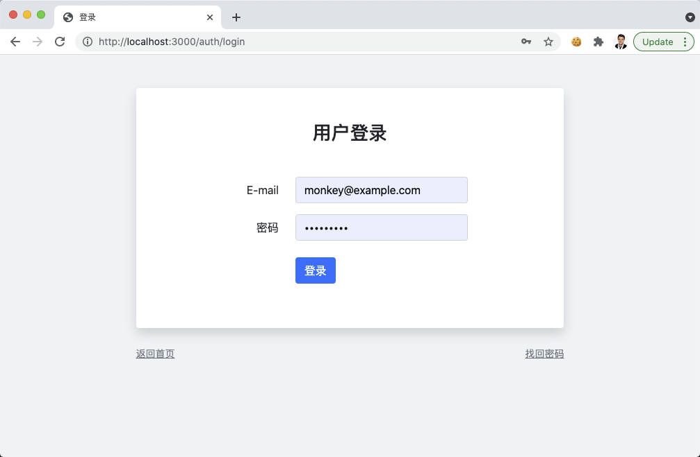
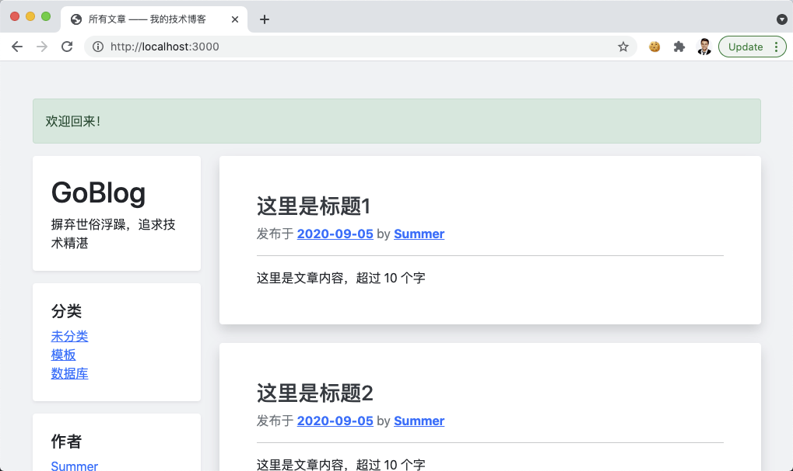
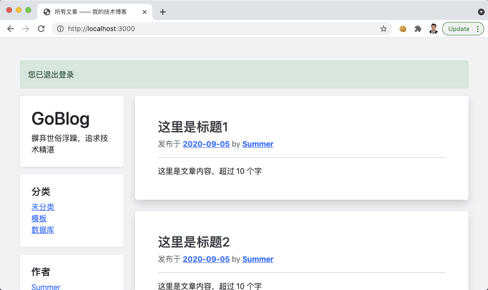
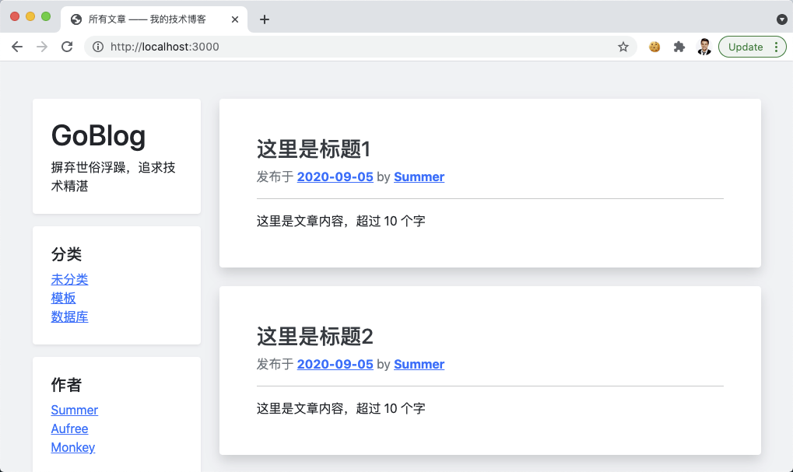

# 11.1. Flash 消息提示

原文链接：https://learnku.com/courses/go-basic/1.22/flash-message-prompt/16541

## 说明

登录和注册成功后，我们希望给到用户一个友好的提示语，接下来一起实现此功能。

## Flash 消息

HTTP 是无状态的，当用户从登录页面跳转到首页时，等于访问了两个链接，如何在这两次访问中共享数据呢？

解决方案是跟登录用户一样的 —— 使用会话。

Flash 消息在 Web 开发中很常见，gorilla/sessions 库也对此功能提供了支持。但是内置的格式并不符合我们的要求，先来创建消息模板：

resources/views/layouts/_messages.gohtml

```
{{define "messages"}}

{{ if .flash.danger }}
<div class="flash-message">
<p class="alert alert-danger">
{{ .flash.danger }}
</p>
</div>
{{ end }}

{{ if .flash.warning }}
<div class="flash-message">
<p class="alert alert-warning">
{{ .flash.warning }}
</p>
</div>
{{ end }}

{{ if .flash.success }}
<div class="flash-message">
<p class="alert alert-success">
{{ .flash.success }}
</p>
</div>
{{ end }}

{{ if .flash.info }}
<div class="flash-message">
<p class="alert alert-info">
{{ .flash.info }}
</p>
</div>
{{ end }}

{{end}}
```

从上面代码中可以看到我们需要的格式是一个 map ，允许定制不同的消息类型。

## flash 包

类似于 auth 库，我们将创建一个 flash 库，依赖于 session 库。

flash 库的方法如下：

| 方法名称
| 描述

| flash.Info
| 添加 Info 类型的消息提示

| flash.Warning
| 添加 Warning 类型的消息提示

| flash.Success
| 添加 Success 类型的消息提示

| flash.Danger
| 添加 Danger 类型的消息提示

| flash.All
| 获取所有消息，返回的数据将作为模板全局变量

首先模板里已经创建好了 message.gohtml 文件，预期的变量是 flash ，我们会从 `view.Render` 方法中统一传入，就如 `isLogined` 一样。

登录成功时调用 `flash.Success("欢迎回来！")` 设置 flash 信息，当用户跳转到下一个页面时，就会被读取到。

因为  Flash 消息是会话里的一次性数据，读取即销毁，我们在编写 flash.All 方法时，需注意读取成功后将 flash 会话数据清空。

## 开始编码：

接下来我们创建底层库 flash :

pkg/flash/flash.go

```
// Package flash 用以支持在会话中存储消息提示
package flash

import (
"encoding/gob"
"goblog/pkg/session"
)

// Flashes Flash 消息数组类型，用以在会话中存储 map
type Flashes map[string]interface{}

// 存入会话数据里的 key
var flashKey = "_flashes"

func init() {
// 在 gorilla/sessions 中存储 map 和 struct 数据需
// 要提前注册 gob，方便后续 gob 序列化编码、解码
gob.Register(Flashes{})
}

// Info 添加 Info 类型的消息提示
func Info(message string) {
addFlash("info", message)
}

// Warning 添加 Warning 类型的消息提示
func Warning(message string) {
addFlash("warning", message)
}

// Success 添加 Success 类型的消息提示
func Success(message string) {
addFlash("success", message)
}

// Danger 添加 Danger 类型的消息提示
func Danger(message string) {
addFlash("danger", message)
}

// All 获取所有消息
func All() Flashes {
val := session.Get(flashKey)
// 读取时必须做类型检测
flashMessages, ok := val.(Flashes)
if !ok {
return nil
}
// 读取即销毁，直接删除
session.Forget(flashKey)
return flashMessages
}

// 私有方法，新增一条提示
func addFlash(key string, message string) {
flashes := Flashes{}
flashes[key] = message
session.Put(flashKey, flashes)
session.Save()
}
```

以上代码已经充分注释，请仔细阅读。

根据 [gorilla/sessions](https://godoc.org/github.com/gorilla/sessions) 文档，在会话中存储 map 类型数据的话，需要注册 gob 编码器里。

什么是 gob?

标准库 gob 是 Go 专属的编解码方式，是标准库自带的一个数据结构序列化的编码/解码工具。类似于 JSON 或 XML，不过执行效率比他们更高。特别适合在 Go 语言程序间传递数据。

## 设置视图变量

接下来需要在 view.Render 方法里对设置全局变量，以方便 message.gohtml 的读取：

pkg/view/view.go

```
.
.
.
// RenderTemplate 渲染视图
func RenderTemplate(w io.Writer, name string, data D, tplFiles ...string) {

// 1. 通用模板数据
data["isLogined"] = auth.Check()
data["loginUser"] = auth.User
data["flash"] = flash.All()
.
.
.
}
```

修改app视图文件：

resources/views/layouts/app.gohtml

```
.
.
.
<div class="container-sm">
<div class="row mt-5">

{{template "messages" .}}

{{template "sidebar" .}}

{{template "main" .}}

</div>
</div>
.
.
.
```

## 开始调用

我们将在三个地方调用：

- 注册成功

- 登录成功

- 退出登录

修改控制器：

app/http/controllers/auth_controller.go

```
.
.
.
// DoRegister 处理注册逻辑
func (*AuthController) DoRegister(w http.ResponseWriter, r *http.Request) {
.
.
.
} else {
// 4. 验证成功，创建数据
_user.Create()

if _user.ID > 0 {
// 登录用户并跳转到首页
flash.Success("恭喜您注册成功！")
auth.Login(_user)
http.Redirect(w, r, "/", http.StatusFound)
} else {
.
.
.
}
}
}
.
.
.
// DoLogin 处理登录表单提交
func (*AuthController) DoLogin(w http.ResponseWriter, r *http.Request) {
.
.
.
// 2. 尝试登录
if err := auth.Attempt(email, password); err == nil {
// 登录成功
flash.Success("欢迎回来！")
http.Redirect(w, r, "/", http.StatusFound)
} else {
.
.
.
}
}

// Logout 退出登录
func (*AuthController) Logout(w http.ResponseWriter, r *http.Request) {
auth.Logout()
flash.Success("您已退出登录")
http.Redirect(w, r, "/", http.StatusFound)
}
```

## 开始测试

访问登录页面 [localhost:3000/auth/login](http://localhost:3000/auth/login) ，填入正确的账号信息，点击登录：



可见顶部的消息提示：



点击左下角的退出登录按钮，并点击确定：



成功显示操作成功的提示。此时如果再次刷新页面，提示将不复存在：



至此 Flash 消息开发完成。

## 代码版本

开始下一节之前，我们先来为代码做下版本标记：

```
$ git add .
$ git commit -m "Flash 消息提示"
```
