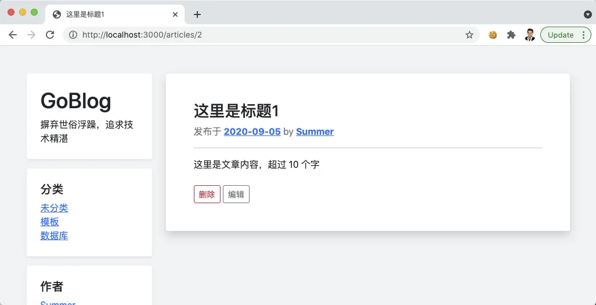
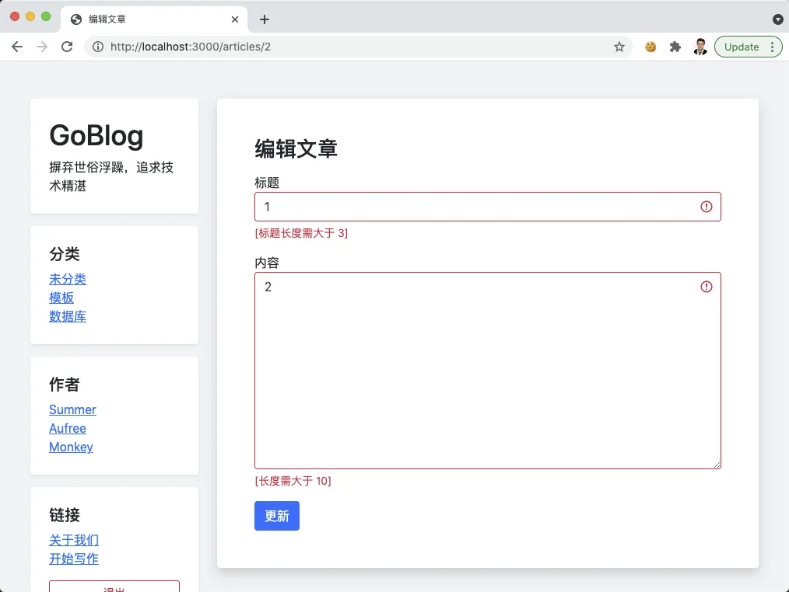
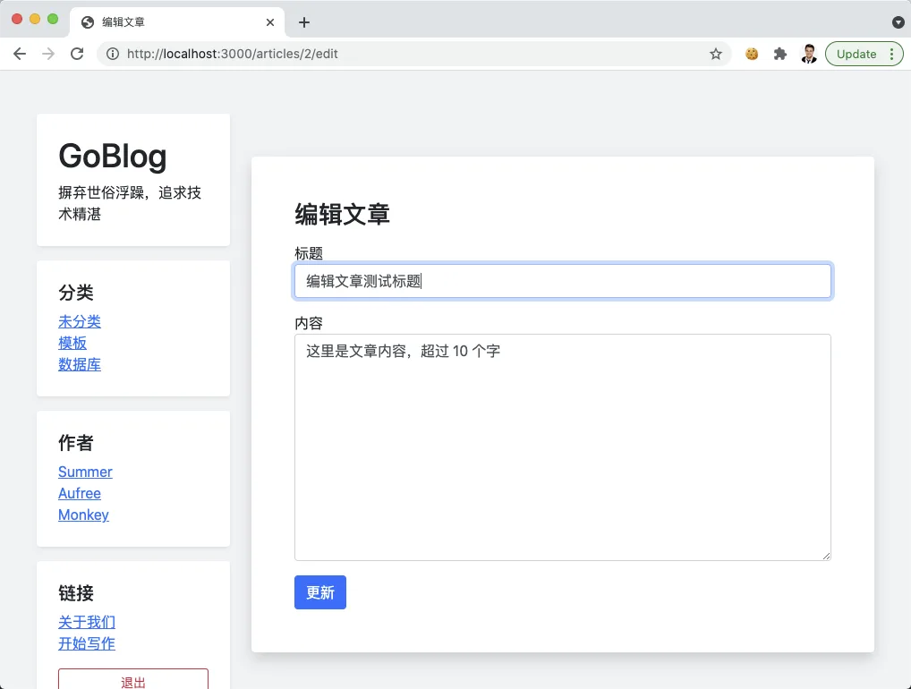
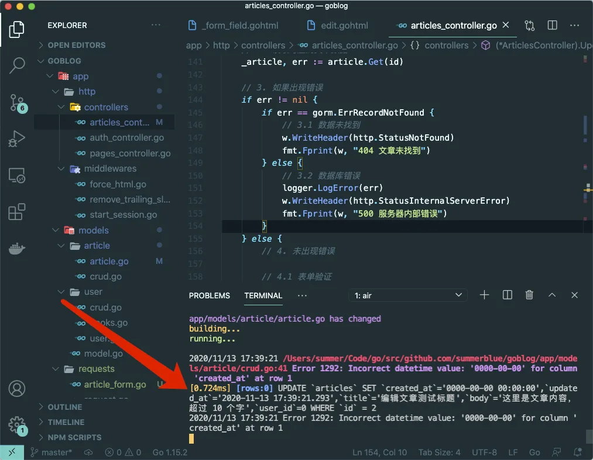
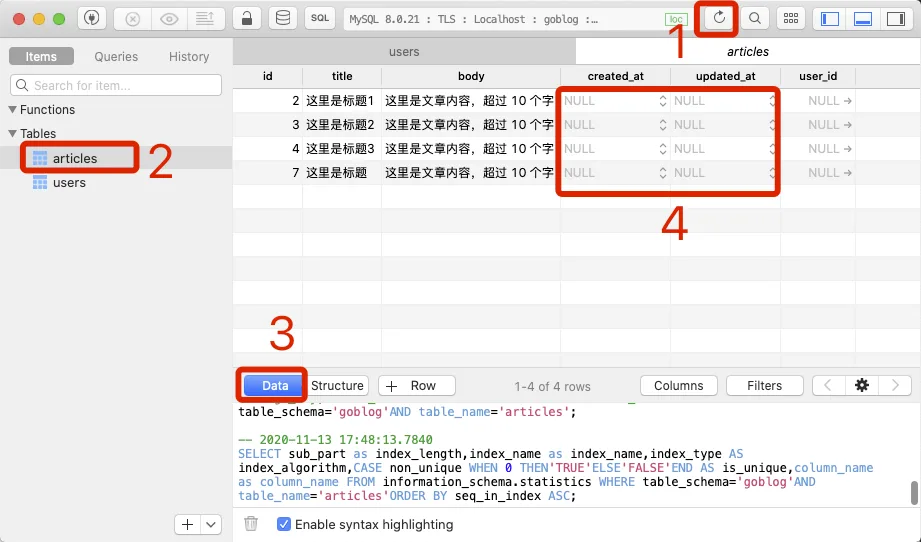
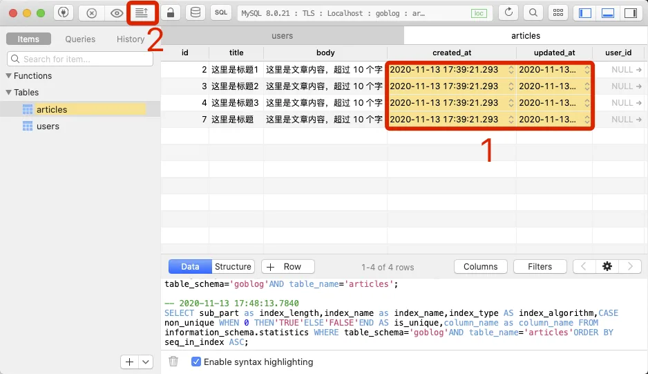
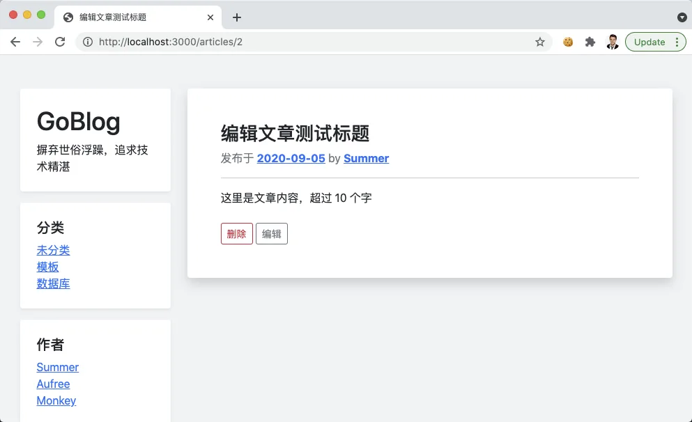

# 11.2. 重构文章表单验证

原文链接：https://learnku.com/courses/go-basic/1.22/user-articles/16542

## 说明

开发用户注册时，我们使用 govalidator 来做验证，很好的提高了表单验证部分代码的可读性。

接下来将重构文章部分表单验证来使用新的方案。

## 新增表单验证函数

参考 user_registration.go 创建文章的表单验证函数：

app/requests/article_form.go

```
package requests

import (
"goblog/app/models/article"

"github.com/thedevsaddam/govalidator"
)

// ValidateArticleForm 验证表单，返回 errs 长度等于零即通过
func ValidateArticleForm(data article.Article) map[string][]string {

// 1. 定制认证规则
rules := govalidator.MapData{
"title": []string{"required", "min:3", "max:40"},
"body":  []string{"required", "min:10"},
}

// 2. 定制错误消息
messages := govalidator.MapData{
"title": []string{
"required:标题为必填项",
"min:标题长度需大于 3",
"max:标题长度需小于 40",
},
"body": []string{
"required:文章内容为必填项",
"min:长度需大于 10",
},
}

// 3. 配置初始化
opts := govalidator.Options{
Data:          &data,
Rules:         rules,
TagIdentifier: "valid", // 模型中的 Struct 标签标识符
Messages:      messages,
}

// 4. 开始验证
return govalidator.New(opts).ValidateStruct()
}
```

## 删除无用的方法

请打开  app/http/controllers/articles_controller.go 文件，找到 validateArticleFormData 的定义，将其删除。

## 修改 Article 模型

添加验证规则：

app/models/article/article.go

```
.
.
.
// Article 文章模型
type Article struct {
models.BaseModel

Title string `gorm:"type:varchar(255);not null;" valid:"title"`
Body  string `gorm:"type:longtext;not null;" valid:"body"`
}
.
.
.
```

我们在 Struct 标签里添加的 `valid` 作为验证使用，`gorm` 用以指定数据库字段信息。

## 开始重构

### 重构控制器

都是我们的熟悉的代码，这里就不再赘述，请仔细阅读：

app/http/controllers/articles_controller.go

```
.
.
.
// Store 文章创建页面
func (*ArticlesController) Store(w http.ResponseWriter, r *http.Request) {

// 1. 初始化数据
_article := article.Article{
Title: r.PostFormValue("title"),
Body:  r.PostFormValue("body"),
}

// 2. 表单验证
errors := requests.ValidateArticleForm(_article)

// 3. 检测错误
if len(errors) == 0 {
// 创建文章
_article.Create()
if _article.ID > 0 {
indexURL := route.Name2URL("articles.show", "id", _article.GetStringID())
http.Redirect(w, r, indexURL, http.StatusFound)
} else {
w.WriteHeader(http.StatusInternalServerError)
fmt.Fprint(w, "创建文章失败，请联系管理员")
}
} else {
view.Render(w, view.D{
"Article": _article,
"Errors":  errors,
}, "articles.create", "articles._form_field")
}
}

// Edit 文章更新页面
func (*ArticlesController) Edit(w http.ResponseWriter, r *http.Request) {
.
.
.
// 4. 读取成功，显示编辑文章表单
view.Render(w, view.D{
"Article": _article,
"Errors":  view.D{},
}, "articles.edit", "articles._form_field")
}
}

// Update 更新文章
func (*ArticlesController) Update(w http.ResponseWriter, r *http.Request) {
.
.
.
} else {
// 4. 未出现错误

// 4.1 表单验证
_article.Title = r.PostFormValue("title")
_article.Body = r.PostFormValue("body")

errors := requests.ValidateArticleForm(_article)

if len(errors) == 0 {

// 4.2 表单验证通过，更新数据
rowsAffected, err := _article.Update()

if err != nil {
// 数据库错误
w.WriteHeader(http.StatusInternalServerError)
fmt.Fprint(w, "500 服务器内部错误")
return
}

// √ 更新成功，跳转到文章详情页
if rowsAffected > 0 {
showURL := route.Name2URL("articles.show", "id", id)
http.Redirect(w, r, showURL, http.StatusFound)
} else {
fmt.Fprint(w, "您没有做任何更改！")
}
} else {

// 4.3 表单验证不通过，显示理由
view.Render(w, view.D{
"Article": _article,
"Errors":  errors,
}, "articles.edit", "articles._form_field")
}
}
}
.
.
.
```

### 重构视图

resources/views/articles/_form_field.gohtml

```

{{define "form-fields"}}
<div class="form-group mt-3">
<label for="title">标题</label>
<input type="text" class="form-control {{if .Errors.title }}is-invalid {{end}}" name="title" value="{{ .Article.Title }}" required>
{{ with .Errors.title }}
<div class="invalid-feedback">
{{ . }}
</div>
{{ end }}
</div>

<div class="form-group mt-3">
<label for="body">内容</label>
<textarea name="body" cols="30" rows="10" class="form-control {{if .Errors.body }}is-invalid {{end}}">{{ .Article.Body }}</textarea>
{{ with .Errors.body }}
<div class="invalid-feedback">
{{ . }}
</div>
{{ end }}
</div>
{{ end }}
```

## 开始测试

打开首页 [localhost:3000/](http://localhost:3000/) ，随便点击一篇文章：



点击编辑按钮进入编辑页面，输入不合规的内容，点击更新按钮：



输入合规的内容，点击更新：



会出现 `500 服务器内部错误` 的报错。应该是我们的 SQL 出错了，此时打开命令行终端：



GORM 很友好的 SQL 错误提示：

```
2020/11/13 17:39:21 /Users/summer/Code/go/src/github.com/summerblue/goblog/app/models/article/crud.go:41 Error 1292: Incorrect datetime value: '0000-00-00' for column 'created_at' at row 1
[0.724ms] [rows:0] UPDATE `articles` SET `created_at`='0000-00-00 00:00:00',`updated_at`='2020-11-13 17:39:21.293',`title`='编辑文章测试标题',`body`='这里是文章内容，超过 10 个字',`user_id`=0 WHERE `id` = 2
2020/11/13 17:39:21 Error 1292: Incorrect datetime value: '0000-00-00' for column 'created_at' at row 1
```

查看数据库，原来是因为数据库里的创建和更新字段都是空的：



我们在使用 GORM 模型时，统一让 GORM 来维护创建和更新时间，但是我们在开发文章功能时，并未使用 GORM ，导致现在里面的数据出现缺陷。

不用太担心这个问题，当新的文章创建时，此问题将迎刃而解。

刚好上面我们有现成的时间，为了让测试进行顺利进行下去，我们利用数据库管理工具对这些值设置为此时间（或直接删除所有内容，然后进入 [localhost:3000/articles/create](http://localhost:3000/articles/create) 创建一条新的数据进行编辑即可）：



再次刷新 `500 服务器内部错误` 页面，并再次提交表单：



内容成功更新。

## 代码版本

开始下一节之前，我们先来为代码做下版本标记：

```
$ git add .
$ git commit -m "重构文章表单验证"
```
