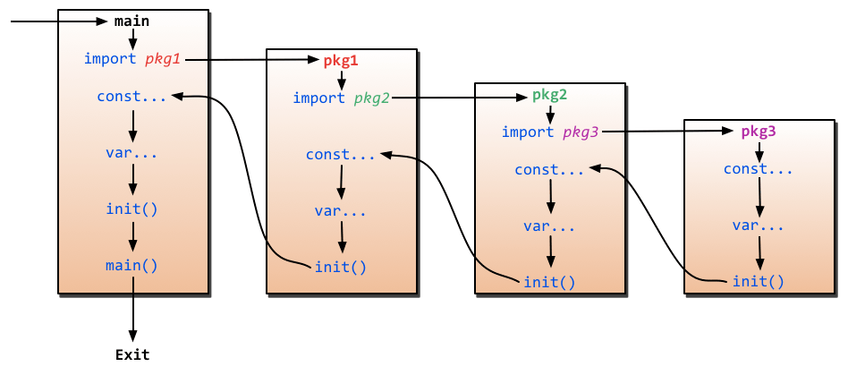
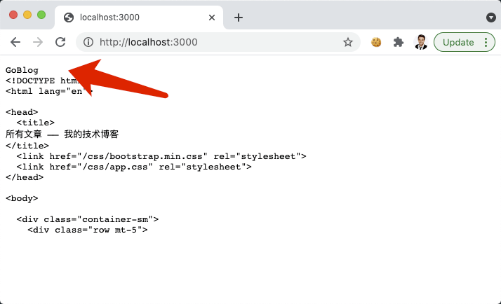
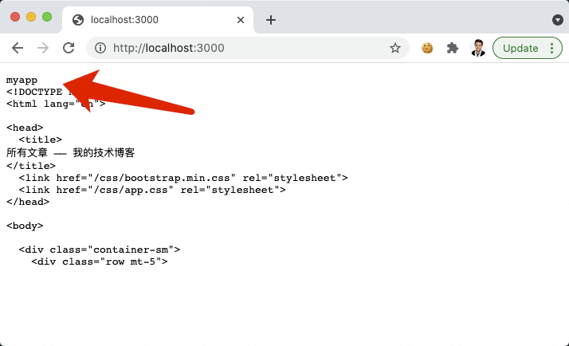

# 11.3. 配置和环境变量

原文链接：https://learnku.com/courses/go-basic/1.22/configuration-information/16543

## 说明

数据库连接信息、会话加密的 KEY、HTTP 服务的监听端口等，目前我们都写死在代码里面，一方面是不好维护，另一方面是项目的适用性很差，无法适用于不同环境。

一般情况下一个 Web 程序会有几个运行环境：

1. 本地开发环境（包括团队其他成员的环境）；

2. 线上生产环境；

3. 测试环境。

很多配置信息无法做到通用，例如说你本地开发环境 MySQL 的连接信息，很难跟线上、团队其他成员、以及测试环境的保持一致。最好的方案是每一个运行环境下，都拥有专属的一套配置信息，当项目在新的环境运行时，针对此环境配置一下即可。

## Viper

[spf13/viper](https://github.com/spf13/viper) 是一个非常优秀的第三方库，GitHub 上一万多个 star 也说明了其受欢迎程度。

Viper 是适用于 Go 应用程序的完整配置解决方案。它支持大部分类型的配置需求和格式。功能如下：

- 设置默认值

- 从 JSON，TOML，YAML，HCL，envfile 和 Java 属性配置文件中读取

- 实时观看和重新读取配置文件（可选）

- 从环境变量中读取

- 从远程配置系统（etcd或Consul）中读取，并监控变更

- 从命令行中读取

- 从缓冲区读取

- 设置显式值

## 如何使用 Viper ？

开始之前，我们需要安装它：

```
$ go get github.com/spf13/viper
```

同样的，我们会将其封装到我们自建的 config 包里：

pkg/config/config.go

```
// Package config 配置信息管理
package config

import (
"goblog/pkg/logger"

"github.com/spf13/cast"
"github.com/spf13/viper"
)

// Viper Viper 库实例
var Viper *viper.Viper

// StrMap 简写 —— map[string]interface{}
type StrMap map[string]interface{}

// init() 函数在 import 的时候立刻被加载
func init() {
// 1. 初始化 Viper 库
Viper = viper.New()
// 2. 设置文件名称
Viper.SetConfigName(".env")
// 3. 配置类型，支持 "json", "toml", "yaml", "yml", "properties",
//             "props", "prop", "env", "dotenv"
Viper.SetConfigType("env")
// 4. 环境变量配置文件查找的路径，相对于 main.go
Viper.AddConfigPath(".")

// 5. 开始读根目录下的 .env 文件，读不到会报错
err := Viper.ReadInConfig()
logger.LogError(err)

// 6. 设置环境变量前缀，用以区分 Go 的系统环境变量
Viper.SetEnvPrefix("appenv")
// 7. Viper.Get() 时，优先读取环境变量
Viper.AutomaticEnv()
}

// Env 读取环境变量，支持默认值
func Env(envName string, defaultValue ...interface{}) interface{} {
if len(defaultValue) > 0 {
return Get(envName, defaultValue[0])
}
return Get(envName)
}

// Add 新增配置项
func Add(name string, configuration map[string]interface{}) {
Viper.Set(name, configuration)
}

// Get 获取配置项，允许使用点式获取，如：app.name
func Get(path string, defaultValue ...interface{}) interface{} {
// 不存在的情况
if !Viper.IsSet(path) {
if len(defaultValue) > 0 {
return defaultValue[0]
}
return nil
}
return Viper.Get(path)
}

// GetString 获取 String 类型的配置信息
func GetString(path string, defaultValue ...interface{}) string {
return cast.ToString(Get(path, defaultValue...))
}

// GetInt 获取 Int 类型的配置信息
func GetInt(path string, defaultValue ...interface{}) int {
return cast.ToInt(Get(path, defaultValue...))
}

// GetInt64 获取 Int64 类型的配置信息
func GetInt64(path string, defaultValue ...interface{}) int64 {
return cast.ToInt64(Get(path, defaultValue...))
}

// GetUint 获取 Uint 类型的配置信息
func GetUint(path string, defaultValue ...interface{}) uint {
return cast.ToUint(Get(path, defaultValue...))
}

// GetBool 获取 Bool 类型的配置信息
func GetBool(path string, defaultValue ...interface{}) bool {
return cast.ToBool(Get(path, defaultValue...))
}
```

`init` 方法是利用了 Go 语言对此方法的优先加载机制，在应用的最开始的地方进行配置信息的初始化。

此方法里配置的内容，是 —— 加载根目录下的 .env 文件，并自动渲染。

其他方法都是标明注释，请仔细阅读。

注意这里的 init 方法是加载 .env 的环境变量信息，而除了 Env 以外的其他方法，都是为处理配置信息而存在。

需要区分一个环境变量和配置信息。环境变量是在 .env 里设置，配置信息是在 config 目录的文件里配置。环境变量我们不需要加入到版本控制器里，而配置信息需要。环境变量每个项目都不一样，配置信息代码是一致的。

如果被绕晕，继续跟着课程走即可。

## 配置信息

接下来我们书写配置信息。

所有配置文件里都标好了注释，请仔细阅读。

所有的配置信息，皆使用 init 方法，请配合以下这张图来阅读这些源码：



### 应用信息 config/app.go

config/app.go

```
// Package config 应用的配置
package config

import "goblog/pkg/config"

func init() {
config.Add("app", config.StrMap{

// 应用名称，暂时没有使用到
"name": config.Env("APP_NAME", "GoBlog"),

// 当前环境，用以区分多环境
"env": config.Env("APP_ENV", "production"),

// 是否进入调试模式
"debug": config.Env("APP_DEBUG", false),

// 应用服务端口
"port": config.Env("APP_PORT", "3000"),

// gorilla/sessions 在 Cookie 中加密数据时使用
"key": config.Env("APP_KEY", "33446a9dcf9ea060a0a6532b166da32f304af0de"),
})
}
```

### 会话 config/session.go

config/session.go

```
package config

import "goblog/pkg/config"

func init() {
config.Add("session", config.StrMap{

// 目前只支持 Cookie
"default": config.Env("SESSION_DRIVER", "cookie"),

// 会话的 Cookie 名称
"session_name": config.Env("SESSION_NAME", "goblog-session"),
})
}
```

### 数据库 config/database.go

config/database.go

```
package config

import (
"goblog/pkg/config"
)

func init() {

config.Add("database", config.StrMap{
"mysql": map[string]interface{}{

// 数据库连接信息
"host":     config.Env("DB_HOST", "127.0.0.1"),
"port":     config.Env("DB_PORT", "3306"),
"database": config.Env("DB_DATABASE", "goblog"),
"username": config.Env("DB_USERNAME", ""),
"password": config.Env("DB_PASSWORD", ""),
"charset":  "utf8mb4",

// 连接池配置
"max_idle_connections": config.Env("DB_MAX_IDLE_CONNECTIONS", 25),
"max_open_connections": config.Env("DB_MAX_OPEN_CONNECTIONS", 100),
"max_life_seconds":     config.Env("DB_MAX_LIFE_SECONDS", 5*60),
},
})
}
```

## 加载配置信息？

目前来讲，我们虽然创建了配置文件和 config 包，但是还没有加载他们的地方。

为了让整个程序里的代码都是使用到配置信息和环境变量，加载配置信息的代码需要优先于其他代码执行。

我们可以在 config 配置信息的包下写一个空白函数，在 main 的 init 函数中执行：

config/config.go

```
package config

// Initialize 配置信息初始化
func Initialize() {
// 触发加载本目录下其他文件中的 init 方法
}
```

然后在 main.go 中加载：

main.go

```
package main

import (
"goblog/app/http/middlewares"
"goblog/bootstrap"
"goblog/config"
c "goblog/pkg/config"
"net/http"
)

func init() {
// 初始化配置信息
config.Initialize()
}

func main() {
// 初始化 SQL
bootstrap.SetupDB()

// 初始化路由绑定
router := bootstrap.SetupRoute()

http.ListenAndServe(":3000", middlewares.RemoveTrailingSlash(router))
}
```

## 创建 .env 文件

最后创建环境配置信息：

.env

```
APP_NAME=GoBlog
APP_ENV=local
APP_KEY=33446a9dcf9ea060a0a6532b166da32f304af0de
APP_DEBUG=true
APP_URL=http://localhost:3000
APP_LOG_LEVEL=debug
APP_PORT=3000

DB_CONNECTION=mysql
DB_HOST=127.0.0.1
DB_PORT=3306
DB_DATABASE=goblog
DB_USERNAME=root
DB_PASSWORD=secret

SESSION_DRIVER=cookie
SESSION_NAME=goblog-session
```

## 测试一下

测试一下调用：

app/http/controllers/articles_controller.go

```
.
.
.
// Index 文章列表页
func (*ArticlesController) Index(w http.ResponseWriter, r *http.Request) {

fmt.Fprint(w, config.Get("app.name"))
.
.
.
}
```

打开浏览器：



尝试修改下环境变量：

.env

```
APP_NAME=myapp
.
.
.
```

刷新浏览器，会发现仍然打印的是 `GoBlog`。这是因为我们的环境变量需要停止 air 编译后再重新加载。虽然 Viper 有方法支持热重载，但是修改环境变量还是比较少见的，我们无需浪费系统资源来做这件事情。

命令行终止下重启 air ，再次刷新页面：



## 删除测试代码

请将 app/http/controllers/articles_controller.go 中 Index 方法中的测试代码删除：

```
fmt.Fprint(w, config.Get("app.name"))
```

## 应用配置信息

配置信息设置成功，接下来我们将其应用到程序里：

main.go

```
package main

import (
"goblog/app/http/middlewares"
"goblog/bootstrap"
"goblog/config"
c "goblog/pkg/config"
"net/http"
)

func init() {
// 初始化配置信息
config.Initialize()
}

func main() {
// 初始化 SQL
bootstrap.SetupDB()

// 初始化路由绑定
router := bootstrap.SetupRoute()

http.ListenAndServe(":"+c.GetString("app.port"), middlewares.RemoveTrailingSlash(router))
}
```

数据库连接信息：

pkg/model/model.go

```
.
.
.
// ConnectDB 初始化模型
func ConnectDB() *gorm.DB {

var err error

// 初始化 MySQL 连接信息
gormConfig := mysql.New(mysql.Config{
DSN: fmt.Sprintf("%v:%v@tcp(%v:%v)/%v?charset=%v&parseTime=True&loc=Local",
config.GetString("database.mysql.username"),
config.GetString("database.mysql.password"),
config.GetString("database.mysql.host"),
config.GetString("database.mysql.port"),
config.GetString("database.mysql.database"),
config.GetString("database.mysql.charset")),
})

var level gormlogger.LogLevel
if config.GetBool("app.debug") {
// 读取不到数据也会显示
level = gormlogger.Warn
} else {
// 只有错误才会显示
level = gormlogger.Error
}

// 准备数据库连接池
DB, err = gorm.Open(gormConfig, &gorm.Config{
Logger: gormlogger.Default.LogMode(level),
})

logger.LogError(err)

return DB
}
```

bootstrap/db.go

```
.
.
.
// SetupDB 初始化数据库和 ORM
func SetupDB() {
.
.
.
// 设置最大连接数
sqlDB.SetMaxOpenConns(config.GetInt("database.mysql.max_open_connections"))
// 设置最大空闲连接数
sqlDB.SetMaxIdleConns(config.GetInt("database.mysql.max_idle_connections"))
// 设置每个链接的过期时间
sqlDB.SetConnMaxLifetime(time.Duration(config.GetInt("database.mysql.max_life_seconds")) * time.Second)

// 创建和维护数据表结构
migration(db)
}
```

会话：

pkg/session/session.go

```
.
.
.
// Store gorilla sessions 的存储库
var Store = sessions.NewCookieStore([]byte(config.GetString("app.key")))
.
.
.
// StartSession 初始化会话，在中间件中调用
func  StartSession(w http.ResponseWriter, r *http.Request) {
var err error

// Store.Get() 的第二个参数是 Cookie 的名称
// gorilla/sessions 支持多会话，本项目我们只使用单一会话即可
Session, err = Store.Get(r, config.GetString("session.session_name"))
.
.
.

}
```

注意我们使用 `.` 来访问下一级的配置元素。

## 测试

篇幅考虑，请自行测试注册、登录等相关功能。

## .gitignore

.env 文件是专属于我们当前环境的配置信息，不应该被提交到代码库中，否则在其他环境中，设置 .env 里的值就会照成冲突。

接下来先将 .env 放到 .gitignore 中：

.gitignore

```
tmp
.env
```

为了方便在其他环境下设置 .env 信息，我们创建一个示例文件：

.env.example

```
APP_NAME=myapp
APP_ENV=local
APP_KEY=33446a9dcf9ea060a0a6532b166da32f304af0de
APP_DEBUG=true
APP_URL=http://localhost:3000
APP_LOG_LEVEL=debug
APP_PORT=3000

DB_CONNECTION=mysql
DB_HOST=127.0.0.1
DB_PORT=3306
DB_DATABASE=goblog
DB_USERNAME=root
DB_PASSWORD=secret

SESSION_DRIVER=cookie
SESSION_NAME=goblog-session
```

此文件会被提交到代码中，这样其他人就知道有哪些配置项了。

## 代码版本

开始下一节之前，我们先来为代码做下版本标记：

```
$ git add .
$ git commit -m "配置和环境变量"
```
