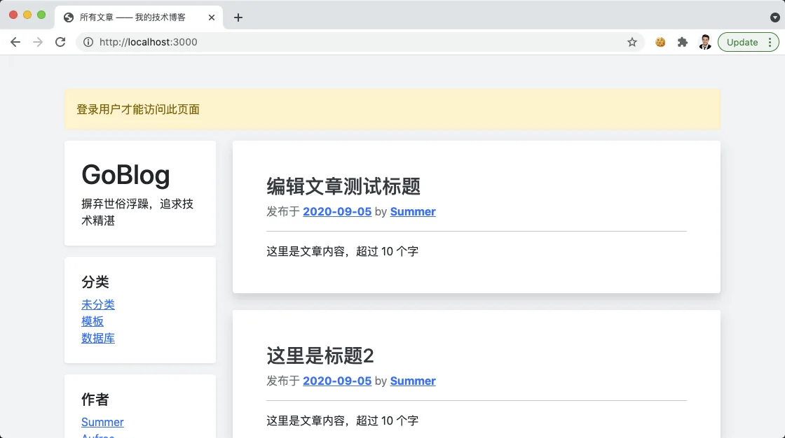

# 11.4. 授权中间件

原文链接：https://learnku.com/courses/go-basic/1.22/access-rights/16544

## 说明

登录情况下，登录和注册页面不应该被用户访问到。修改文章的页面，未登录的用户也属于未授权的访问。

本节我们将使用中间件来处理应用授权。

## 创建中间件

我们将创建两个中间件：

1. auth 中间件 —— 只允许登录用户访问，未登录用户直接跳转到首页并给予提示

2. guest 中间件 —— 只允许游客访问，登录用户直接跳转到首页并给予提示

接下来开始编码：

app/http/middlewares/auth.go

```go
package middlewares

import (
	"goblog/pkg/auth"
	"goblog/pkg/flash"
	"net/http"
)

// Auth 登录用户才可访问
func Auth(next HTTPHandlerFunc) HTTPHandlerFunc {
	return func(w http.ResponseWriter, r *http.Request) {

		if !auth.Check() {
			flash.Warning("登录用户才能访问此页面")
			http.Redirect(w, r, "/", http.StatusFound)
			return
		}

		next(w, r)
	}
}
```

app/http/middlewares/guest.go

```go
package middlewares

import (
	"goblog/pkg/auth"
	"goblog/pkg/flash"
	"net/http"
)

// Guest 只允许未登录用户访问
func Guest(next HTTPHandlerFunc) HTTPHandlerFunc {
	return func(w http.ResponseWriter, r *http.Request) {

		if auth.Check() {
			flash.Warning("登录用户无法访问此页面")
			http.Redirect(w, r, "/", http.StatusFound)
			return
		}

		// 继续处理接下去的请求
		next(w, r)
	}
}
```

app/http/middlewares/middleware.go

```go
package middlewares

import "net/http"

// HTTPHandlerFunc 简写 —— func(http.ResponseWriter, *http.Request)
type HTTPHandlerFunc func(http.ResponseWriter, *http.Request)
```

代码很简单，我们之前都讲解过，这里就不再赘述。

唯一差异的地方，是中间件书写的方式与之前不同。这是因为之前是全局中间件，而这一次我们写的中间件，可以专属指定于单个路由上。

## 应用到路由上

routes/web.go

```go
.
.
.
// RegisterWebRoutes 注册网页相关路由
func RegisterWebRoutes(r *mux.Router) {
    .
    .
    .
    r.HandleFunc("/articles/create", middlewares.Auth(ac.Create)).Methods("GET").Name("articles.create")
    r.HandleFunc("/articles", middlewares.Auth(ac.Store)).Methods("POST").Name("articles.store")
    r.HandleFunc("/articles/{id:[0-9]+}/edit", middlewares.Auth(ac.Edit)).Methods("GET").Name("articles.edit")
    r.HandleFunc("/articles/{id:[0-9]+}", middlewares.Auth(ac.Update)).Methods("POST").Name("articles.update")
    r.HandleFunc("/articles/{id:[0-9]+}/delete", middlewares.Auth(ac.Delete)).Methods("POST").Name("articles.delete")

    .
    .
    .
    r.HandleFunc("/auth/register", middlewares.Guest(auc.Register)).Methods("GET").Name("auth.register")
    r.HandleFunc("/auth/do-register", middlewares.Guest(auc.DoRegister)).Methods("POST").Name("auth.doregister")
    r.HandleFunc("/auth/login", middlewares.Guest(auc.Login)).Methods("GET").Name("auth.login")
    r.HandleFunc("/auth/dologin", middlewares.Guest(auc.DoLogin)).Methods("POST").Name("auth.dologin")
    r.HandleFunc("/auth/logout", middlewares.Auth(auc.Logout)).Methods("POST").Name("auth.logout")
}
```

注意我们的控制器方法都被包起来了，逻辑如下：

- 注册、登录相关路由，我们只允许游客身份访问

- 退出、文章创建编辑和删除，我们只允许登录用户访问

## 测试一下

登录情况下，访问 [localhost:3000/auth/register](http://localhost:3000/auth/register) ，会看到：


退出登录后，访问文章并点击编辑按钮，会显示：



至此简单的授权功能开发完成。

## 代码版本

开始下一节之前，我们先来为代码做下版本标记：

```bash
$ git add .
$ git commit -m "授权中间件"
```
