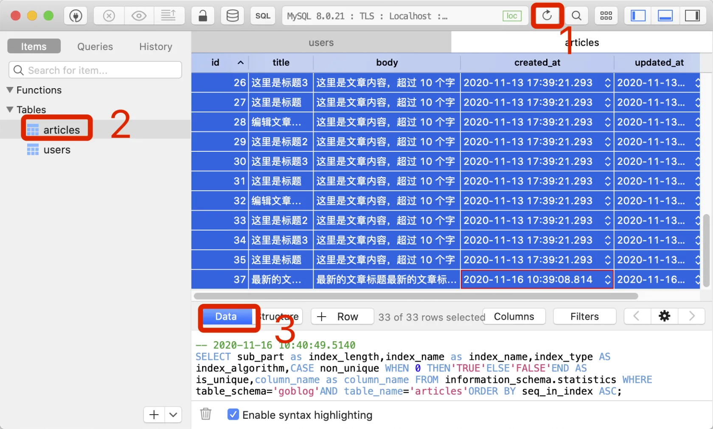
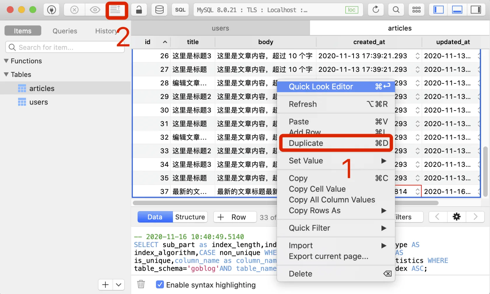
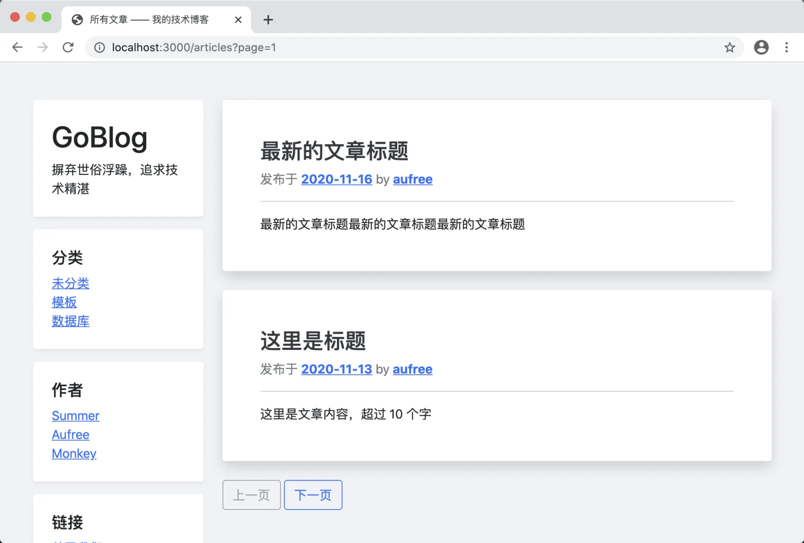
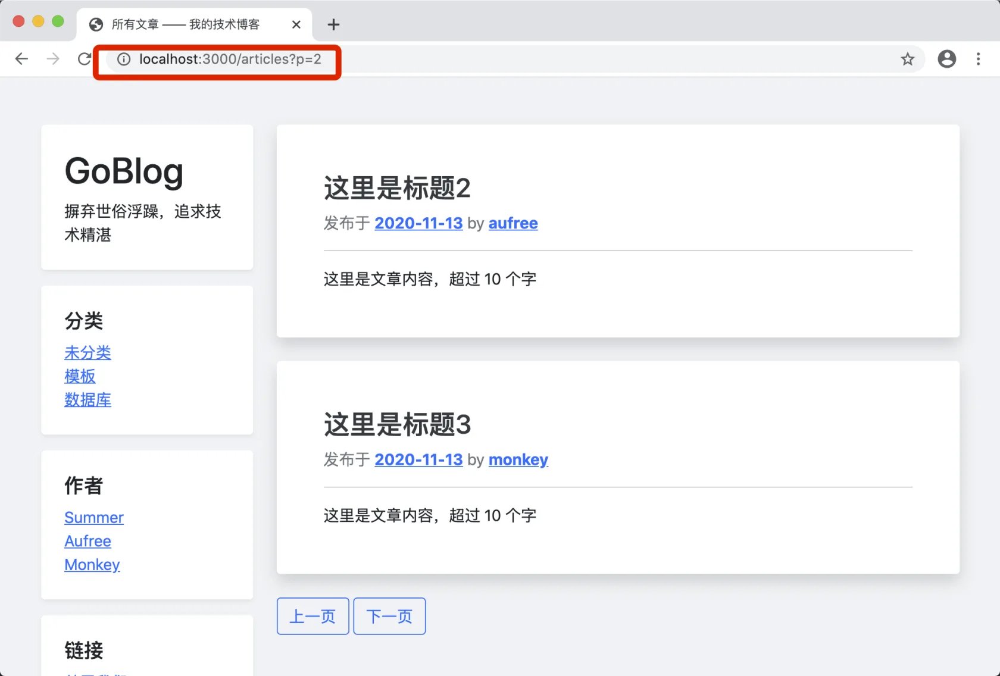

# 13.1. 简单分页

原文链接：https://learnku.com/courses/go-basic/1.22/simple-paging/16553

## 说明

本节我们来完成文章的分页功能的开发。

## 分页模板

我们要开发的分页功能是简单的上一页下一页，需要我们传参一个至少拥有以下信息的数据结构：

```
// 是否需要显示分页
HasPages bool

// 下一页
Next    Page
// 是否存在下一页（存在最后一页的情况）
HasNext bool

// 上一页
Prev    Page
// 是否存在上一页（存在第一页的情况）
HasPrev bool
```

我们先来创建模板：

resources/views/layouts/_pagination.gohtml

```
{{ define "pagination" }}

{{ if .HasPages }}
<nav class="blog-pagination mb-5">

{{ if .HasPrev }}
<a class="btn btn-outline-primary" href="{{ .Prev.URL }}" tabindex="-1" aria-disabled="true">上一页</a>
{{ else }}
<a class="btn btn-outline-secondary disabled" href="#" tabindex="-1" aria-disabled="true">上一页</a>
{{ end }}

{{ if .HasNext }}
<a class="btn btn-outline-primary" href="{{ .Next.URL }}" tabindex="-1" aria-disabled="true">下一页</a>
{{ else }}
<a class="btn btn-outline-secondary disabled" href="#" tabindex="-1" aria-disabled="true">下一页</a>
{{ end }}

</nav>
{{ end }}

{{ end }}
```

放置于 layouts 目录会被自动加载。

接下来是加载分页模板：

resources/views/articles/index.gohtml

```
{{define "title"}}
所有文章 —— 我的技术博客
{{end}}

{{define "main"}}
<div class="col-md-9 blog-main">

{{ if .Articles }}

{{ range $key, $article := .Articles }}
<div class="blog-post bg-white p-5 rounded shadow mb-4">
<h3 class="blog-post-title"><a href="{{ $article.Link }}" class="text-dark text-decoration-none">{{ $article.Title }}</a></h3>
{{template "article-meta" $article }}
<hr>
{{ $article.Body }}
</div><!-- /.blog-post -->
{{ end }}

{{ else }}

<div class="blog-post bg-white p-5 rounded shadow mb-4 text-muted">
<p>暂无文章！</p>
</div>

{{ end }}

<!-- 分页 -->
{{template "pagination" .PagerData }}

</div><!-- /.blog-main -->
{{end}}
```

注意以上代码还添补了文章为空的逻辑，使用以下逻辑：

```
{{ if .Articles }}
... 输出文章
{{ else }}
...暂无文章！
{{ end }}
```

## 分页 pagination 包

根据我们需要产出的内容，来设计和编写 pagination 分页包。

代码比较多，不过都全部加上注释，读多几遍很容易理解：

pkg/pagination/pagination.go

```
package pagination

import (
"goblog/pkg/config"
"goblog/pkg/types"
"math"
"net/http"
"strconv"
"strings"

"gorm.io/gorm"
"gorm.io/gorm/clause"
)

// Page 单个分页元素
type Page struct {
// 链接
URL string
// 页码
Number int
}

// ViewData 同视图渲染的数据
type ViewData struct {
// 是否需要显示分页
HasPages bool

// 下一页
Next    Page
HasNext bool

// 上一页
Prev    Page
HasPrev bool

Current Page

// 数据库的内容总数量
TotalCount int64
// 总页数
TotalPage int
}

// Pagination 分页对象
type Pagination struct {
BaseURL string
PerPage int
Page    int
Count   int64
db      *gorm.DB
}

// New 分页对象构建器
// r —— 用来获取分页的 URL 参数，默认是 page，可通过 config/pagination.go 修改
// db —— GORM 查询句柄，用以查询数据集和获取数据总数
// baseURL —— 用以分页链接
// PerPage —— 每页条数，传参为小于或者等于 0 时为默认值  10，可通过 config/pagination.go 修改
func New(r *http.Request, db *gorm.DB, baseURL string, PerPage int) *Pagination {

// 默认每页数量
if PerPage <= 0 {
PerPage = config.GetInt("pagination.perpage")
}

// 实例对象
p := &Pagination{
db:      db,
PerPage: PerPage,
Page:    1,
Count:   -1,
}

// 拼接 URL
if strings.Contains(baseURL, "?") {
p.BaseURL = baseURL + "&" + config.GetString("pagination.url_query") + "="
} else {
p.BaseURL = baseURL + "?" + config.GetString("pagination.url_query") + "="
}

// 设置当前页码
p.SetPage(p.GetPageFromRequest(r))

return p
}

// Paging 返回渲染分页所需的数据
func (p *Pagination) Paging() ViewData {

return ViewData{
HasPages: p.HasPages(),

Next:    p.NewPage(p.NextPage()),
HasNext: p.HasNext(),

Prev:    p.NewPage(p.PrevPage()),
HasPrev: p.HasPrev(),

Current:   p.NewPage(p.CurrentPage()),
TotalPage: p.TotalPage(),

TotalCount: p.Count,
}
}

// NewPage 设置当前页
func (p Pagination) NewPage(page int) Page {
return Page{
Number: page,
URL:    p.BaseURL + strconv.Itoa(page),
}
}

// SetPage 设置当前页
func (p *Pagination) SetPage(page int) {
if page <= 0 {
page = 1
}

p.Page = page
}

// CurrentPage 返回当前页码
func (p Pagination) CurrentPage() int {
totalPage := p.TotalPage()
if totalPage == 0 {
return 0
}

if p.Page > totalPage {
return totalPage
}

return p.Page
}

// Results 返回请求数据，请注意 data 参数必须为 GROM 模型的 Slice 对象
func (p Pagination) Results(data interface{}) error {
var err error
var offset int
page := p.CurrentPage()
if page == 0 {
return err
}

if page > 1 {
offset = (page - 1) * p.PerPage
}

return p.db.Preload(clause.Associations).Limit(p.PerPage).Offset(offset).Find(data).Error
}

// TotalCount 返回的是数据库里的条数
func (p *Pagination) TotalCount() int64 {
if p.Count == -1 {
var count int64
if err := p.db.Count(&count).Error; err != nil {
return 0
}
p.Count = count
}

return p.Count
}

// HasPages 总页数大于 1 时会返回 true
func (p *Pagination) HasPages() bool {
n := p.TotalCount()
return n > int64(p.PerPage)
}

// HasNext returns true if current page is not the last page
func (p Pagination) HasNext() bool {
totalPage := p.TotalPage()
if totalPage == 0 {
return false
}

page := p.CurrentPage()
if page == 0 {
return false
}

return page < totalPage
}

// PrevPage 前一页码，0 意味着这就是第一页
func (p Pagination) PrevPage() int {
hasPrev := p.HasPrev()

if !hasPrev {
return 0
}

page := p.CurrentPage()
if page == 0 {
return 0
}

return page - 1
}

// NextPage 下一页码，0 的话就是最后一页
func (p Pagination) NextPage() int {
hasNext := p.HasNext()
if !hasNext {
return 0
}

page := p.CurrentPage()
if page == 0 {
return 0
}

return page + 1
}

// HasPrev 如果当前页不为第一页，就返回 true
func (p Pagination) HasPrev() bool {
page := p.CurrentPage()
if page == 0 {
return false
}

return page > 1
}

// TotalPage 返回总页数
func (p Pagination) TotalPage() int {
count := p.TotalCount()
if count == 0 {
return 0
}

nums := int64(math.Ceil(float64(count) / float64(p.PerPage)))
if nums == 0 {
nums = 1
}

return int(nums)
}

// GetPageFromRequest 从 URL 中获取 page 参数
func (p Pagination) GetPageFromRequest(r *http.Request) int {
page := r.URL.Query().Get(config.GetString("pagination.url_query"))

if len(page) > 0 {
pageInt := types.StringToInt(page)
if pageInt <= 0 {
return 1
}
return pageInt
}
return 0
}
```

需要注意的是方法解释器，有时候我们使用地址接受者 `*`：

```
func (p *Pagination) name(){
...
}
```

和变量接受者：

```
func (p Pagination) name(){
...
}
```

一般当你需要改变接受者的属性时，必须使用前者。因为是地址变量，所有的修改都会应用到同一个地址上。

最后需要处理下新增的函数 `types.StringToInt()` ：

pkg/types/converter.go

```
.
.
.

// StringToInt 将字符串转换为 int
func StringToInt(str string) int {
i, err := strconv.Atoi(str)
if err != nil {
logger.LogError(err)
}
return i
}
```

StringToInt 将字符串转换为 int 类型，且内部做好了错误处理。

## 新增配置信息

为了应用的灵活性，pagination 包有两个参数使用了配置项，接下来创建：

config/pagination.go

```
package config

import "goblog/pkg/config"

func init() {
config.Add("pagination", config.StrMap{

// 默认每页条数
"perpage": 10,

// URL 中用以分辨多少页的参数
"url_query": "page",
})
}
```

## 模型里的调用

底层的 pagination 包已经创建完成，接下来是修改获取文章列表数据的 `article.GetAll()` 方法：

app/models/article/crud.go

```
.
.
.
// GetAll 获取全部文章
func GetAll(r *http.Request, perPage int) ([]Article, pagination.ViewData, error) {

// 1. 初始化分页实例
db := model.DB.Model(Article{}).Order("created_at desc")
_pager := pagination.New(r, db, route.Name2URL("home"), perPage)

// 2. 获取视图数据
viewData := _pager.Paging()

// 3. 获取数据
var articles []Article
_pager.Results(&articles)

return articles, viewData, nil
}
.
.
.
```

db 变量里书写的数据读取逻辑，都会被应用到分页上。

这里我们顺便修改下 `route.Name2URL()` 让其生成完整的 URL 而不止是路径：

pkg/route/router.go

```
.
.
.
// Name2URL 通过路由名称来获取 URL
func Name2URL(routeName string, pairs ...string) string {
url, err := route.Get(routeName).URL(pairs...)
if err != nil {
logger.LogError(err)
return ""
}

return config.GetString("app.url") + url.String()
}
.
.
.
```

这里我们使用了配置信息，这样能更好的适用于线上和开发环境。接下来创建这个配置项：

config/app.go

```
.
.
.
// 用以生成链接
"url": config.Env("APP_URL", "http://localhost:3000"),
})
}
```

.env 文件中已经存在 APP_URL 项，我们只需添加配置信息即可。

## 控制器修改

`GetAll()` 方法的参数和返回值已经发生更改，控制器方法中我们也许作出相应的更改：

app/http/controllers/articles_controller.go

```
.
.
.
// Index 文章列表页
func (ac *ArticlesController) Index(w http.ResponseWriter, r *http.Request) {

// 1. 获取结果集
articles, pagerData, err := article.GetAll(r, 2)

if err != nil {
ac.ResponseForSQLError(w, err)
} else {

// ---  2. 加载模板 ---
view.Render(w, view.D{
"Articles":  articles,
"PagerData": pagerData,
}, "articles.index", "articles._article_meta")
}
}
.
.
.
```

注意加载模板那里，我们也新增了 `PagerData` 模板变量，分页模板会使用到这个变量。

## 测试一下

开始之前我们来创建更多的数据，以方便展示分页。

打开数据库管理工具，选择全部数据行：



右键显示菜单后，选择复制：



多操作几次就可以得到很多数据。

我们目前设置了每页数据为 2 条，显示出来的效果：



你也可以前往 config/pagination.go ，修改 `url_query` 的值为 `p`，点击分页链接后显示的效果就是：



至此分页功能开发完成。

## 代码版本

开始下一节之前，我们先来为代码做下版本标记：

```
$ git add .
$ git commit -m "简单分页"
```
