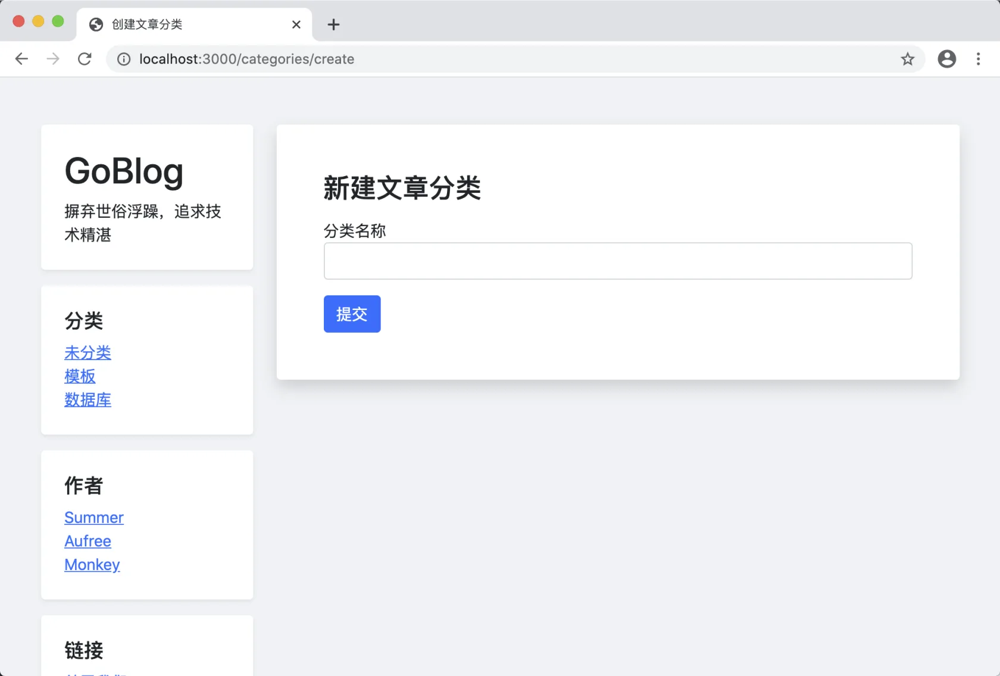
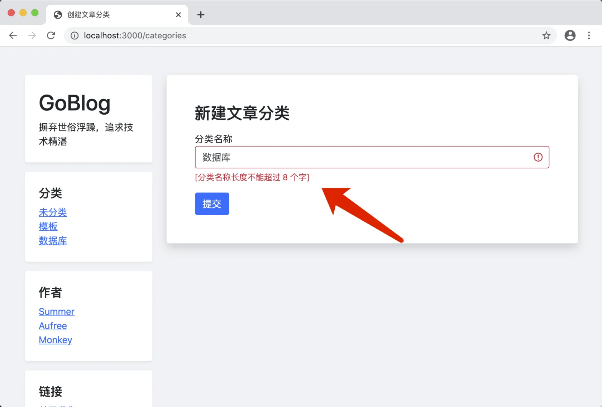
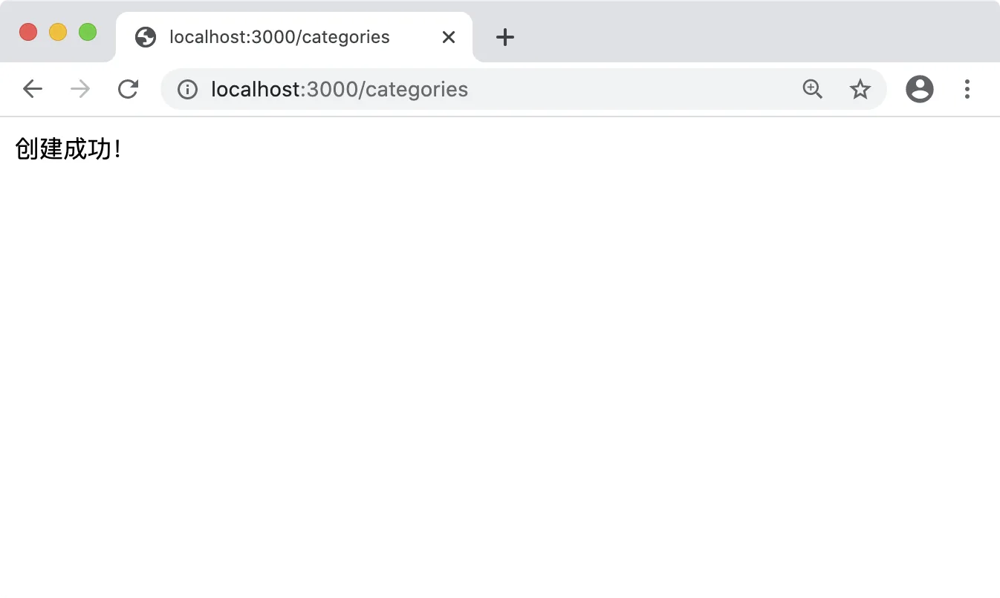

# 13.2. 创建分类

原文链接：https://learnku.com/courses/go-basic/1.22/classification-of-articles/16554

## 说明

这一节我们来一起开发创建分类相关功能。

## 注册路由

routes/web.go

```go
.
.
.
// RegisterWebRoutes 注册网页相关路由
func RegisterWebRoutes(r *mux.Router) {
    .
    .
    .
    r.HandleFunc("/articles/{id:[0-9]+}/delete", middlewares.Auth(ac.Delete)).Methods("POST").Name("articles.delete")

    // 文章分类
    cc := new(controllers.CategoriesController)
    r.HandleFunc("/categories/create", middlewares.Auth(cc.Create)).Methods("GET").Name("categories.create")
    r.HandleFunc("/categories", middlewares.Auth(cc.Store)).Methods("POST").Name("categories.store")
    .
    .
    .
}
```

## 创建控制器 CategoriesController

app/http/controllers/categories_controller.go

```go
package controllers

import (
	"goblog/pkg/view"
	"net/http"
)

// CategoriesController 文章分类控制器
type CategoriesController struct {
	BaseController
}

// Create 文章分类创建页面
func (*CategoriesController) Create(w http.ResponseWriter, r *http.Request) {
	view.Render(w, view.D{}, "categories.create")
}

// Store 保存文章分类
func (*CategoriesController) Store(w http.ResponseWriter, r *http.Request) {
	// 稍后开发
}
```

## 创建表单

resources/views/categories/create.gohtml

```
{{define "title"}}
创建文章分类
{{end}}

{{define "main"}}
<div class="col-md-9 blog-main">
<div class="blog-post bg-white p-5 rounded shadow mb-4">

<h3>新建文章分类</h3>

<form action="{{ RouteName2URL "categories.store" }}" method="post">

<div class="form-group mt-3">
<label for="title">分类名称</label>
<input type="text" class="form-control {{if .Errors.name }}is-invalid {{end}}" name="name" value="{{ .Category.Name }}" required>
{{ with .Errors.name }}
<div class="invalid-feedback">
{{ . }}
</div>
{{ end }}
</div>

<button type="submit" class="btn btn-primary mt-3">提交</button>

</form>

</div><!-- /.blog-post -->
</div>

{{end}}
```

## 测试表单显示

访问 [localhost:3000/categories/create](http://localhost:3000/categories/create) ：



## 保存分类

接下来处理表单提交过来的逻辑。

参考文章控制器，依葫芦画瓢：

app/http/controllers/categories_controller.go

```go
.
.
.
// Store 保存文章分类
func (*CategoriesController) Store(w http.ResponseWriter, r *http.Request) {

	// 1. 初始化数据
	_category := category.Category{
		Name: r.PostFormValue("name"),
	}

	// 2. 表单验证
	errors := requests.ValidateCategoryForm(_category)

	// 3. 检测错误
	if len(errors) == 0 {
		// 创建文章分类
		_category.Create()
		if _category.ID > 0 {
			fmt.Fprint(w, "创建成功！")
			// indexURL := route.Name2URL("categories.show", "id", _category.GetStringID())
			// http.Redirect(w, r, indexURL, http.StatusFound)
		} else {
			w.WriteHeader(http.StatusInternalServerError)
			fmt.Fprint(w, "创建文章分类失败，请联系管理员")
		}
	} else {
		view.Render(w, view.D{
			"Category": _category,
			"Errors":   errors,
		}, "categories.create")
	}
}
```

## 创建分类模型

app/models/category/category.go

```go
// Package category 存放应用的分类数据模型
package category

import (
	"goblog/app/models"
)

// Category 文章分类
type Category struct {
	models.BaseModel

	Name string `gorm:"type:varchar(255);not null;" valid:"name"`
}
```

我们只需要一个字段即可。Struct 标签里的 valid 参数是给表单验证准备的。

接下来是分类创建方法：

app/models/category/crud.go

```go
package category

import (
	"goblog/pkg/logger"
	"goblog/pkg/model"
)

// Create 创建分类，通过 category.ID 来判断是否创建成功
func (category *Category) Create() (err error) {
	if err = model.DB.Create(&category).Error; err != nil {
		logger.LogError(err)
		return err
	}

	return nil
}
```

## 注册自动迁移

模型创建完成后，我们还需要创建数据表结构，有了 GORM 的自动迁移功能，这会变得很简单：

bootstrap/db.go

```go
.
.
.
func migration(db *gorm.DB) {

	// 自动迁移
	db.AutoMigrate(
		&user.User{},
		&article.Article{},
		&category.Category{},
	)
}
```

保存编译成功后，就会自动在数据库中创建 categories 表，请自行查看。

## 最后是表单验证

app/requests/category_form.go

```go
package requests

import (
	"goblog/app/models/category"

	"github.com/thedevsaddam/govalidator"
)

// ValidateCategoryForm 验证表单，返回 errs 长度等于零即通过
func ValidateCategoryForm(data category.Category) map[string][]string {

	// 1. 定制认证规则
	rules := govalidator.MapData{
		"name": []string{"required", "min:2", "max:8", "not_exists:categories,name"},
	}

	// 2. 定制错误消息
	messages := govalidator.MapData{
		"name": []string{
			"required:分类名称为必填项",
			"min:分类名称长度需至少 2 个字",
			"max:分类名称长度不能超过 8 个字",
		},
	}

	// 3. 配置初始化
	opts := govalidator.Options{
		Data:          &data,
		Rules:         rules,
		TagIdentifier: "valid", // 模型中的 Struct 标签标识符
		Messages:      messages,
	}

	// 4. 开始验证
	return govalidator.New(opts).ValidateStruct()
}
```

## 开始测试

访问 [localhost:3000/categories/create](http://localhost:3000/categories/create) ，输入内容：



很明显这块文字的长度判断有问题，之前我们在开发文章的表单验证时讨论过。

中文需要使用 `utf8.RuneCountInString()` 来验证长度。

接下来我们定制中文版的长度限制规则：

app/requests/request.go

```go
.
.
.
// 此方法会在初始化时执行
func init() {
    .
    .
    .
    // max_cn:8
    govalidator.AddCustomRule("max_cn", func(field string, rule string, message string, value interface{}) error {
            valLength := utf8.RuneCountInString(value.(string))
            l, _ := strconv.Atoi(strings.TrimPrefix(rule, "max_cn:")) //handle other error
            if valLength > l {
                if message != "" {
                    return errors.New(message)
                }
                return fmt.Errorf("长度不能超过 %d 个字", l)
            }
            return nil
    })

    // min_cn:2
    govalidator.AddCustomRule("min_cn", func(field string, rule string, message string, value interface{}) error {
            valLength := utf8.RuneCountInString(value.(string))
            l, _ := strconv.Atoi(strings.TrimPrefix(rule, "min_cn:")) //handle other error
            if valLength < l {
                if message != "" {
                    return errors.New(message)
                }
                return fmt.Errorf("长度需大于 %d 个字", l)
            }
            return nil
    })
}
```

更新下我们的分类表单验证规则：

app/requests/category_form.go

```go
.
.
.
// ValidateCategoryForm 验证表单，返回 errs 长度等于零即通过
func ValidateCategoryForm(data category.Category) map[string][]string {

    // 1. 定制认证规则
    rules := govalidator.MapData{
        "name": []string{"required", "min_cn:2", "max_cn:8", "not_exists:categories,name"},
    }

    // 2. 定制错误消息
    messages := govalidator.MapData{
        "name": []string{
            "required:分类名称为必填项",
            "min_cn:分类名称长度需至少 2 个字",
            "max_cn:分类名称长度不能超过 8 个字",
        },
    }
    .
    .
    .
}
```

再次测试，点击提交按钮，会显示创建成功：



## 友好提示

跳转的提示不够友好，我们使用 flash 包来提示：

app/http/controllers/categories_controller.go

```go
.
.
.
// Store 保存文章分类
func (*CategoriesController) Store(w http.ResponseWriter, r *http.Request) {
    .
    .
    .
    if _category.ID > 0 {
        flash.Success("分类创建成功")
        indexURL := route.Name2URL("home")
        http.Redirect(w, r, indexURL, http.StatusFound)
    } else {
        w.WriteHeader(http.StatusInternalServerError)
        fmt.Fprint(w, "创建文章分类失败，请联系管理员")
    }
    .
    .
    .
}
.
.
.
```

请自行测试。

## 修复文章长度验证的 Bug

我们在重构文章表单验证时，使用的也是 `min` 和 `max` 规则，这里也一并修改下：

app/requests/article_form.go

```go
.
.
.
// ValidateArticleForm 验证表单，返回 errs 长度等于零即通过
func ValidateArticleForm(data article.Article) map[string][]string {

    // 1. 定制认证规则
    rules := govalidator.MapData{
        "title": []string{"required", "min_cn:3", "max_cn:40"},
        "body":  []string{"required", "min_cn:10"},
    }

    // 2. 定制错误消息
    messages := govalidator.MapData{
        "title": []string{
            "required:标题为必填项",
            "min_cn:标题长度需大于 3",
            "max_cn:标题长度需小于 40",
        },
        "body": []string{
            "required:文章内容为必填项",
            "min_cn:长度需大于 10",
        },
    }
    .
    .
    .
```

篇幅考虑，请自行测试！

## 代码版本

开始下一节之前，我们先来为代码做下版本标记：

```bash
$ git add .
$ git commit -m "创建分类"
```
