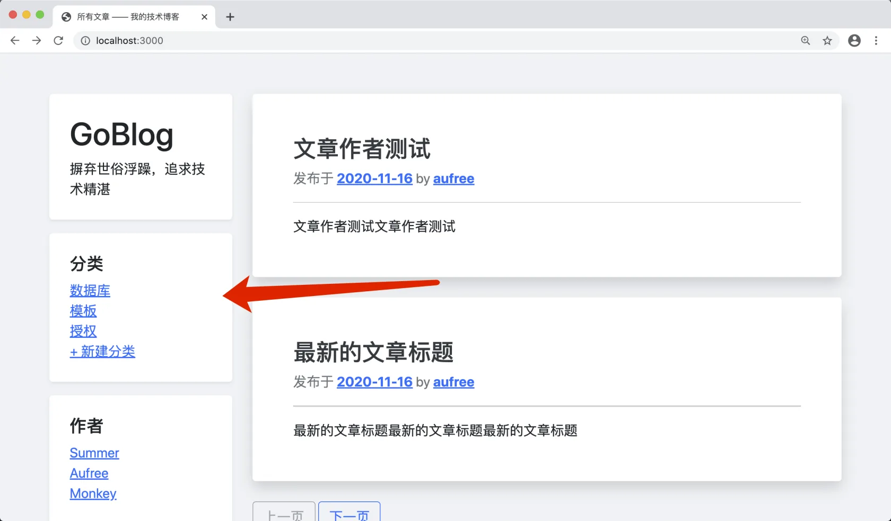

# 13.3. 显示分类

原文链接：https://learnku.com/courses/go-basic/1.22/show-categories/16555

## 说明

上一节我们开发了创建分类的功能，本节将处理显示相关的逻辑。

## 数据准备

请前往 [localhost:3000/categories/create](http://localhost:3000/categories/create) ，创建以下分类：

- 数据库

- 模板

- 授权

## 新建路由

在 categories.store 后面新增路由：

routes/web.go

```
.
.
.
// RegisterWebRoutes 注册网页相关路由
func RegisterWebRoutes(r *mux.Router) {
.
.
r.HandleFunc("/categories", middlewares.Auth(cc.Store)).Methods("POST").Name("categories.store")
r.HandleFunc("/categories/{id:[0-9]+}", cc.Show).Methods("GET").Name("categories.show")
.
.
.
}

```

## 控制器方法

先创建一个占位符，我们先把左边栏的分类列表显示出来再说：

app/http/controllers/categories_controller.go

```
.
.
.
// Show 显示分类下的文章列表
func (*CategoriesController) Show(w http.ResponseWriter, r *http.Request) {
//
}
```

## 模型方法

创建获取分类数据的方法：

app/models/category/crud.go

```
.
.
.
// All 获取分类数据
func All() ([]Category, error) {
var categories []Category
if err := model.DB.Find(&categories).Error; err != nil {
return categories, err
}
return categories, nil
}
```

添加 Link 方法，允许左边栏的分类列表显示链接：

app/models/category/category.go

```
.
.
.
// Link 方法用来生成文章链接
func (category Category) Link() string {
return route.Name2URL("categories.show", "id", category.GetStringID())
}
```

## 模板变量

大部分页面都会使用到左边栏的分类数据，我们将其注册到全局模板变量中：

pkg/view/view.go

```
.
.
.
// RenderTemplate 渲染视图
func RenderTemplate(w io.Writer, name string, data D, tplFiles ...string) {

// 1. 通用模板数据
data["isLogined"] = auth.Check()
data["flash"] = flash.All()
data["Users"], _ = user.All()
data["Categories"], _ = category.All()
.
.
.
}
.
.
.
```

## 模板读取数据

接下来将边栏的数据显示出来：

resources/views/layouts/sidebar.gohtml

```
.
.
.
<div class="p-4 bg-white rounded shadow-sm mb-3">
<h5>分类</h5>
<ol class="list-unstyled mb-0">
{{ range $key, $category := .Categories }}
<li><a href="{{ $category.Link }}">{{ $category.Name }}</a></li>
{{ end }}
<li><a href="{{ RouteName2URL "categories.create" }}">+ 新建分类</a></li>
</ol>
</div>
.
.
.
```

## 测试一下

访问首页，即可看到我们的分类数据：



## 代码版本

开始下一节之前，我们先来为代码做下版本标记：

```
$ git add .
$ git commit -m "显示分类"
```
