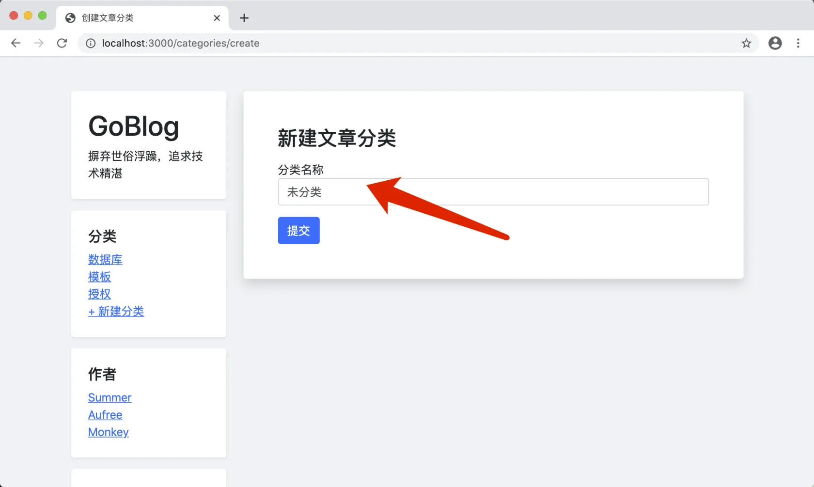
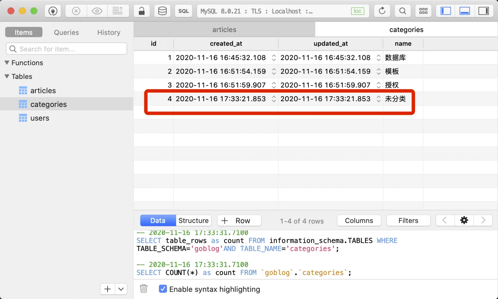
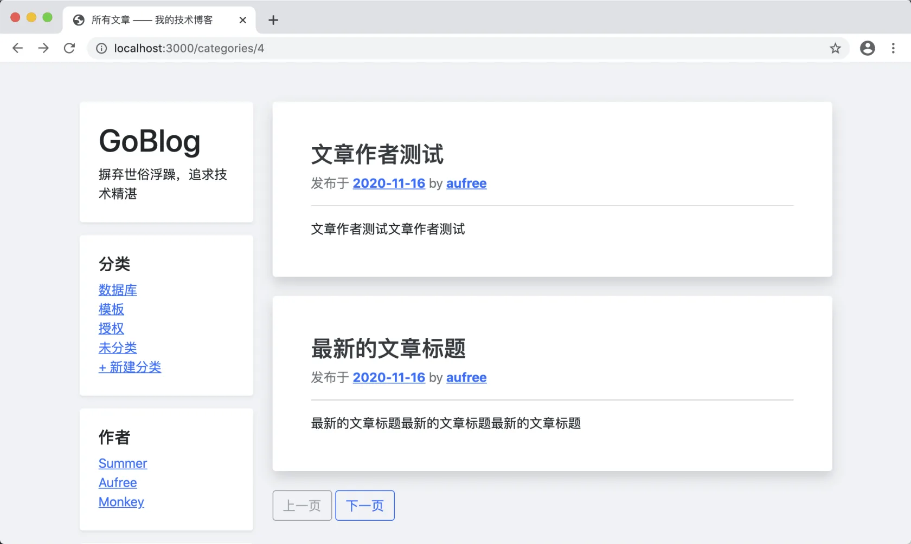

# 13.4. 分类下的文章

原文链接：https://learnku.com/courses/go-basic/1.22/classified-articles/16556

## 说明

左边分类列表已经能显示出来，但此时如果你点进去，会出现一个空白页。

本节我们来开发这个页面，此页面显示的是分类下文章列表。

## Article 新增字段

app/models/article/article.go

```
.
.
.
// Article 文章模型
type Article struct {
.
.
.

CategoryID uint64 `gorm:"not null;default:4;index"`
}
.
.
.
```

因为我们数据库里已经存在很多文章数据，如果设置为 `not null` 的话会照成数据不一致。这里我们加上默认值 `default:4` ，接下来我们创建这个 ID 为 4 的分类，分类名称为`未分类`，点击创建：





## 通过分类来获取文章列表

新增模型方法：

app/models/article/crud.go

```
.
.
.
// GetByCategoryID 获取分类相关的文章
func GetByCategoryID(cid string, r *http.Request, perPage int) ([]Article, pagination.ViewData, error) {

// 1. 初始化分页实例
db := model.DB.Model(Article{}).Where("category_id = ?", cid).Order("created_at desc")
_pager := pagination.New(r, db, route.Name2URL("categories.show", "id", cid), perPage)

// 2. 获取视图数据
viewData := _pager.Paging()

// 3. 获取数据
var articles []Article
_pager.Results(&articles)

return articles, viewData, nil
}
```

## 控制器调用

接下来要在控制器中使用：

app/http/controllers/categories_controller.go

```
.
.
.
// Show 显示分类下的文章列表
func (cc *CategoriesController) Show(w http.ResponseWriter, r *http.Request) {

// 1. 获取 URL 参数
id := route.GetRouteVariable("id", r)

// 2. 读取对应的数据
_category, err := category.Get(id)

// 3. 获取结果集
articles, pagerData, err := article.GetByCategoryID(_category.GetStringID(), r, 2)

if err != nil {
cc.ResponseForSQLError(w, err)
} else {

// ---  2. 加载模板 ---
view.Render(w, view.D{
"Articles":  articles,
"PagerData": pagerData,
}, "articles.index", "articles._article_meta")
}
}
```

前往创建 `category.Get()` 方法：

app/models/category/crud.go

```
.
.
.
// Get 通过 ID 获取分类
func Get(idstr string) (Category, error) {
var category Category
id := types.StringToUint64(idstr)
if err := model.DB.First(&category, id).Error; err != nil {
return category, err
}

return category, nil
}
```

## 开始测试

访问 [localhost:3000/categories/4](http://localhost:3000/categories/4) ：



分页也能正常使用。

## 代码版本

开始下一节之前，我们先来为代码做下版本标记：

```
$ git add .
$ git commit -m "关联文章和分类"
```
