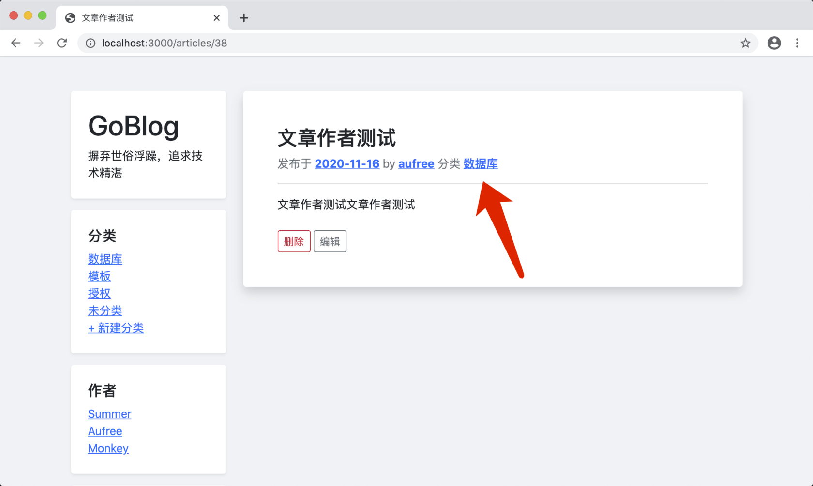

# 13.5. 总结和任务

原文链接：https://learnku.com/courses/go-basic/1.22/task-summary/16557

## 总结

本章基本上把我们之前接触的知识温习了一遍。

## 编程任务

### 任务一

请在创建文章时候，让用户可以选择分类。文章创建后，文章详情页里的 Meta 数据里，可以显示分类信息如下：

### 任务二

请为文章分类开发编辑功能，允许登录用户可以编辑某个分类。

UI 即兴发挥，业务逻辑参考文章编辑。
