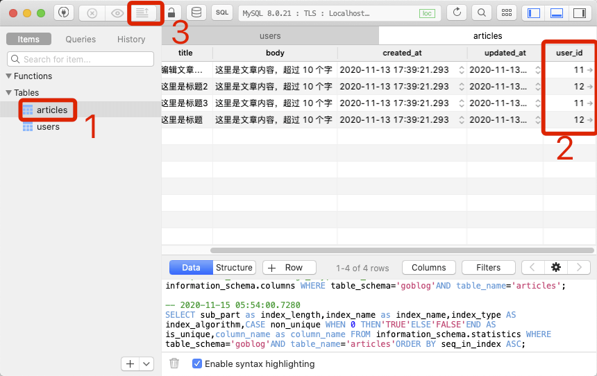
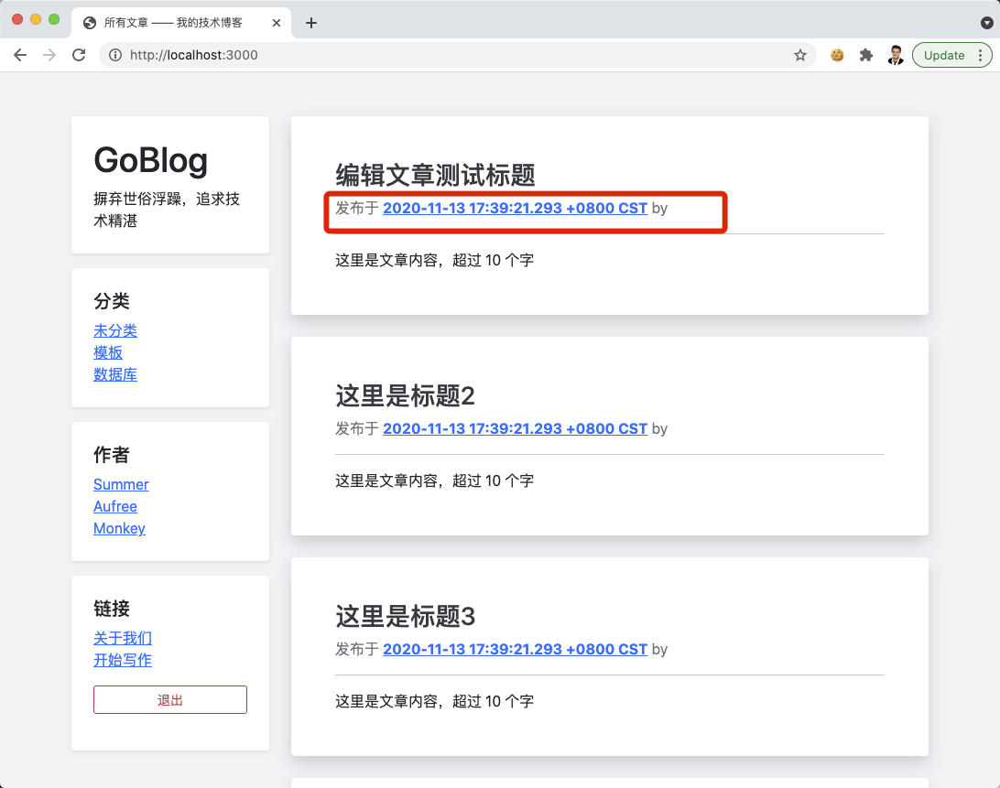
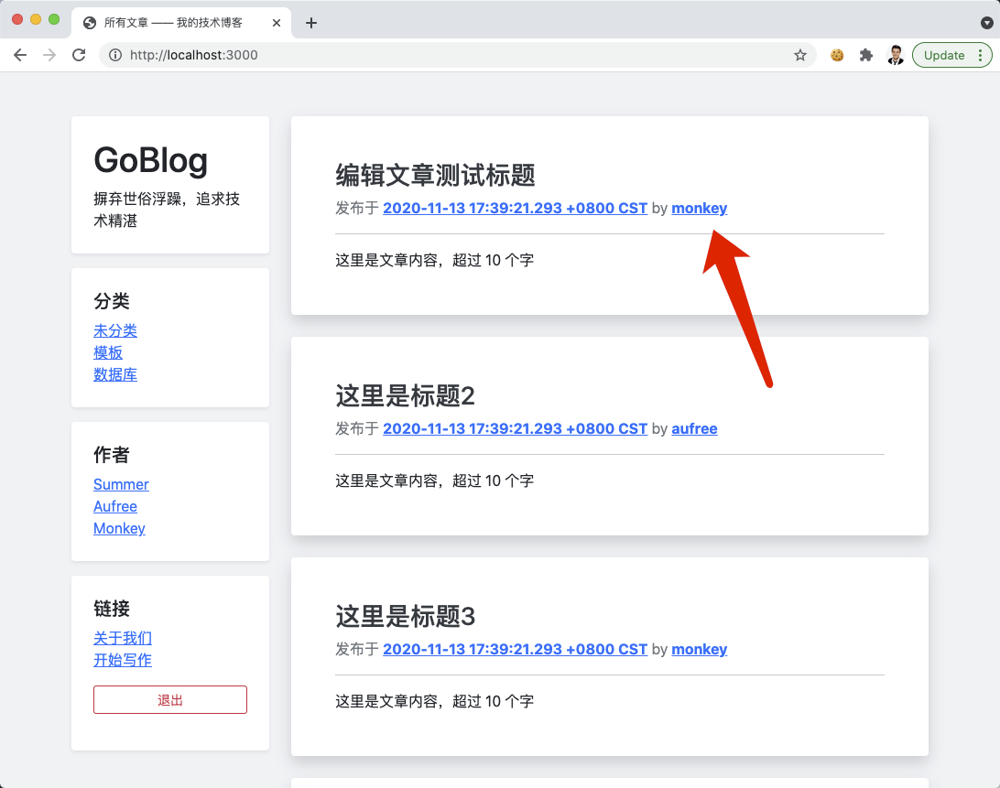
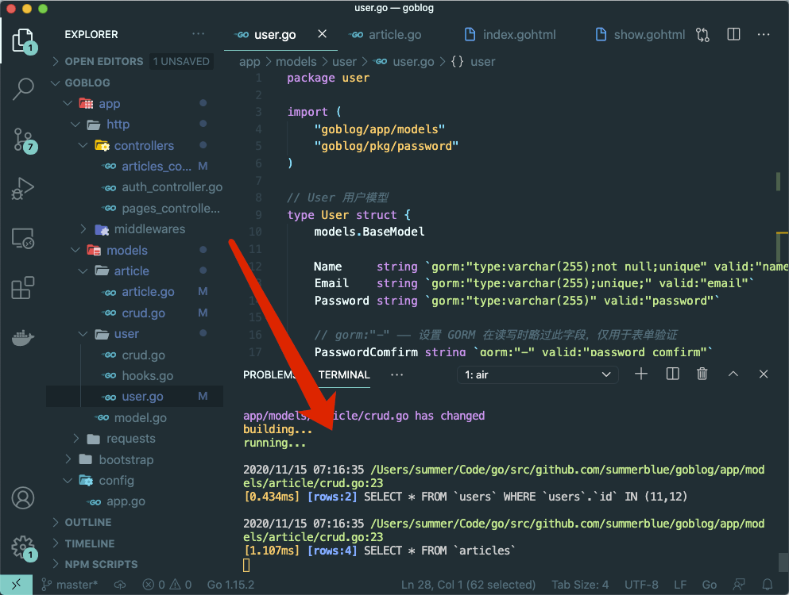
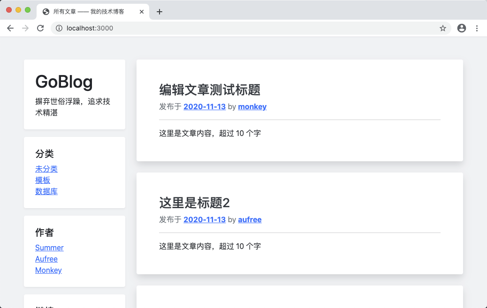

# 12.1. 显示文章作者

原文链接：https://learnku.com/courses/go-basic/1.22/users-and-articles/16546

## 说明

本节我们来关联用户与文章。

## GORM 模型关联

GORM 的模型关联有：

- 一对一 Belongs To 、Has One

- 一对多 Has Many

- 多对多 Many To Many

风格与 Laravel 类似。支持模型查询、连带创建或更新、预加载等功能。

## 设置模型关联

在 Article 模型中新增 user_id 字段，以及用户项，即可完成模型的关联：

app/models/article/article.go

```
.
.
.
// Article 文章模型
type  Article  struct  {
.
.
.
UserID uint64 `gorm:"not null;index"`
User   user.User
}
.
.
.
```

注意：请确保顶部引入的是 `goblog/app/models/user`。

GORM 是遵循约定优先于配置的风格。约定规定，一对一的关联，是通过模型单数小写加下划线和 ID 如 `user_id` 来实现，它会去读下划线前面的单词的复数形式作为数据表（如此例的 users），取字段 id 为关联字段。

在特殊的情况下，如果你无法按照约定，也可以自行配置关联关系，具体请见 [Belongs To 文档](https://gorm.io/docs/belongs_to.html)

```
UserID uint64 `gorm:"not null;index"`
```

因为每一篇文章都必须有一位作者，我们添加 `not null` 的 MySQL 约束数据不能为空。另外因为此字段经常查询，我们设定 `index` 增加数据库索引让读取更快。

为了保持数据正确，请前往数据库工具中填充 user_id 的值。确保 users 表里这些 id 都是有效的：



## 读取用户信息

目前我们有两个地方需要读取文章作者，并且 HTML 结构是一致的，我们将其统一起来：

resources/views/articles/index.gohtml

```
.
.
.
<div class="blog-post bg-white p-5 rounded shadow mb-4">
<h3 class="blog-post-title"><a href="{{ $article.Link }}" class="text-dark text-decoration-none">{{ $article.Title }}</a></h3>

{{template "article-meta" $article }}

<hr>
{{ $article.Body }}

</div><!-- /.blog-post -->

{{ end }}
.
.
.
```

resources/views/articles/show.gohtml

```
.
.
.
<div class="blog-post bg-white p-5 rounded shadow mb-4">
<h3 class="blog-post-title">{{ .Article.Title }}</h3>

{{template "article-meta" .Article }}

<hr>
{{ .Article.Body }}
.
.
.
```

接下来创建 `article-meta` 这个模板：

resources/views/articles/_article_meta.gohtml

```
{{define "article-meta"}}
<p class="blog-post-meta text-secondary">
发布于 <a href="{{ .Link }}" class="font-weight-bold">{{ .CreatedAt }}</a>
by <a href="{{ .User.Link }}" class="font-weight-bold">{{ .User.Name }}</a>
</p>
{{ end }}
```

用以创建用户链接的 `.User.Link` 不存在，接下来创建：

app/models/user/user.go

```
.
.
.
// Link 方法用来生成用户链接
func (user *User) Link() string {
return ""
}
```

这里先返回空字串，下一节我们会开发用户页面的功能。

加载子模板的话，需要修改控制器将 `_article_meta.gohtml` 加载进来：

app/http/controllers/articles_controller.go

```
.
.
.
// Show 文章详情页面
func (*ArticlesController) Show(w http.ResponseWriter, r *http.Request) {
.
.
.
} else {
// ---  4. 读取成功，显示文章 ---
view.Render(w, view.D{
"Article": article,
}, "articles.show", "articles._article_meta")
}
}

// Index 文章列表页
func (*ArticlesController) Index(w http.ResponseWriter, r *http.Request) {
.
.
.
// ---  2. 加载模板 ---
view.Render(w, view.D{
"Articles": articles,
}, "articles.index", "articles._article_meta")
}
}
.
.
.
```

刷新页面：



创建时间渲染出来了（证明子模板加载成功），而用户信息没有。

这是因为我们还未告诉 GORM 加载关联数据。

## 读取关联

读取关联我们需要使用 GORM 的 `Preload()` 方法。

一般情况下读取一篇或者多篇文章时，我们都希望能带上用户的信息，因此统一做修改：

app/models/article/crud.go

```
.
.
.
// Get 通过 ID 获取文章
func Get(idstr string) (Article, error) {
var article Article
id := types.StringToUint64(idstr)
if err := model.DB.Preload("User").First(&article, id).Error; err != nil {
return article, err
}

return article, nil
}

// GetAll 获取全部文章
func GetAll() ([]Article, error) {
var articles []Article
if err := model.DB.Debug().Preload("User").Find(&articles).Error; err != nil {
return articles, err
}
return articles, nil
}
.
.
.
```

注意以上代码我们新增了两个 `Preload()`。

>

提示： 调试单条模型的 SQL 语句，可以使用 GORM 提供的`Debug()`方法，上面的 GetAll 方法里使用到了，接下来看看会有什么输出。

再次刷新首页：



用户名出来了，再来看下使用 GORM 的  `Debug()` 后，命令行 SQL 输出：



继续测试，点击标题进入文章的详情页面，也可以看到同样的 meta 信息。

## 删除无用代码

`Debug()` 调用是我们调试 SQL 使用的，为了保持命令行干净，请将其删除。

这里提一句，开发时请尽量保持命令行干净，以防止错过重要的编译信息。

## 格式化时间

最后我们来格式化创建文章的时间，只显示日期就够了。

GORM 默认维护的 CreatedAt 和 UpdatedAt 的字段类型为 `time.Time`，这意味着我们可直接使用 time.Time 相关操作方法。

新增 CreatedAtDate 方法：

app/models/article/article.go

```
.
.
.
// CreatedAtDate 创建日期
func (article Article) CreatedAtDate() string {
return article.CreatedAt.Format("2006-01-02")
}
```

我们使用到 `Format()` 方法来格式化数据，传参为格式的布局模板，可用的布局模板如下：

| 布局模板
| 时间标识
| C 类型
| 备注

| 2006-01-02
| yyyy-MM-dd
| %F
| ISO 8601

| 20060102
| yyyyMMdd
| %Y%m%d
| ISO 8601

| January 02, 2006
| MMMM dd, yyyy
| %B %d, %Y
|

| 02 January 2006
| dd MMMM yyyy
| %d %B %Y
|

| 02-Jan-2006
| dd-MMM-yyyy
| %d-%b-%Y
|

| 01/02/06
| MM/dd/yy
| %D
| US

| 01/02/2006
| MM/dd/yyyy
| %m/%d/%Y
| US

| 010206
| MMddyy
| %m%d%y
| US

| Jan-02-06
| MMM-dd-yy
| %b-%d-%y
| US

| Jan-02-2006
| MMM-dd-yyyy
| %b-%d-%Y
| US

| 06
| yy
| %y
|

| Mon
| EEE
| %a
|

| Monday
| EEEE
| %A
|

| Jan-06
| MMM-yy
| %b-%y
|

模板修改:

resources/views/articles/_article_meta.gohtml

```
{{define "article-meta"}}
<p class="blog-post-meta text-secondary">
发布于 <a href="{{ .Link }}" class="font-weight-bold">{{ .CreatedAtDate }}</a>
by <a href="{{ .User.Link }}" class="font-weight-bold">{{ .User.Name }}</a>
</p>
{{ end }}
```

刷新页面：



即可看到只显示日期。

## 代码版本

开始下一节之前，我们先来为代码做下版本标记：

```
$ git add .
$ git commit -m "文章作者"
```
