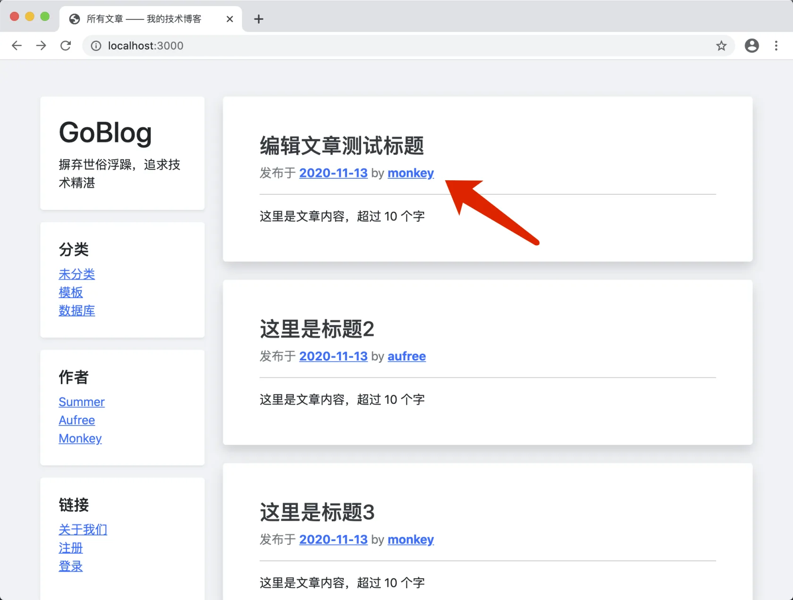
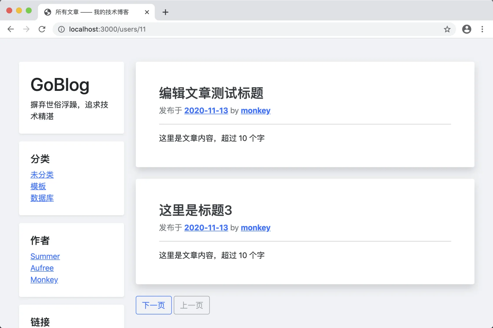

# 12.2. 用户的文章

原文链接：https://learnku.com/courses/go-basic/1.22/users-article/16547

## 说明

本节来开发用户发布的文章列表。

## 注册路由

routes/web.go

```
.
.
.
// RegisterWebRoutes 注册网页相关路由
func  RegisterWebRoutes(r *mux.Router) {
.
.
.

// 用户相关
uc := new(controllers.UserController)
r.HandleFunc("/users/{id:[0-9]+}", uc.Show).Methods("GET").Name("users.show")

// 静态资源
.
.
.
}
```

前往创建控制器：

app/http/controllers/user_controller.go

```
package controllers

import (
"fmt"
"goblog/app/models/article"
"goblog/app/models/user"
"goblog/pkg/logger"
"goblog/pkg/route"
"goblog/pkg/view"
"net/http"

"gorm.io/gorm"
)

// UserController 用户控制器
type UserController struct {
}

// Show 用户个人页面
func (*UserController) Show(w http.ResponseWriter, r *http.Request) {

// 1. 获取 URL 参数
id := route.GetRouteVariable("id", r)

// 2. 读取对应的文章数据
_user, err := user.Get(id)

// 3. 如果出现错误
if err != nil {
if err == gorm.ErrRecordNotFound {
// 3.1 数据未找到
w.WriteHeader(http.StatusNotFound)
fmt.Fprint(w, "404 用户未找到")
} else {
// 3.2 数据库错误
logger.LogError(err)
w.WriteHeader(http.StatusInternalServerError)
fmt.Fprint(w, "500 服务器内部错误")
}
} else {
// ---  4. 读取成功，显示用户文章列表 ---
articles, err := article.GetByUserID(_user.GetStringID())
if err != nil {
logger.LogError(err)
w.WriteHeader(http.StatusInternalServerError)
fmt.Fprint(w, "500 服务器内部错误")
} else {
view.Render(w, view.D{
"Articles": articles,
}, "articles.index", "articles._article_meta")
}
}
}
```

代码之前分解过，这里不再赘述。

模板使用文章列表的模板即可。

读取用户相关文章时用到了 `GetByUserID()` 方法，我们前往创建：

app/models/article/crud.go

```
.
.
.
// GetByUserID 获取全部文章
func GetByUserID(uid string) ([]Article, error) {
var articles []Article
if err := model.DB.Where("user_id = ?", uid).Preload("User").Find(&articles).Error; err != nil {
return articles, err
}
return articles, nil
}
```

最后再更新上一节创建的 `user.Link()` 方法:

app/models/user/user.go

```
.
.
.
// Link 方法用来生成用户链接
func (user User) Link() string {
return route.Name2URL("users.show", "id", user.GetStringID())
}
```

## 测试一下

打开首页 [localhost:3000/](http://localhost:3000/) ，点击用户链接：



可以看到此页面只显示当前用户发布的文章：



## 代码版本

开始下一节之前，我们先来为代码做下版本标记：

```
$ git add .
$ git commit -m "用户的文章"
```
