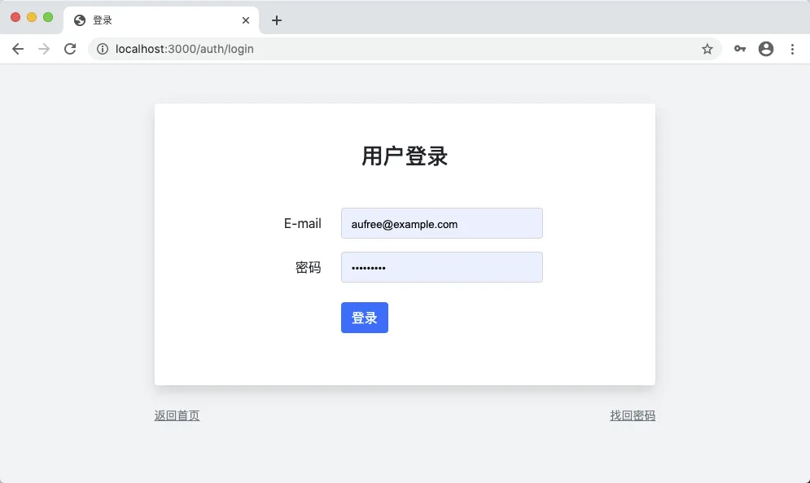
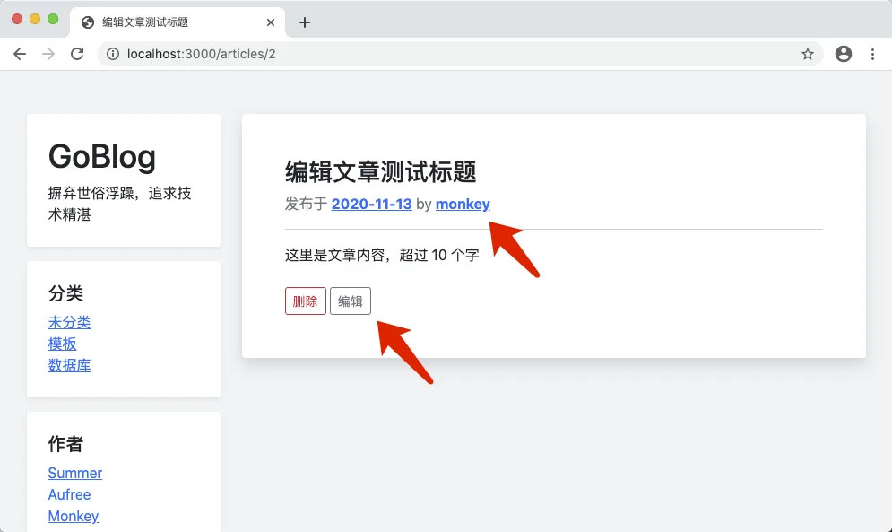
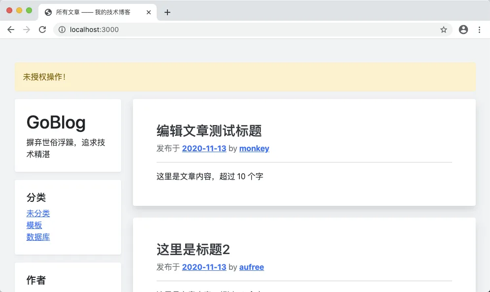
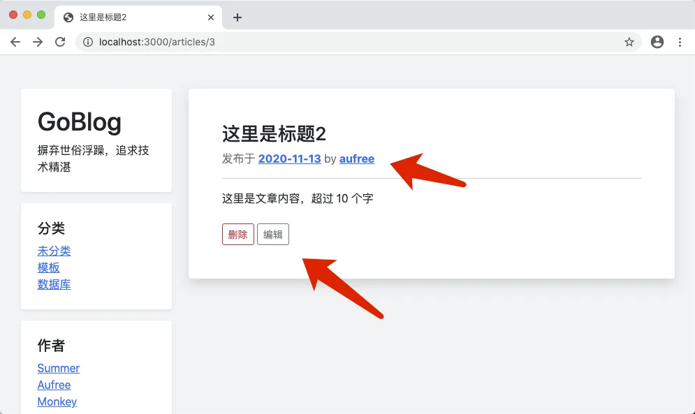
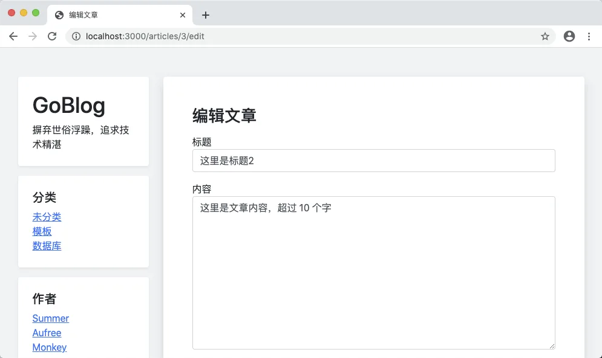
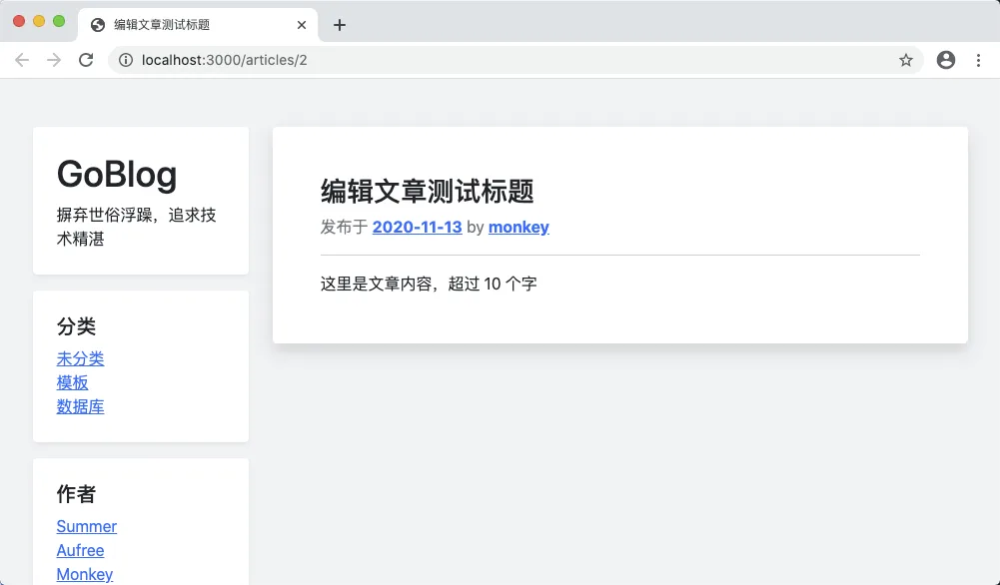
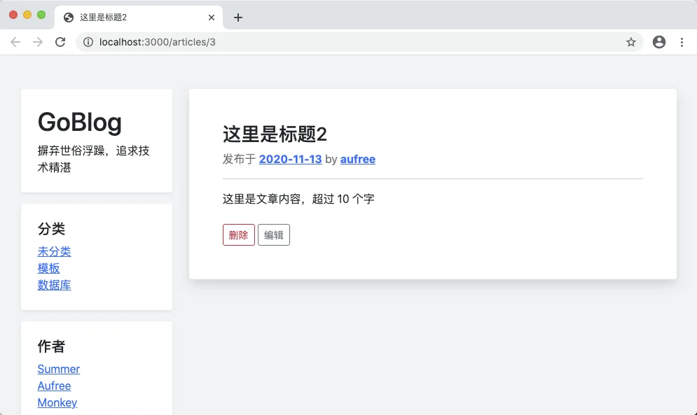

# 12.3. 授权策略

原文链接：https://learnku.com/courses/go-basic/1.22/authorization-strategy/16548

## 说明

文章的编辑和删除功能，应该只有文章的作者才能有权限操作，目前是所有登录的用户都有权限，本节我们一起来修复这个问题。

## 授权策略

为了方便维护，我们将权限判断代码放到 app/policies 下，命名规则是模型加后缀 `_policy`。

此项目的权限控制比较简单，我们书写权限判断方法即可，方法命名规则是 `Can{Action}{Model}`。

以下是文章的权限判断：

app/policies/topic_policy.go

```
// Package policies 存放应用的授权策略
package policies

import (
"goblog/app/models/article"
"goblog/pkg/auth"
)

// CanModifyArticle 是否允许修改话题
func CanModifyArticle(_article article.Article) bool {
return auth.User().ID == _article.UserID
}
```

## 使用授权策略

授权调用的位置是数据库里查出来数据之后，执行目标操作之前：

app/http/controllers/articles_controller.go

```
.
.
.
// Edit 文章更新页面
func (ac *ArticlesController) Edit(w http.ResponseWriter, r *http.Request) {
.
.
.
} else {

// 检查权限
if !policies.CanModifyArticle(_article) {
flash.Warning("未授权操作！")
http.Redirect(w, r, "/", http.StatusFound)
} else {
// 4. 读取成功，显示编辑文章表单
view.Render(w, view.D{
"Article": _article,
"Errors":  view.D{},
}, "articles.edit", "articles._form_field")
}
}
}

// Update 更新文章
func (ac *ArticlesController) Update(w http.ResponseWriter, r *http.Request) {
.
.
.
} else {
// 4. 未出现错误

// 检查权限
if !policies.CanModifyArticle(_article) {
flash.Warning("未授权操作！")
http.Redirect(w, r, "/", http.StatusForbidden)
} else {

// 4.1 表单验证
_article.Title = r.PostFormValue("title")
_article.Body = r.PostFormValue("body")

errors := requests.ValidateArticleForm(_article)

if len(errors) == 0 {

// 4.2 表单验证通过，更新数据
rowsAffected, err := _article.Update()

if err != nil {
// 数据库错误
w.WriteHeader(http.StatusInternalServerError)
fmt.Fprint(w, "500 服务器内部错误")
return
}

// √ 更新成功，跳转到文章详情页
if rowsAffected > 0 {
showURL := route.Name2URL("articles.show", "id", id)
http.Redirect(w, r, showURL, http.StatusFound)
} else {
fmt.Fprint(w, "您没有做任何更改！")
}
} else {

// 4.3 表单验证不通过，显示理由
view.Render(w, view.D{
"Article": _article,
"Errors":  errors,
}, "articles.edit", "articles._form_field")
}
}
}
}

// Delete 删除文章
func (ac *ArticlesController) Delete(w http.ResponseWriter, r *http.Request) {
.
.
.
} else {

// 检查权限
if !policies.CanModifyArticle(_article) {
flash.Warning("您没有权限执行此操作！")
http.Redirect(w, r, "/", http.StatusFound)
} else {
// 4. 未出现错误，执行删除操作
rowsAffected, err := _article.Delete()

// 4.1 发生错误
if err != nil {
// 应该是 SQL 报错了
w.WriteHeader(http.StatusInternalServerError)
fmt.Fprint(w, "500 服务器内部错误")
} else {
// 4.2 未发生错误
if rowsAffected > 0 {
// 重定向到文章列表页
indexURL := route.Name2URL("articles.index")
http.Redirect(w, r, indexURL, http.StatusFound)
} else {
// Edge case
w.WriteHeader(http.StatusNotFound)
fmt.Fprint(w, "404 文章未找到")
}
}
}
}
}
```

## 测试一下

### 未授权访问

使用 Aufree 用户登录 [localhost:3000/auth/login](http://localhost:3000/auth/login) ：



点击作者为 Monkey 的文章，并点击编辑：



显示未授权：



### 正确授权

点击作者为 Aufree 的文章，并点击编辑：



顺利进入



## 显示编辑按钮

控制器里写入模板数据：

app/http/controllers/articles_controller.go

```
.
.
.
// Show 文章详情页面
func (ac *ArticlesController) Show(w http.ResponseWriter, r *http.Request) {
.
.
.
} else {
// ---  4. 读取成功，显示文章 ---
view.Render(w, view.D{
"Article":          article,
"CanModifyArticle": policies.CanModifyArticle(article),
}, "articles.show", "articles._article_meta")
}
}
```

模板里添加判断：

resources/views/articles/show.gohtml

```
.
.
.
{{ if .CanModifyArticle }}
<form class="mt-4" action="{{ RouteName2URL "articles.delete" "id" .Article.GetStringID }}" method="post">
<button type="submit" onclick="return confirm('删除动作不可逆，请确定是否继续')" class="btn btn-outline-danger btn-sm">删除</button>
<a href="{{ RouteName2URL "articles.edit" "id" .Article.GetStringID }}" class="btn btn-outline-secondary btn-sm">编辑</a>
</form>
{{end}}
.
.
.
```

### 测试一下

登录用户为 Aufree 的情况下，打开 Monkey 发的文章：



打开 Aufree 发的文章：



## 代码版本

开始下一节之前，我们先来为代码做下版本标记：

```
$ git add .
$ git commit -m "授权策略"
```
