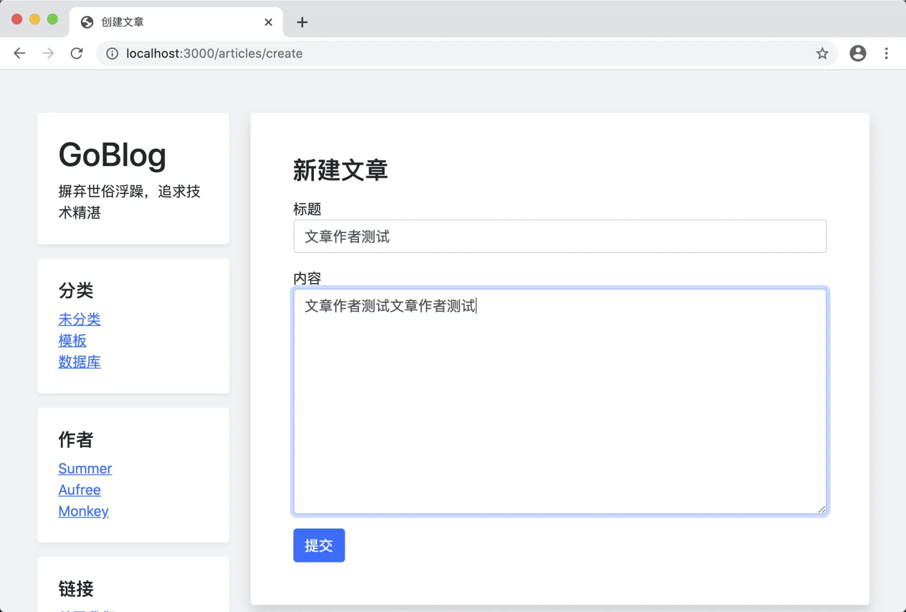
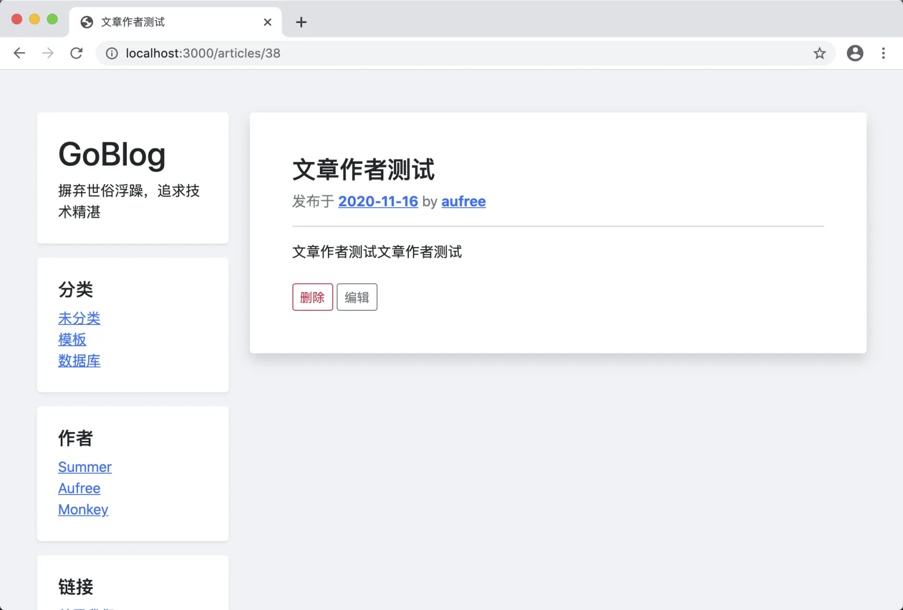

# 12.5. 绑定文章作者

原文链接：https://learnku.com/courses/go-basic/1.22/binding-authors/16550

## 说明

文章创建时，我们还需将执行此操作的用户 ID 进行关联。

## 修改控制器方法

只需要在 `Store()` 方法中将其进行绑定即可：

app/http/controllers/articles_controller.go

```go
.
.
.
// Store 文章创建页面
func (*ArticlesController) Store(w http.ResponseWriter, r *http.Request) {

    // 1. 初始化数据
    currentUser := auth.User()
    _article := article.Article{
        Title:  r.PostFormValue("title"),
        Body:   r.PostFormValue("body"),
        UserID: currentUser.ID,
    }
    .
    .
    .
}
.
.
.
```

## 测试一下

进入创建页面 [localhost:3000/articles/create](http://localhost:3000/articles/create) ，并填写内容：



点击提交后显示我刚刚创建的文章，作者是正确的：



## 代码版本

开始下一节之前，我们先来为代码做下版本标记：

```bash
$ git add .
$ git commit -m "绑定文章作者"
```
