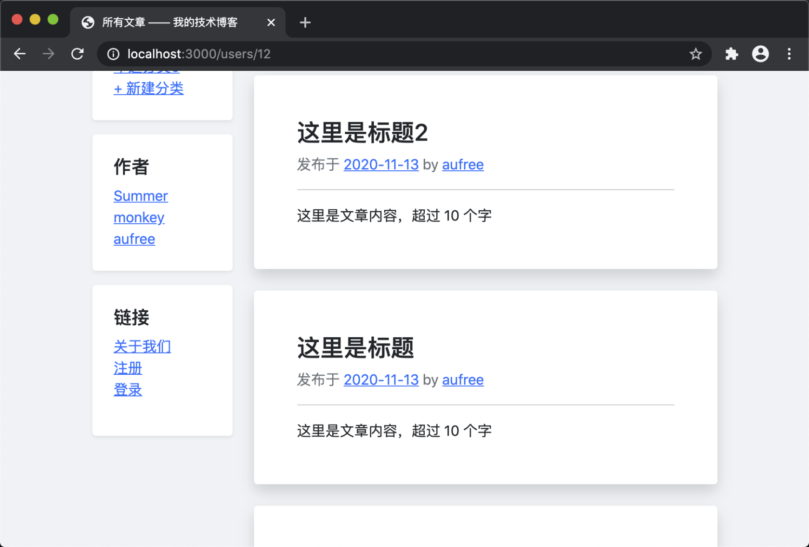

# 12.6. 显示作者

原文链接：https://learnku.com/courses/go-basic/1.22/show-author/16551

## 说明

本节我们将在左边栏显示真实的用户列表。

## 读取所有用户

首先我们在模型里添加 `All()` 方法：

app/models/user/crud.go

```
.
.
.

// All 获取所有用户数据
func All() ([]User, error) {
var users []User
if err := model.DB.Find(&users).Error; err != nil {
return users, err
}
return users, nil
}
```

## 模板变量

大部分页面都会使用到左边栏的用户数据，我们将其注册到全局模板变量中：

pkg/view/view.go

```
.
.
.
// RenderTemplate 渲染视图
func RenderTemplate(w io.Writer, name string, data D, tplFiles ...string) {

// 1. 通用模板数据
data["isLogined"] = auth.Check()
data["flash"] = flash.All()
data["Users"], _ = user.All()
.
.
.
}
.
.
.
```

## 模板读取数据

接下来将左边栏的数据显示出来：

resources/views/layouts/sidebar.gohtml

```
.
.
.
{{ if .Users }}
<div class="p-4 bg-white rounded shadow-sm mb-3">
<h5>作者</h5>
<ol class="list-unstyled mb-0">
{{ range $key, $user := .Users }}
<li><a href="{{ $user.Link }}">{{ $user.Name }}</a></li>
{{ end }}
</ol>
</div>
{{ end }}
.
.
.
```

## 测试一下

访问首页，即可看到边栏作者的数据：



## 代码版本

开始下一节之前，我们先来为代码做下版本标记：

```
$ git add .
$ git commit -m "显示作者"
```
