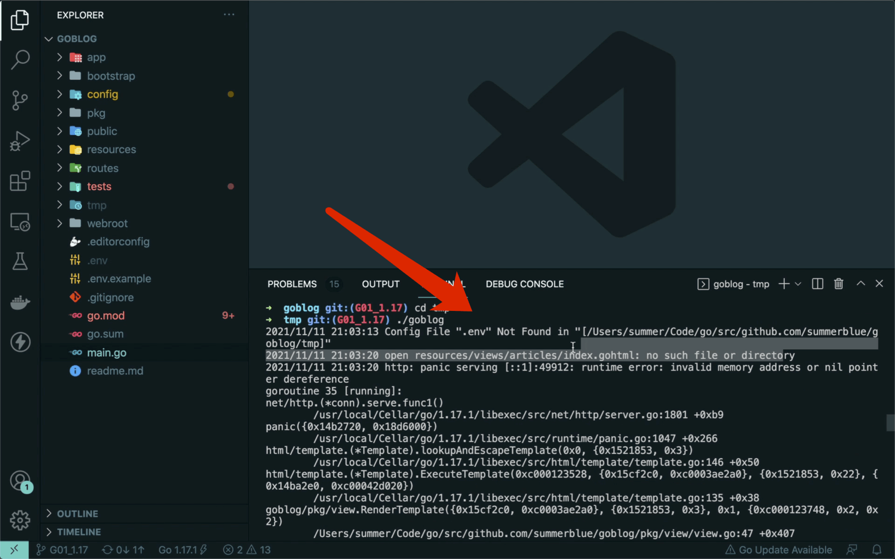

# 14.1. 应用打包

原文链接：https://learnku.com/courses/go-basic/1.22/application-packaging/16558

## 说明

本节我们来讲解 Golang 应用打包的相关知识。

话题涵盖：

- go build 的局限性；

- 打包策略 —— 哪些东西需要打包；

- 第三方和官方的打包工具。

接下来一一讲解。

## go build

### 单个可执行文件的好处

go build 命令会将 Go 项目，包括其依赖的标准库和第三方库一起打包，最终结果是 单个可执行文件，可直接运行在目标系统中。

相对比 PHP/Python/Java/Nodejs 等需要配置复杂的运行环境，Go 编译后的可执行文件无需 『Go 环境』即可运行。

这大大降低了部署的复杂度，例如说不用考虑服务器上的 Go 版本是多少、多个项目的情况下也不用纠结如何在机器上装多个版本的 Go 等。

### 跨平台交叉编译

Go 语言支持跨平台交叉编译，也就是说我们可以在 Windows 或 Mac 平台下编写代码，最后将代码编译成能够在 Linux amd64 服务器上运行的程序。

根目录使用以下指令可以静态编译`Linux`平台`amd64`架构的可执行文件：

```
$ CGO_ENABLED=0 GOOS=linux GOARCH=amd64 go build -o goblog
```

Winows 依次执行以下四个命令：

```
SET CGO_ENABLED=0
SET GOOS=linux
SET GOARCH=amd64
go build -o goblog
```

根目录下生成的`goblog`便是我们静态编译的，可运行在`Linux amd64` 系统上的可执行文件。

### 编译本机的可执行文件

我们先在本机上试验编译功能，编译为可在本机运行的单个可执行文件：

```
# 创建 tmp 目录
$ mkdir tmp

# 生成二进制文件
$ go build -o tmp/goblog

# 复制环境配置信息
$ cp .env tmp/

# 进入 tmp 目录下运行我们的程序
$ cd tmp
$ ./goblog
```

浏览器访问 [localhost:3000](http://localhost:3000) ，会提示无法显示网页。回到命令行，可以看到以下报错：



这是因为正常情况下当我们使用 `go build` 命令时，只会将 .go 文件打包编译。Goblog 项目中，模板文件和 CSS/JS 文件不会被打包到二进制文件中。

要打包模板文件或者其他非 .go 文件，需要使用工具来实现。

## 相对路径

这里需要知道的一点，如果将 tmp 里的可执行文件 goblog 挪到我们的项目根目录下，是可以正常执行的。

这是因为 goblog 里虽然没有打包模板文件，但是代码里书写了他们相对路径，goblog 根目录下执行时，是能找到这些模板文件的。

也就是说，将 goblog 可执行文件丢到服务器上运行。在运行程序的目录下，将 resources 目录和 public 目录上传上去，也可正常运行。这里要特别注意，是相对路径，下面举个例子：

```
# 项目目录
$ cd /data/www/goblog.com

# 看下里面有什么内容
$ ls -a
resources public .env goblog

# 在当前目录下执行 goblog 命令才能正确加载 resources public .env 这些文件
$ ./goblog
```

## 打包策略

开始之前，我们先来提一个问题：

在 Goblog 项目里，什么类型的文件需要打包？

目前来讲，Goblog 项目里有三种非 .go 文件：

- .env  文件（配置信息）

- CSS/JS 静态文件（网页可直接显示）

- .gohtml 模板文件（Go 程序渲染页面必需）

环境变量 .env 是用来配置服务器信息，如数据库连接信息、站点 URL 、端口等， 一般不需要打包，只需要确保 goblog 应用能加载到即可（放置于 goblog 可执行文件的同目录下，运行命令时在当前目录下运行）。

CSS 和 JS 和图片等静态文件，如果使用 代理部署 的话，可以使用 Nginx 服务器来处理这些静态请求。所以一般不推荐打包，只要将文件放置于正确的位置，且在Nginx 中做好配置即可。这么做好处是，Nginx 里配置动静分离，对静态文件（包括图片、视频等）统一管理，配置静态域名、 gzip 压缩等，Go 程序用来处理动态请求，各取所长。

模板文件，以 .gohtml 为后缀的文件，因为我们的 Go 程序逻辑中需要用到这些文件，推荐打包。

一些其他的常见的内容类型，例如迁移文件或者填充数据文件，是需要打包的。

本节里，为了演示为目的，产出单个可执行文件，我们将会连 CSS 和 JS 文件一起打包。

## 打包工具

目前来讲 Go 生态圈有大量的第三方打包工具，以下是几个比较知名的：

- [gobuffalo/packr](https://github.com/gobuffalo/packr)

- [markbates/pkger](https://github.com/markbates/pkger)

- [rakyll/statik](https://github.com/rakyll/statik)

- [knadh/stuffbin](https://github.com/knadh/stuffbin)

- [github.com/go-bindata/go-bindata](https://github.com/go-bindata/go-bindata)

- [elazarl/go-bindata-assetfs](https://github.com/elazarl/go-bindata-assetfs)

- [GeertJohan/go.rice](https://github.com/GeertJohan/go.rice)

他们都做着同样的事情，那就是将静态文件（JS, CSS, 图片）或者模板文件等非 .go 文件打包到一个二进制文件中。

Go 的工具链早先不支持打包静态文件，直到 2021-02-16 发布的 1.16 版本，自带了 [Embed 标准库](https://pkg.go.dev/embed) 。

Embed 的发布，也算是 Go 对打包静态文件的官方内置支持。

下一节我们会讲解如何使用 Embed 工具对 Goblog 项目进行打包。
