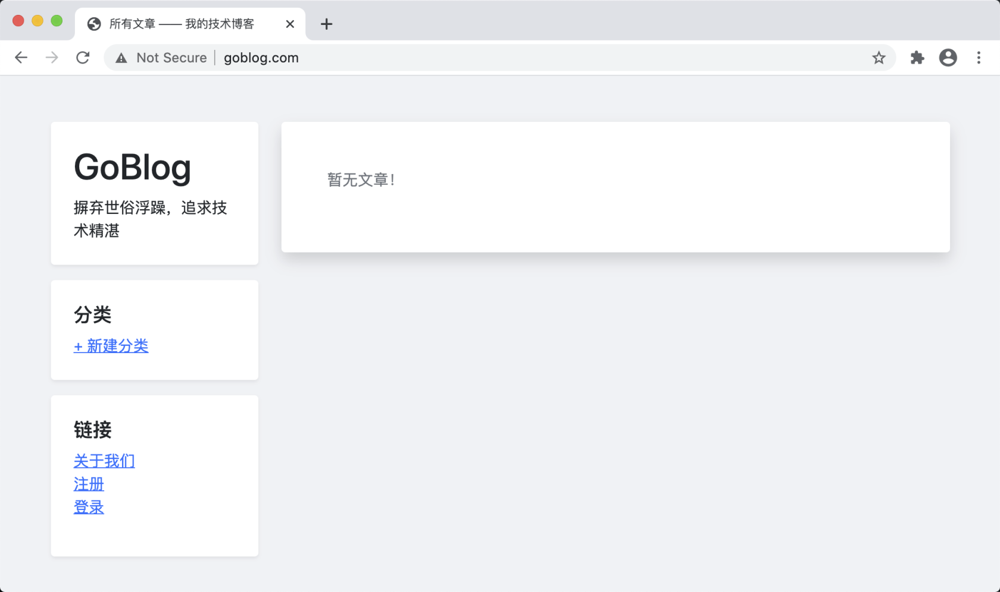

# 14.5. 部署应用

原文链接：https://learnku.com/courses/go-basic/1.22/start-deployment/16562

## 说明

本节将采用代理部署方式，将我们的项目部署到生产环境中。

## 舞台设置

### 1. 服务器环境

篇幅所限，阿里云、腾讯云等服务商后台创建服务器的过程这里略过，请自行创建服务器，且为服务器指定公网 IP 。

本文是在 Ubuntu 20.04 64位系统下撰写，所以你最好也是使用这个系统，不是的话也没关系。

没有域名也没关系，我们可以使用 hosts 绑定。

### 2. 使用到的软件

- Nginx —— 代理服务器，请确保安装；

- Supervisor —— 进程管理，请确保安装；

- MySQL —— 数据库，请确保安装。

请为数据库创建一个名为 `goblog` 的数据库，字符集为 `utf8mb4` ，可以使用以下命令创建：

```
CREATE DATABASE goblog CHARACTER SET utf8mb4 COLLATE utf8mb4_unicode_ci;
```

## 开始部署

### 1. 创建 Web 目录

SSH 连接到服务器上，创建 Web 目录。

我的目录一般会放在 /data/www 下，服务器上有多个项目，每个项目会创建网站域名对应的 Web 目录。

假如我们要部署的域名是 `goblog.com` 使用以下命令：

```
$ mkdir -p /data/www/goblog.com
```

### 2. 编译可执行文件

根目录使用下面的指令可以静态编译 `Linux` 平台 `amd64` 架构的可执行文件。

Mac 或 Linux 系统：

```
$ CGO_ENABLED=0 GOOS=linux GOARCH=amd64 go build -o goblog
```

Winows 依次执行以下四个命令：

```
SET CGO_ENABLED=0
SET GOOS=linux
SET GOARCH=amd64
go build -o goblog
```

命令详解：

- CGO_ENABLED ：设置是否在 Go 代码中调用 C 代码。0 为关闭，采用纯静态编译；

- GOOS ： 目标操作系统

- GOARCH ： 目标操作系统的架构

- `-o` 是产出的目标文件名称

通过如下命令可查看 Go 支持 OS 和平台列表：

```
$ go tool dist list
aix/ppc64
android/386
android/amd64
android/arm
android/arm64
darwin/amd64
darwin/arm64
dragonfly/amd64
freebsd/386
freebsd/amd64
freebsd/arm
freebsd/arm64
illumos/amd64
ios/amd64
ios/arm64
js/wasm
linux/386
linux/amd64
linux/arm
linux/arm64
linux/mips
linux/mips64
.
.
.
windows/386
windows/amd64
windows/arm
windows/arm64
```

### 3. 上传文件

上面的命令执行完成后，会在根目录下产生一个 `goblog` 的可执行文件，使用 SCP 命令将其上传到服务器 Web 目录：

```
$ scp goblog root@117.50.你的ip.25:/data/www/goblog.com/
```

SCP 命令使用的是 SSH 连接，安全稳定。当然你也可以通过 SFTP 或者 FTP 将文件上传到 `/data/www/goblog.com/` 目录下。

在服务器的 `/data/www/goblog.com/` 下创建 .env 文件，并做相应修改，请修改以下的数据库连接信息、APP_KEY 和 APP_URL，其他信息有必要也可以做修改：

.env

```
APP_NAME=Goblog
APP_ENV=local
APP_KEY=33446a9dcf9ea033a0a6532b166da32f304af0de
APP_DEBUG=true
APP_URL=http://goblog.com
APP_LOG_LEVEL=debug
APP_PORT=3000

DB_CONNECTION=mysql
DB_HOST=127.0.0.1
DB_PORT=3306
DB_DATABASE=goblog
DB_USERNAME=xxxxxx
DB_PASSWORD=xxxxxxxxxxxxxxxx

SESSION_DRIVER=cookie
SESSION_NAME=goblog-session
```

注意此时 goblog 可执行文件与 .env 文件是在同一个目录下 —— `/data/www/goblog.com/`  。

### 4. 运行项目

服务器上，进入 `/data/www/goblog.com/` 目录，并允许我们的项目：

```
$ cd /data/www/goblog.com/
$ ./goblog
```

此时如果我们的 goblog 数据库里面没有表，应该会在命令行输出创建表的信息，这是 GORM 在做自动迁移。

服务器上使用以下命令测试一下：

```
$ curl http://localhost:3000
```

一切正常的话，会打印出：

```
<!DOCTYPE html>
<html lang="en">

<head>
<title>
所有文章 —— 我的技术博客
</title>
<link href="/css/bootstrap.min.css" rel="stylesheet">
<link href="/css/app.css" rel="stylesheet">
</head>
.
.
.
```

此时我们的程序已经可以正常运行。

### 5. 绑定 hosts

为方便调试，我们来修改本机的 hosts 。

假设以下：

- 域名是 goblog.com

- ip 是 173.20.20.20 （请换为你的服务器 IP ）

定位 hosts 文件：

- Mac 或 Linux 下，文件在 `/etc/hosts` 中，使用 `sudo vi /etc/hosts` 命令编辑；

- Windows 下是 `C:\WINDOWS\system32\drivers\etc\hosts` ，不懂请百度一下。

修改 hosts 文件，最后面添加一行：

```
173.20.20.20    goblog.com
```

然后保存。

使用 Ping 测试一下：

```
$ ping goblog.com
```

返回的第一行跟我们绑定的域名是一致的就行了：

```
PING goblog.com (173.20.20.20): 56 data bytes
.
.
.
```

### 6. 配置 Nginx

我的服务器上有多个站点，nginx.conf 里配置了：

```
http {
.
.
.
include /etc/nginx/sites-enabled/*;
}
```

目录 `/etc/nginx/sites-enabled`下是所有的站点配置，以域名区分。goblog 项目域名就使用 goblog.com 命名，配置如下：

/etc/nginx/sites-enabled/goblog.com

```
server {
listen       80;
server_name goblog.com;

access_log   /data/log/nginx/goblog/access.log;
error_log    /data/log/nginx/goblog/error.log;

location / {
proxy_pass                 http://127.0.0.1:3000;
proxy_redirect             off;
proxy_set_header           Host             $host;
proxy_set_header           X-Real-IP        $remote_addr;
proxy_set_header           X-Forwarded-For  $proxy_add_x_forwarded_for;
}
}
```

日志目录 `/data/log/nginx/goblog` 也请确保存在，不存在的话运行以下：

```
$ mkdir -p /data/log/nginx/goblog
```

配置完成后，使用以下命令确保 Nginx 配置正确：

```
$ nginx -t
```

`-t` 是 test 的意思，输出以下即代表正确：

```
nginx: the configuration file /etc/nginx/nginx.conf syntax is ok
nginx: configuration file /etc/nginx/nginx.conf test is successful
```

现在可以让 Nginx 加载我们的 goblog.com 配置：

```
$ service nginx reload
```

浏览器访问 goblog.com ，应该可以看到：



现在 Nginx 配置成功。

### 7. 配置 Supervisor

目前我们的 goblog 还是通过命令行运行的方式，一旦退出命令行 goblog.com 将无法打开。

所以一般我们会使用进程管理工具来管理 Go 应用，使其在后台运行，且出错时可自动重启。

开始之前我们先在服务器上，将之前监听的 3000 端口的 goblog 程序关闭：

```
$ kill -9 $(lsof -ti:3000)
```

接下来我们在 `/etc/supervisor/conf.d`目录中创建一个新的配置：

/etc/supervisor/conf.d/goblog.conf

```
[program:goblog]
directory=/data/www/goblog.com
command=/data/www/goblog.com/goblog
stopsignal=TERM
autostart=true
autorestart=true
user=www-data
stdout_logfile=/data/log/supervisor/goblog/stdout.log
stderr_logfile=/data/log/supervisor/goblog/stderr.log
```

以下是配置信息详解：

| 配置项
| 说明

| [program:goblog]
| 程序名称，stop start 等管理时使用

| directory=/data/www/goblog.com
| 进入该目录运行命令，确保了 .env 的正确加载

| command=/data/www/goblog.com/goblog
| 执行 goblog 项目

| stopsignal=TERM
| 重启时发送的信号，确保端口正常关闭

| autostart=true
| 是否自启动

| autorestart=true
| 是否自动重启

| user=www-data
| 执行程序的用户

| stdout_logfile=/data/log/supervisor/goblog/stdout.log
| 输出日志位置

| stderr_logfile=/data/log/supervisor/goblog/stderr.log
| 错误输出日志

请确保 `/data/log/supervisor/goblog` 目录存在，不存在的话使用以下命令创建：

```
$ mkdir -p /data/log/supervisor/goblog
```

最后，保存文件。

现在运行以下命令让 Supervisor 重新加载配置文件：

```
$ supervisorctl reload
```

运行 `status` 命令，加上我们的 goblog 程序名称来查看状态：

```
$ supervisorctl status goblog
goblog                           RUNNING   pid 36184, uptime 0:17:49
```

一切正常。

Supervisor 还有以下的几个常见操作：

| 命令
| 说明

| supervisorctl reload
| 重启 supervisor

| supervisorctl status 程序名
| 查看状态，后面不加程序名的话是所有任务状态

| supervisorctl shutdown
| 关闭所有任务

| supervisorctl start 程序名
| 启动任务

| supervisorctl stop 程序名
| 关闭任务

浏览器访问 goblog.com ，可以看到：


随着 Supervisor 的配置成功，我们的 Goblog 项目也成功部署上线了。

## 小结

这一节涉及到很多服务器操作，如果你有疑惑的地方，或者什么问题解决不了，请到这篇文章的下方发起提问。
