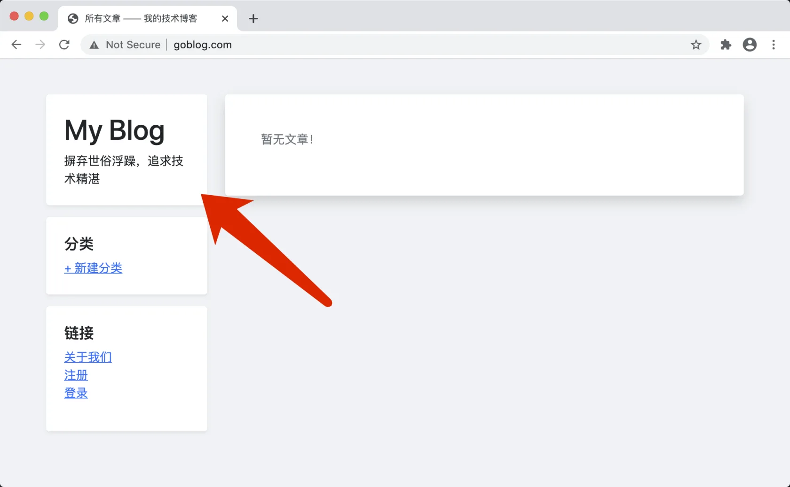

# 14.6. Makefile 任务管理

原文链接：https://learnku.com/courses/go-basic/1.22/makefile-task-management/16563

## 说明

我们的 Goblog 程序已经成功部署到服务器上，这节课我们来讲解后面如果有更新代码，如何更新到服务器上。

## Makefile

Makefile 是一个老牌的任务管理工具。

以我们的 Goblog 程序为例，上线新程序，需要很多步骤，如：

1. 编译程序，产生 Linux/amd64 可执行文件；

2. 停用 supervisor 里的 goblog 程序；

3. 上传 goblog 程序；

4. 开启 supervisor 里的 goblog 程序；

Makefile 可以将这些操作合并为一个命令：

```
$ make deploy
```

接下来我们来看如何操作。

## Makefile 文件

根目录创建 Makefile 文件：

Makefile

```
REMOTE=117.你的.IP.地址
APPNAME=goblog

.PHONY: deploy
deploy:
@echo "\n--- 开始构建可执行文件 ---"
GOOS=linux GOARCH=amd64 go build -ldflags="-s -w" -v -o tmp/$(APPNAME)_tmp

@echo "\n--- 上传可执行文件 ---"
scp tmp/$(APPNAME)_tmp root@$(REMOTE):/data/www/goblog.com/

@echo "\n--- 停止服务 ---"
ssh root@$(REMOTE) "supervisorctl stop $(APPNAME)"

@echo "\n--- 替换新文件 ---"
ssh root@$(REMOTE) "cd /data/www/goblog.com/ \
&& rm $(APPNAME) \
&& mv $(APPNAME)_tmp $(APPNAME) \
&& chown www-data:www-data $(APPNAME)"

@echo "\n--- 开始服务 ---"
ssh root@$(REMOTE) "supervisorctl start $(APPNAME)"

@echo "\n--- 部署完毕 ---\n"
```

语法讲解：

```
REMOTE=117.你的.IP.地址
APPNAME=goblog
```

这两行是设置变量，变量读取为 `$(REMOTE)` 和 `$(APPNAME)`。

```
.PHONY: deploy
deploy:
```

这是定制一个任务。

首先，`.PHONY` 是什么？默认情况下，Makefile 目标是 `文件目标` — 它们用于从其他文件构建文件。make 假定其目标是一个文件，这使得编写 makefiles 相对容易。

但如果我们将 Make 当做任务管理器的话，为了防止与根目录下同名文件冲突，一个最佳实践就是在任务的上一行写入 `.PHONY: 任务名称`。

## 修改代码

修改标题从 `GoBlog` 改为 `My Blog`:

resources/views/layouts/sidebar.gohtml

```
.
.
.
<h1><a href="/" class="link-dark text-decoration-none">My Blog</a></h1>
.
.

```

## 开始测试

命令行执行：

```
$ make deploy
```

输出：

```

--- 开始构建可执行文件 ---
GOOS=linux GOARCH=amd64 go build -ldflags="-s -w" -v -o tmp/goblog_tmp

--- 上传可执行文件 ---
scp tmp/goblog_tmp root@117.50.36.69:/data/www/goblog.com/
goblog_tmp                                                                            100% 9332KB  12.4MB/s   00:00

--- 停止服务 ---
ssh root@117.50.36.69 "supervisorctl stop goblog"
goblog: stopped

--- 替换新文件 ---
ssh root@117.50.36.69 "cd /data/www/goblog.com/ \
&& rm goblog \
&& mv goblog_tmp goblog \
&& chown www-data:www-data goblog"

--- 开始服务 ---
ssh root@117.50.36.69 "supervisorctl start goblog"
goblog: started

--- 部署完毕 ---

```

访问 [goblog.com/](http://goblog.com/) ：



可以看到标题已经从 GoBlog 改为 My Blog。

测试完毕，将代码改回来：

```
$ git checkout "resources/views/layouts/sidebar.gohtml"
```

重新部署：

```
$ make deploy
```

本节完。
