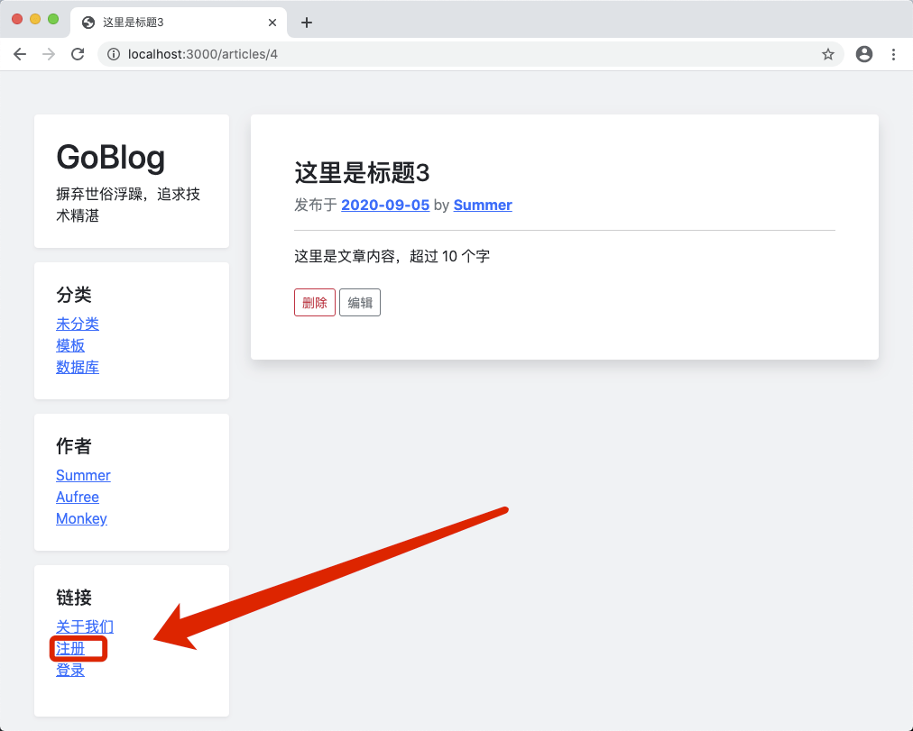
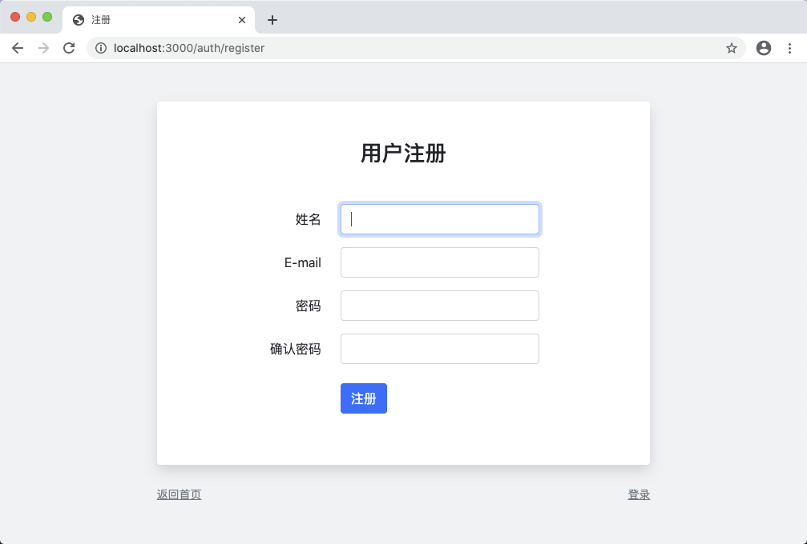

# 10.1. 注册表单

原文链接：https://learnku.com/courses/go-basic/1.22/registration-form/16531

## 说明

从这一节开始，我们来开发注册和登录功能。

让我们先从构建注册表单开始。

## 注册路由

我们假设 AuthController 已经存在，利用注册路由来设计 URL 、路由名称以及对应的控制器方法：

routes/web.go

```
.
.
.
// RegisterWebRoutes 注册网页相关路由
func  RegisterWebRoutes(r *mux.Router) {
.
.
.
r.HandleFunc("/articles/{id:[0-9]+}/delete", ac.Delete).Methods("POST").Name("articles.delete")

// 用户认证
auc := new(controllers.AuthController)
r.HandleFunc("/auth/register", auc.Register).Methods("GET").Name("auth.register")
r.HandleFunc("/auth/do-register", auc.DoRegister).Methods("POST").Name("auth.doregister")

.
.
.
}
```

## 控制器

新建控制器文件，并创建以上的两个方法：

app/http/controllers/auth_controller.go

```
package controllers

import (
"goblog/pkg/view"
"net/http"
)

// AuthController 处理用户认证
type AuthController struct {
}

// Register 注册页面
func (*AuthController) Register(w http.ResponseWriter, r *http.Request) {
view.Render(w, ArticlesFormData{}, "auth.register")
}

// DoRegister 处理注册逻辑
func (*AuthController) DoRegister(w http.ResponseWriter, r *http.Request) {
//
}
```

以上还不是最终代码，存在两个问题：

1. 注册登录页面不需要左边导航栏，需使用不同的布局文件；

2. `ArticlesFormData` 只限于在文章控制器中使用，在此处显得格格不入，需使用更加通用的数据格式，以便在所有控制器中使用。

我们先来处理第一个问题。

## 简单布局

注册登录相关页面，都会使用此视图：

resources/views/layouts/simple.gohtml

```
{{define "simple"}}
<!DOCTYPE html>
<html lang="en">

<head>
<title>{{template "title" .}}</title>
<link href="/css/bootstrap.min.css" rel="stylesheet">
<link href="/css/app.css" rel="stylesheet">
</head>

<body>

<div class="container-sm">
<div class="row  mt-5">

<div class="col-md-8 offset-md-2 blog-main">
{{template "main" .}}
</div>

</div>
</div>

<script src="/js/bootstrap.min.js"></script>

</body>

</html>
{{end}}
```

注册表单模板：

resources/views/auth/register.gohtml

```
{{define "title"}}
注册
{{end}}

{{define "main"}}
<div class="blog-post bg-white p-5 rounded shadow mb-4">

<h3 class="mb-5 text-center">用户注册</h3>

<form action="{{ RouteName2URL "auth.doregister" }}" method="post">

<div class="form-group row mb-3">
<label for="name" class="col-md-4 col-form-label text-md-right">姓名</label>
<div class="col-md-6">
<input id="name" type="text" class="form-control" name="name" value="" required="" autofocus="">
</div>
</div>

<div class="form-group row mb-3">
<label for="email" class="col-md-4 col-form-label text-md-right">E-mail</label>
<div class="col-md-6">
<input id="email" type="email" class="form-control" name="email" value="" required="">
</div>
</div>

<div class="form-group row mb-3">
<label for="password" class="col-md-4 col-form-label text-md-right">密码</label>
<div class="col-md-6">
<input id="password" type="password" class="form-control" name="password" required="">
</div>
</div>

<div class="form-group row mb-3">
<label for="password-confirm" class="col-md-4 col-form-label text-md-right">确认密码</label>
<div class="col-md-6">
<input id="password-confirm" type="password" class="form-control" name="password_confirmation" required="">
</div>
</div>

<div class="form-group row mb-3 mb-0 mt-4">
<div class="col-md-6 offset-md-4">
<button type="submit" class="btn btn-primary">
注册
</button>
</div>
</div>

</form>

</div>

<div class="mb-3">
<a href="/" class="text-sm text-muted"><small>返回首页</small></a>
<a href="/" class="text-sm text-muted float-right"><small>登录</small></a>
</div>

{{end}}
```

注册登录等相关页面，我们都放置于 `auth` 目录下。

## 渲染简单视图

我们将在保留 `Render` 的同时创建 `RenderSimple` 方法，用以渲染使用了简单布局模板：

pkg/view/view.go

```
// Package view 视图渲染
package view

import (
"goblog/pkg/logger"
"goblog/pkg/route"
"html/template"
"io"
"path/filepath"
"strings"
)

// Render 渲染通用视图
func Render(w io.Writer, data interface{}, tplFiles ...string) {
RenderTemplate(w, "app", data, tplFiles...)
}

// RenderSimple 渲染简单的视图
func RenderSimple(w io.Writer, data interface{}, tplFiles ...string) {
RenderTemplate(w, "simple", data, tplFiles...)
}

// RenderTemplate 渲染视图
func RenderTemplate(w io.Writer, name string, data interface{}, tplFiles ...string) {
// 1 设置模板相对路径
viewDir := "resources/views/"

// 2. 遍历传参文件列表 Slice，设置正确的路径，支持 dir.filename 语法糖
for i, f := range tplFiles {
tplFiles[i] = viewDir + strings.Replace(f, ".", "/", -1) + ".gohtml"
}

// 3. 所有布局模板文件 Slice
layoutFiles, err := filepath.Glob(viewDir + "layouts/*.gohtml")
logger.LogError(err)

// 4. 合并所有文件
allFiles := append(layoutFiles, tplFiles...)

// 5 解析所有模板文件
tmpl, err := template.New("").
Funcs(template.FuncMap{
"RouteName2URL": route.Name2URL,
}).ParseFiles(allFiles...)
logger.LogError(err)

// 6 渲染模板
err = tmpl.ExecuteTemplate(w, name, data)
logger.LogError(err)
}
```

抽出来 `RenderTemplate()` 方法作为底层方法，将布局模板的名称变量化，`Render` 和 `RenderSimple` 调用此方法，并传参对应的布局名称，代码很好理解。

## 通用化传参数据格式

第一个问题已解决，接下来处理第二个问题。

先来看下 ArticlesFormData 的定义：

```
// ArticlesFormData 创建博文表单数据
type ArticlesFormData struct {
Title, Body string
Article     article.Article
Errors      map[string]string
}
```

不论从类型命名，到数据格式，都不够通用。

既然是传参给视图的数据，那我们将放置于 pkg/view 包里。因为经常使用，我们命名可以尽量简短点：

pkg/view/view.go

```
// Package view 视图渲染
package view

import (
"goblog/pkg/logger"
"goblog/pkg/route"
"html/template"
"io"
"path/filepath"
"strings"
)

// D 是 map[string]interface{} 的简写
type D map[string]interface{}

.
.
.
```

注意这里我们再次使用万能类型 `interface{}`，这是一个很常见的使用场景。

使用时：

```
view.D{
"Title":  title,
"Body":   body,
"Errors": errors,
}
```

等同于：

```
ArticlesFormData{
Title:  title,
Body:   body,
Errors: errors,
}
```

更加灵活、通用。

重新改写控制器：

app/http/controllers/auth_controller.go

```
.
.
.
// Register 注册页面
func (*AuthController) Register(w http.ResponseWriter, r *http.Request) {
view.RenderSimple(w, view.D{}, "auth.register")
}
.
.
.
```

## 小作业

请参考上文提到的 `view.D` 与 `ArticlesFormData` 的使用方法，独自重构 `articles_controller.go` 中的 ArticlesFormData 调用。

分两步：

- 删除 `ArticlesFormData`

- 根据命令行错误提示一个个修改为 `view.D`，直到编译通过

## 查看最终页面

首先添加注册入口链接：

resources/views/layouts/sidebar.gohtml

```
.
.
.
<ol class="list-unstyled">
<li><a href="#">关于我们</a></li>
<li><a href="{{ RouteName2URL "auth.register" }}">注册</a></li>
<li><a href="#">登录</a></li>
</ol>
.
.
.
```

访问页面：



点击进入：



至此注册表单构建完成。

## 代码版本

开始下一节之前，我们先来为代码做下版本标记：

```
$ git add .
$ git commit -m "注册页面"
```
