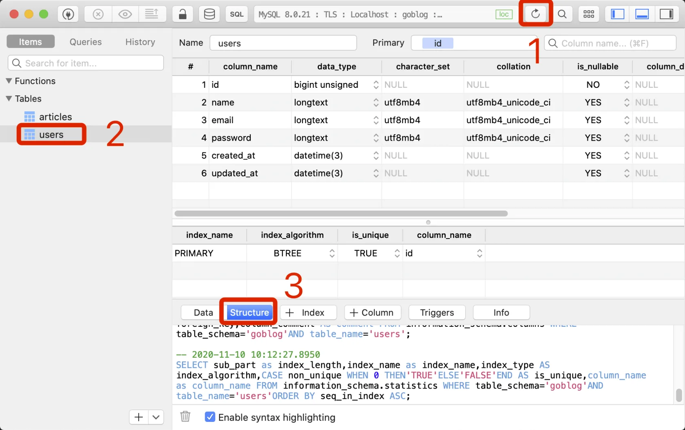
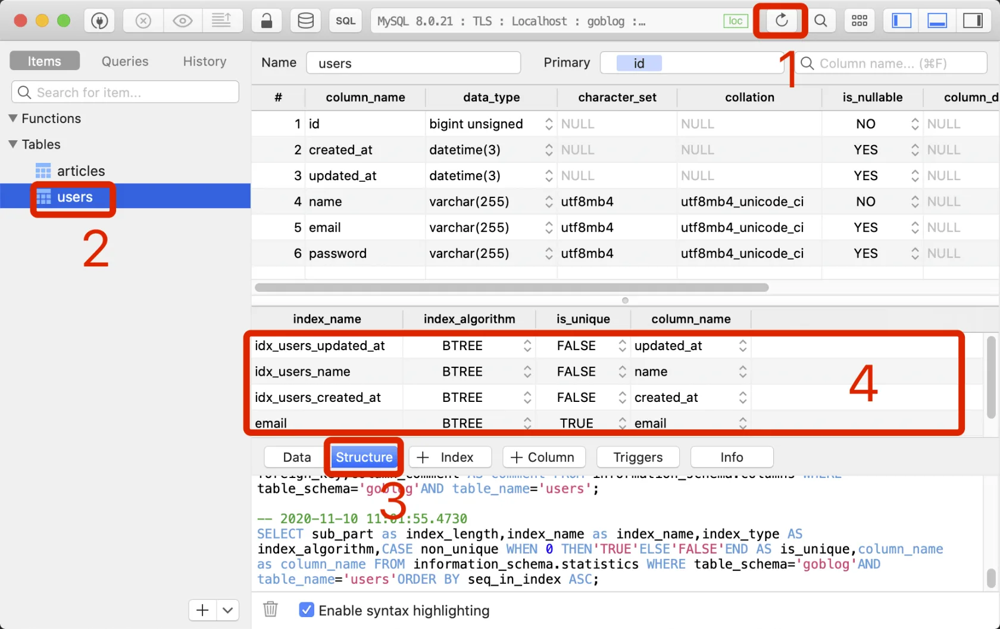
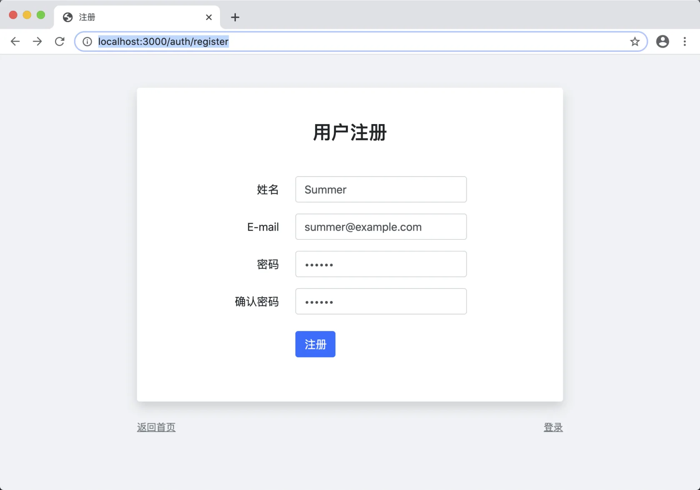
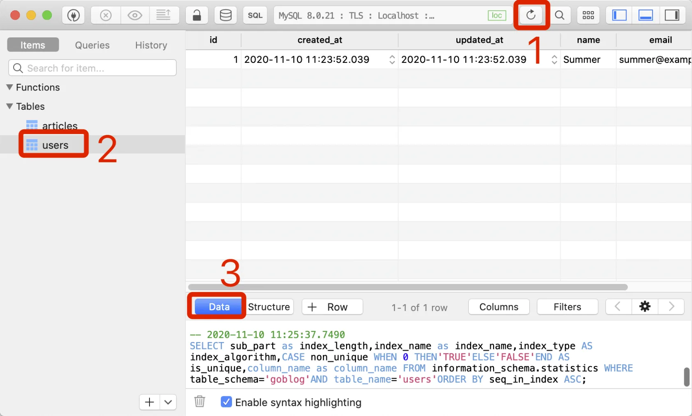

# 10.2. 创建用户

原文链接：https://learnku.com/courses/go-basic/1.22/create-user/16532

## 说明

上一节我们构建了注册表单，本节将开始处理表单提交以后的逻辑。

## 伪代码

打开授权控制器，定位到 `DoRegister()` 方法，我们先写伪代码：

app/http/controllers/auth_controller.go

```
.
.
.
// DoRegister 处理注册逻辑
func (*AuthController) DoRegister(w http.ResponseWriter, r *http.Request) {
// 1. 表单验证
// 2. 验证通过 —— 入库，并跳转到首页
// 3. 表单不通过 —— 重新显示表单
}
```

在编码开始时写一些伪代码，有利于整理思路。

表单验证以及验证不通过这块，我们下一节再来做，这一节，我们先专注于入库。

## 用户模型

接下来我们创建用户模型：

app/models/user/user.go

```
// Package user 用户模型
package user

import (
"goblog/app/models"
"time"
)

// User 用户模型
type User struct {
models.BaseModel

Name     string
Email    string
Password string
}
```

与 Article 同样的使用模型基类 BaseModel，里面有我们的 ID。

还有两个字段`CreatedAt` 和 `UpdatedAt` 也属于通用字段，Article 里也会使用到（文章的创建和更新时间），以后其他数据模型我们也会希望有数据创建的时间，所以统一添加到基类里：

app/models/model.go

```
// Package models 模型基类
package models

import (
"goblog/pkg/types"
"time"
)

// BaseModel 模型基类
type BaseModel struct {
ID uint64

CreatedAt time.Time
UpdatedAt time.Time
}
.
.
.
```

## 创建表结构

模型设计好了以后，接下来是创建对应的数据库表和字段。

GORM 自带了自动迁移功能，可以针对设置的模型 Struct 来自动创建数据表结构。免去了我们手动维护 SQL 的烦恼，自动迁移也有统一多个数据库系统的好处。

使用自动迁移很简单，只需要调用 `AutoMigrate()` 方法并将数据模型 Struct 传参进去即可。

因为这是一个全局动作，我们这个操作放置于数据库初始化的地方：

bootstrap/db.go

```
package bootstrap

import (
"goblog/app/models/article"
"goblog/app/models/user"
"goblog/pkg/model"
"time"

"gorm.io/gorm"
)

// SetupDB 初始化数据库和 ORM
func SetupDB() {
.
.
.
// 创建和维护数据表结构
migration(db)
}

func migration(db *gorm.DB) {

// 自动迁移
db.AutoMigrate(
&user.User{},
&article.Article{},
)
}
```

注意： 请确保 goblog/app/models/user 被正确 import。如果错误 import 了，且 users 表字段不对，可直接在数据库视图工具里删除 users 表，然后重新启动 air。GORM 会在程序运行时运行迁移逻辑。

GORM 的自动迁移工具不支持版本，只能保持字段与传参的 Struct 一致，无法删除字段。所以我们将自动迁移的代码封装到 `migration()` 方法里，以后遇到需要删除字段的情况，将这些代码写到此方法即可。

保存文件后，命令行的 air 会自动编译，此时数据库的表结构将会自动生成，我们使用 SQL 视图工具查看：



可以看到我们的 users 表已经生成。

### 字段标签

不过 name 、email、password 的字段类型不符合我们的要求，我们可以通过设置 GORM 模型的 Struct Tag 来解决。修改下我们的模型：

app/models/user/user.go

```
// Package user 用户模型
package user

import (
"goblog/app/models"
)

// User 用户模型
type User struct {
models.BaseModel

Name     string `gorm:"column:name;type:varchar(255);not null;unique"`
Email    string `gorm:"column:email;type:varchar(255);default:NULL;unique;"`
Password string `gorm:"column:password;type:varchar(255)"`
}
```

模型基类里也要做修改：

app/models/model.go

```
// Package models 模型基类
package models

import (
"goblog/pkg/types"
"time"
)

// BaseModel 模型基类
type BaseModel struct {
ID uint64 `gorm:"column:id;primaryKey;autoIncrement;not null"`

CreatedAt time.Time `gorm:"column:created_at;index"`
UpdatedAt time.Time `gorm:"column:updated_at;index"`
}
.
.
.
```

上面使用 Struct 元素类型后面跟着 `gorm:`  开头的就是 GORM 提供的字段标签。用以告知 GORM 在迁移时，如何正确的设置数据库字段。

声明 GORM 数据模型时，字段标签是可选的，GORM 支持以下：（注：名大小写不敏感，但建议使用 `camelCase` 风格）

| 标签名 |
| --- |
| 说明 |

| column |
| --- |
| 指定 db 列名 |

| type |
| --- |
| 列数据类型，推荐使用兼容性好的通用类型，例如：所有数据库都支持 bool、int、uint、float、string、time、bytes 并且可以和其他标签一起使用，例如：`not null`、`size`, `autoIncrement`… 像 `varbinary(8)` 这样指定数据库数据类型也是支持的。在使用指定数据库数据类型时，它需要是完整的数据库数据类型，如：`MEDIUMINT UNSINED not NULL AUTO_INSTREMENT` |

| size |
| --- |
| 指定列大小，例如：`size:256` |

| primaryKey |
| --- |
| 指定列为主键 |

| unique |
| --- |
| 指定列为唯一 |

| default |
| --- |
| 指定列的默认值 |

| precision |
| --- |
| 指定列的精度 |

| scale |
| --- |
| 指定列大小 |

| not null |
| --- |
| 指定列为 NOT NULL |

| autoIncrement |
| --- |
| 指定列为自动增长 |

| embedded |
| --- |
| 嵌套字段 |

| embeddedPrefix |
| --- |
| 嵌入字段的列名前缀 |

| autoCreateTime |
| --- |
| 创建时追踪当前时间，对于 `int` 字段，它会追踪时间戳秒数，您可以使用 `nano`/`milli` 来追踪纳秒、毫秒时间戳，例如：`autoCreateTime:nano` |

| autoUpdateTime |
| --- |
| 创建/更新时追踪当前时间，对于 `int` 字段，它会追踪时间戳秒数，您可以使用 `nano`/`milli` 来追踪纳秒、毫秒时间戳，例如：`autoUpdateTime:milli` |

| index |
| --- |
| 根据参数创建索引，多个字段使用相同的名称则创建复合索引，查看 [索引](https://gorm.io/zh_CN/docs/indexes.html) 获取详情 |

| uniqueIndex |
| --- |
| 与 `index` 相同，但创建的是唯一索引 |

| check |
| --- |
| 创建检查约束，例如 `check:age > 13`，查看 [约束](https://gorm.io/zh_CN/docs/constraints.html) 获取详情 |

| <- |
| --- |
| 设置字段写入的权限， `<-:create` 只创建、`<-:update` 只更新、`<-:false` 无写入权限、`<-` 创建和更新权限 |

| -> |
| --- |
| 设置字段读的权限，`->:false` 无读权限 |

| -
| --- |
| 忽略该字段，`-` 无读写权限 |

接下来看下数据表结构：



可以看到字段类型符合我们的预期。

上图数字 4 标记的地方是数据库索引，可以看到 GORM 也都正确地设置了。

>

注意： 如果你看到的表结构不符预期，请确保 bootstrap/db.go 文件中顶部 import 的是 `goblog/app/models/user` 而不是 `os/user`。如果之前是 `os/user`，请删除 users 数据表，保存下文件触发 air 重新运行项目，即可生成正确的表结构。

## 插入数据

新建创建用户的方法：

app/models/user/crud.go

```
package user

import (
"goblog/pkg/logger"
"goblog/pkg/model"
)

// Create 创建用户，通过 User.ID 来判断是否创建成功
func (user *User) Create() (err error) {
if err = model.DB.Create(&user).Error; err != nil {
logger.LogError(err)
return err
}

return nil
}
```

控制器里调用：

app/http/controllers/auth_controller.go

```
.
.
.
// DoRegister 处理注册逻辑
func (*AuthController) DoRegister(w http.ResponseWriter, r *http.Request) {

// 0. 初始化变量
name := r.PostFormValue("name")
email := r.PostFormValue("email")
password := r.PostFormValue("password")

// 1. 表单验证
// 2. 验证通过 —— 入库，并跳转到首页
_user := user.User{
Name:     name,
Email:    email,
Password: password,
}
_user.Create()

if _user.ID > 0 {
fmt.Fprint(w, "插入成功，ID 为"+_user.GetStringID())
} else {
w.WriteHeader(http.StatusInternalServerError)
fmt.Fprint(w, "创建用户失败，请联系管理员")
}

// 3. 表单不通过 —— 重新显示表单
}
```

注意： 请确保 goblog/app/models/user 被正确 import。

代码我们之前创建文章的时候都分解过，应该很容易看懂。

打开注册页面 [localhost:3000/auth/register](http://localhost:3000/auth/register) ，填入简单的信息：



提交成功后查看数据库：



成功插入数据。

注意：目前我们的密码是明文的，本节的目标是跑通数据入库的流程，后面会讲到如何正确存储密码。

数据验证我们会在下一节进行讲解。

## 代码版本

开始下一节之前，我们先来为代码做下版本标记：

```
$ git add .
$ git commit -m "创建用户"
```
