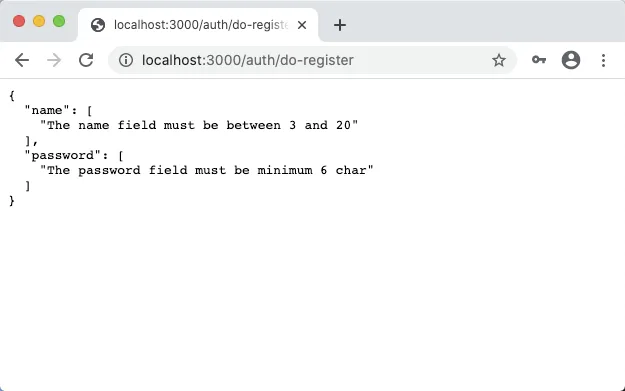
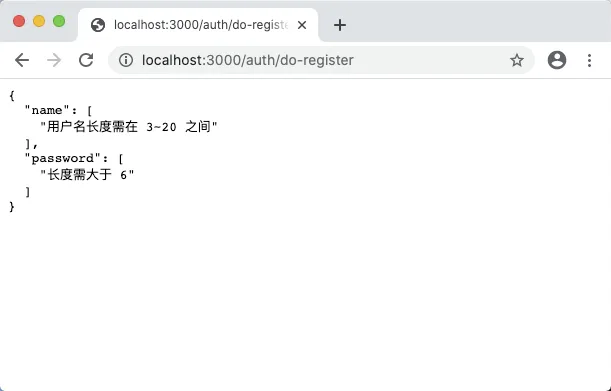
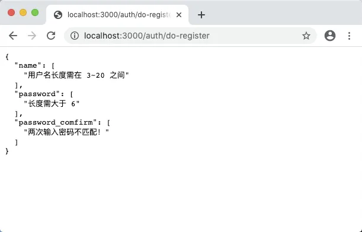
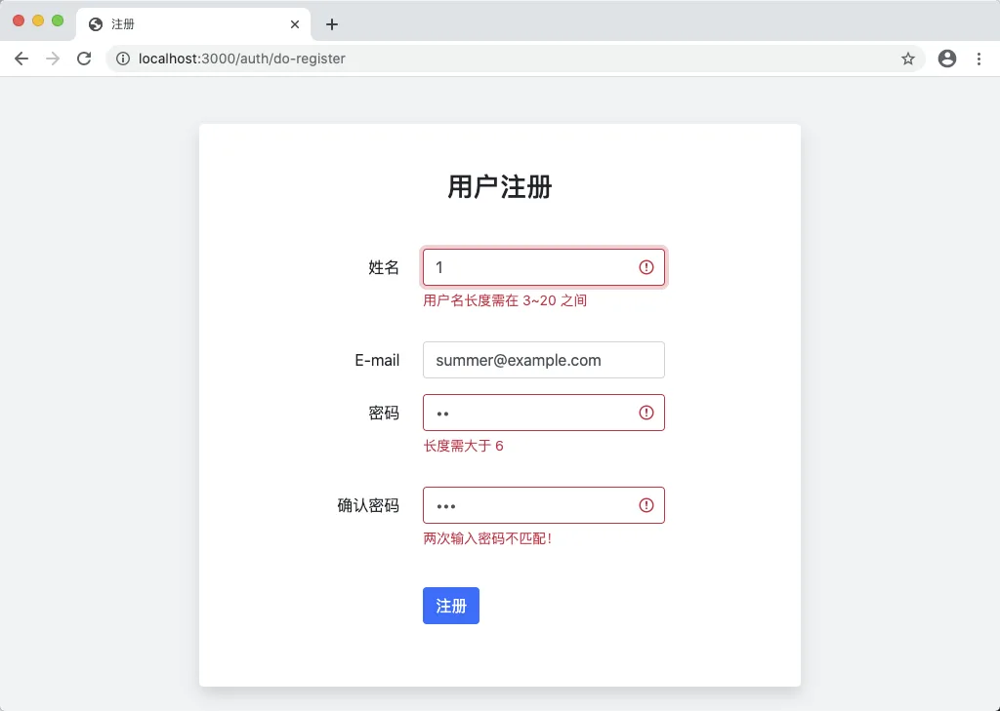

# 10.3. 注册表单验证

原文链接：https://learnku.com/courses/go-basic/1.22/registration-form-validation/16533

## 说明

用户的数据是不能信任的，本节我们来做表单验证。

## 安装 govalidator

表单验证 Web 开发中常见的功能，Go 生态圈已经有很好的解决方案，我们无需重新发明轮子。

比较知名的有 [asaskevich/govalidator](https://github.com/asaskevich/govalidator) 和 [thedevsaddam/govalidator](https://github.com/thedevsaddam/govalidator) ，两个都值得使用，后者借鉴了 Laravel，比较简单易用，本项目将采用此包。

安装：

```
$ go get github.com/thedevsaddam/govalidator
```

## 集成到控制器中

我们会先写比较粗糙的代码，快速跑通，看看怎么使用这个工具，然后再一步一步优化代码：

app/http/controllers/auth_controller.go

```
.
.
.

type userForm struct {
Name            string `valid:"name"`
Email           string `valid:"email"`
Password        string `valid:"password"`
PasswordConfirm string `valid:"password_confirm"`
}

// DoRegister 处理注册逻辑
func (*AuthController) DoRegister(w http.ResponseWriter, r *http.Request) {

// 1. 初始化数据
_user := userForm{
Name:            r.PostFormValue("name"),
Email:           r.PostFormValue("email"),
Password:        r.PostFormValue("password"),
PasswordConfirm: r.PostFormValue("password_confirm"),
}

// 2. 表单规则
rules := govalidator.MapData{
"name":             []string{"required", "alpha_num", "between:3,20"},
"email":            []string{"required", "min:4", "max:30", "email"},
"password":         []string{"required", "min:6"},
"password_confirm": []string{"required"},
}

// 3. 配置选项
opts := govalidator.Options{
Data:          &_user,
Rules:         rules,
TagIdentifier: "valid", // Struct 标签标识符
}

// 4. 开始认证
errs := govalidator.New(opts).ValidateStruct()

if len(errs) > 0 {
// 4.1 有错误发生，打印数据
data, _ := json.MarshalIndent(errs, "", "  ")
fmt.Fprint(w, string(data))
} else {
// _user.Create()

// if _user.ID > 0 {
//     fmt.Fprint(w, "插入成功，ID 为"+_user.GetStringID())
// } else {
//     w.WriteHeader(http.StatusInternalServerError)
//     fmt.Fprint(w, "注册失败，请联系管理员")
// }
}

// 5. 表单不通过 —— 重新显示表单
}
```

`4.1 有错误发生，打印数据` 我们第一次使用 json 包的 `json.MarshalIndent()` 方法，一般此方法用来将 Go 对象格式成为 JSON 字符串，并加上合理的缩进。

后面 `_user.Create()` 我们先注释掉。

请阅读上面的代码注释，`2. 表单规则` 那块代码，是设置具体的字段验证规则，非常直观。

所有的验证规则，请参考 [项目文档](https://github.com/thedevsaddam/govalidator#validation-rules) 。

我们用到的规则如下：

| 规则名称 |
| --- |
| 作用 |

| required |
| --- |
| 字段必须有值 |

| alpha_num |
| --- |
| 只允许英文字母和数字混合 |

| between:3,20 |
| --- |
| 字段长度介于 3 ~ 20 之间 |

| min:4 |
| --- |
| 最少四个字符 |

| max:30 |
| --- |
| 最大 30 个字符 |

| email |
| --- |
| 必须为 Email |

文件保存后，我们测试一下，打开注册页面，随便填写一些内容，然后点提交：



可以正常工作。

### 定制错误消息

目前错误信息是英文的，接下来我们定制错误消息：

app/http/controllers/auth_controller.go

```
.
.
.
// DoRegister 处理注册逻辑
func (*AuthController) DoRegister(w http.ResponseWriter, r *http.Request) {
// 1. 初始化数据
.
.
.

// 2. 表单规则
.
.
.

// 3. 定制错误消息
messages := govalidator.MapData{
"name": []string{
"required:用户名为必填项",
"alpha_num:格式错误，只允许数字和英文",
"between:用户名长度需在 3~20 之间",
},
"email": []string{
"required:Email 为必填项",
"min:Email 长度需大于 4",
"max:Email 长度需小于 30",
"email:Email 格式不正确，请提供有效的邮箱地址",
},
"password": []string{
"required:密码为必填项",
"min:长度需大于 6",
},
"password_confirm": []string{
"required:确认密码框为必填项",
},
}

// 4. 配置选项
opts := govalidator.Options{
Data:          &_user,
Rules:         rules,
TagIdentifier: "valid", // Struct 标签标识符
Messages:      messages,
}
.
.
.
}
```

请注意我们在 `4. 配置选项` 那里新增了一个 `Messages` 元素。

错误消息的定制方式是字段与规则一一对应，请仔细阅读源码，很好理解。

再次刷新页面注册表单的提交页面：



可见中文提示。

## 表单请求

为方便维护，接下来我们将思考如何把表单验证逻辑从控制器中移出，只剩下一个简单的调用。

首先是 `1. 初始化数据` ，这部分是对表单字段进行赋值，后面创建用户时，也需要编写类似的代码。我们尝试删除 `userForm` struct 并在模型中新增对应的标签：

app/models/user/user.go

```
.
.
.
// User 用户模型
type User struct {
models.BaseModel

Name     string `gorm:"column:name;type:varchar(255);not null;unique" valid:"name"`
Email    string `gorm:"column:email;type:varchar(255);default:NULL;unique;" valid:"email"`
Password string `gorm:"column:password;type:varchar(255)" valid:"password"`
// gorm:"-" —— 设置 GORM 在读写时略过此字段
PasswordConfirm string ` gorm:"-" valid:"password_confirm"`
}
```

字段标签有点长，我们考虑精简一下。GORM 默认会将键小写化作为字段名称，`column`项可去除，另外默认是允许 NULL 的，故 `default:NULL` 项也可去除。

精简后最终代码：

app/models/user/user.go

```
.
.
.
// User 用户模型
type User struct {
models.BaseModel

Name     string `gorm:"type:varchar(255);not null;unique" valid:"name"`
Email    string `gorm:"type:varchar(255);unique;" valid:"email"`
Password string `gorm:"type:varchar(255)" valid:"password"`

// gorm:"-" —— 设置 GORM 在读写时略过此字段，仅用于表单验证
PasswordConfirm string `gorm:"-" valid:"password_confirm"`
}
```

注意： `PasswordConfirm` 字段我们使用了 GORM 的字段标示 `-`，这个配置告诉 GORM 在执行数据库读写操作时，略过此字段。因为此字段只在表单验证中使用。

接下来控制器中删除 `userForm`声明，并将 `1. 初始化数据` 修改如下：

```
// 1. 初始化数据
_user := user.User{
Name:            r.PostFormValue("name"),
Email:           r.PostFormValue("email"),
Password:        r.PostFormValue("password"),
PasswordConfirm: r.PostFormValue("password_confirm"),
}
```

使用到了 `user.User` ，注意顶部 import 的是 `"goblog/app/models/user"` 否则会编译错误。

### 独立的表单请求文件

接下来我们需要将表单验证逻辑从控制器中迁出。参考 Laravel ，我们将每一个表单所需的验证独立存放于一个文件内，放置于 `app/requests` 目录下。考虑到后面随着业务逻辑慢慢增多，单独文件会让我们的程序架构更加清晰。

这一次处理的是注册表单，我们就给文件取名 `user_registration.go`：

app/requests/user_registration.go

```
// Package requests 请求处理
package requests

import (
"goblog/app/models/user"

"github.com/thedevsaddam/govalidator"
)

// ValidateRegistrationForm 验证表单，返回 errs 长度等于零即通过
func ValidateRegistrationForm(data user.User) map[string][]string {

// 1. 定制认证规则
rules := govalidator.MapData{
"name":             []string{"required", "alpha_num", "between:3,20"},
"email":            []string{"required", "min:4", "max:30", "email"},
"password":         []string{"required", "min:6"},
"password_confirm": []string{"required"},
}

// 2. 定制错误消息
messages := govalidator.MapData{
"name": []string{
"required:用户名为必填项",
"alpha_num:格式错误，只允许数字和英文",
"between:用户名长度需在 3~20 之间",
},
"email": []string{
"required:Email 为必填项",
"min:Email 长度需大于 4",
"max:Email 长度需小于 30",
"email:Email 格式不正确，请提供有效的邮箱地址",
},
"password": []string{
"required:密码为必填项",
"min:长度需大于 6",
},
"password_confirm": []string{
"required:确认密码框为必填项",
},
}

// 3. 配置初始化
opts := govalidator.Options{
Data:          &data,
Rules:         rules,
TagIdentifier: "valid", // 模型中的 Struct 标签标识符
Messages:      messages,
}

// 4. 开始验证
errs := govalidator.New(opts).ValidateStruct()

// 5. 因 govalidator 不支持 password_confirm 验证，我们自己写一个
if data.Password != data.PasswordConfirm {
errs["password_confirm"] = append(errs["password_confirm"], "两次输入密码不匹配！")
}

return errs
}
```

注意函数名称命名规则是 `Validate{表单名称}Form` ，如注册表单就是 `ValidateRegistrationForm`。

接下来修改 DoRegister 方法，臃肿的代码可以精简为以下：

app/http/controllers/auth_controller.go

```
.
.
.
// DoRegister 处理注册逻辑
func (*AuthController) DoRegister(w http.ResponseWriter, r *http.Request) {

// 1. 初始化数据
_user := user.User{
Name:            r.PostFormValue("name"),
Email:           r.PostFormValue("email"),
Password:        r.PostFormValue("password"),
PasswordConfirm: r.PostFormValue("password_confirm"),
}

// 2. 表单规则
errs := requests.ValidateRegistrationForm(_user)

if len(errs) > 0 {
// 3. 有错误发生，打印数据
data, _ := json.MarshalIndent(errs, "", "  ")
fmt.Fprint(w, string(data))
} else {
// 4. 验证成功，创建数据
_user.Create()

if _user.ID > 0 {
http.Redirect(w, r, "/", http.StatusFound)
} else {
w.WriteHeader(http.StatusInternalServerError)
fmt.Fprint(w, "注册失败，请联系管理员")
}
}
}
```

再次刷新浏览器，可以看到一切工作正常：



## 友好的错误提示

表单验证有错误了，当然不是直接打印 JSON 数据，而是要给用户友好的提醒。

具体做法是将错误信息和用户提交过来的信息传入模板里进行渲染。

控制器先设定好逻辑：

app/http/controllers/auth_controller.go

```
.
.
.
func (*AuthController) DoRegister(w http.ResponseWriter, r *http.Request) {
.
.
.
if len(errs) > 0 {
// 3. 表单不通过 —— 重新显示表单
view.RenderSimple(w, view.D{
"Errors": errs,
"User":   _user,
}, "auth.register")
} else {
.
.
.
}
}
```

注册模板修改如下：

resources/views/auth/register.gohtml

```
{{define "title"}}
注册
{{end}}

{{define "main"}}
<div class="blog-post bg-white p-5 rounded shadow mb-4">

<h3 class="mb-5 text-center">用户注册</h3>

<form action="{{ RouteName2URL "auth.doregister" }}" method="post">

<div class="form-group row mb-3">
<label for="name" class="col-md-4 col-form-label text-md-right">姓名</label>
<div class="col-md-6">
<input id="name" type="text" class="form-control {{if .Errors.name }}is-invalid {{end}}" name="name" value="{{ .User.Name }}" required="" autofocus="">
{{ with .Errors.name }}
<div class="invalid-feedback">
{{ range $message := . }}
<p>{{ $message }}</p>
{{ end }}
</div>
{{ end }}
</div>
</div>

<div class="form-group row mb-3">
<label for="email" class="col-md-4 col-form-label text-md-right">E-mail</label>
<div class="col-md-6">
<input id="email" type="email" class="form-control {{if .Errors.email }}is-invalid {{end}}" name="email" value="{{ .User.Email }}" required="">
{{ with .Errors.email }}
<div class="invalid-feedback">
{{ range $message := . }}
<p>{{ $message }}</p>
{{ end }}
</div>
{{ end }}
</div>
</div>

<div class="form-group row mb-3">
<label for="password" class="col-md-4 col-form-label text-md-right">密码</label>
<div class="col-md-6">
<input id="password" type="password" class="form-control {{if .Errors.password }}is-invalid {{end}}" name="password" value="{{ .User.Password }}" required="">
{{ with .Errors.password }}
<div class="invalid-feedback">
{{ range $message := . }}
<p>{{ $message }}</p>
{{ end }}
</div>
{{ end }}
</div>
</div>

<div class="form-group row mb-3">
<label for="password-confirm" class="col-md-4 col-form-label text-md-right">确认密码</label>
<div class="col-md-6">
<input id="password-confirm" type="password" class="form-control {{if .Errors.password_confirm }}is-invalid {{end}}" name="password_confirm" value="{{ .User.PasswordConfirm }}" required="">
{{ with .Errors.password_confirm }}
<div class="invalid-feedback">
{{ range $message := . }}
<p>{{ $message }}</p>
{{ end }}
</div>
{{ end }}
</div>
</div>

<div class="form-group row mb-3 mb-0 mt-4">
<div class="col-md-6 offset-md-4">
<button type="submit" class="btn btn-primary">
注册
</button>
</div>
</div>

</form>

</div>

<div class="mb-3">
<a href="/" class="text-sm text-muted"><small>返回首页</small></a>
<a href="/" class="text-sm text-muted float-right"><small>登录</small></a>
</div>

{{end}}
```

刷新页面：



模板代码里有很多重复代码：

```
<div class="invalid-feedback">
{{ range $message := . }}
<p>{{ $message }}</p>
{{ end }}
</div>
```

我们可以将其独立到一个模板里，然后在使用到的地方使用 `template` 关键词进行加载：

resources/views/layouts/_form_error_feedback.gohtml

```
{{define "invalid-feedback"}}
<div class="invalid-feedback">
{{ range $message := . }}
<p>{{ $message }}</p>
{{ end }}
</div>
{{end}}
```

修改模板：

resources/views/auth/register.gohtml

```
{{define "title"}}
注册
{{end}}

{{define "main"}}
<div class="blog-post bg-white p-5 rounded shadow mb-4">

<h3 class="mb-5 text-center">用户注册</h3>

<form action="{{ RouteName2URL "auth.doregister" }}" method="post">

<div class="form-group row mb-3">
<label for="name" class="col-md-4 col-form-label text-md-right">姓名</label>
<div class="col-md-6">
<input id="name" type="text" class="form-control {{if .Errors.name }}is-invalid {{end}}" name="name" value="{{ .User.Name }}" required="" autofocus="">
{{ with .Errors.name }}
{{ template "invalid-feedback" . }}
{{ end }}
</div>
</div>

<div class="form-group row mb-3">
<label for="email" class="col-md-4 col-form-label text-md-right">E-mail</label>
<div class="col-md-6">
<input id="email" type="email" class="form-control {{if .Errors.email }}is-invalid {{end}}" name="email" value="{{ .User.Email }}" required="">
{{ with .Errors.email }}
{{ template "invalid-feedback" . }}
{{ end }}
</div>
</div>

<div class="form-group row mb-3">
<label for="password" class="col-md-4 col-form-label text-md-right">密码</label>
<div class="col-md-6">
<input id="password" type="password" class="form-control {{if .Errors.password }}is-invalid {{end}}" name="password" value="{{ .User.Password }}" required="">
{{ with .Errors.password }}
{{ template "invalid-feedback" . }}
{{ end }}
</div>
</div>

<div class="form-group row mb-3">
<label for="password-confirm" class="col-md-4 col-form-label text-md-right">确认密码</label>
<div class="col-md-6">
<input id="password-confirm" type="password" class="form-control {{if .Errors.password_confirm }}is-invalid {{end}}" name="password_confirm" value="{{ .User.PasswordConfirm }}" required="">
{{ with .Errors.password_confirm }}
{{ template "invalid-feedback" . }}
{{ end }}
</div>
</div>

<div class="form-group row mb-3 mb-0 mt-4">
<div class="col-md-6 offset-md-4">
<button type="submit" class="btn btn-primary">
注册
</button>
</div>
</div>

</form>

</div>

<div class="mb-3">
<a href="/" class="text-sm text-muted"><small>返回首页</small></a>
<a href="/" class="text-sm text-muted float-right"><small>登录</small></a>
</div>

{{end}}
```

可以看到 `{{ template "invalid-feedback" . }}` 的使用，再次刷新页面：


工作正常。

提示： 因为我们将 `invalid-feedback` 当做通用组件放置于 `resources/views/layouts` 目录中，此目录里的所有文件都会被自动加载，代码逻辑请见自定义包 `pkg/view` 里的 `RenderTemplate` 方法。

## 代码版本

开始下一节之前，我们先来为代码做下版本标记：

```
$ git add .
$ git commit -m "注册表单验证"

```
