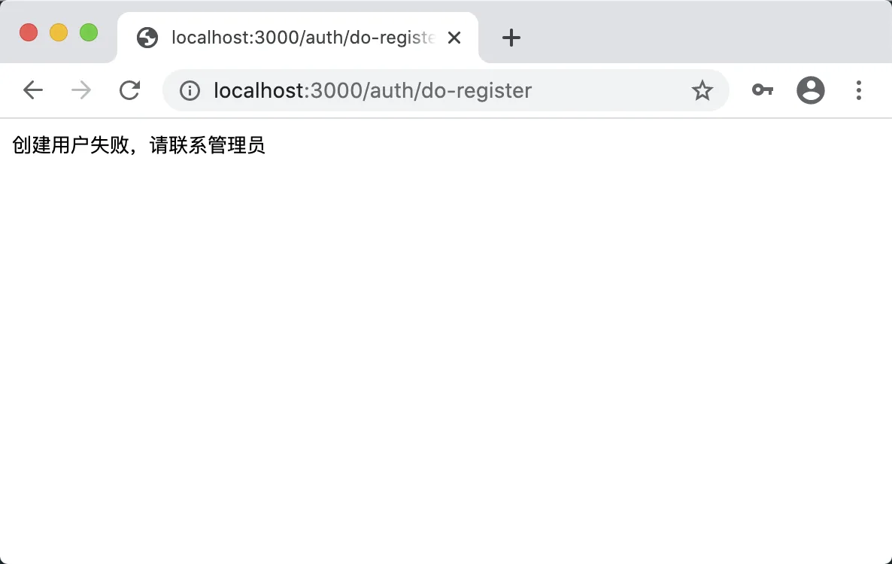
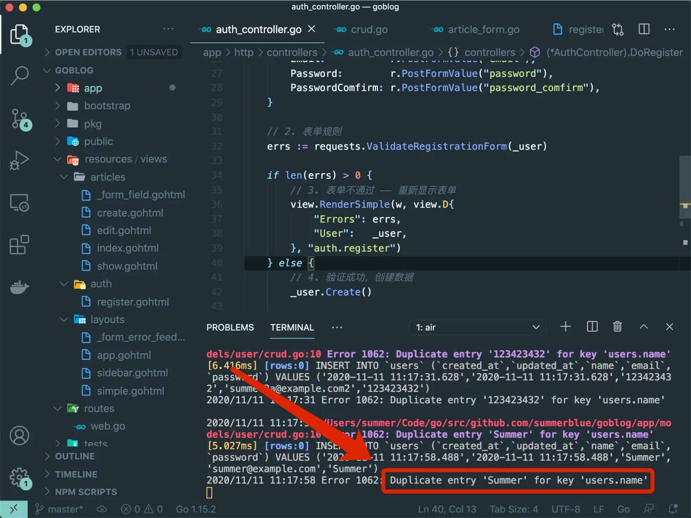
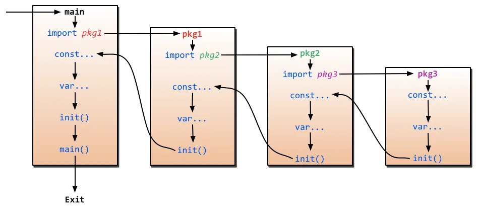
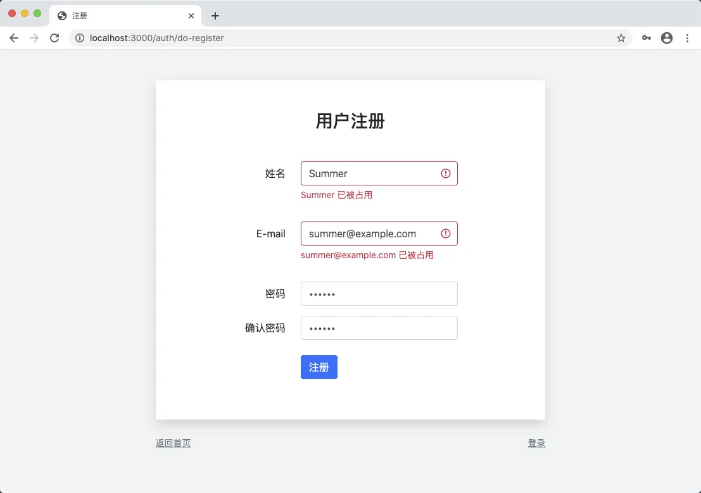

# 10.4. 自定义验证规则

原文链接：https://learnku.com/courses/go-basic/1.22/custom-validation-rules/16534

## 说明

目前我们的表单验证还未完整，当数据库里有相同用户名或者邮箱时，用户提交注册，会显示：



在看下命令行终端：



这是因为我们在创建用户模型时，使用 GORM  的字段标签,为 Email 和用户名字段设置了 `unique` 属性。

接下来我们优化反馈逻辑，在用户名或者邮箱已存在的情况，给予用户提示。

## 添加自定义规则

参考 [项目首页文档](https://github.com/thedevsaddam/govalidator#add-custom-rules) 创建自定义规则：

app/requests/request.go

```
package requests

import (
"fmt"
"goblog/pkg/model"
"strings"

"github.com/thedevsaddam/govalidator"
)

// 此方法会在初始化时执行
func init() {
// not_exists:users,email
govalidator.AddCustomRule("not_exists", func(field string, rule string, message string, value interface{}) error {
rng := strings.Split(strings.TrimPrefix(rule, "not_exists:"), ",")

tableName := rng[0]
dbFiled := rng[1]
val := value.(string)

var count int64
model.DB.Table(tableName).Where(dbFiled+" = ?", val).Count(&count)

if count != 0 {

if message != "" {
return errors.New(message)
}

return fmt.Errorf("%v 已被占用", val)
}
return nil
})
}
```

这是我们第一次使用 `init()` 方法。在 Go 里面，`init()` 方法是特殊类型方法，他会在包被引入的时候执行。

请见下图：



如上图，有以下须知：

- 假如 main 引入了 pkg1 最终依赖于 pkg3，pkg3 中的 `init()` 方法会优先被执行；

- 同一个包里，单文件的情况，`init()` 优先于其他方法执行，包括 `main()`；

- 同一个包里的常量和变量声明会优先于 `init()` 方法执行；

- 同一个文件里允许多个 `init()` 存在，会按照自上而下的顺序执行；

- 同一个包，多个文件里存在 `init()` 的情况，执行顺序是按文件名的字母排序执行。

Go 的官方标准库里很多包都使用 `init()` 来初始化数据。在这里我们利用此机制来优先执行注册自定义规则的代码。

## 使用认证规则

app/requests/user_registration.go

```
.
.
.
// ValidateRegistrationForm 验证表单，返回 errs 长度等于零即通过
func ValidateRegistrationForm(data user.User) map[string][]string {

// 1. 定制认证规则
rules := govalidator.MapData{
"name":             []string{"required", "alpha_num", "between:3,20", "not_exists:users,name"},
"email":            []string{"required", "min:4", "max:30", "email", "not_exists:users,email"},
.
.
.
}
.
.
.
}
```

在两个需要的字段后面新增了 `not_exists` 规则，当用户名或者 Email 被占用后，提交表单可见：



## 代码版本

开始下一节之前，我们先来为代码做下版本标记：

```
$ git add .
$ git commit -m "确保用户名和邮箱唯一"
```
