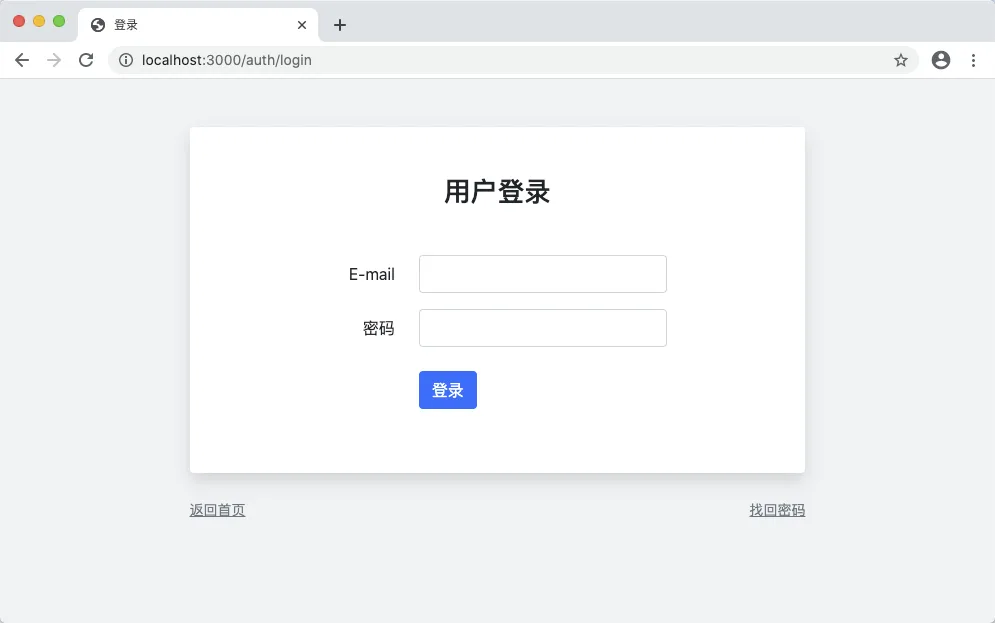
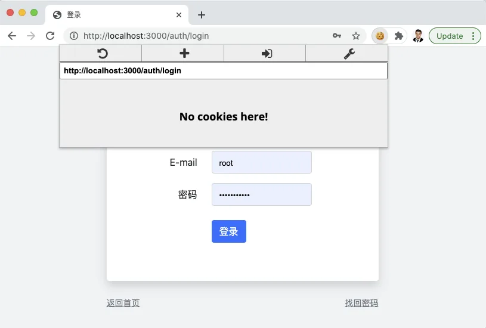
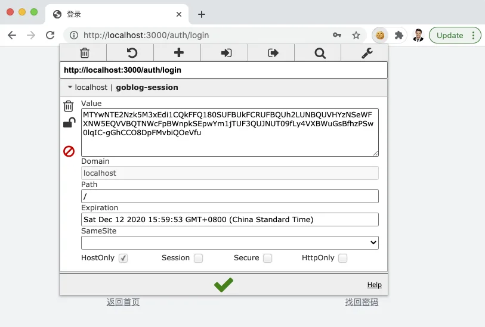
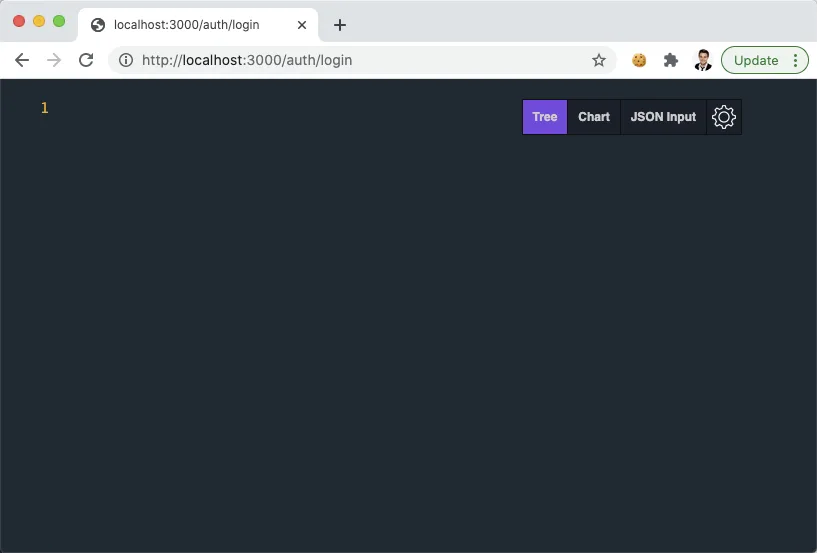
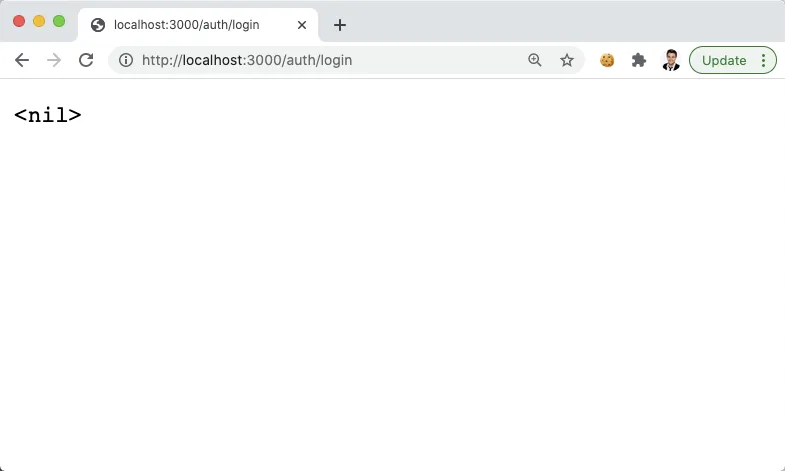
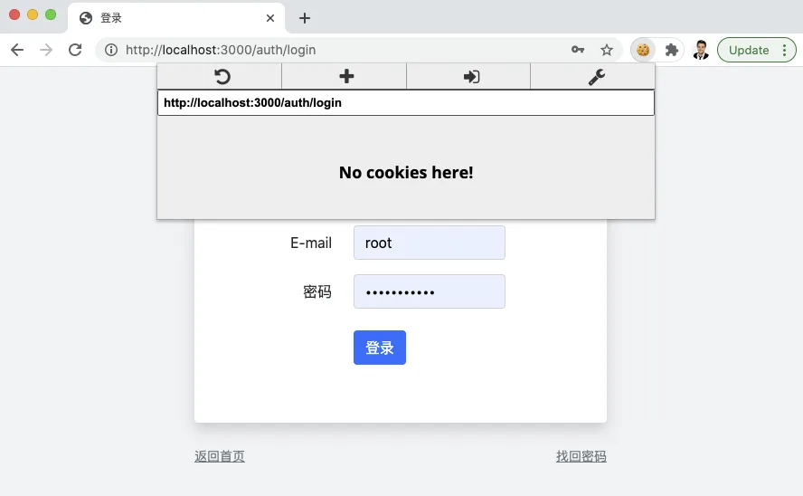

# 10.5. 登录和会话控制

原文链接：https://learnku.com/courses/go-basic/1.22/user-login/16535

## 说明

用户注册成功，接下来开发用户登录功能。

## 注册路由

首先我们来注册路由：

routes/web.go

```
.
.
.
// RegisterWebRoutes 注册网页相关路由
func RegisterWebRoutes(r *mux.Router) {
.
.
.
r.HandleFunc("/auth/login", auc.Login).Methods("GET").Name("auth.login")
r.HandleFunc("/auth/dologin", auc.DoLogin).Methods("POST").Name("auth.dologin")

// 静态资源
.
.
.
}
```

## 控制器方法

接下来创建控制器方法：

app/http/controllers/auth_controller.go

```
.
.
.
// Login 显示登录表单
func (*AuthController) Login(w http.ResponseWriter, r *http.Request) {
view.RenderSimple(w, view.D{}, "auth.login")
}

// DoLogin 处理登录表单提交
func (*AuthController) DoLogin(w http.ResponseWriter, r *http.Request) {
//
}
```

DoLogin 的逻辑我们等会再写。先将显示登录表单跑通。

## 视图

接下来创建 `auth.login` 视图，将 register.gohtml 内容复制过来然后稍作修改：

resources/views/auth/login.gohtml

```
{{define "title"}}
登录
{{end}}

{{define "main"}}
<div class="blog-post bg-white p-5 rounded shadow mb-4">

<h3 class="mb-5 text-center">用户登录</h3>

<form action="{{ RouteName2URL "auth.dologin" }}" method="post">

<div class="form-group row mb-3">
<label for="email" class="col-md-4 col-form-label text-md-right">E-mail</label>
<div class="col-md-6">
<input id="email" type="email" class="form-control {{if .Error }}is-invalid {{end}}" name="email" value="{{ .Email }}" required="">
{{ with .Error }}
<div class="invalid-feedback">
<p>{{ . }}</p>
</div>
{{ end }}
</div>
</div>

<div class="form-group row mb-3">
<label for="password" class="col-md-4 col-form-label text-md-right">密码</label>
<div class="col-md-6">
<input id="password" type="password" class="form-control {{if .Errors.password }}is-invalid {{end}}" name="password" value="{{ .Password }}" required="">
</div>
</div>

<div class="form-group row mb-3 mb-0 mt-4">
<div class="col-md-6 offset-md-4">
<button type="submit" class="btn btn-primary">
登录
</button>
</div>
</div>

</form>

</div>

<div class="mb-3">
<a href="/" class="text-sm text-muted"><small>返回首页</small></a>
<a href="" class="text-sm text-muted float-right"><small>找回密码</small></a>
</div>

{{end}}
```

## 访问登录页面

浏览器打开： [localhost:3000/auth/login](http://localhost:3000/auth/login)



## 什么是会话控制？

用户登录，技术上讲是叫会话控制。

HTTP 是无状态的，要保证会话控制，要利用 Cookie 来做。

一般做会话控制，有两种方式：

- 一种是不带后端存储

- 另一种是带后端存储

### 全 Cookie 会话

不带后端存储的就是将会话数据存储于 Cookie 中。数据是加密过的，且一般设置 Cookie 时使用 HttpOnly 标示来防止 JS 读取。传输到服务端的时候，再重新解密。

主要好处是在多服务器时不需要配置，原生支持，因为数据都存储在客户端的 Cookie 中，只需要保证加密解密的钥匙是一样的即可。

坏处有两个：

- 一个是依赖于 HTTP Cookie 有数据大小限制，Cookie 的总大小不能超过 4KB，使用时要注意不能往会话里写入太多数据；

- 第二个，因为会话数据是放在客户端，在用户访问服务器之前，我们无法对这些会话数据进行修改和管理（例如说因为特殊情况需要重置所有会话，也就是说让所有用户重新登录）。

### 带存储的会话

而带后端存储的会话控制，也同样使用 Cookie，不过只保存会话 ID，所有数据都放于存储器中。

常见的存储介质有：

- 文件

- MySQL

- Memcache

- Redis

- 等

这种做法最大的好处是可以存储更多的会话数据，但是坏处是当多机器部署时，需要注意使用同一个会话存储，以免造成混乱。多机部署的问题使用专业会话存储工具，如 Memcache 或者 Redis 很容易解决。

## gorilla/sessions 库

本项目中，我们将使用 [gorilla/sessions](https://github.com/gorilla/sessions) 来做会话管理。

gorilla/sessions 原生支持 Cookie 会话和文件会话两种方式，也有很多 [第三方的存储器](https://github.com/gorilla/sessions#store-implementations) 支持，MySQL/Memcache/Redis 应有尽有。

从易用性考虑，本项目我们将使用 Cookie 会话，其他会话存储器的使用大同小异，只是初始化时有所不同。

### gorilla/sessions 库为我们做了什么？

gorilla/sessions 为我们提供了会话数据的加密解密，以及底层的 Cookie 管理。使用时，我们可以通过配置信息来更改其默认行为。

## 我们需要做什么？

我们先来规划一下。

gorilla/sessions 提供的接口比较简单，为了方便维护，我们需要将其封装到自己的 session 包里，目前能想到的有以下方法：

| 方法名称 |
| --- |
| 作用 |

| session.StartSession |
| --- |
| 初始化会话，在中间件中调用 |

| session.Put |
| --- |
| 写入键值对应的会话数据 |

| session.Get |
| --- |
| 获取会话数据 |

| session.Forget |
| --- |
| 删除某个会话项 |

| session.Flush |
| --- |
| 删除当前 |

| session.Save |
| --- |
| 保存会话 |

以上方法名称参考了知名的 Laravel 框架。

## session 包

聊了这么多，接下来开始写代码。

先安装 gorilla/sessions 包：

```
$ go get github.com/gorilla/sessions
```

接下来我们会创建两个包，分别是：

- session —— 负责与 gorilla/sessions 交互的逻辑

- auth —— 负责用户认证相关逻辑，底层使用 session 包

这样设计的好处是，auth 认证逻辑（登录、退出等）与底层的 session 管理逻辑解耦。假如后面我们如果要换 session 驱动，或者使用不同的认证机制，都不用碰到应用里到处使用的 auth 代码。

因为 auth 包要依赖 session 包，优先创建底层包：

pkg/session/session.go

```
// Package session 会话管理
package session

import (
"goblog/pkg/logger"
"net/http"

"github.com/gorilla/sessions"
)

// Store gorilla sessions 的存储库
var Store = sessions.NewCookieStore([]byte("33446a9dcf9ea060a0a6532b166da32f304af0de"))

// Session 当前会话
var Session *sessions.Session

// Request 用以获取会话
var Request *http.Request

// Response 用以写入会话
var Response http.ResponseWriter

// StartSession 初始化会话，在中间件中调用
func StartSession(w http.ResponseWriter, r *http.Request) {
var err error

// Store.Get() 的第二个参数是 Cookie 的名称
// gorilla/sessions 支持多会话，本项目我们只使用单一会话即可
Session, err = Store.Get(r, "goblog-session")
logger.LogError(err)

Request = r
Response = w
}

// Put 写入键值对应的会话数据
func Put(key string, value interface{}) {
Session.Values[key] = value
Save()
}

// Get 获取会话数据，获取数据时请做类型检测
func Get(key string) interface{} {
return Session.Values[key]
}

// Forget 删除某个会话项
func Forget(key string) {
delete(Session.Values, key)
Save()
}

// Flush 删除当前会话
func Flush() {
Session.Options.MaxAge = -1
Save()
}

// Save 保持会话
func Save() {
// 非 HTTPS 的链接无法使用 Secure 和 HttpOnly，浏览器会报错
// Session.Options.Secure = true
// Session.Options.HttpOnly = true
err := Session.Save(Request, Response)
logger.LogError(err)
}
```

上文已经把 session 的方法罗列出来，这里照着 [gorilla/sessions](https://godoc.org/github.com/gorilla/sessions) 的文档将调用方式填入进去。

>

注意： 调用 `NewCookieStore` 时传参的是一串随机字符串，作为最佳实践，这个随机字串应该放置于配置中，并且随着程序的不同环境而不一致，这里我们先这么写着，后面再来统一处理配置信息的问题。

### 使用会话

我们需要创建中间件来运行会话初始化方法 `session.StartSession()`：

app/http/middlewares/start_session.go

```
package middlewares

import (
"goblog/pkg/session"
"net/http"
)

// StartSession 开启 session 会话控制
func StartSession(next http.Handler) http.Handler {
return http.HandlerFunc(func(w http.ResponseWriter, r *http.Request) {

// 1. 启动会话
session.StartSession(w, r)

// 2. . 继续处理接下去的请求
next.ServeHTTP(w, r)
})
}
```

还需要注册中间件：

routes/web.go

```
.
.
.
// RegisterWebRoutes 注册网页相关路由
func RegisterWebRoutes(r *mux.Router) {
.
.
.
// --- 全局中间件 ---

// 开始会话
r.Use(middlewares.StartSession)
}
```

## 测试

接下来我们来测试一下，测试之前，为了方便查看 Cookie 请安装 [EditThisCookie](http://www.editthiscookie.com/) Chrome 插件（安装不上的同学没关系，下面会有详尽的截图，知道原理就行）。

就利用我们的登录页面，请访问 [localhost:3000/auth/login](http://localhost:3000/auth/login) ，打开 EditThisCookie 插件可以看到当前我们并无 Cookie：



### 新增会话数据

在控制器里我们新增个会话数据：

app/http/controllers/auth_controller.go

```
.
.
.
// Login 显示登录表单
func (*AuthController) Login(w http.ResponseWriter, r *http.Request) {

session.Put("uid", "1")

view.RenderSimple(w, view.D{}, "auth.login")
}
.
.
.
```

浏览器刷新，再次查看 Cookie：



上图可以看到 Cookie 已经种上了，数据是加密的，且过期时间是距离现在一个月，这是 gorilla/sessions 的默认值，可以通过设置 `Session.Options.MaxAge` 来更改。

### 读取会话数据

接下来我们尝试读出会话数据：

app/http/controllers/auth_controller.go

```
.
.
.
// Login 显示登录表单
func (*AuthController) Login(w http.ResponseWriter, r *http.Request) {

fmt.Fprint(w, session.Get("uid"))

// view.RenderSimple(w, view.D{}, "auth.login")
}
.
.
.
```

刷新登录页面：



可见数据被准确读出来。请注意，HTTP 是无状态的，我们现已成功让两次不同的请求共享数据。

### 删除会话数据

接下来试下删除会话值：

app/http/controllers/auth_controller.go

```
.
.
.
// Login 显示登录表单
func (*AuthController) Login(w http.ResponseWriter, r *http.Request) {

session.Forget("uid")

view.RenderSimple(w, view.D{},  "auth.login")
}
.
.
.
```

刷新一下 [localhost:3000/auth/login](http://localhost:3000/auth/login) ，然后再次读取：

app/http/controllers/auth_controller.go

```
.
.
.
// Login 显示登录表单
func (*AuthController) Login(w http.ResponseWriter, r *http.Request) {

fmt.Fprint(w, session.Get("uid"))

// view.RenderSimple(w, view.D{}, "auth.login")
}
.
.
.
```

可以看到：



### 销毁整个会话

更改：

app/http/controllers/auth_controller.go

```
.
.
.
// Login 显示登录表单
func (*AuthController) Login(w http.ResponseWriter, r *http.Request) {

session.Flush()

view.RenderSimple(w, view.D{},  "auth.login")
}
.
.
.
```

刷新一下 [localhost:3000/auth/login](http://localhost:3000/auth/login) ，点击 EditThisCookie 按钮查看 Cookie：



Cookie 已被清空，符合预期。

## 还原代码

请删除测试代码，为下一节做准备：

app/http/controllers/auth_controller.go

```
.
.
.
// Login 显示登录表单
func (*AuthController) Login(w http.ResponseWriter, r *http.Request) {
view.RenderSimple(w, view.D{},  "auth.login")
}
.
.
.
```

## 代码版本

开始下一节之前，我们先来为代码做下版本标记：

```
$ git add .
$ git commit -m "登录表单和会话控制"
```
