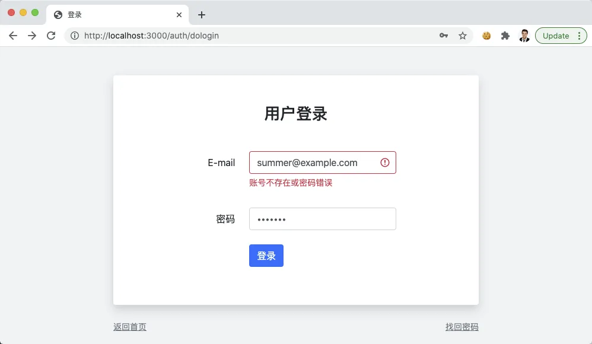
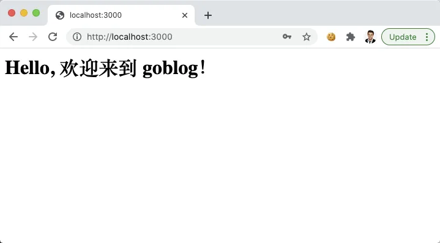

# 10.6. 认证用户

原文链接：https://learnku.com/courses/go-basic/1.22/session-and-authentication-management/16536

## 说明

上一节我们创建了登录表单和 session 库，已经具备了用户登录功能的雏形，本节来最终完善此功能。

## auth 包

基于 session 包，我们将会创建 auth 包，来管理用户认证。

方法列表如下：

| 方法名称 |
| --- |
| 作用 |

| auth.User |
| --- |
| 获取当前登录用户 |

| auth.Attempt |
| --- |
| 传入邮箱和密码，进行登陆尝试 |

| auth.Login |
| --- |
| 传入用户模型，用户注册成功后登陆用户 |

| auth.Logout |
| --- |
| 退出登录 |

| auth.Check |
| --- |
| 检测是否登录 |

使用 auth.Attempt 或者 auth.Login 进行登录，在这个方法里如果登录成功的话，会写入一个叫 `uid` 的会话数据。

以上方法名称借鉴了 Laravel 框架。原因是这些方法读起来很自然。

auth 库依赖于 session 库，现在 session 库已经创建完成，并且能正常功能，接下来就是创建 auth 库。

pkg/auth/auth.go

```go
// Package auth 授权模块
package auth

import (
	"errors"
	"goblog/app/models/user"
	"goblog/pkg/session"

	"gorm.io/gorm"
)

func _getUID() string {
	_uid := session.Get("uid")
	uid, ok := _uid.(string)
	if ok && len(uid) > 0 {
		return uid
	}
	return ""
}

// User 获取登录用户信息
func User() user.User {
	uid := _getUID()
	if len(uid) > 0 {
		_user, err := user.Get(uid)
		if err == nil {
			return _user
		}
	}
	return user.User{}
}

// Attempt 尝试登录
func Attempt(email string, password string) error {
	// 1. 根据 Email 获取用户
	_user, err := user.GetByEmail(email)

	// 2. 如果出现错误
	if err != nil {
		if err == gorm.ErrRecordNotFound {
			return errors.New("账号不存在或密码错误")
		} else {
			return errors.New("内部错误，请稍后尝试")
		}
	}

	// 3. 匹配密码
	if !_user.ComparePassword(password) {
		return errors.New("账号不存在或密码错误")
	}

	// 4. 登录用户，保存会话
	session.Put("uid", _user.GetStringID())

	return nil
}

// Login 登录指定用户
func Login(_user user.User) {
	session.Put("uid", _user.GetStringID())
}

// Logout 退出用户
func Logout() {
	session.Forget("uid")
}

// Check 检测是否登录
func Check() bool {
	return len(_getUID()) > 0
}
```

我们调用了 `user.Get()` 和 `user.GetByEmail()` 方法，这两个方法未定义，前往模型中创建：

app/models/user/crud.go

```go
.
.
.
// Get 通过 ID 获取用户
func Get(idstr string) (User, error) {
	var user User
	id := types.StringToUint64(idstr)
	if err := model.DB.First(&user, id).Error; err != nil {
		return user, err
	}
	return user, nil
}

// GetByEmail 通过 Email 来获取用户
func GetByEmail(email string) (User, error) {
	var user User
	if err := model.DB.Where("email = ?", email).First(&user).Error; err != nil {
		return user, err
	}
	return user, nil
}
```

匹配用户密码那里，我们使用 `users.ComparePassword()`方法，此方法暂时还没有，我们创建一下：

app/models/user/user.go

```go
.
.
.
// ComparePassword 对比密码是否匹配
func (user *User) ComparePassword(password string) bool {
	return user.Password == password
}
```

因为我们存进去的是明文，这里我们直接匹配字符串。

>

注意： 后面我们会有专门的章节来讲解用户密码正确的加密方式。

## 控制器方法

接下来编写控制器方法：

app/http/controllers/auth_controller.go

```go
.
.
.
// DoLogin 处理登录表单提交
func (*AuthController) DoLogin(w http.ResponseWriter, r *http.Request) {

	// 1. 初始化表单数据
	email := r.PostFormValue("email")
	password := r.PostFormValue("password")

	// 2. 尝试登录
	if err := auth.Attempt(email, password); err == nil {
		// 登录成功
		http.Redirect(w, r, "/", http.StatusFound)
	} else {
		// 3. 失败，显示错误提示
		view.RenderSimple(w, view.D{
			"Error":    err.Error(),
			"Email":    email,
			"Password": password,
		}, "auth.login")
	}
}
```

打开 [localhost:3000/auth/login](http://localhost:3000/auth/login) ，填入邮箱和密码，故意填错密码，点击登录（用户密码是明文保存的，忘记了可以打开数据库工具查看）：



使用正确的邮箱和密码，再次登录，即可看到：



## 代码版本

开始下一节之前，我们先来为代码做下版本标记：

```bash
$ git add .
$ git commit -m "会话和认证管理"
```
