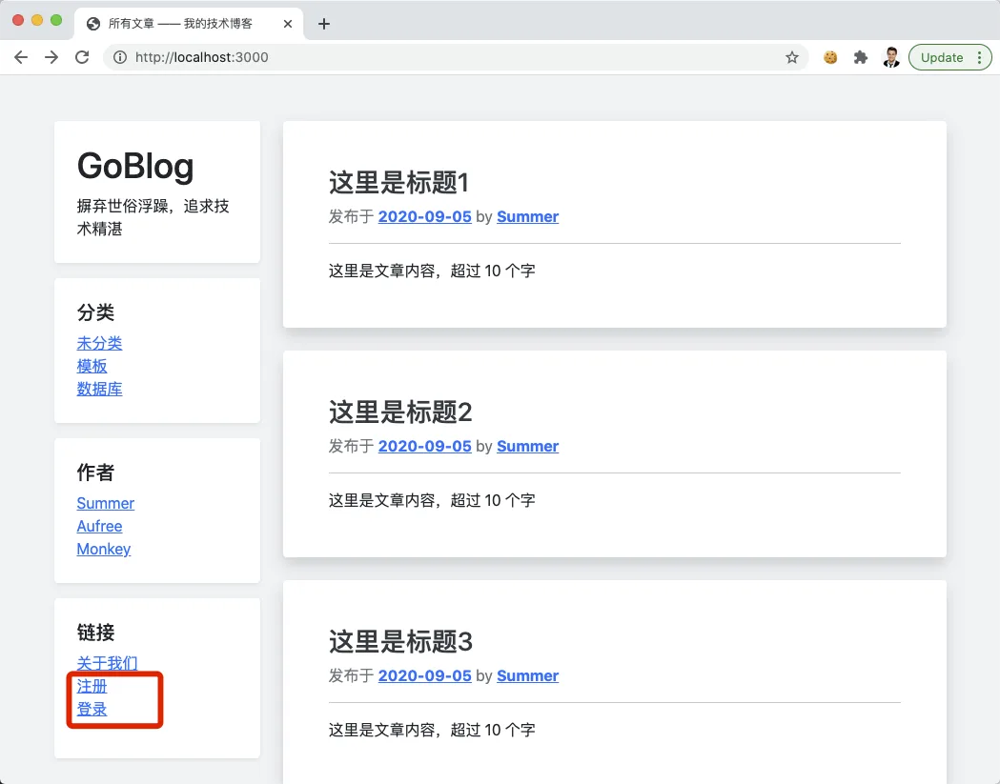
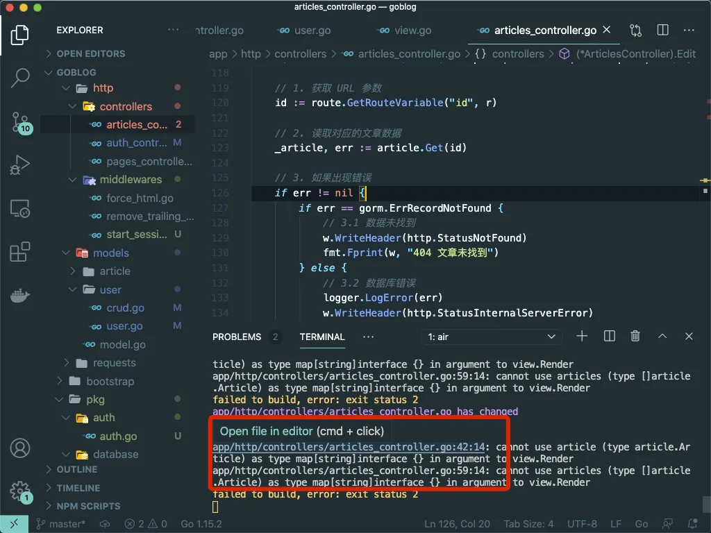
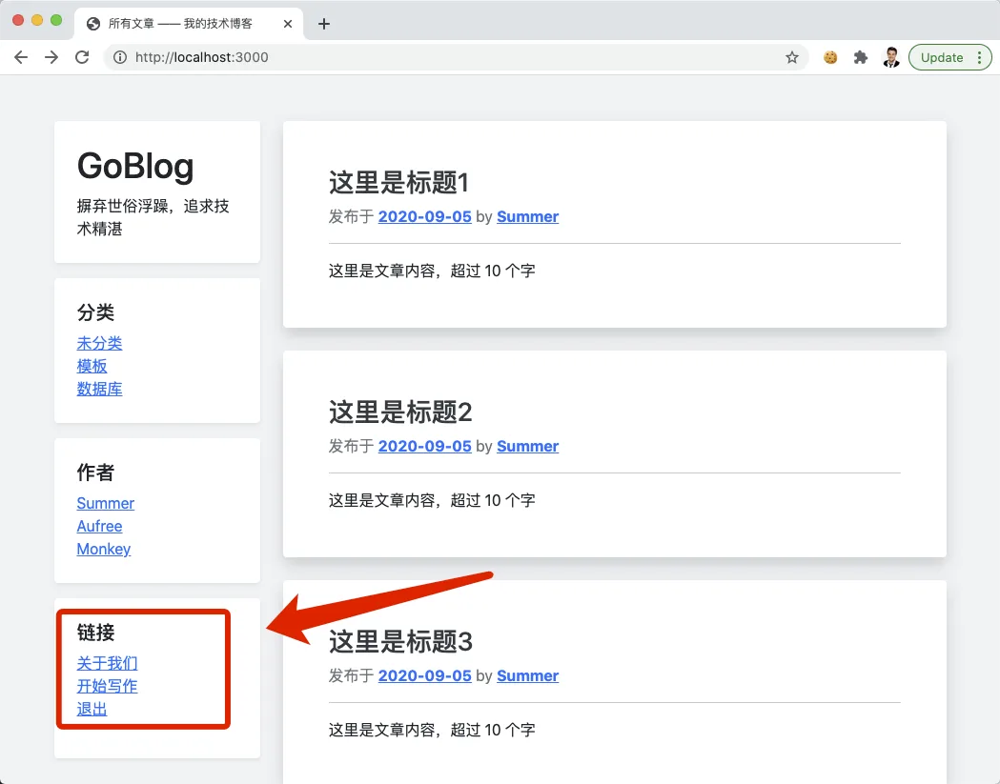

# 10.7. 登录状态

原文链接：https://learnku.com/courses/go-basic/1.22/login-state/16537

## 说明

这一节，我们来开发登录状态，页面里能看到用户是否登录，才能正确的显示退出登录按钮。

## 首页显示

目前首页显示的是几个大大的字，事实上我们想要的是显示文章列表。

因为我们使用了路由文件和控制器，非常好修改：

routes/web.go

```go
.
.
.
// RegisterWebRoutes 注册网页相关路由
func RegisterWebRoutes(r *mux.Router) {

    // 静态页面
    pc := new(controllers.PagesController)
    r.NotFoundHandler = http.HandlerFunc(pc.NotFound)
    r.HandleFunc("/about", pc.About).Methods("GET").Name("about")

    // 文章相关页面
    ac := new(controllers.ArticlesController)
    r.HandleFunc("/", ac.Index).Methods("GET").Name("home")
    r.HandleFunc("/articles/{id:[0-9]+}", ac.Show).Methods("GET").Name("articles.show")
    .
    .
    .
}
```

可见将静态页面里 `"/"` 的路由移动到文章相关页面下，并与 `/articles` 使用上了同一个路由控制方法。

打开浏览器查看首页 [localhost:3000/](http://localhost:3000/) ：



接下来我们来为上图红框内设置合理的逻辑 —— 在登录的情况下，显示 退出 和 发表文章 入口。

## 全局模板变量

首先需要设置全局模板变量，在模板里我们可以通过这些变量来判断当前用户是否登录。

因为我们的视图都统一使用 view 包来加载，修改起来很简单：

pkg/view/view.go

```go
// Package view 视图渲染
package view

import (
	"goblog/pkg/auth"
	"goblog/pkg/logger"
	"goblog/pkg/route"
	"html/template"
	"io"
	"path/filepath"
	"strings"
)

// D 是 map[string]interface{} 的简写
type D map[string]interface{}

// Render 渲染通用视图
func Render(w io.Writer, data D, tplFiles ...string) {
	RenderTemplate(w, "app", data, tplFiles...)
}

// RenderSimple 渲染简单的视图
func RenderSimple(w io.Writer, data D, tplFiles ...string) {
	RenderTemplate(w, "simple", data, tplFiles...)
}

// RenderTemplate 渲染视图
func RenderTemplate(w io.Writer, name string, data D, tplFiles ...string) {

	// 1. 通用模板数据
	data["isLogined"] = auth.Check()

	// 2. 生成模板文件
	allFiles := getTemplateFiles(tplFiles...)

	// 3. 解析所有模板文件
	tmpl, err := template.New("").
		Funcs(template.FuncMap{
			"RouteName2URL": route.Name2URL,
		}).ParseFiles(allFiles...)
	logger.LogError(err)

	// 4. 渲染模板
	err = tmpl.ExecuteTemplate(w, name, data)
	logger.LogError(err)
}

func getTemplateFiles(tplFiles ...string) []string {
	// 1 设置模板相对路径
	viewDir := "resources/views/"

	// 2. 遍历传参文件列表 Slice，设置正确的路径，支持 dir.filename 语法糖
	for i, f := range tplFiles {
		tplFiles[i] = viewDir + strings.Replace(f, ".", "/", -1) + ".gohtml"
	}

	// 3. 所有布局模板文件 Slice
	layoutFiles, err := filepath.Glob(viewDir + "layouts/*.gohtml")
	logger.LogError(err)

	// 4. 合并所有文件
	return append(layoutFiles, tplFiles...)
}
```

以上代码做了几个变更：

1. `RenderTemplate()` 方法太长，生成模板文件列表的地方抽出来放置于`getTemplateFiles()` 中；

2. 几个 Render 方法的第二个参数，使用了数据类型 `view.D`，也就是 `map[string]interface{}`；

3. 有了 2 的统一数据格式，`RenderTemplate()` 里即可加入我们期望的 `isLogined` 和 `loginUser` 模板变量。

## 重构小任务

此时，因为我们修改了 `Render()` 第二个参数的数据类型，命令行里会有很多报错：



没关系，接下来我们一一修复。

### 重构控制器代码

请打开 app/http/controllers/articles_controller.go ，寻找以下内容：

```
view.Render(w, article, "articles.show")
```

改为：

```
view.Render(w, view.D{
"Article": article,
}, "articles.show")
```

接下来是找到：

```
view.Render(w, articles, "articles.index")
```

改为：

```
view.Render(w, view.D{
"Articles": articles,
}, "articles.index")
```

### 重构视图文件

现在我们使用的是键值数据，视图也应做相同修改。

文章页面直接替换为以下内容：

resources/views/articles/show.gohtml

```
{{define "title"}}
{{ .Article.Title }}
{{end}}

{{define "main"}}
<div class="col-md-9 blog-main">

<div class="blog-post bg-white p-5 rounded shadow mb-4">
<h3 class="blog-post-title">{{ .Article.Title }}</h3>
<p class="blog-post-meta text-secondary">发布于 <a href="" class="font-weight-bold">2020-09-05</a> by <a href="#" class="font-weight-bold">Summer</a></p>

<hr>
{{ .Article.Body }}

<form class="mt-4" action="{{ RouteName2URL "articles.delete" "id" .Article.GetStringID }}" method="post">
<button type="submit" onclick="return confirm('删除动作不可逆，请确定是否继续')" class="btn btn-outline-danger btn-sm">删除</button>
<a href="{{ RouteName2URL "articles.edit" "id" .Article.GetStringID }}" class="btn btn-outline-secondary btn-sm">编辑</a>
</form>

</div><!-- /.blog-post -->
</div>

{{end}}
```

修改文章列表页：

resources/views/articles/index.gohtml

```
{{ range $key, $article := . }}
```

改为：

```
{{ range $key, $article := .Articles }}
```

保险起见，请前往 [localhost:3000/](http://localhost:3000/) 页面，并点击进入某篇文章以确认无误。

## 登录状态

接下来修改本文第一张截图里红框内的逻辑：

resources/views/layouts/sidebar.gohtml

```
.
.
.
<div class="p-4 bg-white rounded shadow-sm mb-3">
<h5>链接</h5>
<ol class="list-unstyled">
<li><a href="#">关于我们</a></li>
{{ if .isLogined }}
<li><a href="{{ RouteName2URL "articles.create" }}">开始写作</a></li>
<li><a href="">退出</a></li>
{{ else }}
<li><a href="{{ RouteName2URL "auth.register" }}">注册</a></li>
<li><a href="{{ RouteName2URL "auth.login" }}">登录</a></li>
{{ end }}
</ol>
</div>
</div>
{{end}}
```

登录情况下，显示退出等按钮，未登录情况下显示登录按钮：



因为上一节我们成功登录了用户，所以我这里显示的登录以后的逻辑。

## 代码版本

开始下一节之前，我们先来为代码做下版本标记：

```bash
$ git add .
$ git commit -m "登录状态"
```
