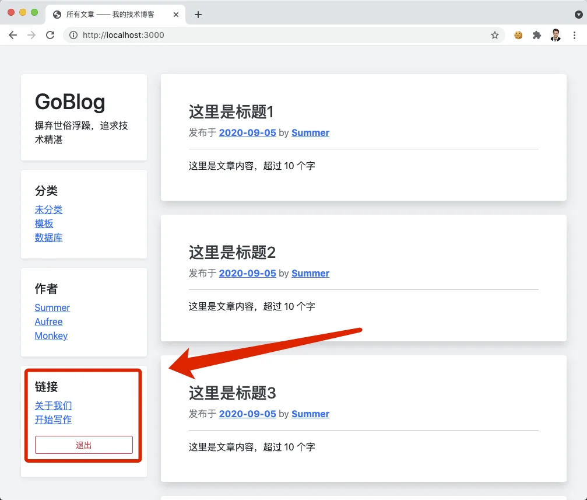
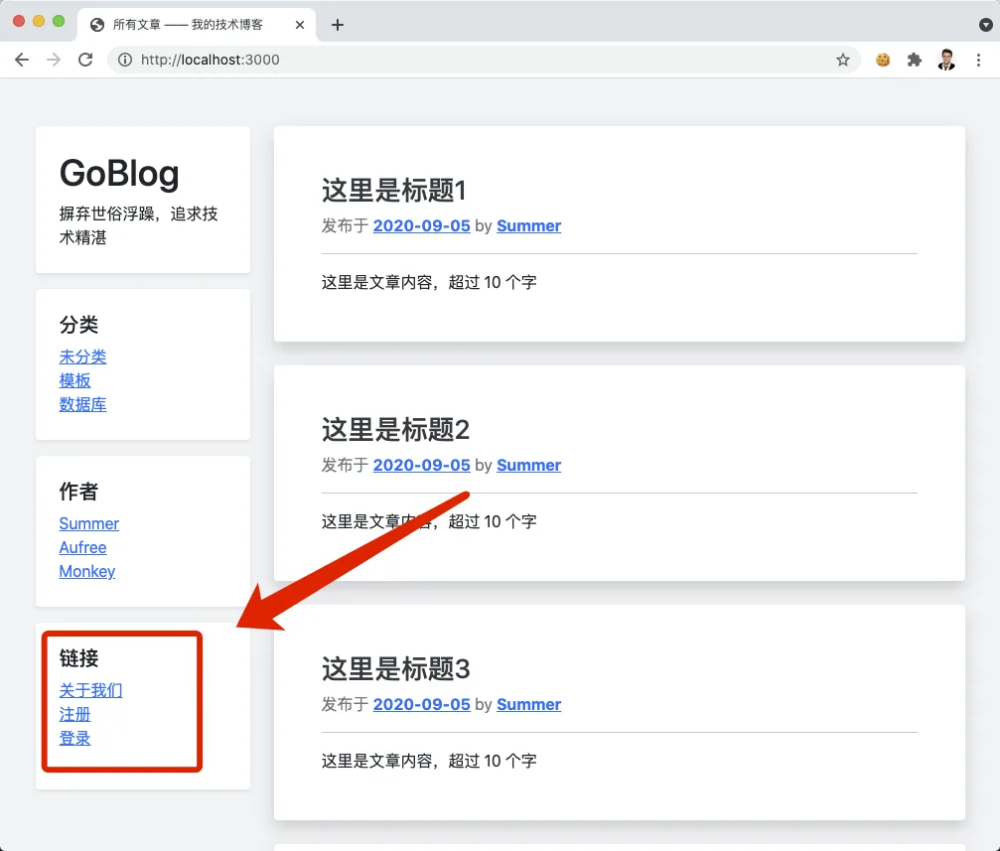

# 10.8. 退出登录

原文链接：https://learnku.com/courses/go-basic/1.22/log-out/16538

## 说明

本文开发退出登录功能。

## 注册路由

在 `auth.dologin` 后新增 `auth.logout` 路由：

routes/web.go

```go
.
.
.
// RegisterWebRoutes 注册网页相关路由
func RegisterWebRoutes(r *mux.Router) {
    .
    .
    .
    r.HandleFunc("/auth/dologin", auc.DoLogin).Methods("POST").Name("auth.dologin")
    r.HandleFunc("/auth/logout", auc.Logout).Methods("POST").Name("auth.logout")

    .
    .
    .
}
```

注意： 退出操作必须使用 POST 方法。恶意用户在网站上伪造图片链接 `src="<你的退出链接>`，将导致用户在不知情的情况下就退出登录，使用 POST 方法即可避免。

## 控制器方法

接下来创建控制器方法：

app/http/controllers/auth_controller.go

```go
.
.
.
// Logout 退出登录
func (*AuthController) Logout(w http.ResponseWriter, r *http.Request) {
	auth.Logout()
	http.Redirect(w, r, "/", http.StatusFound)
}
```

因提前准备好了 auth 包，退出功能很容易实现。

## 退出表单

接下来是构建退出表单：

resources/views/layouts/sidebar.gohtml

```
.
.
.

<div class="p-4 bg-white rounded shadow-sm mb-3">
<h5>链接</h5>
<ol class="list-unstyled">
<li><a href="#">关于我们</a></li>
{{ if .isLogined }}
<li><a href="{{ RouteName2URL "articles.create" }}">开始写作</a></li>
<li class="mt-3">
<form action="{{ RouteName2URL "auth.logout" }}" method="POST" onsubmit="return confirm('您确定要退出吗？');">
<button class="btn btn-block btn-outline-danger btn-sm" type="submit" name="button">退出</button>
</form>
</li>
{{ else }}
<li><a href="{{ RouteName2URL "auth.register" }}">注册</a></li>
<li><a href="{{ RouteName2URL "auth.login" }}">登录</a></li>
{{ end }}
</ol>
</div>
</div>
{{end}}
```

查看左边栏底部（未登录请前往登录页面 [localhost:3000/auth/login](http://localhost:3000/auth/login) 登录）：



点击退出登录，确认退出：



## 代码版本

开始下一节之前，我们先来为代码做下版本标记：

```bash
$ git add .
$ git commit -m "退出登录"
```
