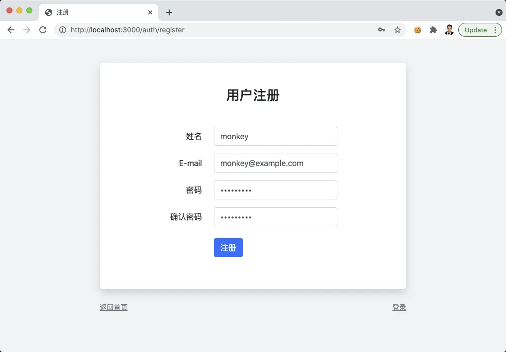
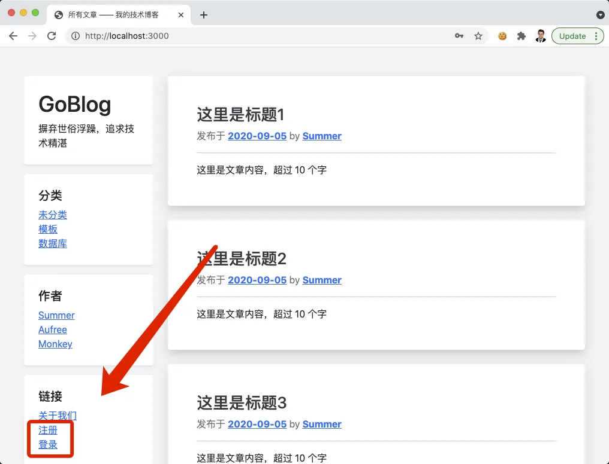
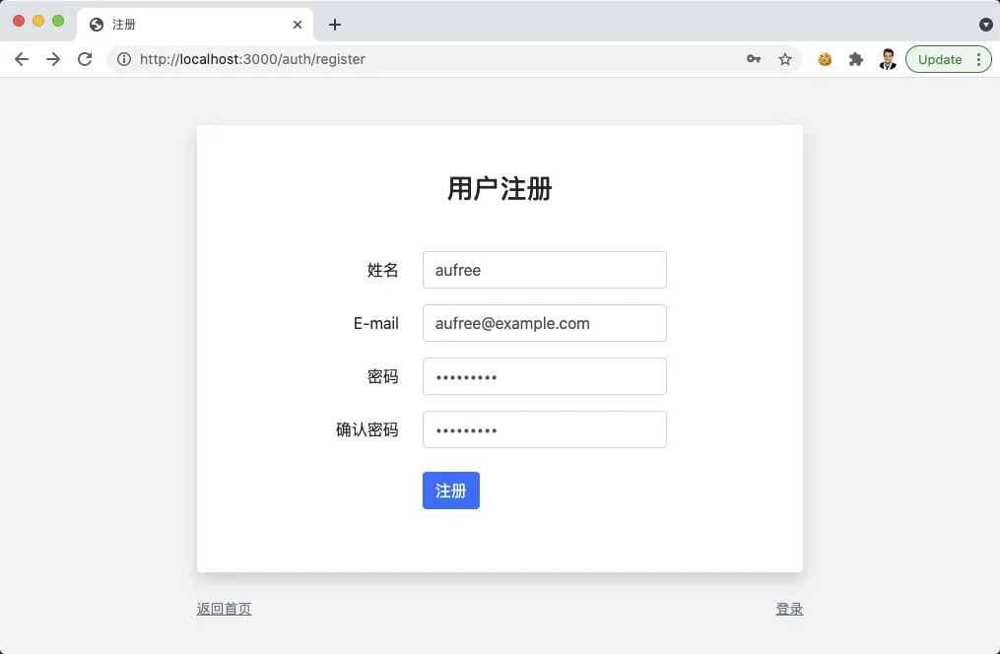
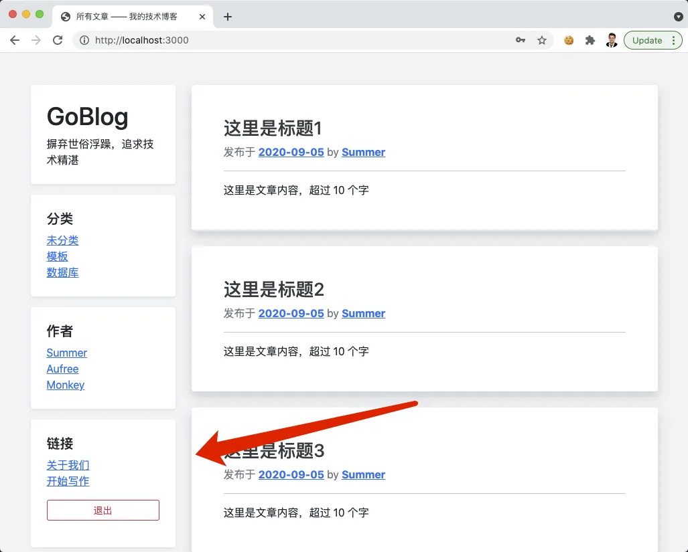
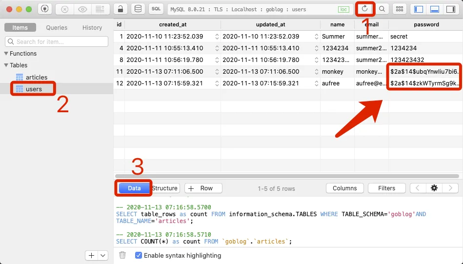
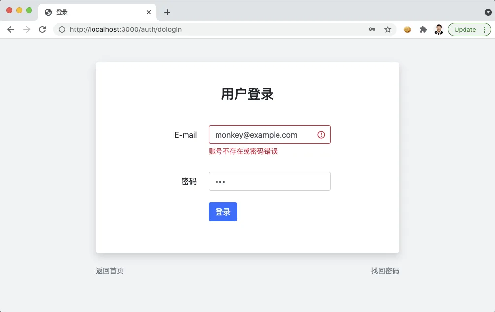
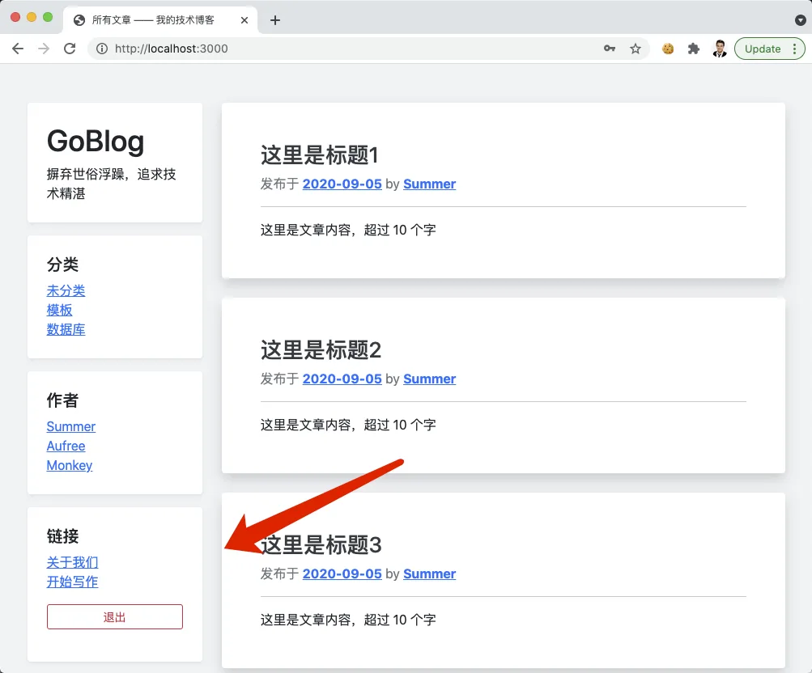

# 10.9. 用户密码加密

原文链接：https://learnku.com/courses/go-basic/1.22/user-password-encryption/16539

## 说明

目前我们的密码是明文存储在数据库中，这是对用户来说是很不负责任的。互联网应用被黑客攻击是很正常的事情，有一天数据库泄露了，你希望黑客不会太轻易的就获取到用户的关键信息，关于这个话题大家可以了解一下 [CSDN 密码泄露事件](https://www.zhihu.com/search?type=content&q=csdn%20%E5%AF%86%E7%A0%81%E6%B3%84%E9%9C%B2) 。

## bcrypt 包

Golang 官方包  [crypto/bcrypt](https://godoc.org/golang.org/x/crypto/bcrypt) 是非常棒的密码加密解决方案，同一个字符串，例如说 `abc123456` ，每一次加密出来的结果都不一样，也就是不可逆。这样杜绝了黑客拿到加密数据以后倒推数据的可能。

如何使用 bcrypt 包？

1. 首先我们将 bcrypt 封装到新建的 password 包中，并统一在这个包里做好错误处理；

2. 利用 GORM 提供的模型钩子，在创建和更新时对密码进行加密；

3. 登录时拿用户提交的明文密码与数据库里的加密过的密码进行配对。

底层包 password 包含以下方法：

| 方法名称 |
| --- |
| 说明 |

| password.Hash |
| --- |
| 使用 bcrypt 对密码进行加密 |

| password.CheckHash |
| --- |
| 对比明文密码和数据库的哈希值 |

| password.IsHashed |
| --- |
| 判断字符串是否是哈希过的数据 |

因模型更新的钩子里无法判断某个字段是否使用了新的值，故统一将使用 `password.IsHashed` 来判断，没有哈希过的，直接加哈希就行。接下来在代码中看会比较直观一点。

### 安装 bcrypt 包

命令行：

```bash
$ go get golang.org/x/crypto/bcrypt
```

创建 password 包：

pkg/password/password.go

```go
// Package password 密码加密与校验
package password

import (
	"goblog/pkg/logger"

	"golang.org/x/crypto/bcrypt"
)

// Hash 使用 bcrypt 对密码进行加密
func Hash(password string) string {
	// GenerateFromPassword 的第二个参数是 cost 值。建议大于 12，数值越大耗费时间越长
	bytes, err := bcrypt.GenerateFromPassword([]byte(password), 14)
	logger.LogError(err)

	return string(bytes)
}

// CheckHash 对比明文密码和数据库的哈希值
func CheckHash(password, hash string) bool {
	err := bcrypt.CompareHashAndPassword([]byte(hash), []byte(password))
	logger.LogError(err)
	return err == nil
}

// IsHashed 判断字符串是否是哈希过的数据
func IsHashed(str string) bool {
	// bcrypt 加密后的长度等于 60
	return len(str) == 60
}
```

## 对密码进行加密

我们单独创建 hooks.go 文件来存放模型钩子：

app/models/user/hooks.go

```go
package user

import (
	"goblog/pkg/password"

	"gorm.io/gorm"
)

// BeforeCreate GORM 的模型钩子，创建模型前调用
func (user *User) BeforeCreate(tx *gorm.DB) (err error) {
	user.Password = password.Hash(user.Password)
	return
}

// BeforeUpdate GORM 的模型钩子，更新模型前调用
func (user *User) BeforeUpdate(tx *gorm.DB) (err error) {
	if !password.IsHashed(user.Password) {
		user.Password = password.Hash(user.Password)
	}
	return
}
```

[GORM 模型钩子](https://gorm.io/docs/hooks.html) 是在创建、查询、更新、删除等操作之前、之后调用的函数。为模型定义指定的方法，它会在创建、更新、查询、删除时自动被调用。如果任何回调返回错误，GORM 将停止后续的操作并回滚事务。

>

小提示： 所有 GORM 支持的钩子，请查阅其文档 —— [GORM 模型钩子](https://gorm.io/docs/hooks.html)。

事实上，针对创建和更新的事件监控，我们可以使用覆盖面更广的 `BeforeSave` 钩子：

app/models/user/hooks.go

```go
package user

import (
	"goblog/pkg/password"

	"gorm.io/gorm"
)

// BeforeSave GORM 的模型钩子，在保存和更新模型前调用
func (user *User) BeforeSave(tx *gorm.DB) (err error) {

	if !password.IsHashed(user.Password) {
		user.Password = password.Hash(user.Password)
	}
	return
}
```

>

注意： 请将以上内容覆盖整个文件，意味着删掉 BeforeCreate 和 BeforeUpdate 钩子的调用。

BeforeSave 会在保存和更新模型前调用。

## 测试一下

打开 [localhost:3000/auth/register](http://localhost:3000/auth/register) ，填入类似信息，密码 `abc123456` ：



点击注册后，会跳转到首页证明注册成功：



但是红框里的信息并没有显示我们登录，这是因为注册成功后自动登录的逻辑我们还没加上。

修改下：

app/http/controllers/auth_controller.go

```go
.
.
.
// DoRegister 处理注册逻辑
func (*AuthController) DoRegister(w http.ResponseWriter, r *http.Request) {
    .
    .
    .
} else {
    // 4. 验证成功，创建数据
    _user.Create()

    if _user.ID > 0 {
        // 登录用户并跳转到首页
        auth.Login(_user)
        http.Redirect(w, r, "/", http.StatusFound)
    } else {
        .
        .
        .
    }
}
}
.
.
.
```

重新注册用户 aufree ，密码也是 `abc123456`：



应该可以看到登录成功：



继续我们之前的测试，注册成功后，看下数据库：



箭头指向的地方是加密过了的。

## 登录时检测

登录时，我们使用了 ComparePassword 方法进行密码匹对，我们来回顾下 auth.Attempt 方法：

```go
// Attempt 尝试登录
func Attempt(email string, password string) error {
	// 1. 根据 Email 获取用户
	_user, err := user.GetByEmail(email)

	// 2. 如果出现错误
	if err != nil {
		if err == gorm.ErrRecordNotFound {
			return errors.New("账号不存在或密码错误")
		} else {
			return errors.New("内部错误，请稍后尝试")
		}
	}

	// 3. 匹配密码
	if !_user.ComparePassword(password) {
		return errors.New("账号不存在或密码错误")
	}

	// 4. 登录用户，保存会话
	session.Put("uid", _user.GetStringID())

	return nil
}
```

修改 ComparePassword 方法：

app/models/user/user.go

```go
.
.
.
// ComparePassword 对比密码是否匹配
func (user *User) ComparePassword(_password string) bool {
	return password.CheckHash(_password, user.Password)
}
```

修改完成后，访问 [localhost:3000/](http://localhost:3000/)

1. 点击左下角的退出按钮，提示框点击确定退出登录；

2. 点击右下角登录链接进入登录页面；

3. 先使用错误的密码 `123`，如下图



重新使用正确的密码 `abc123456`，点击登录，会跳转到首页并登录成功，注意左下角的退出按钮：



至此密码加密开发完成。

## 代码版本

开始下一节之前，我们先来为代码做下版本标记：

```bash
$ git add .
$ git commit -m "用户密码加密"
```
