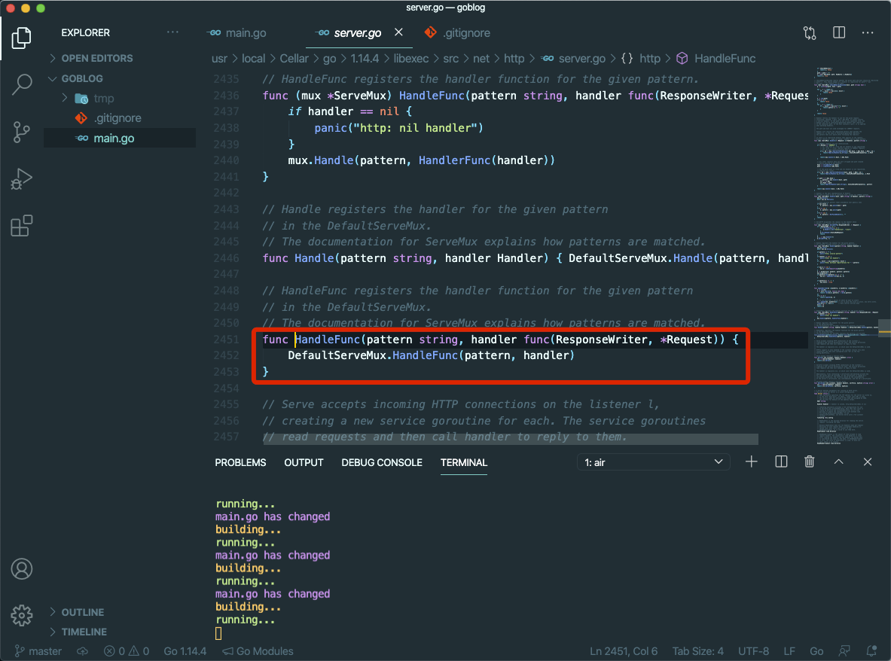
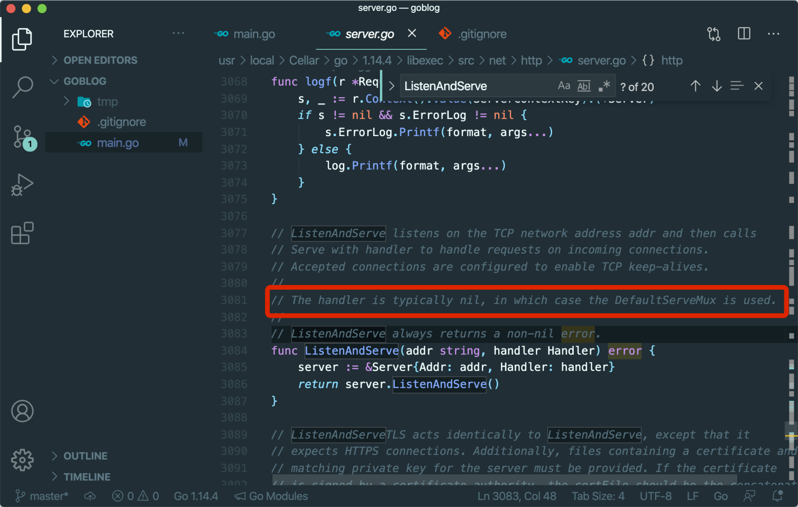

# 4.1. 路由 - http.ServeMux

原文链接：https://learnku.com/courses/go-basic/1.22/about-my-page/16484

## 说明

goblog 需要一款灵活的路由器来搭配 MVC 程序结构。Go Web 开发有各式各样的路由器可供选择，我们先来看下 Go 标准库 `net/http` 包里的 http.ServeMux。

## ServeMux 和 Handler

Go 语言中处理 HTTP 请求主要跟两个东西相关：ServeMux 和 Handler。

ServeMux 本质上是一个 HTTP 请求路由器（或者叫多路复用器，Multiplexor）。它把收到的请求与一组预先定义的 URL 路径列表做对比，然后在匹配到路径的时候调用关联的处理器（Handler）。

http 的 ServeMux 虽听起来陌生，事实上我们已经在使用它了。

## 重构：区分不同的 Handler

先来重构下我们的代码，修改如下：

main.go

```
package main

import (
"fmt"
"net/http"
)

func defaultHandler(w http.ResponseWriter, r *http.Request) {
w.Header().Set("Content-Type", "text/html; charset=utf-8")
if r.URL.Path == "/" {
fmt.Fprint(w, "<h1>Hello, 欢迎来到 goblog！</h1>")
} else {
w.WriteHeader(http.StatusNotFound)
fmt.Fprint(w, "<h1>请求页面未找到 :(</h1>"+
"<p>如有疑惑，请联系我们。</p>")
}
}

func aboutHandler(w http.ResponseWriter, r *http.Request) {
w.Header().Set("Content-Type", "text/html; charset=utf-8")
fmt.Fprint(w, "此博客是用以记录编程笔记，如您有反馈或建议，请联系 "+
"<a href=\"mailto:summer@example.com\">summer@example.com</a>")
}

func main() {
http.HandleFunc("/", defaultHandler)
http.HandleFunc("/about", aboutHandler)
http.ListenAndServe(":3000", nil)
}
```

浏览器访问以下三个链接，发现与之前一致：

- [localhost:3000/](http://localhost:3000/)

- [localhost:3000/about](http://localhost:3000/about)

- [localhost:3000/no-where](http://localhost:3000/no-where)

## 查看 http.HandleFunc 源码

在 VSCode 编辑器里，把鼠标放置在 main 方法中的 `http.HandleFunc` 上，并同时按住 Ctrl 键（不要松开），当出现下划线的时候，点击进去：



此时我们看到的代码，是 `net/http` 包的源码。显而易见，http 包也是由 Go 代码实现的。

仔细看下 HandleFunc 函数的定义：

```
func HandleFunc(pattern string, handler func(ResponseWriter, *Request)) {
DefaultServeMux.HandleFunc(pattern, handler)
}
```

参数：

- `pattern` 是 URI 的规则，例如 `/` 或者 `about`

- `handler` 是供调用的函数

`http.HandleFunc()` 函数是对 `DefaultServeMux.HandleFunc()` 的封装，而我们再用相同的方法查看 `http.ListenAndServe()` 的源码：



注释里有这么一段：

```
The handler is typically nil, in which case the DefaultServeMux is used.
```

handler 通常为 nil，此种情况下会使用 DefaultServeMux。

## 重构：使用自定义的 ServeMux

重构如下：

main.go

```
.
.
.

func main() {
router := http.NewServeMux()

router.HandleFunc("/", defaultHandler)
router.HandleFunc("/about", aboutHandler)

http.ListenAndServe(":3000", router)
}
```

浏览器访问以下三个链接，与之前一致：

- [localhost:3000/](http://localhost:3000/)

- [localhost:3000/about](http://localhost:3000/about)

- [localhost:3000/no-where](http://localhost:3000/no-where)

## http.ServeMux  的局限性

http.ServeMux 在 goblog 中使用，会遇到以下几个问题：

- 不支持 URI 路径参数

- 不支持请求方法过滤

- 不支持路由命名

URI 路径参数

例如说博客详情页，我们的 URI 是 `articles/1` 这样来查看 ID 为 1 的文章。http.ServeMux 也可以实现，新增一个路由作为示范：

main.go

```
.
.
.
func main() {
router := http.NewServeMux()

router.HandleFunc("/", defaultHandler)
router.HandleFunc("/about", aboutHandler)

// 文章详情
router.HandleFunc("/articles/", func(w http.ResponseWriter, r *http.Request) {
id := strings.SplitN(r.URL.Path, "/", 3)[2]
fmt.Fprint(w, "文章 ID："+id)
})

http.ListenAndServe(":3000", router)
}
```

不够直观，且徒增了代码的维护成本。

请求方法过滤

无法直接从路由上区分 POST 或者 GET  等 HTTP 请求方法，只能手动判断，例如：

main.go

```
.
.
.
func main() {
.
.
.

// 列表 or 创建
router.HandleFunc("/articles", func(w http.ResponseWriter, r *http.Request) {
switch r.Method {
case "GET":
fmt.Fprint(w, "访问文章列表")
case "POST":
fmt.Fprint(w, "创建新的文章")
}
})

http.ListenAndServe(":3000", router)
}
```

我们使用 CURL 来测试下：

```
$ curl http://localhost:3000/articles
访问文章列表%
$ curl -X POST http://localhost:3000/articles
创建新的文章%
```

可以实现，但是要多出来很多代码。

不支持路由命名

路由命名是一套允许我们快速修改页面里显示 URL 的机制。

例如说我们的文章详情页，URL 是

```
http://example.com/articles/{id}
```

项目随着时间的推移，变得非常巨大，在几十个页面里都存在这个 URI 。突然有个需求或者有其他不可控因素，要求我们修改链接为：

```
http://example.com/posts/{id}
```

那么我们只能到这个几十个页面里去修改。

使用路由命名的话，我们为 `articles/{id}` 这个路由命名为 `articles.show`，几十个页面在编码时，都使用这个路由名称而不是具体的 URI，遇到修改的需求时，我们只需在定义路由这一个地方修改即可。

目前 http.ServeMux 不支持此功能。

## http.ServeMux 的优缺点

如上所述，Go 开源社区里有诸多路由器可供选择，那么标准库的 http.ServeMux 对比这些路由器有什么优缺点呢？

优点

- 标准库意味着随着 Go 打包安装，无需另行安装

- 测试充分

- 稳定、兼容性强

- 简单，高效

缺点

- 缺少 Web 开发常见的特性

- 在复杂的项目中使用，需要你写更多的代码

开发效率和运行效率，永远是对立面。

Go 因为其诞生的背景（Google 的大流量），以及核心成员的出身（底层语言和系统的缔造者），Go 标准库选择 运行效率 高于 开发效率，所以对一些常见的功能并没有添加到标准库中，这是情有可原的。

然而在 goblog 中，我们将会有数据库等与第三方服务的请求操作，跟这类编码比起来，路由解析这点性能优化微不足道。所以在这个项目中，我们将在性能不会牺牲太大的情况下，选择 开发效率 多一点。

## 标准库里的就是最好的？

新手常常会认为标准库里的就是最好的。其实不然，标准库也是由 Go 语言编写的。

就拿 `net/http` 来讲，GitHub 上有一个项目专门对 [Go 中知名的 HTTP 路由器性能做对比](https://github.com/julienschmidt/go-http-routing-benchmark)，结果是第三方包 [HttpRouter](https://github.com/julienschmidt/httprouter) 比 http.ServeMux 还要快不少。

事实上，标准库最大的优点是 Go 自带。

所以不止在选择 HTTP 服务器，在选择其他解决方案时，都可以大胆的使用一些 Go 开源社区优秀的第三方包。

## 代码版本

开始下一节之前，我们先来为代码做下版本标记：

```
$ git add .
$ git commit -m "尝试 http.ServeMux"
```
