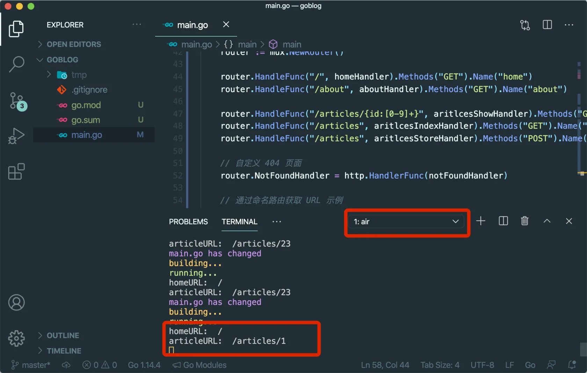

# 4.2. 集成 Gorilla Mux

原文链接：https://learnku.com/courses/go-basic/1.22/routing-gorilla-mux/16485

## 说明

我们将选用 [gorilla/mux](https://github.com/gorilla/mux) 来作为 goblog 的路由器。 本节我们将一起来看下如何集成到项目中。

## 为什么不选择 HttpRouter？

[HttpRouter](https://github.com/julienschmidt/httprouter) 是目前来讲速度最快的路由器，且被知名框架 [Gin](https://github.com/gin-gonic/gin) 所采用。

不选择 HttpRouter 的原因是其功能略显单一，没有路由命名功能，不符合我们的要求。

HttpRouter 和 Gin 比较适合在要求高性能，且路由功能要求相对简单的项目中，如 API 或微服务。在全栈的 Web 开发中，gorilla/mux 在性能上虽然有所不及，但是功能强大，比较实用。

## 安装 gorilla/mux

这是我们第一次安装第三方依赖，goblog 项目将使用官方推荐的 Go Module 来管理第三方依赖。

Go Modules 相关知识下一节再来讲。本节专注于安装和使用 gorilla/mux。

下面使用 `go get` 命令安装 gorilla/mux ：

```bash
$ go get -u github.com/gorilla/mux
```

安装成功后使用 `git status` 可以看到有两个文件变跟：

```bash
$ git status
```

输出：

```
On branch master
Changes not staged for commit:
(use "git add <file>..." to update what will be committed)
(use "git restore <file>..." to discard changes in working directory)
modified:   go.mod

Untracked files:
(use "git add <file>..." to include in what will be committed)
go.sum

no changes added to commit (use "git add" and/or "git commit -a")
```

>

提示： 下一节，我们再来讲解这两个文件的作用。

## 使用 gorilla/mux

gorilla/mux 因实现了 net/http 包的 `http.Handler` 接口，故兼容 http.ServeMux ，也就是说，我们可以直接修改一行代码，即可将 gorilla/mux 集成到我们的项目中：

main.go

```go
.
.
.
func main() {
    router := mux.NewRouter()
    .
    .
    .
}
```

>

注意： 修改以上代码后保存，因为安装了 [Go for Visual Studio Code](https://github.com/golang/vscode-go) 插件，VSCode 会自动在文件顶部的 `import` 导入 mux 库，我们无需手动添加。

依次以下链接：

1. [localhost:3000/](http://localhost:3000/)

2. [localhost:3000/about](http://localhost:3000/about)

3. [localhost:3000/articles](http://localhost:3000/articles)

4. [localhost:3000/no-exists](http://localhost:3000/no-exists)

5. [localhost:3000/articles/2](http://localhost:3000/articles/2)

6. [localhost:3000/articles/](http://localhost:3000/articles/)

可以发现：

- 1、2 和 3 可以正常访问。

- 4 无法访问到自定义的 404 页面

- 5 文章详情页无法访问

- 6 可以访问到文章页面，但是 ID 为空

这是因为 gorilla/mux 的路由解析采用的是 精准匹配 规则，而 net/http 包使用的是 长度优先匹配 规则。

-
精准匹配 指路由只会匹配准确指定的规则，这个比较好理解，也是较常见的匹配方式。

-
长度优先匹配 一般用在静态路由上（不支持动态元素如正则和URL路径参数），优先匹配字符数较多的规则。

以我们的 goblog 为例：

```
router.HandleFunc("/", defaultHandler)
router.HandleFunc("/about", aboutHandler)
```

使用 长度优先匹配 规则的 http.ServeMux 会把除了 `/about` 这个匹配的以外的所有 URI 都使用 `defaultHandler` 来处理。

而使用 精准匹配 的 gorilla/mux 会把以上两个规则精准匹配到两个链接，`/` 为首页，`/about` 为关于，除此之外都是 `404 未找到`。

知道这个规则后，配合上面几个测试链接的返回结果，会更好理解。

一般 长度优先匹配 规则用在静态内容处理上比较合适，动态内容，例如我们的 goblog 这种动态网站，使用  精准匹配 会比较方便。

## 迁移到 Gorilla Mux

基于以上规则，接下来改进代码：

main.go

```go
package main

import (
	"fmt"
	"net/http"

	"github.com/gorilla/mux"
)

func homeHandler(w http.ResponseWriter, r *http.Request) {
	w.Header().Set("Content-Type", "text/html; charset=utf-8")
	fmt.Fprint(w, "<h1>Hello, 欢迎来到 goblog！</h1>")
}

func aboutHandler(w http.ResponseWriter, r *http.Request) {
	w.Header().Set("Content-Type", "text/html; charset=utf-8")
	fmt.Fprint(w, "此博客是用以记录编程笔记，如您有反馈或建议，请联系 "+
		"<a href=\"mailto:summer@example.com\">summer@example.com</a>")
}

func notFoundHandler(w http.ResponseWriter, r *http.Request) {
	w.Header().Set("Content-Type", "text/html; charset=utf-8")
	w.WriteHeader(http.StatusNotFound)
	fmt.Fprint(w, "<h1>请求页面未找到 :(</h1><p>如有疑惑，请联系我们。</p>")
}

func articlesShowHandler(w http.ResponseWriter, r *http.Request) {
	vars := mux.Vars(r)
	id := vars["id"]
	fmt.Fprint(w, "文章 ID："+id)
}

func articlesIndexHandler(w http.ResponseWriter, r *http.Request) {
	fmt.Fprint(w, "访问文章列表")
}

func articlesStoreHandler(w http.ResponseWriter, r *http.Request) {
	fmt.Fprint(w, "创建新的文章")
}

func main() {
	router := mux.NewRouter()

	router.HandleFunc("/", homeHandler).Methods("GET").Name("home")
	router.HandleFunc("/about", aboutHandler).Methods("GET").Name("about")

	router.HandleFunc("/articles/{id:[0-9]+}", articlesShowHandler).Methods("GET").Name("articles.show")
	router.HandleFunc("/articles", articlesIndexHandler).Methods("GET").Name("articles.index")
	router.HandleFunc("/articles", articlesStoreHandler).Methods("POST").Name("articles.store")

	// 自定义 404 页面
	router.NotFoundHandler = http.HandlerFunc(notFoundHandler)

	// 通过命名路由获取 URL 示例
	homeURL, _ := router.Get("home").URL()
	fmt.Println("homeURL: ", homeURL)
	articleURL, _ := router.Get("articles.show").URL("id", "23")
	fmt.Println("articleURL: ", articleURL)

	http.ListenAndServe(":3000", router)
}
```

接下来我们一步步分解代码。

### 1. 新增 homeHandler

首先，因为使用的是精确匹配，我们将 `defaultHandler` 变更 `homeHandler` 且将处理 404 的代码移除。

### 2.  指定 Methods() 来区分请求方法

看下这两个路由：

```
router.HandleFunc("/articles", articlesIndexHandler).Methods("GET").Name("articles.index")
router.HandleFunc("/articles", articlesStoreHandler).Methods("POST").Name("articles.store")
```

命令行：

```bash
$ curl http://localhost:3000/articles
访问文章列表%
$ curl -X POST http://localhost:3000/articles
创建新的文章%
```

解析正确。

>

注意： 在 Gorilla Mux 中，如未指定请求方法，默认会匹配所有方法。

### 3. 请求路径参数和正则匹配

我们的文章详情页面的匹配：

```
router.HandleFunc("/articles/{id:[0-9]+}", articlesShowHandler).Methods("GET").Name("articles.show")
```

注意 ID 路径的设置：

```
{id:[0-9]+}
```

有以下规则：

- 使用 `{name}` 花括号来设置路径参数

- 在有正则匹配的情况下，使用 `:` 区分。第一部分是名称，第二部分是正则表达式

```
[0-9]+
```

限定了 一个或者多个的数字。如果你访问非数字的 ID ，如  [localhost:3000/articles/string](http://localhost:3000/articles/string) 即会看到 404 页面。

再看下在 Handler 里面我们如何获取到这个参数：

```go
func articlesShowHandler(w http.ResponseWriter, r *http.Request) {
	vars := mux.Vars(r)
	id := vars["id"]
	fmt.Fprint(w, "文章 ID："+id)
}
```

Mux 提供的方法 `mux.Vars(r)` 会将 URL 路径参数解析为键值对应的 Map，使用以下方法即可读取：

```
vars["id"]
```

### 4. 命名路由与链接生成

看下以下代码：

```
router.HandleFunc("/", homeHandler).Methods("GET").Name("home")
router.HandleFunc("/articles/{id:[0-9]+}", articlesShowHandler).Methods("GET").Name("articles.show")
```

`Name()` 方法用来给路由命名，传参是路由的名称，接下来我们就可以靠这个名称来获取到 URI：

```
homeURL, _ := router.Get("home").URL()
fmt.Println("homeURL: ", homeURL)
articleURL, _ := router.Get("articles.show").URL("id", "1")
fmt.Println("articleURL: ", articleURL)
```

命令行切到我们的 air 窗口，即可看到 `fmt.Println` 打印出来的内容：



## 代码版本

开始下一节之前，我们先来为代码做下版本标记：

```bash
$ git add .
$ git commit -m "集成 Gorilla Mux 路由"
```
