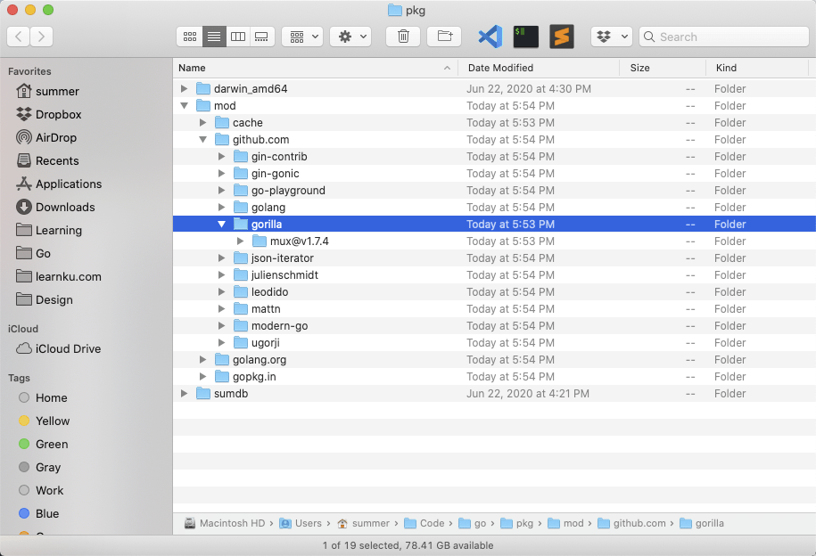

# 4.3. 依赖管理 Go Modules

原文链接：https://learnku.com/courses/go-basic/1.22/dependency-management-go-module/16486

## 说明

Go Modules  是 Go 语言的代码依赖管理工具。类似于 PHP 中的 Composer、Node.js 中的 npm 。

Go Modules 由官方维护。自 Go 版本 1.14 开始，官方鼓励所有用户迁移到 Go Modules 以进行依赖项管理。

## Go 依赖管理工具大统一

Go 1.11 之前，最令人诟病的问题是其缺少一个现代化、统一的、官方推荐的依赖管理工具。虽说开源社区自发创建了许多依赖工具，其中优秀的如 dep、glide 等。

然而，他们都有同一个问题——非官方推荐。开源社区出现无意义的分裂和消耗。

Go 1.11 推出的模块（Modules）无疑为 Go 语言开发者打开了一扇新的大门。

## 弃用 $GOPATH

Go Modules 出现的目的之一就是为了解决 GOPATH 的问题。

在 $GOPATH 时代，Go 源码必须放置于 `$GOPATH/src` 下，抛弃 $GOPATH 的好处，是你能在任意地方创建的 Go 项目。

另外，$GOPATH 有非常落后的依赖管理系统。因在执行`go get`时，无法传达任何版本信息。

在构建 Go 应用程序上，我们无法保证其它人与你所期望依赖的第三方库是相同的版本（相同的代码），也就是说无法保证所有人的依赖版本都一致。

## Go Modules 日常使用

### 1. 初始化

新项目，我们可以使用`go mod init` 初始化生成 `go.mod` 文件，这个我们在之前章节已做了，无需再次执行：

```
$ go mod init
```

### 2. Go Proxy

因国内访问外网受限，一般我们都会配合 Go Proxy 使用，以防止使用 `go get` 获取源码包时花费时间过长或无法下载：

```
$ go env -w  GOPROXY=https://goproxy.cn,direct
```

>

知识点： 我们使用 `go env -w` 来修改 Go 相关的环境变量。

Go Proxy 设置完成后即可放心使用 `go get` 来下载依赖了，作为测试，我们下载 HttpRouter ：

```
$ go get github.com/julienschmidt/httprouter
```

使用 Proxy 的情况下一般很快就能下载完成。

安装 package 的原则是先拉最新的 release tag，若无 tag 则拉最新的 commit。

### 3. go.mod

每一次的 `go get` 都会同时修改 `go.mod` 和 `go.sum` 文件。

这两个文件是下载依赖包的主要依据。`go.mod`类似于 PHP 中的 composer.json ，而 go.sum 则是 composer.lock。

打开查看 `go.mod` 的源码：

go.mod

```
module goblog

go 1.19

require (
github.com/gorilla/mux v1.8.0 // indirect
github.com/julienschmidt/httprouter v1.3.0 // indirect
)
```

几个参数：

- module —— 我们的 goblog 在 Go Module 里也算是一个 Module ；

- go —— 指定了版本要求，最低 1.19

- require —— 是项目所需依赖

### 4. go.sum

`go.sum` 文件保存着依赖包的版本和哈希值：

go.sum

```
github.com/gorilla/mux v1.8.0 h1:i40aqfkR1h2SlN9hojwV5ZA91wcXFOvkdNIeFDP5koI=
github.com/gorilla/mux v1.8.0/go.mod h1:DVbg23sWSpFRCP0SfiEN6jmj59UnW/n46BH5rLB71So=
github.com/julienschmidt/httprouter v1.3.0 h1:U0609e9tgbseu3rBINet9P48AI/D3oJs4dN7jwJOQ1U=
github.com/julienschmidt/httprouter v1.3.0/go.mod h1:JR6WtHb+2LUe8TCKY3cZOxFyyO8IZAc4RVcycCCAKdM=
```

需要注意的是，`go.sum` 里不止会保存直接依赖包的哈希值，间接依赖包的哈希值也会被保存。

什么是间接依赖包？

间接依赖包就是依赖包的依赖，以及他们的依赖… 我们目前下载的两个包 `mux` 和 `httprouter`，没有间接依赖，接下来我们拉取知名的 gin 框架来试试：

```
$ go get github.com/gin-gonic/gin
```

下载成功后打开 `go.sum` ，会发现里面的内容远远多于 `go.mod`。这是因为 gin 有很多依赖包，而这些依赖包也会有自己的依赖。

接下来我们仔细看下，每个模块路径有如下两种哈希：

```
github.com/gorilla/mux v1.8.0 h1:i40aqfkR1h2SlN9hojwV5ZA91wcXFOvkdNIeFDP5koI=
github.com/gorilla/mux v1.8.0/go.mod h1:DVbg23sWSpFRCP0SfiEN6jmj59UnW/n46BH5rLB71So=
```

前者为 Go Modules 打包整个模块包文件 zip 后再进行 hash 值，而后者为针对 go.mod 的 hash 值。

由此可见，go.sum 是保证所下载源码 100% 正确的重要依据。如果有恶意用户，将某个 Git 项目的 tag 源码做了修改，这些哈希值将会不匹配并报错。

因为 go.sum 有 100% 保证 build 一致的作用，我们建议开发中将其加入到代码版本控制器中。这里面不止有安全的因素，当同事或者其他人 clone 你的代码，我们也希望代码可以保持一致。

### 5. indirect

回到我们的 `go.mod` 中，可以看到 `require` 区块里有 `// indirect` 字样：

```
.
.
.
require (
github.com/gin-contrib/sse v0.1.0 // indirect
github.com/gin-gonic/gin v1.8.1 // indirect
github.com/go-playground/locales v0.14.0 // indirect
github.com/go-playground/universal-translator v0.18.0 // indirect
github.com/go-playground/validator/v10 v10.10.0 // indirect
github.com/goccy/go-json v0.9.7 // indirect
github.com/gorilla/mux v1.8.0 // indirect
github.com/json-iterator/go v1.1.12 // indirect
github.com/julienschmidt/httprouter v1.3.0 // indirect
github.com/leodido/go-urn v1.2.1 // indirect
github.com/mattn/go-isatty v0.0.14 // indirect
github.com/modern-go/concurrent v0.0.0-20180228061459-e0a39a4cb421 // indirect
github.com/modern-go/reflect2 v1.0.2 // indirect
github.com/pelletier/go-toml/v2 v2.0.1 // indirect
github.com/ugorji/go/codec v1.2.7 // indirect
golang.org/x/crypto v0.0.0-20210711020723-a769d52b0f97 // indirect
golang.org/x/net v0.0.0-20210226172049-e18ecbb05110 // indirect
golang.org/x/sys v0.0.0-20210806184541-e5e7981a1069 // indirect
golang.org/x/text v0.3.6 // indirect
google.golang.org/protobuf v1.28.0 // indirect
gopkg.in/yaml.v2 v2.4.0 // indirect
)
```

此标志标明这个依赖包还未被使用，如果你在代码的某个地方 `import` 到的话，VSCode 的 Go 插件就会自动将这个标志去除。

### 6. go mod tidy 命令

此命令做整理依赖使用，执行时会把未使用的 module 移除掉，我们试试：

```
$ go mod tidy
```

再次查看 `go.mod` 和 `go.sum` 文件，会发现我们上面测试引入的两个包，包括一大堆的依赖，因未使用，皆被移除。

### 7. 源码包的存放位置

默认源码包存放于 `$GOPATH/pkg/mod` 中，你可以打开看下。我的如下：



### 8. 清空 Go Modules 缓存

使用以下命令可以清空本地下载的 Go Modules 缓存：

```
$ go clean -modcache
```

### 9. 下载依赖

默认情况下，当 `go run` 和 `go build` 命令执行时，Go 会基于 `go.mod` 文件自动拉取依赖。

Go Module 也提供了一个命令用以下载项目所需依赖：

```
$ go mod download
```

### 10. 所有 Go Modules 命令

以下是完整的命令列表，有些不常用的篇幅原因我们不做讲解：

| 命令
| 作用

| go mod init
| 生成 go.mod 文件

| go mod download
| 下载 go.mod 文件中指明的所有依赖

| go mod tidy
| 整理现有的依赖

| go mod graph
| 查看现有的依赖结构

| go mod edit
| 编辑 go.mod 文件

| go mod vendor
| 导出项目所有的依赖到vendor目录

| go mod verify
| 校验一个模块是否被篡改过

| go mod why
| 查看为什么需要依赖某模块

### 11. 相关环境变量

#### 1). GO111MODULE

此变量为 Go modules 的开关，此值有以下几个可能：

- auto：项目包含了 go.mod 文件的话启用 Go modules，目前在 Go1.11 至 Go1.15 中仍然是默认值。

- on：启用 Go modules，推荐设置，将会是未来版本中的默认值。

- off：禁用 Go modules，不推荐设置。

因是在 Go1.11 版本添加，故命名为 GO111MODULE。

未来 GO111MODULE 会先调整为默认值为 on（曾经在 Go1.13 想改为 on，并且已经合并了 PR，但最后因为种种原因改回了 auto），然后再把 GO111MODULE 这个变量去掉，目前猜测会在 Go 2。太早去掉 GO111MODULE 的支持，会存在兼容性问题。

#### 2). GOPROXY

此变量用于设置 Go 模块代理（Go module proxy），其作用是拉取源码时能够脱离传统的 VCS 方式，直接通过镜像站点来快速拉取。

镜像的好处多多，一个是防止某个版本的代码被有意或无意删除。第二是能将源码压为 zip 包，方便传输。最重要的——可以做镜像加速站点，这在例如国内这种不稳定的网络环境下尤为重要。

GOPROXY 的默认值是：

```
https://proxy.golang.org,direct
```

然而 `proxy.golang.org` 在国内是无法访问的，所以我们使用 Go modules 时，需设置国内的 Go 模块代理：

```
$ go env -w GOPROXY=https://goproxy.cn,direct
```

>

信息： goproxy.cn 是一个由 CDN 提供商七牛云支持的非营利性项目。七牛云也是中国最早在生产环境中使用 Go 的公司之一，项目介绍请见：[github.com/goproxy/goproxy.cn/blob...](https://github.com/goproxy/goproxy.cn/blob/master/README.zh-CN.md) 。

GOPROXY的值是一个以英文逗号 `,` 分割的 Go 模块代理列表，可设置多个模块代理。将其设置为 `off` ，将会禁止 Go 在后续操作中使用任何 Go 模块代理。

direct 标志

`direct` 标志意味着从源地址抓取（比如 GitHub 等）。

如我们设置 GOPROXY 的值为：

```
https://goproxy.cn,direct
```

则告诉 `go get` 在获取源码包时先尝试 `https://goproxy.cn`，如果遇到 404 等错误时，再尝试从源地址抓取。

#### 3). GOSUMDB

此值是 Go Checksum Database 的缩写，用于在拉取模块版本时（无论是从源站拉取还是通过 Go Module Proxy 拉取）保证拉取到的模块代码包未经过篡改，若发现不一致将会立即中止。

GOSUMDB 的默认值为：

```
sum.golang.org
```

在国内同样无法访问，所幸 GOSUMDB 可以被 Go Module Proxy 代理。我们所设置的模块代理 `goproxy.cn` 支持代理 `sum.golang.org`。

另外，此变量还可设置为 `off`，会禁止 Go 在后续操作中校验模块哈希。

#### 4). GONOPROXY/GONOSUMDB/GOPRIVATE

这三个环境变量都是用在依赖了私有模块，这些模块 GOPROXY 和 GOSUMDB  都无法读取。

- GONOPROXY —— 设置不走 Go Proxy 的 URL 规则；

- GONOSUMDB —— 设置不检查哈希的 URL 规则；

- GOPRIVATE —— 设置私有模块的 URL 规则，会同时设置以上两个变量。

因为 GOPRIVATE 会同时设定以上两个，所以一般私有仓库使用 GOPRIVATE 即可。

以上三个值，都可使用逗号分隔来设置多个选项。例如：

```
$ go env -w GOPRIVATE="git.example.com,github.com/name/project"

```

设置后当 `go get` 时，前缀为 `git.example.com` 和 `github.com/name/project` 的模块都会被认为是私有模块。

我们也可以利用通配符，例如：

```
$ go env -w GOPRIVATE="*.example.com"

```

这样子设置的话，所有模块路径为 example.com 的子域名（例如：git.example.com）都将不经过 Go module proxy 和 Go checksum database，需要注意的是不包括 example.com 本身。

## 小结

以上我们学习了 Go Modules 的规则，规则较多信息量比较大，如果你记不住，没关系。这里你只需过一遍，混个脸熟，后面遇到问题可以来这里查阅即可。

## 版本控制

如果你跟着上面的内容进行操作，此时你无需做什么。如果 `git status` 发现有修改的内容，这些内容都是我们测试的，无需提交到版本控制器中，可以使用以下方法进行放弃：

```
$ git checkout .
```

此命令检出版本库最新的代码，并放弃本地修改。
