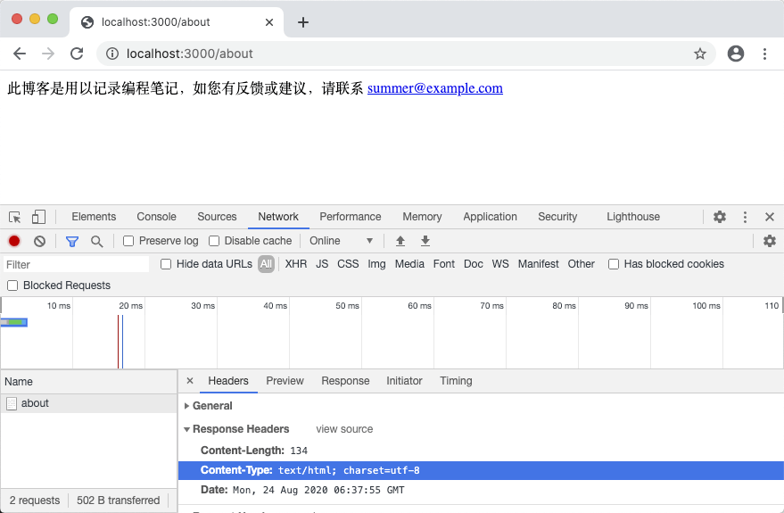

# 4.4. 使用中间件

原文链接：https://learnku.com/courses/go-basic/1.22/using-middleware/16487

## 说明

本节我们来讨论现代 Web 开发常见的解决方案：中间件。

## 中间件

目前为止，我们的代码中有一段重复性很高的代码：

```
w.Header().Set("Content-Type", "text/html; charset=utf-8")
```

这是设置内容类型的标头，以便浏览器能正常解析页面。

基本上我们每一个页面都会用到这段代码。后面会有静态内容，像图片、CSS 和 JS 文件，`Content-Type` 有不一致的，到时候我们再行处理，目前我们先默认所有页面都需要。

一般像这种要统一对响应做处理的，我们可以使用中间件来做。

## 使用中间件

main.go

```
package main

import (
"fmt"
"net/http"

"github.com/gorilla/mux"
)

func homeHandler(w http.ResponseWriter, r *http.Request) {
fmt.Fprint(w, "<h1>Hello, 欢迎来到 goblog！</h1>")
}

func aboutHandler(w http.ResponseWriter, r *http.Request) {
fmt.Fprint(w, "此博客是用以记录编程笔记，如您有反馈或建议，请联系 "+
"<a href=\"mailto:summer@example.com\">summer@example.com</a>")
}

func notFoundHandler(w http.ResponseWriter, r *http.Request) {

w.WriteHeader(http.StatusNotFound)
fmt.Fprint(w, "<h1>请求页面未找到 :(</h1><p>如有疑惑，请联系我们。</p>")
}

func articlesShowHandler(w http.ResponseWriter, r *http.Request) {
vars := mux.Vars(r)
id := vars["id"]
fmt.Fprint(w, "文章 ID："+id)
}

func articlesIndexHandler(w http.ResponseWriter, r *http.Request) {
fmt.Fprint(w, "访问文章列表")
}

func articlesStoreHandler(w http.ResponseWriter, r *http.Request) {
fmt.Fprint(w, "创建新的文章")
}

func forceHTMLMiddleware(next http.Handler) http.Handler {
return http.HandlerFunc(func(w http.ResponseWriter, r *http.Request) {
// 1. 设置标头
w.Header().Set("Content-Type", "text/html; charset=utf-8")
// 2. 继续处理请求
next.ServeHTTP(w, r)
})
}

func main() {
router := mux.NewRouter()

router.HandleFunc("/", homeHandler).Methods("GET").Name("home")
router.HandleFunc("/about", aboutHandler).Methods("GET").Name("about")

router.HandleFunc("/articles/{id:[0-9]+}", articlesShowHandler).Methods("GET").Name("articles.show")
router.HandleFunc("/articles", articlesIndexHandler).Methods("GET").Name("articles.index")
router.HandleFunc("/articles", articlesStoreHandler).Methods("POST").Name("articles.store")

// 自定义 404 页面
router.NotFoundHandler = http.HandlerFunc(notFoundHandler)

// 中间件：强制内容类型为 HTML
router.Use(forceHTMLMiddleware)

// 通过命名路由获取 URL 示例
homeURL, _ := router.Get("home").URL()
fmt.Println("homeURL: ", homeURL)
articleURL, _ := router.Get("articles.show").URL("id", "1")
fmt.Println("articleURL: ", articleURL)

http.ListenAndServe(":3000", router)
}
```

可以看到我们新增了 `forceHTMLMiddleware` 中间件方法：

```
func forceHTMLMiddleware(h http.Handler) http.Handler {
return http.HandlerFunc(func(w http.ResponseWriter, r *http.Request) {
// 1. 设置标头
w.Header().Set("Content-Type", "text/html; charset=utf-8")
// 2. 继续处理请求
h.ServeHTTP(w, r)
})
}
```

然后使用 Gorilla Mux 的 `mux.Use()` 方法来加载中间件：

```
router.Use(forceHTMLMiddleware)
```

## 测试一下

浏览器打开 [localhost:3000/about](http://localhost:3000/about) ，或者其他存在的页面，查看标头：



## 代码版本

开始下一节之前，我们先来为代码做下版本标记：

```
$ git add .
$ git commit -m "使用中间件"
```
