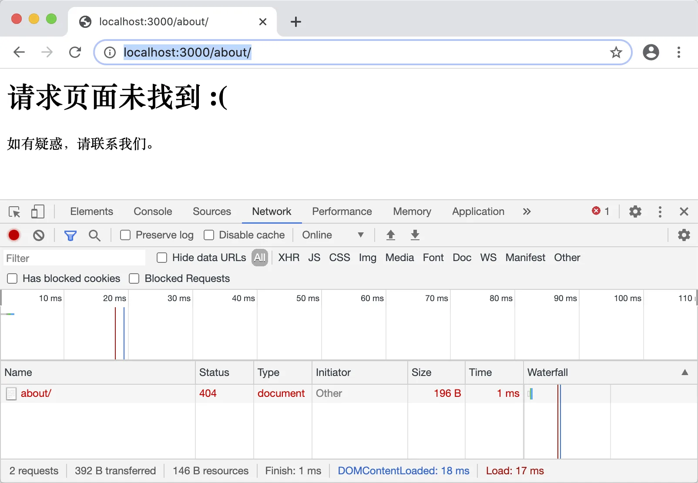
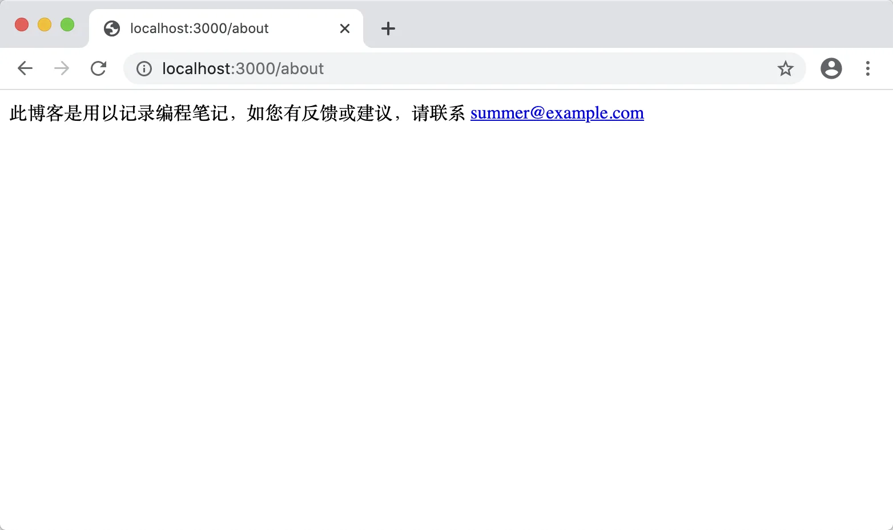
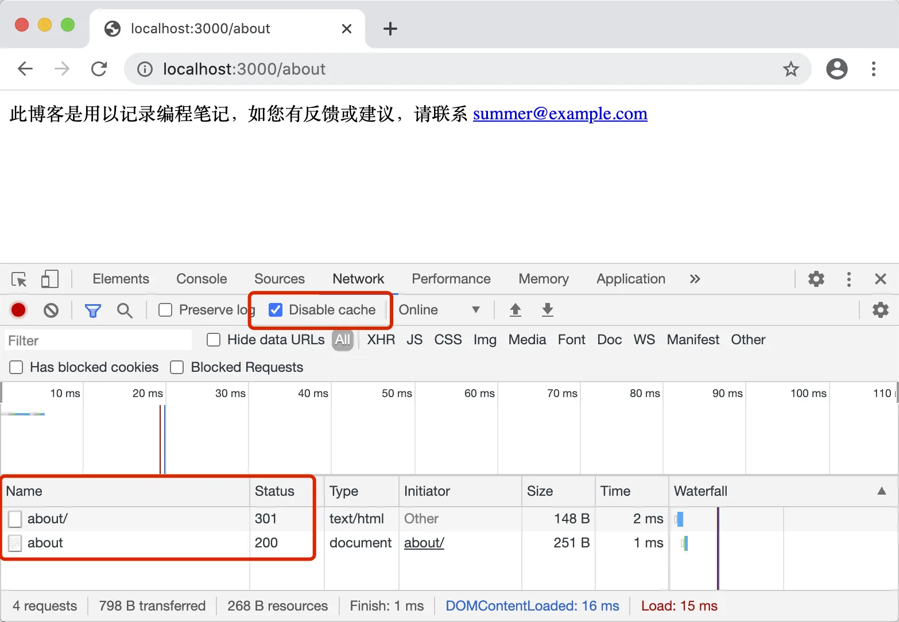
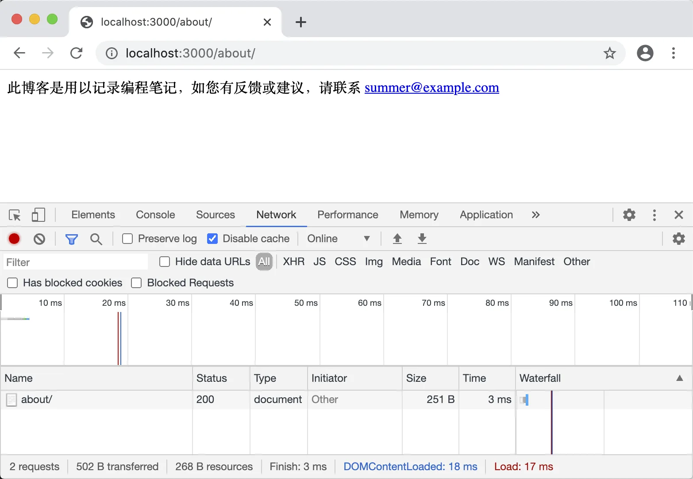
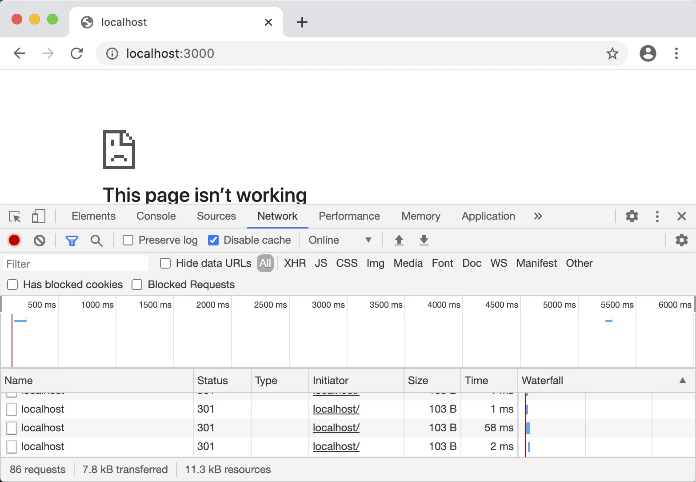
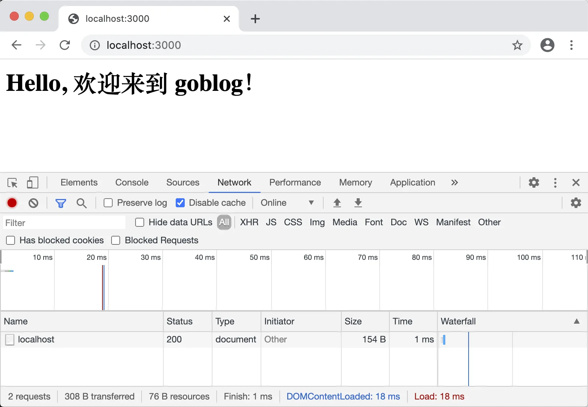

# 4.5. URI 中的斜杆

原文链接：https://learnku.com/courses/go-basic/1.22/slant-bar-in-uri/16488

## 说明

本小节我们将解决程序里 URL 的斜杆问题。

访问以下两个链接：

- [localhost:3000/about](http://localhost:3000/about)

- [localhost:3000/about/](http://localhost:3000/about/)

可以看到有 `/` 的链接会报 404 错误：



就如：

- [learnku.com/go](https://learnku.com/go)

- [learnku.com/go/](https://learnku.com/go/)

我们希望 URL 后面是否加斜杆的情况下，皆使用同一个返回结果。

## StrictSlash

对于这个问题 Gorilla Mux 提供了一个 `StrictSlash(value bool)` 函数，我们先来试试：

在 `main` 函数中，请将以下这一行：

```
router := mux.NewRouter()
```

修改为：

```
router := mux.NewRouter().StrictSlash(true)
```

浏览器再次访问 [localhost:3000/about/](http://localhost:3000/about/) ：



可以看到 URL 被校正了，跳转速度太快，我们再次试试看。

我们打开 Chrome 的控制台，查看请求，注意把 `Disable cache` 打钩：



可以看到当请求  `about/` 时产生了两个请求，第一个是 301 跳转，第二个是跳转到的 `about` 去掉斜杆的链接。

浏览器在处理 301 请求时，会缓存起来。后续的 `about/` 浏览器都会自动去请求 `about` 链接，也就是说两次请求只会在第一次的时候发生。

这个解决方案看起来不错，然而有一个严重的问题 —— 当请求方式为 POST 的时候，遇到服务端的 `301` 跳转，将会变成 GET 方式。很明显，这并非所愿，我们需要一个更好的方案。

## 兼容 POST 请求

首先还原我们上面的修改：

```
$ git checkout .
```

我们需要在 URL 进入 Gorilla Mux 路由解析之前，就将后面的 `/` 去掉。

像这种针对所有请求的操作，你第一时间想到的可能是用中间件处理，然而因为执行顺序的问题，Gorilla Mux 会先匹配路由，再执行中间件，故使用中间件永远会返回 404.

解决方法很简单，那就是写一个函数把 Gorilla Mux 包起来，在这个函数中我们先对进来的请求做处理，然后再传给 Gorilla Mux 去解析。

接下来新增 `removeTrailingSlash()` 函数并调用：

main.go

```
.
.
.
func removeTrailingSlash(next http.Handler) http.Handler {
return http.HandlerFunc(func(w http.ResponseWriter, r *http.Request) {
r.URL.Path = strings.TrimSuffix(r.URL.Path, "/")
next.ServeHTTP(w, r)
})
}

func main() {
.
.
.

http.ListenAndServe(":3000",  removeTrailingSlash(router))
}
```

我们使用 strings 包提供的 `TrimSuffix(s, suffix string) string` 函数来移除 `/` 后缀，如果不带斜杆后缀的话，`r.URL.Path` 将会被原封不动地返回。

>

知识点： Go 标准库中的 strings 包提供了用于操作字符串，比如分割、合并、去除、替换等等常用的方法。

修改保持后，再次访问 [localhost:3000/about/](http://localhost:3000/about/) ：



问题解决。

偶然间，我们又发现了另一个问题，访问主页 [localhost:3000/](http://localhost:3000/) 会出现错误：



那是因为我们的 `removeTrailingSlash` 中这一段：

```
r.URL.Path = strings.TrimSuffix(r.URL.Path, "/")
```

会将我们的首页 URL `/` 给去除了，解决方法是把 `/` 路径排除在外：

main.go

```
func removeTrailingSlash(next http.Handler) http.Handler {
return http.HandlerFunc(func(w http.ResponseWriter, r *http.Request) {
// 1. 除首页以外，移除所有请求路径后面的斜杆
if r.URL.Path != "/" {
r.URL.Path = strings.TrimSuffix(r.URL.Path, "/")
}

// 2. 将请求传递下去
next.ServeHTTP(w, r)
})
}
```

保存修改后，再次访问 [localhost:3000/](http://localhost:3000/) ，可见正常的结果：



## 代码版本

开始下一节之前，我们先来为代码做下版本标记：

```
$ git add .
$ git commit -m "移除 URL 路径中的斜杠"
```
