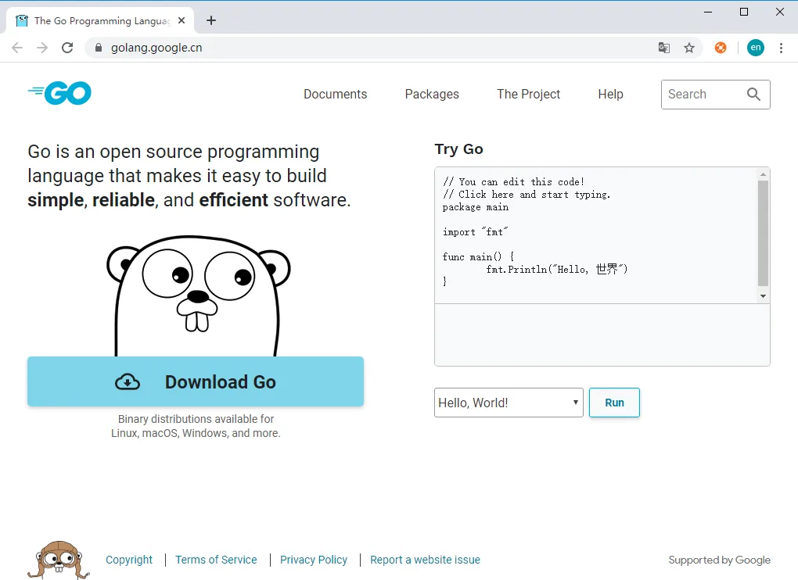
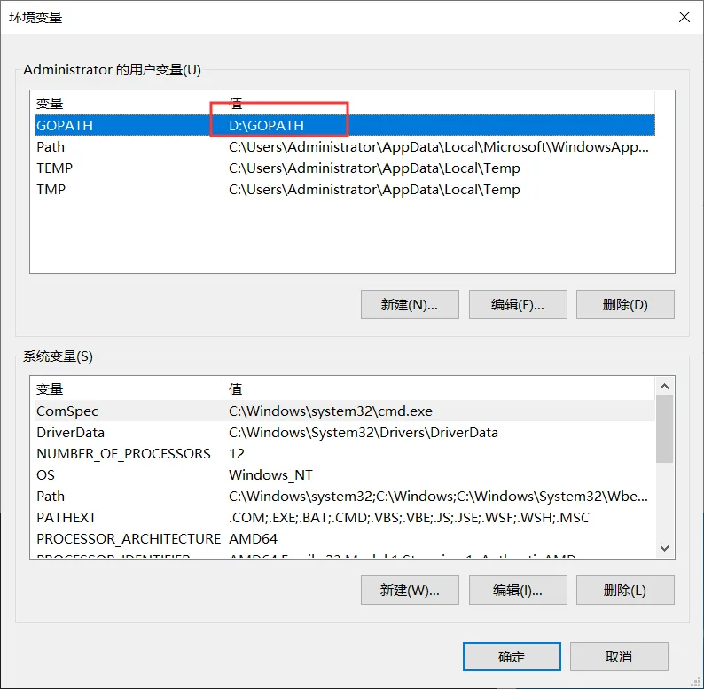
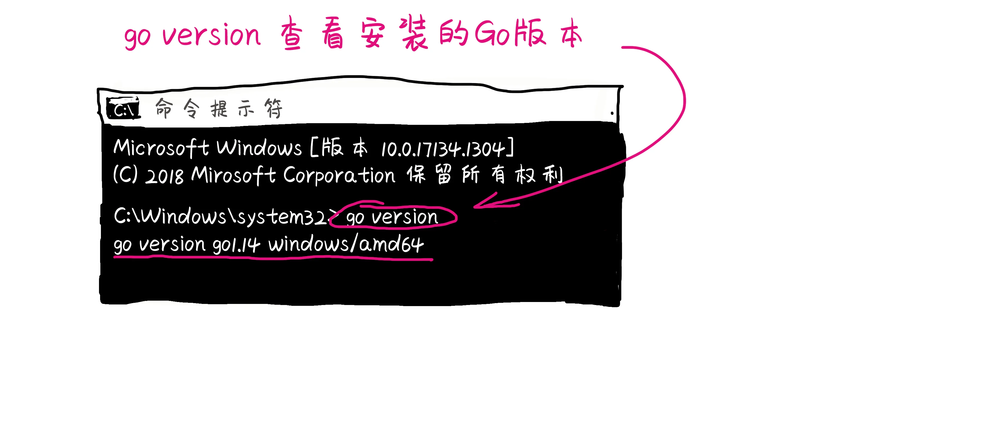
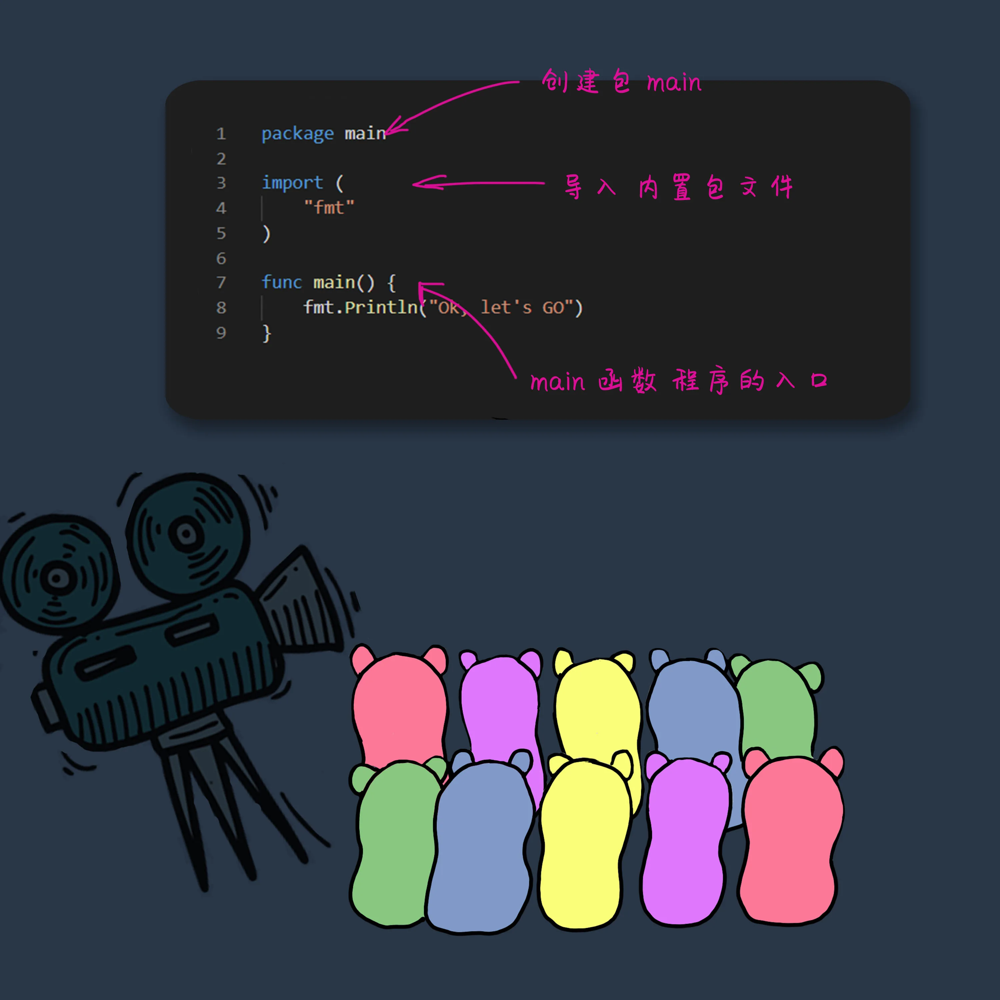

# 老司机带带我--上车 Go Go Go

原文链接：https://juejin.cn/book/6844733833401597966/section/6844733833426763783

# 上车 Go Go Go


你是否在哪里听说过Go语言，它非常受欢迎，你是否觉得长篇幅的文字，对于自学Go语言的你来说有些枯燥？于是我们使用漫画加文字的形式，带领大家开辟一方天地，让你更容易走入Go语言的世界。Go语言的开发者之一 Rob Pike 他的妻子设计了Go的吉祥物一个非常可爱的土拨鼠形象。我们将围绕Go的吉祥物形象为你讲解Go语言。


## 是谁创造了Go语言

Ken Thompson C语言Unix和Plan9的创始人之一，20世纪70年代 设计并实现了Unix操作系统，还和Rob Pike 设计了UTF-8编码。

Rob Pike 不但设计了UTF-8编码，还开发了分布式多用户操作系统Plan9 Inferno操作系统和Limbo编程语言。

Robert Griesemer 就职于Google，负责Chrome浏览器中Google V8引擎的代码。

他们于2007年开始设计Go语言，于2009年正式对外发布。Go语言即具备python等动态语言的开发速度，又拥有C/C++等编译型语言的性能与安全性。又被称作21世纪的C语言，不但能够访问底层操作系统还提供了强大的网络编程和并发编程，分布式编程。


# 为什么要创建Go语言

快速 天下武功唯快不破，选择一门快速的语言例如C语言，却难以开发，编译速度依赖性运行时错误都非常多，要么有些语言依赖关系太多，最重要的一个就是解释器本身，例如java语言需要虚拟机才能运行代码，javascript和node.js 维护起来就是噩梦了。 尤其是遇到回调。Go语言一开始设计就考虑到快速编译。他能像其他解释型语言一样，你不会注意他正在编译。


安全 作为强类型静态语言，并自带垃圾回收机制所以也具有安全性。因为Go的语言设计拥有像C语言那样操作指针，但是他通常不会像C语言那样危险，因为他内存是由Go自身进行管理的。


代码简洁 Go语言不仅在编译上快速，代码的简洁明了，易于阅读。


已编译 不需要虚拟机支持，可直接编译成机器代码。编译后的文件也不需要依赖其他包文件。

跨平台 Go语言拥有的交叉编译，可以轻松编译到指定的平台上运行：例如OS X ,Linux,Windows，Arm 或者其他平台。

垃圾回收 自带垃圾回收机制。


内置包 Go语言拥有几乎所有你能用到的标准库。例如http网络协议包，json解析包，time时间包等等。这种碎片化的东西在一个系统中占用大部分时间。


工具 Go语言出色的内置命令工具,自动设置代码格式，检查代码存在的问题，go fmt 命令每次保存后自动格式化代码。

并发 并发在Go语言中属于一大亮点，并发的最小单元是协程，是一个微线程却有别于线程。协程由Go语言自身创建，并且由Go语言自身的运行时runtime调度。在其它语言中需要通过线程来解决的问题。一台电脑能够开启的线程数量是有限制的。在Go语言中可以很轻松开启一个协程来处理，因为协程很微型，不会占用电脑资源。一台电脑可以轻松开启成千上万个协程，在这个大数据的时代，能够处理大流量的数据能力的语言，并且能够简单快速开发的语言，非Go语言莫属了。


# 哪些公司都在使用Go语言

Go社区中至少有100万名Go程序员。越来越多的公司都拥抱Go语言，最著名的使用Go语言的公司Google，Docker,Dropbox,Heroku,Uber等。国内的比如滴滴，腾讯，阿里，京东商城，爱奇艺，小米，360，美团，驴妈妈旅游网，斗鱼直播，探探 等等 都在使用Go语言。包括哔哩哔哩的后台也从java转向了Go 可见Go语言的受欢迎程度。


# 配置Go语言开发环境

在go的官方网址上下载go最新版本[https://golang.google.cn/](https://golang.google.cn/)。或者 Go 的中文网上下载 [https://studygolang.com/dl](https://studygolang.com/dl)



## windows环境配置

下载windos环境下的安装文件后缀名为.msi 的文件,安装完成默认环境变量配置好了，工作目录会默认安装到用户变量里，GOPATH C:\Users\Administrator\go\ 文件下。可以手动修改GOPATH指定目录，例如D:\GOPATH 文件夹。


使用Go命令 go version 查看是否看装成功。



## Linux 环境配置

下载linux环境的安装包 后缀名为.tar.gz
使用命令将压缩文件解压到指定目录
`sudo tar -xzf go1.13.4.linux-amd64.tar.gz -C /usr/local `

```
vim .bashrc
export GOROOT=/usr/local/go        # 安装目录。
export GOPATH=$HOME/go             # 工作环境
export GOBIN=$GOPATH/bin           # 可执行文件存放
export PATH=$GOPATH:$GOBIN:$GOROOT/bin:$PATH       # 添加PATH路径

```

添加环境变量到 .profile 这个配置文件中
`export GOROOT="/usr/local/go"`

## Go各种目录都是做什么的

GOROOT  go的安装目录。
GOPATH  就是我们自己以后开发的代码所存储的目录，GOPATH下有三个目录 。

- src  存储go的源代码（需要我们自己手动创建）。

- pkg 存储编译后生成的包文件 （自动生成）。

- bin存储生成的可执行文件（自动生成）。


手动在Home目录下创建go文件夹，作为 GO 的工作空间。`export GOPATH=$HOME/go`

```
# 我们需要将GOBIN添加到PATH环境变量中
export GOBIN=$GOROOT/bin
export PATH=$PATH:$GOBIN

# 上两步也可以写在一起
export PATH=$GOROOT/bin:$PATH

```

使用命令

```
cd ~            # 到主目录
ls -a           # 显示所有文件
vi .profile     # 打开.profile文件
输入i           # 进入编辑模式
点击esc键       # 结束编辑模式
输入 :wq        # 保存并退出
source .profile # 使文件生效

```

最终的.profile配置文件中的代码

```
export GOROOT="/usr/local/go"
export GOPATH=$HOME/go
export PATH=$GOROOT/bin:$PATH

```

环境变量配置完成后，可以通过 `go version` 查看go版本。  ` go env` 查看环境变量设置。

# 创建第一个Go程序



### 仅需几行代码就能创建一个Go程序

`package 创建包` Go语言以包作为管理单位，每一个源文件都必须先声明它的所属包，所以每个Go的源文件都会以一个 package 声明一个包名称。  package main 就是声明了一个main包。

`import 导入包` 在包声明之后使用import 导入到需要的地方，`import fmt`导入了一个Go语言内置提供的fmt包 。 如果需要导入多个包，就在括号内加入多个包的名称，每一行代表一个包。

```go
import (
"fmt"
"time"
)

```

`main 函数`  它是Go语言的入口，程序在启动时候第一个执行的函数。main函数只能声明在main包中。fmt.Println("ok,let's Go") 表示打印输出。使用fmt包下的Println函数在控制台打印输出并换行，fmt包还有其他函数Printf按照格式打印等等。
