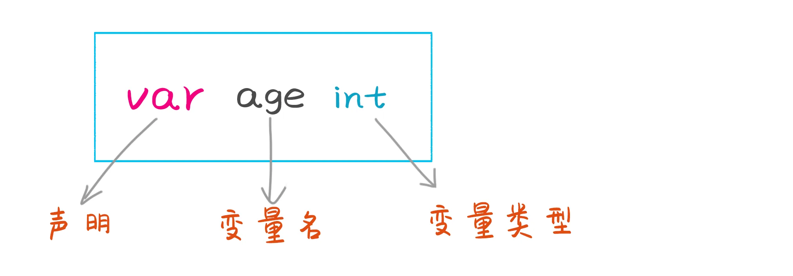
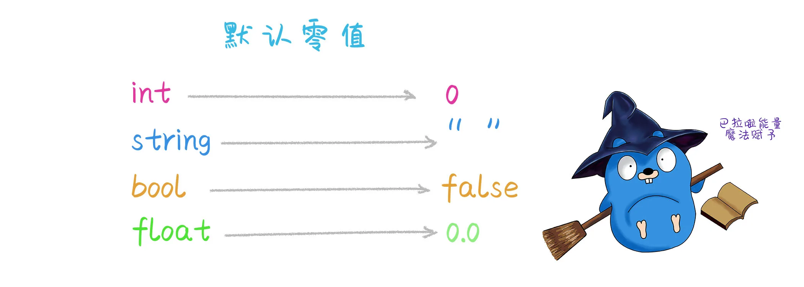
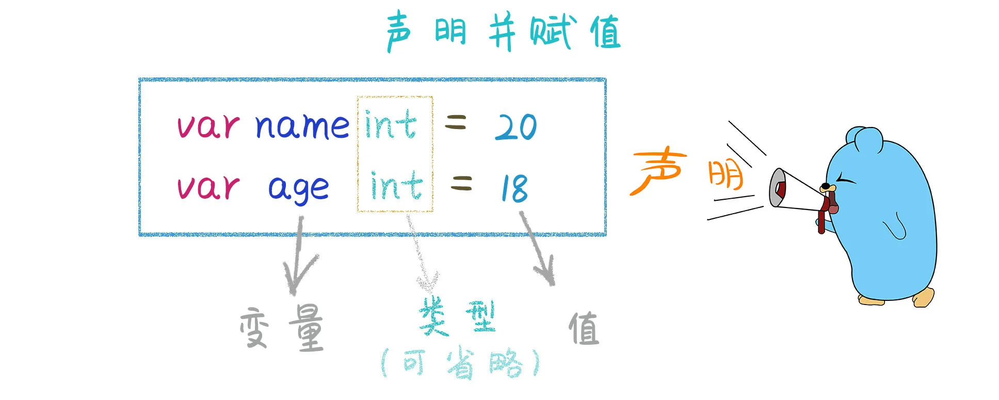
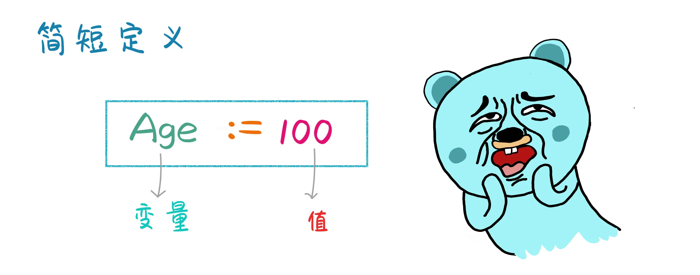
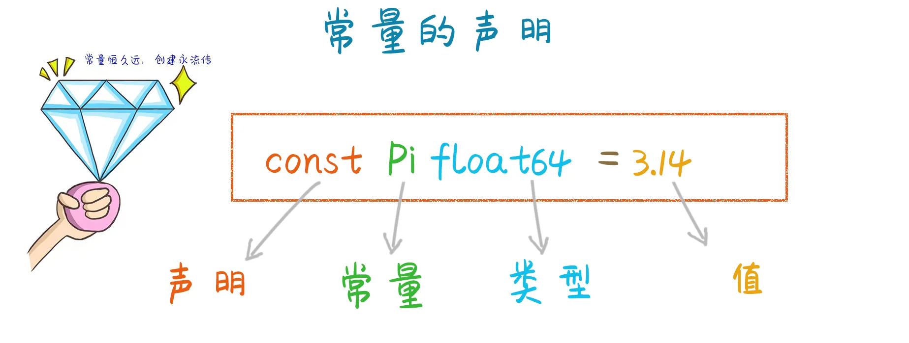
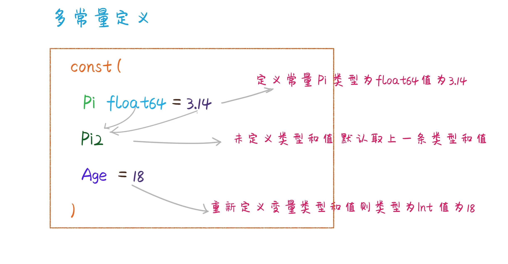
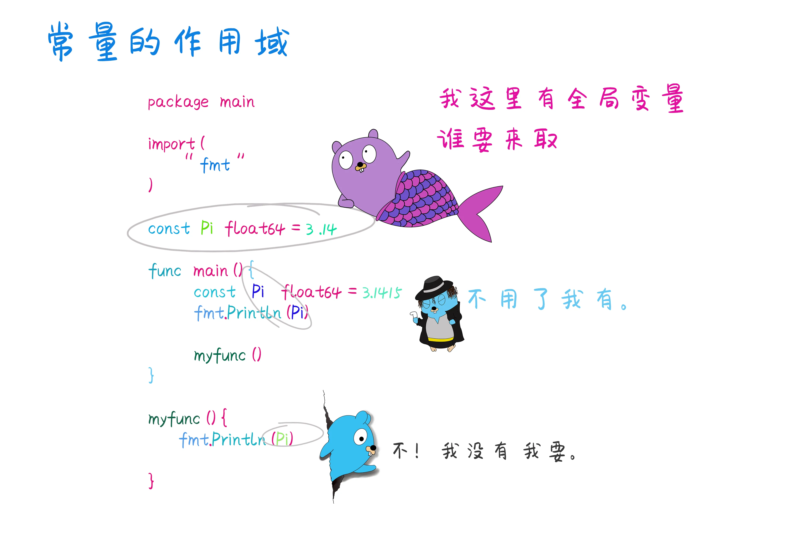
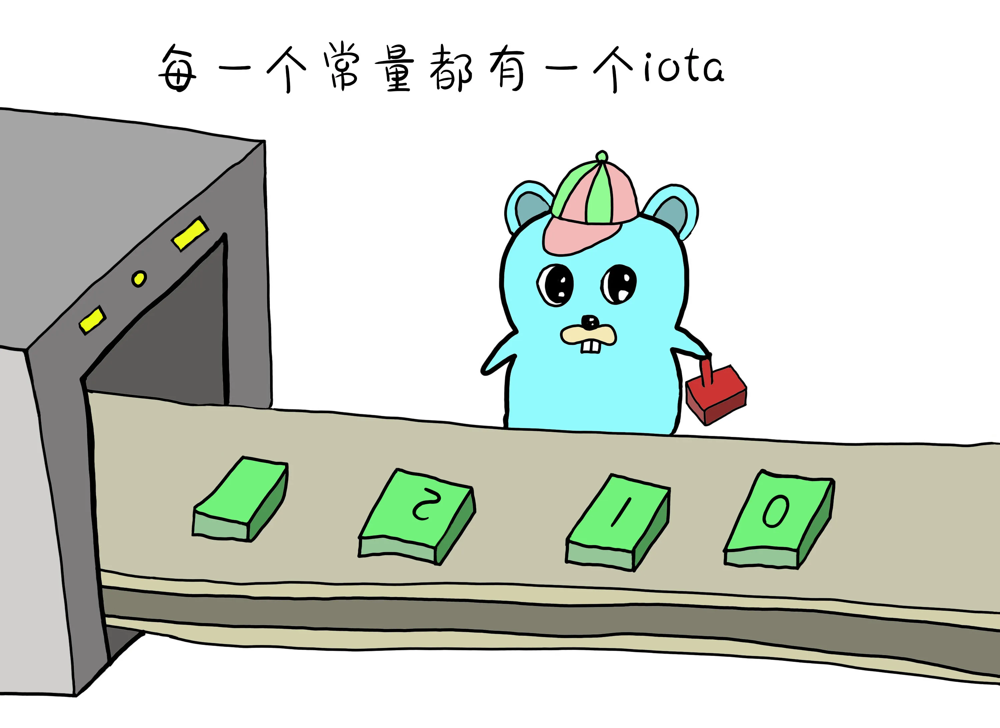
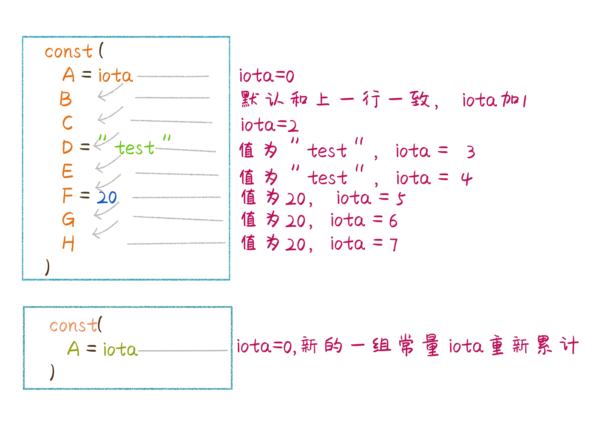

# Go小二的两大秘密武器--变量和常量

原文链接：https://juejin.cn/book/6844733833401597966/section/6844733833477128206

# 变量

Go语言是静态强类型语言，所以变量是有明确类型的。变量实质上就是在内存中的一小块空间，用来存储特定类型的可变数据。如果没有变量我们的程序中只能将数值写死都是静态的数据，我们无法更改，变量可以让我们进行动态的操作。在数学概念中变量表示没有固定的值，可以随时改变的数。 例如：除数，减数与被减数等。


`类型` 变量内可以存储哪种类型的数据。

`值`    变量内存储的具体的值。

`地址` 在计算机中可以找到变量的位置，计算机为变量开辟的一块内存地址。

## 如何声明变量

在其他语言中比如C#、java声明变量都需要关键字var。 go语言也可以这样声明。



这里只是声明了一个变量，并没有给当前变量赋值。默认就是当前声明的类型的零值。我们在使用变量时需要给他进行赋值。



## 如何赋值

```go
var age int //声明 未赋值默认为0
age = 18    //赋值
```


Go语言支持根据数据推导数据类型的方法。所以在定义的时候可以不用写数据类型，直接根据你所初始化的值，来推导出定义的数据类型。

```go
var name = "王钢蛋"
var age = 10
```

## 简短定义

如果以上方式还是不够简单！ Go再推出更简单方式，简短定义的方式。



```
//简短定义方式  声明并赋值
name :="王铁蛋"
age := 10
```

## 多变量定义

```go
//var方式声明多变量
var a, b, c int
a = 1
b = 2
c = 3
//也可以写在一行
var a1, a2, a3 int = 10, 20, 30
//也可以省略类型 根据数据进行类型推导
var a1, a2, a3 = 10, 20, "ago"
//如果是多种类型 也可以使用集合
var (
	a1 = ""
	a2 = 10
)
```

简短定义方式定义多个变量。 需要注意的是，一个变量在程序中只能够定义一次，重复定义就会报错。

```
//简短定义方式定义多变量
name,age:="王钢蛋",18
println(name,age)
//重复定义就报错
name,age:="zhangsan",19
//如果定义的左边有一个新的变量
name,age,sex:="lisi",20,"女"
//左边有一个新的，对于前两个就是修改操作，后一个是声明并赋值操作。
```

## 变量使用

起初计算机最最精贵的莫过于内存了，在使用多变量进行变量交换的时候，使用传统的方法进行变量的交换，需要多申请一块内存来交换。


```go
//a变量的值 要和b变量交换 需要一个第三方变量来转接
var a int = 100 //首先定义一个变量a 比作图中的新郎
var b int = 20  //创建一个变量b 看作图中的新娘
var c int       //变量c就是媒婆 新郎新娘交换信物还得经过媒婆

c = a //媒婆先接过新郎的信物
a = b //新郎腾出手来接过新娘的信物
b = c //新娘子在接过媒婆手中的信物
fmt.Println(a, b)
```

在Go语言中可以轻松实现，婚姻自由变量自由啦。


```go
var a int = 100 //新郎的信物a
var b int = 200 //新娘的信物b

b, a = a, b //新郎新娘交换礼物

fmt.Println(a, b)
```

## 匿名变量

匿名变量也就是没有名字的变量, 开发过程中可能会遇到有些变量不是必须的。匿名变量使用下划线" _ " 表示。 "_" 也称为空白标识符，任何类型都可以使用它进行赋值,而且任何类型赋值后都将直接被抛弃，所以在使用匿名变量时，表示后续代码不需要再用此变量。

```go
package main

import (
	"fmt"
)

func main() {
	a, _ := 100, 200
	// 这里第二个值200赋给了匿名变量_ 也就忽略了不需要再次打印出来
	fmt.Println(a)
}
```

## 变量的作用域

变量在程序中有一定的作用范围，如果一个变量声明在函数体的外部，这样的变量被认为是全局变量，全局变量在整个包内，也就是当前的package内都可以被调用得到。如果变量定义在函数体内部，则被称之为局部变量。例如下面代码:

```go
package main

import (
	"fmt"
	"os"
)

// 全局变量
var name = "zhangsan"

// 主函数 程序的入口
func main() {
	fmt.Println(name) //可以访问到全局变量name

	myfunc()
}

// 自定义函数
func myfunc() {
	fmt.Println(name) //这里也可以访问到全局变量name

	age := 30
	fmt.Println(age) //age为myfunc的局部变量 只能够在函数内部使用

	if t, err := os.Open("file.txt"); err != nil {
		fmt.Print(t) //t作为局部变量 只能在if内部使用
	}
	fmt.Println(t) //在if外部使用变量则会报错 undefined: t  未声明的变量t
}
```

## 总结一下

- 变量在使用前必须先声明。

- 变量名不能重复定义。

- 如果是简短定义方式，左边至少有一个是新的变量。

- 如果定义了变量，必须得使用，否则编译无法通过。

- 全局变量可以不使用也能编译通过，定义的全局变量和局部变量名称如果相同，则会优先使用局部变量。

- 简短定义方式不能定义全局变量，也就是不能声明在函数外部。

# 常量

## 为什么要使用常量

相对于变量而言，常量是在程序使用过程中，不会改变的数据。有些地方你需要将定义好的常量重复使用，代码中你不允许它的值改变。例如 圆周率  在程序执行过程中不会改变。

## 常量的声明



## 多常量声明


如果未声明常量的类型和值，它将从上一个常量中获取它，在上图中pi2将会从pi上获取类型和值，如果新声明了常量，并且有分配值，它就是新声明的常量。 例如上图的 Age 就是int类型的18。 如果再继续声明Age2不给Age2 赋初始值的话， 默认就会取上一个Age的值和类型。

## 常量的作用域


常量只能在其声明的范围内使用，如果在一个函数内部作用域中声明的常量与外部名称相同， 则只用自己内部的常量， 它将忽略外部的常量。



## 总结一下

- 常量数值不能修改。

- 常量定义后可以不使用。

- 常量定义不能使用简短定义方式。

- 常量中使用的数据类型只能是 整型、布尔、浮点、复数类型、字符串类型。

## iota特殊的常量

iota是常量里面的计数器，初始值默认值是0，可以被编译器自动修改，每定义一组常量时，iota逐行自增1。





## iota如何使用

Go语言中没有提供像其他语言中的enum枚举类型，但是可以使用const来模拟枚举类型。iota 可以被用作枚举值。

```go
package main

import (
	"fmt"
)

type Mytype int

// 定义一个常量 来模拟枚举类型 Spring设置为iota为值默认就是 0
const (
	Spring Mytype = iota
	Summer
	Autumn
	Winter
)

func main() {
	// 打印定义的常量枚举信息Autumn 值2
	fmt.Printf("%v\n", Autumn) //2
}
```

## iota用作位移操作

```go
package main

import "fmt"

const (
	i = 3 << iota //3<<0  3的二进制 0000 0011向左位移0位
	j = 5 << iota //5<<1  二进制 0000 1010
	k             //5<<2  二进制 0001 0100
	l             //5<<3  二进制 0010 1000
)

func main() {
	fmt.Printf("i二进制为：%b 数值为%d\n", i, i)
	fmt.Printf("j二进制为：%b 数值为%d\n", j, j)
	fmt.Printf("k二进制为：%b 数值为%d\n", k, k)
	fmt.Printf("l二进制为：%b 数值为%d\n", l, l)
}
```上面代码出现一个位移操作符号 `<<` 代表向左位移,和占位符 `%b` 用来打印变量i的二进制信息, 有关操作符和占位符的内容可继续学习下一节 漫画Go语言基础数据类型部分。

```
