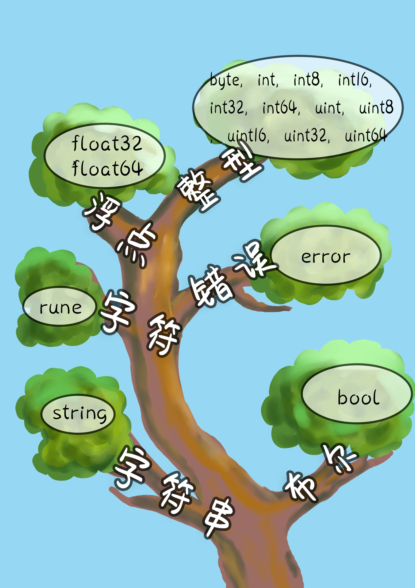
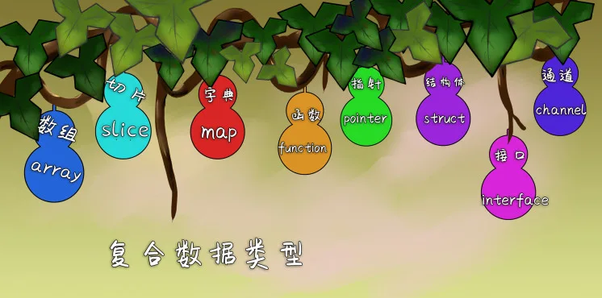
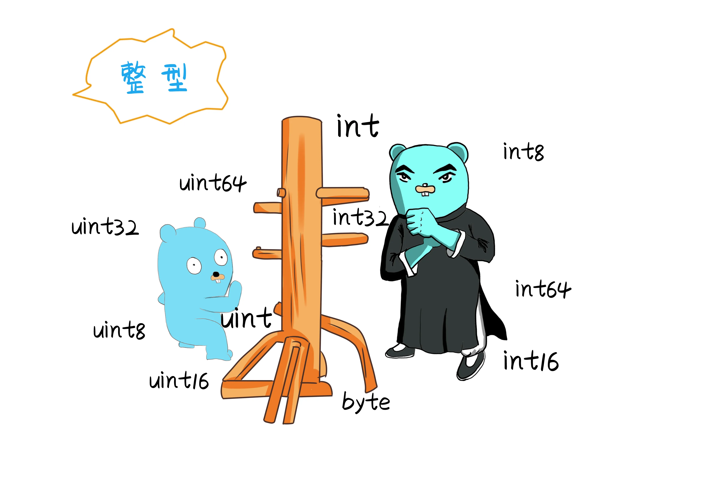
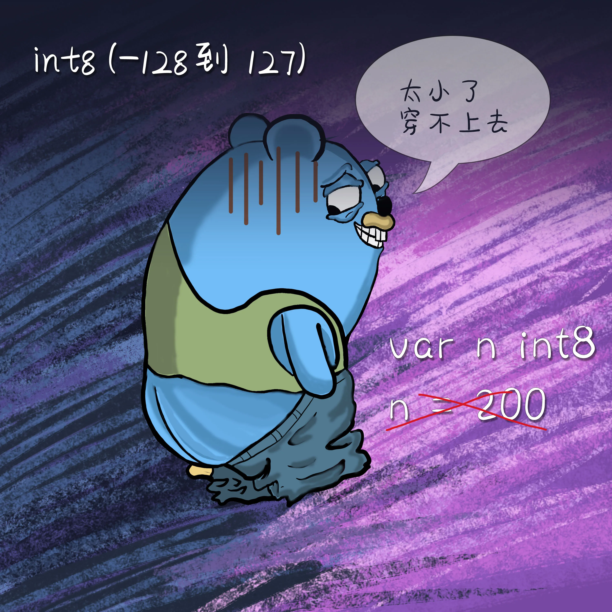
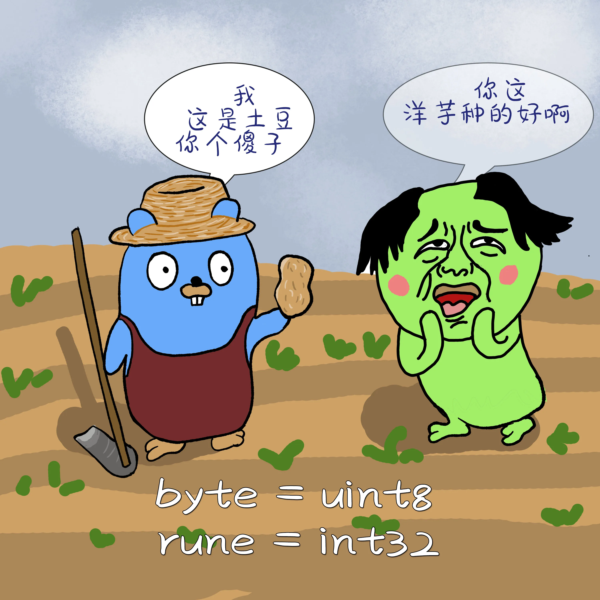
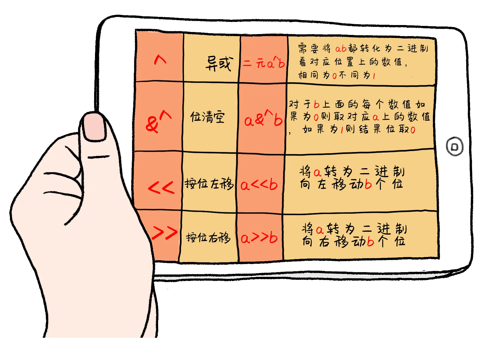

# Go小二的刀枪剑棘斧钺钩叉-- 数据类型

原文链接：https://juejin.cn/book/6844733833401597966/section/6844733833477111821

# Go语言基础数据类型

## 数据类型的转换与运算

数据类型是一门高级语言的基础，Go属于又属于强类型静态编译语言。Go语言拥有两大数据类型，基本数据类型和复合数据类型。





## 整型

| 数据类型 | 说明 | 取值范围 |
| --- | --- | --- |
| 有符号整数 |  |  |
| int8 | 有符号 8位整数 | -128到 127 |
| int16 | 有符号 16位整数 | -32768 到32767 |
| int32 | 有符号 32位整数 | -2147483648到2147483647 |
| int64 | 有符号 64位整数 | -9223372036854775808到9223372036854775807 |
| 无符号整数 |  |  |
| uint8 | 无符号8位整数 | 0到255 |
| uint16 | 无符号16位整数 | 0到65535 |
| uint32 | 无符号32位整数 | 0到4294967295 |
| uint64 | 无符号64位整数 | 0到18446744073709551615 |



- int后面的8， 代表转成二进制的长度。  8个0/1码。

- uint8  最小的值转为二进制是00000000八个零， 再转为十进制最小应该是0。最大的值转为二进制是11111111八个一 ，再转为十进制应该是255。

- 有符号： 带符号的表示转为数值后，最高位表示符号位 ，0 表示正数， 1表示负数 ，剩余的位才表示数值。

- 无符号： 无符号 没有正负之分 所有的位都表示数值。

Go语言中int类型的大小与具体的平台有关系，一般来说，int在32位系统中是4字节，在64位系统中是8字节，使用简短定义自动推导类型初始化一个整数，默认为int类型。
关于int类型的取值范围，如果要把一个大的数字，放进小的数据类型则会放不进去。



```go
var n int8
n = 100
fmt.Println(n) //100 没有问题
//如果赋值为200 则不行 因为int8取值范围最大是127

var i2 uint8
i2 = 200
fmt.Println(i2) //200  uint8 取值范围最大是0到255
```

在Go语言中 byte与uint8 是一样的，rune与int32是一样的，代表同一种数据类型。但是int和int64 不是同一种类型。



```go
//byte  uint8 的别称
//rune  int32 的别称
var i3 uint8
i3 = 100
var i4 byte
i4 = i3
fmt.Println(i3, i4) //100,100
```

## 字符串

字符串的概念就是多个byte的集合，一个字符序列用双引号""，或者`` (esc下面的键) 表示。


```go
s1 := "ABC"
fmt.Printf("s1的类型是%T，值为%s\n", s1, s1) //string ,ABC

v1 := 'A'
v2 := "A"
fmt.Printf("v1的类型是%T,%d\n", v1, v1) // int32 65
fmt.Printf("v2的类型是%T,%s\n", v2, v2) //string A

//单引号存储的是 ASCII编码
//A的ASCII值=65
//B的ASCII值B=66
//a的ASCII值a=97

v3 := '中'
fmt.Printf("%T,%d,%c,%q\n", v3, v3, v3, v3) //int32 20013 中 ‘中’

//定义字符串
s3 := "hello 漫画go语言"
s2 := `hello go`
fmt.Printf(s3) //hello 漫画go语言
fmt.Printf(s2) //hello go

//字符串的长度
//中文占3个字节
fmt.Println(len(s3)) //20
fmt.Println(len(s2)) //8

//获取某个字节
fmt.Println(s2[0]) //104
```

## 字符转义

双引号单引号如果作为字符串输出，需要使用`\"`进行转义后才能使用  \n  \r  \t  为特殊作用字符。

```go
//字符转义空格
fmt.Println("hello \t golang")
//hello      golang

//输出换行
fmt.Println("hello \n golang")
//hello
// golang

//回车符号
fmt.Println("hello \r golang")
//hello
// golang

//输出路径
fmt.Println("E:\\golang\\go.jpg")
//E:\golang\go.jpg

//双引号
fmt.Println("hello  \"golang\"")
//hello  "golang"
```

## 布尔

一个布尔类型的值只有两种结果，true或者false 非真即假。往往使用在条件判断的时候。


```go
//布尔类型作为条件比较返回结果只有true和false两种
a := 10
fmt.Println(a == 2) //false

fmt.Println(a != 2) //true
```

## 浮点型

Go语言有两种精度的浮点数 float32 和 float64。浮点类型的数据取值范围可以从很小或者很巨大。

| 单精度 浮点类型 |  | 取值范围 |
| --- | --- | --- |
| float32 | 负数时 | -3.402823E38 到 -1.401298E-45 |
| float32 | 正数时 | 1.401298E-45 到 3.402823E38 |

| 双精度 浮点类型 | 取值范围 |
| --- | --- |
| float64 | -1.79E+308 到 +1.79E+308 |

`1.79E-308` 是 1.79 乘以 10的负308次方。
`1.79E+308` 是 1.79 乘以 10的308次方。

### 单精度双精度两者区别

##### 在内存中占有的字节数不同

- 单精度浮点数在机内占4个字节。

- 双精度浮点数在机内占8个字节。

##### 有效数字位数不同

- 单精度浮点数 有效数字7位。

- 双精度浮点数 有效数字16位。

##### 使用情况区别

- 一般用来表示美元和分的时候用单精度类型。

- 超出人类经验的数字函数，例如 sin()  cos()  tan() sqrt()  都使用双精度值。

## 数据类型的转换

go 语言是静态语言，要求，定义、赋值、 运算、类型一致才能进行操作。所以要进行操作的时候必须保证数据类型一致。需要注意的是，只有兼容的数据类型才能够转换。
强制类型转换的语法 Type(value)

```go
var a int8 = 10
var b int16
//b=a  因为类型不同不能直接转换
b = int16(a)
fmt.Println(a, b) //10,10

f1 := 3.12
var c int
c = int(f1)
fmt.Println(f1, c) // 3.12 , 3  浮点类型转为整形的时候 只是取了整数部分

//不是所有类型都能互相转换
//数值类型的可以转换   int 和bool 不能转换
```

## 运算符

算数运算符 程序在运行过程中执行数学运算时候需要算数运算符。


| 运算符 | 描述 | 说明 |
| --- | --- | --- |
| + | 表示相加 | 5+2 =7 |
| - | 相减 | 5-2 =3 |
| * | 相乘 | 5*2 =10 |
| / | 相除 取商 | 5/3 = 1 |
| % | 相除 取余数 | 5%3= 2 |
| ++ | 自身加1 | 5++ =6 |
| -- | 自身减1 | 5-- =4 |

关系运算符 关系运算符的结果是bool类型的


| 运算符 | 描述 | 说明 |
| --- | --- | --- |
| == | 比较相等 | 10==10       结果 true |
| != | 比较不等 | 10 !=10    结果 false |
| > | 是否大于 | 100>1        结果 true |
| < | 是否小于 | 100<1         结果 false |
| >= | 大于等于 | 100>=100   结果 true |
| <= | 小于等于 | 100>=101     结果 false |

逻辑运算符

| 标识符 | 描述 | 说明 |
| --- | --- | --- |
| && | 逻辑与 | 操作数都为真才为真 有一个为假就为假（一假则假，全真为真） |
| II | 逻辑或 | 操作数有一个为真就为真（一真为真，全假为假） |
| ! | 逻辑非 | 相反方向则为真（假为真 真为假） |

位运算符



```go
var a int8 = 12
var b int8 = 15
fmt.Printf("%b,%b \n", a, b)
//0000 1100 a 的二进制
//0000 1111 b 的二进制

//0000 1100 按位与 &    --转为10进制   结果 12
//0000 1111 按位或 |    --转为10进制   结果 15
//0000 0011 按位异或 ^  --转为10进制   结果 3
//0000 0000 按位清空 &^ --转为10进制   结果 0

//<< 按位左移    a << b    将a转为二进制 向左移动b个位
//>> 按位右移    a >> b    将a转为二进制 向右移动b个位

aes := a << 2
//0011 0000  a向左位移2位结果
fmt.Printf("%b\n", aes)
aes2 := a >> 2
//0000 0011  a向右位移2位结果
fmt.Printf("%b\n", aes2)
```

## 赋值运算符

| 运算符 | 描述 |
| --- | --- |
| = | 把等号右侧的数值 赋给左边的变量 |
| += | 自身加上后面的值 再赋给左边的变量 |
| -= | 自身减去后面的值 在赋给左边 |
| /= | 自身除后面的值 再赋值给左边 |
| %= | 自身与后面的值求余数后 再赋值给左边 |
| <<= | 左移后再赋值 |
| >>= | 右移后再赋值 |
| &= | 按位与后再赋值 |
| I= | 按位或 后再赋值 |
| ^= | 按位异或后再赋值 |

## 占位符号

占位符表示在程序中输出一行字符串时候，或者格式化输出字符串的时候使用。go内置包fmt中Printf方法可以在控制台格式化打印出用户输入的内容。fmt.Printf("%T",x)


| 占位符 | 说明 | 举例 | 输出 |
| --- | --- | --- | --- |
| %d | 十进制的数字 | fmt.Printf("%d",10) | 10 |
| %T | 取类型 | b       :=true    fmt.Printf("%T",b) | bool |
| %s | 取字符串 | s      :="123"   fmt.Printf("%s",s) | 123 |
| %t | 取bool类型的值 | b:=true    fmt.Printf("%t",b) | true |
| %p | 取内存地址 | p   :="123"  fmt.Printf("%p", &p) | 0xc0000461f0 |
