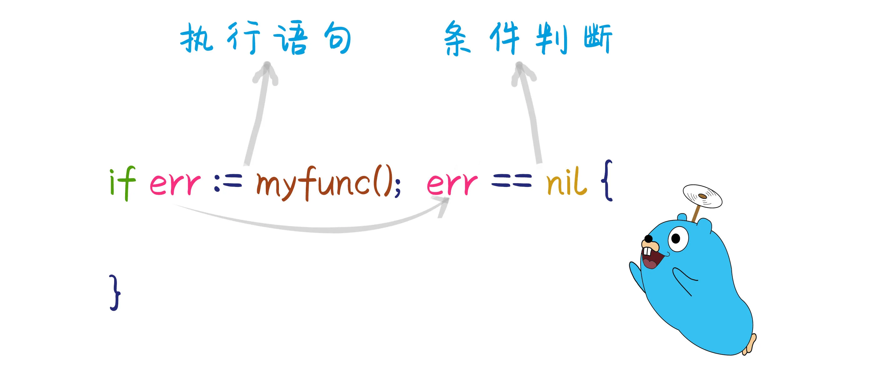
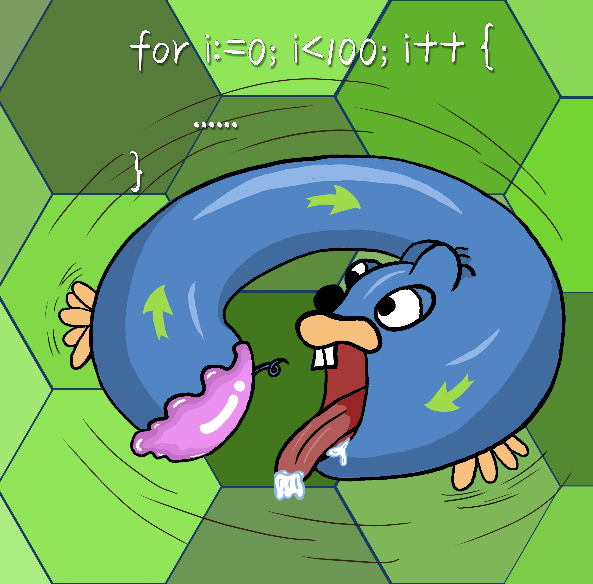
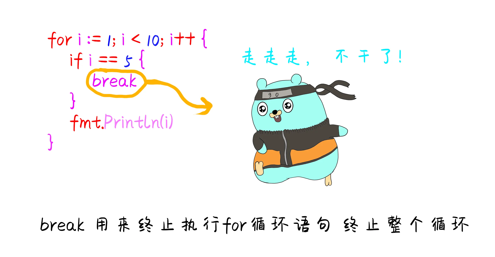
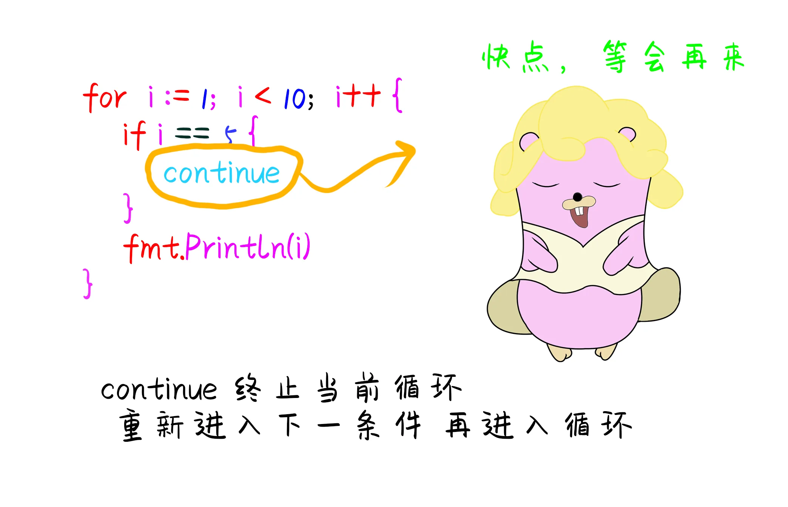
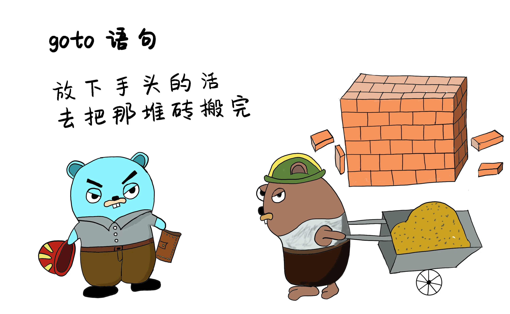
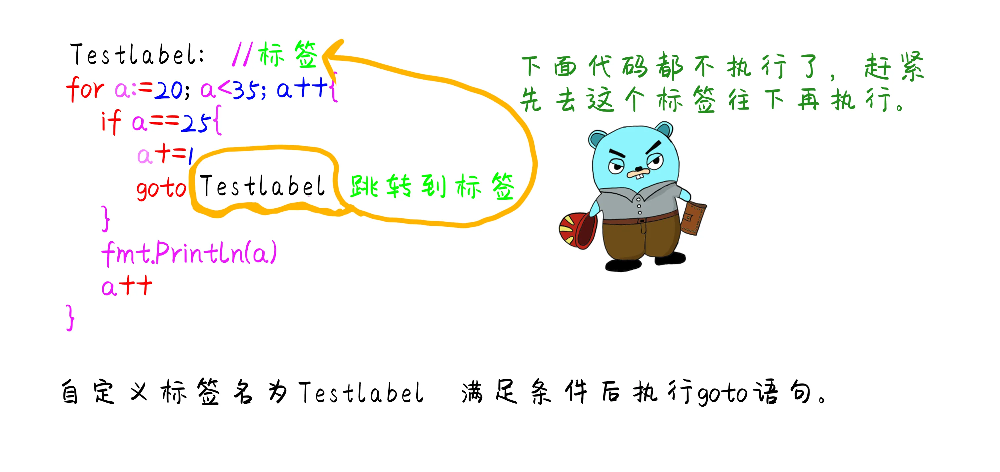
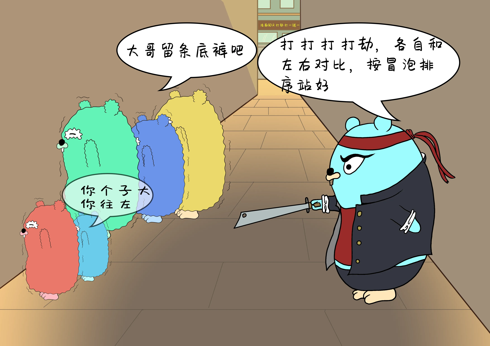
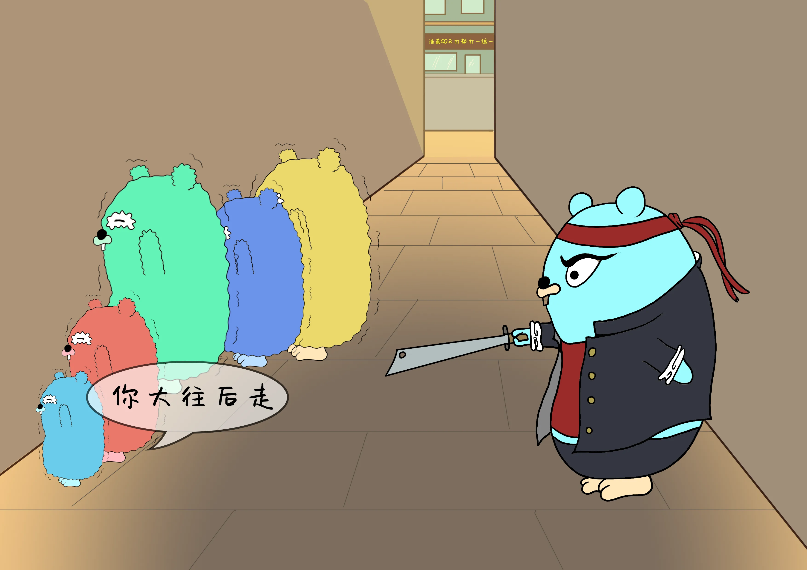
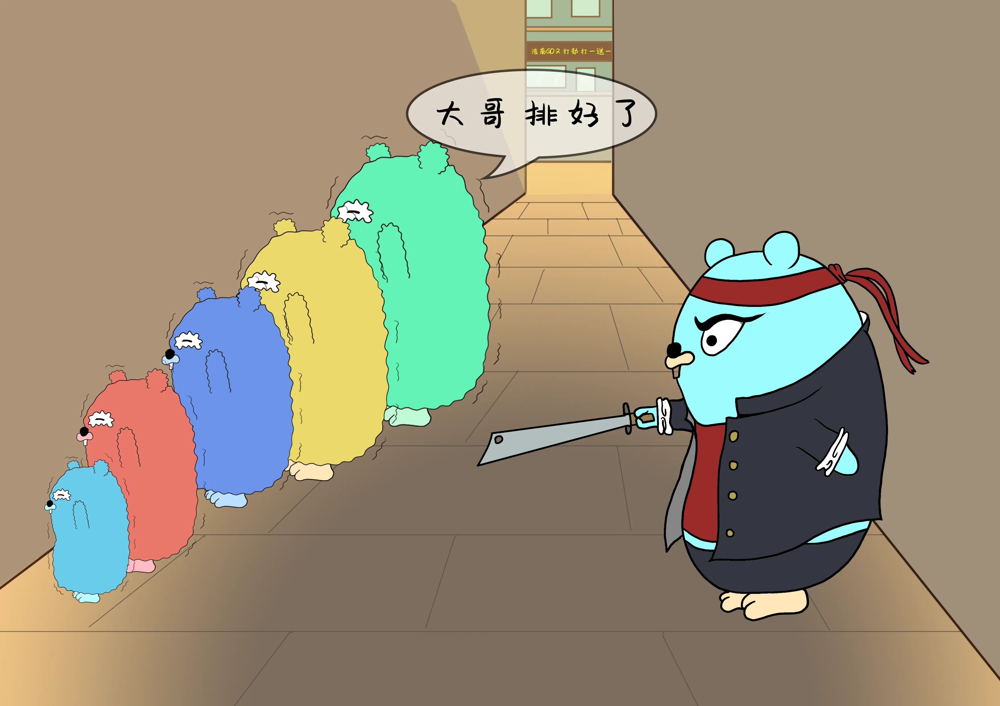

# Go小二的流程控制

原文链接：https://juejin.cn/book/6844733833401597966/section/6844733833477111816

# 程序控制结构

程序的执行是由上到下逐行执行，叫做 顺序结构 。程序中为了满足某种条件的时候才会执行的结构，叫做 选择结构 ，当满足条件时候循环反复执行多次的代码， 叫做 循环结构。

## if分支语句


Go语言中关键字if 用于某个条件的判断是否成立，如果成立则会执行大括号{}内部的代码，否则会忽略这段代码。如果有else条件则会执行else条件内的代码块。

```go
if 布尔表达式 {
	//布尔条件为true时候执行代码
}

if 布尔表达式 {
	//条件成立执行代码
} else {
	//条件不成立执行代码
}

if 布尔表达式 {
	//布尔条件为true时候执行代码
} else if 布尔表达式2 {
	//布尔条件为false时候执行代码
} else {
	//上面都不成立执行代码
}
```

## if在Go语言中的特殊写法

其他语言中if 后面都是跟随着条件判断语句，而Go语言中可以在if之后，条件判断之间再加上一段执行语句，执行的结果再用作后面的条件判断。例如



上图代码中err是函数myfunc() 返回的结果，执行myfunc()语句之后，再通过条件判断对err进行判断，err的作用域就只能够在这条语句范围内。

## switch分支语句

switch和if的区别是， if 之后只能是bool类型，  而switch 可以作用其他类型。  但是case 后面的数据必须和变量类型一致。
case 是没有先后顺序的，只要符合条件就会进入。case后面的数值 必须是唯一的不能重复。default 不是必须的，根据实际情况来写。

```go
//switch语法一
switch 变量名{
case 数值1: 分支1
case 数值2: 分支2
case 数值3: 分支3
    ...
default:
    最后一个分支
}

//语法二 省略变量 相当于作用在了bool 类型上

switch{
case true: 分支1
case false: 分支2
}

//语法三 case 后可以跟随多个数值， 满足其中一个就执行
switch num{
case 1,2,3:
    fmt.Println("num符合其中某一个 执行代码")
case 4,5,6:
    fmt.Println("执行此代码")
}

//语法四 可以添加初始化变量 作用于switch内部

switch name:="huangrong"; name{
case "guojing":
    fmt.Println("shideguojing")
case "huangrong":
    fmt.Println("shidehuangrong")
}
```

### switch 中 break 和fallthrough

在switch 语句中，默认每个case后自带一个break，表示到此结束 不向下执行了，跳出整个switch。fallthrough 表示强制执行后面的没有执行的case代码。

```go
//break 断开当前所有的执行 跳出整个switch
n := 2
switch n {
case 1:
	fmt.Println("九阴真经")
	fmt.Println("九阴真经")
	fmt.Println("九阴真经")
case 2:
	fmt.Println("葵花宝典")
	fmt.Println("葵花宝典")
	break
	fmt.Println("葵花宝典")
case 3:
	fmt.Println("辟邪剑谱")
	fmt.Println("辟邪剑谱")
	fmt.Println("辟邪剑谱")
}
//输出
葵花宝典
葵花宝典

// fallthrough 穿透switch 当前case执行完了 继续执行下一case 不用匹配下一case是否符合直接执行
//**fallthrough必须放在case最后一行
m := 2
switch m {
case 1:
	fmt.Println("一月")
case 2:
	fmt.Println("二月")
	fallthrough
case 3:
	fmt.Println("三月")
case 4:
	fmt.Println("四月")
}
//输出  二月 三月
```

## for 循环语句

for 循环是程序流程控制中的循环结构，  是当满足条件，代码反复执行多次， 其他的 if、switch 满足条件后只执行一次。

```go
语法： for init; condition;post{ }
init            初始化  只执行一次
condition   bool类型 执行条件 如果满足继续执行后面的循环体  如果不满足 则终止执行
{}               循环体
post           表达式 将在循环体执行结束之后执行
```



```go
//for 标准写法
for i := 0; i <= 5; i++ {
	fmt.Println(i, "次执行")
}

//for其他写法  初始化可以放for循环外 表达式2写在循环体内部
i := 1
for i <= 5 {
	fmt.Println("循环体")
	i++
}

// 如果表达式2 条件判断省略 则进入死循环模式
for {
	fmt.Println("....")
}
```

### for循环中的break 和continue

break 用来终止执行for循环语句，终止整个循环。continue 终止当前循环的迭代，重新进入下一条件，进入循环。



```go
for i := 1; i < 10; i++ {
	if i == 5 {
		break
	}
	fmt.Println(i)
}

//结果
1
2
3
4
```



```go
for i := 1; i < 10; i++ {
	if i == 5 {
		continue
	}
	fmt.Println(i)
}
//结果
1
2
3
4
6
7
8
9
```

### 多层嵌套循环中的break 和continue

默认都只结束当前一层循环，如果想要结束到指定循环，需要给循环体前贴上标签。

```go
flag:
for i := 1; i < 10; i++ {
	for j := 1; j < i; j++ {
		fmt.Println(i, j)
		if j == 5 {
			break flag
		}
	}
	fmt.Println(i)
}
```

## goto语句

可以跳转到程序中指定的行和嵌套循环里的break标签是一样的，不管后面还有多少代码都不再执行。



```go
//语法
lable:func1
...
goto label
```

示例：定义TestLabel 标签，条件满足后goto语句跳转到标签执行。


```go
TestLabel: //标签
for a := 20; a < 35; a++ {
    if a == 25 {
        a += 1
        goto TestLabel
    }
    fmt.Println(a)
    a++
}
}
```

## 冒泡排序

冒泡排序是将一组无序的随机数组，按照大小顺序进行排序。重复循环数组中的每一个元素，将左右两边数据进行对比，判断两边元素是否需要交换，将最小的元素慢慢浮上来，或者将最大的元素慢慢沉下去。



```go
package main

import "fmt"

func main() {
	values := []int{4, 3, 14, 85, 34, 27, 91, 95, 26, 12, 32}
	fmt.Println(values)
	BubblingASC(values)  //正序冒泡
	BubblingDESC(values) //倒序冒泡
}

// 冒泡排序 正序，大的靠后 小的靠前。
func BubblingASC(values []int) {
	for i := 0; i < len(values)-1; i++ {
		for j := i + 1; j < len(values); j++ {
			if values[i] > values[j] { //左右两边数据对比
				values[i], values[j] = values[j], values[i] //数据交换
			}
		}
	}
	fmt.Println(values)
}

// 冒泡排序 倒序, 大的靠前 小的靠后。
func BubblingDESC(values []int) {
	for i := 0; i < len(values)-1; i++ {
		for j := i + 1; j < len(values); j++ {
			if values[i] < values[j] { //左右两边数据对比
				values[i], values[j] = values[j], values[i] //数据交换
			}
		}
	}
	fmt.Println(values)
}
```





### return 返回

```go
package main

import "fmt"

func main() {
	a, b, c := myfunc()
	fmt.Printf("a = %d, b = %d, c = %d\n", a, b, c)
}

func myfunc() (a, b, c int) {
	a, b, c = 111, 222, 333
	return
}
```
