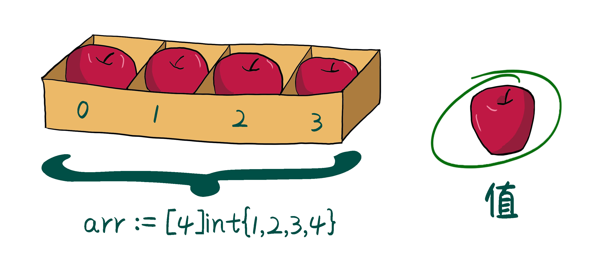
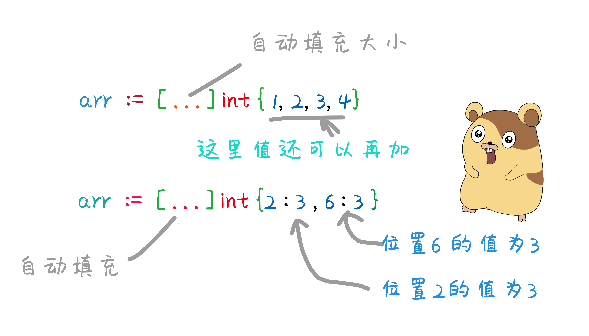
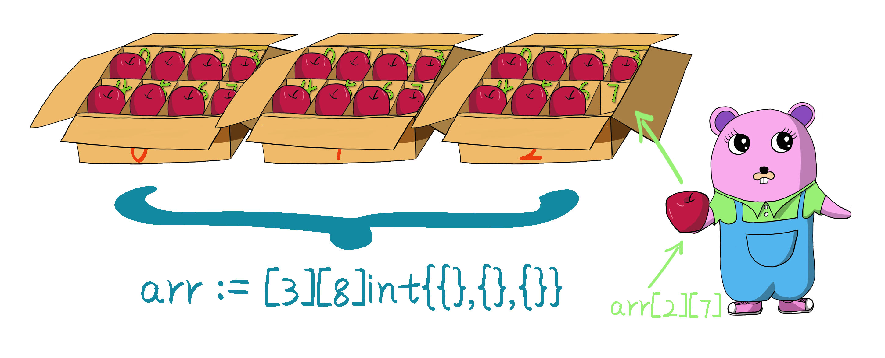
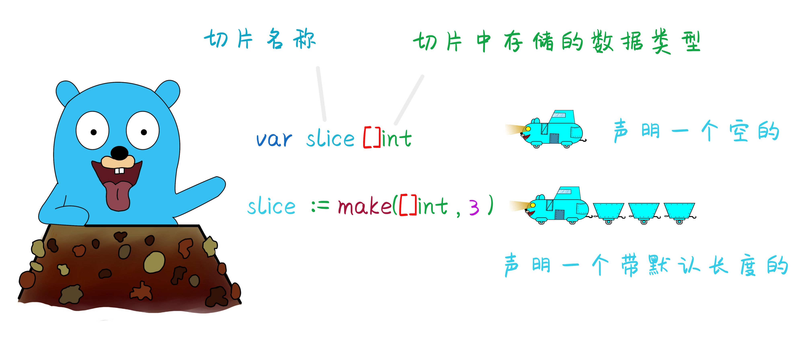
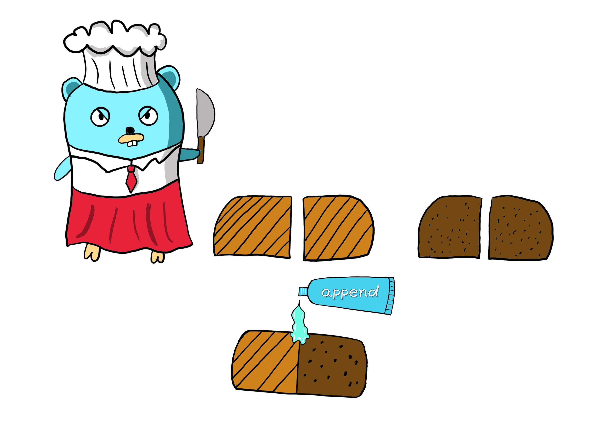
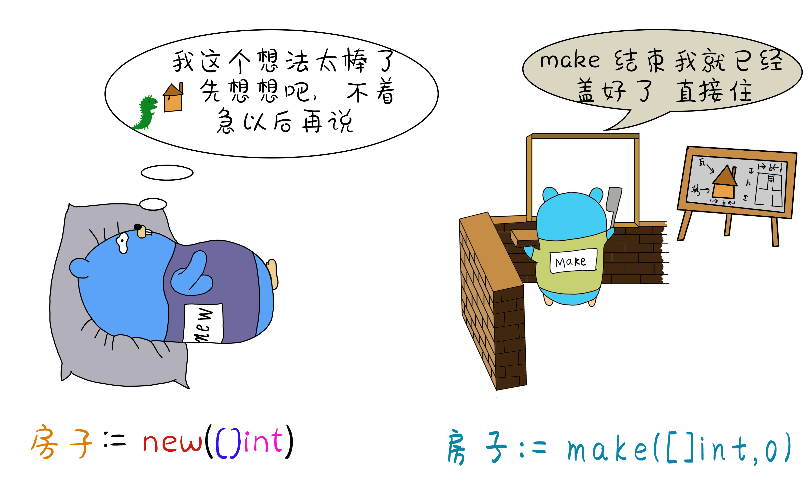
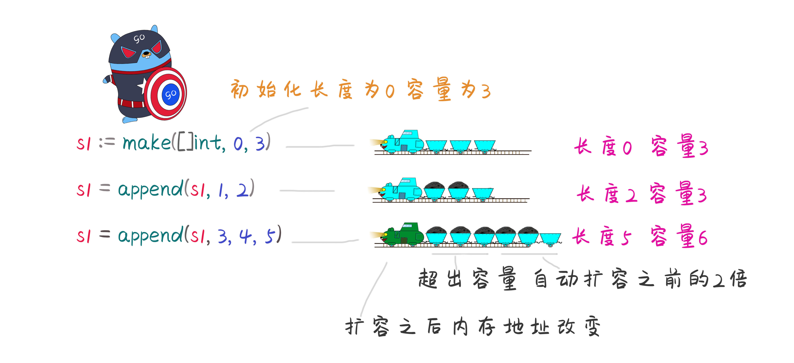
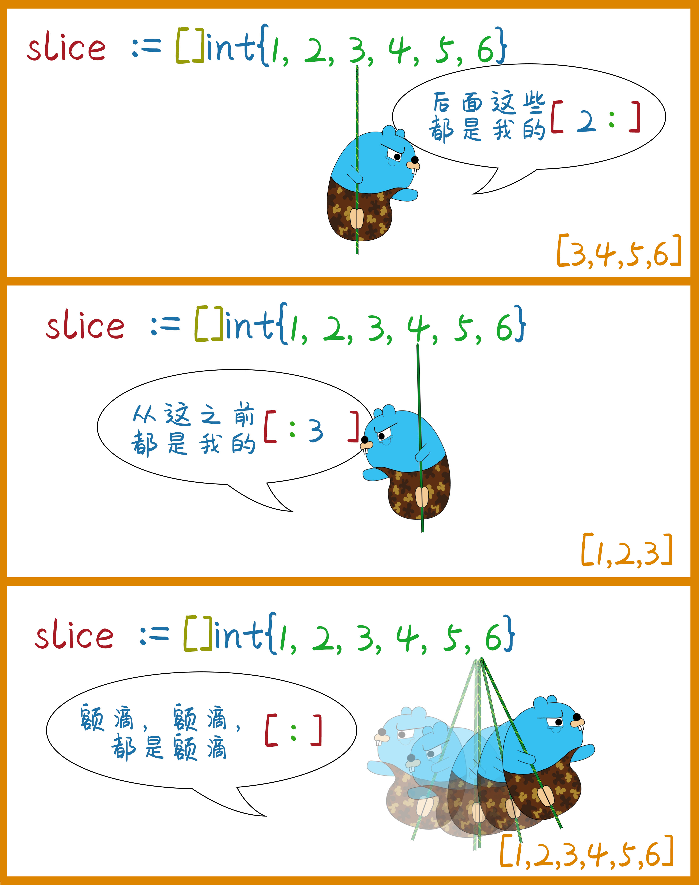
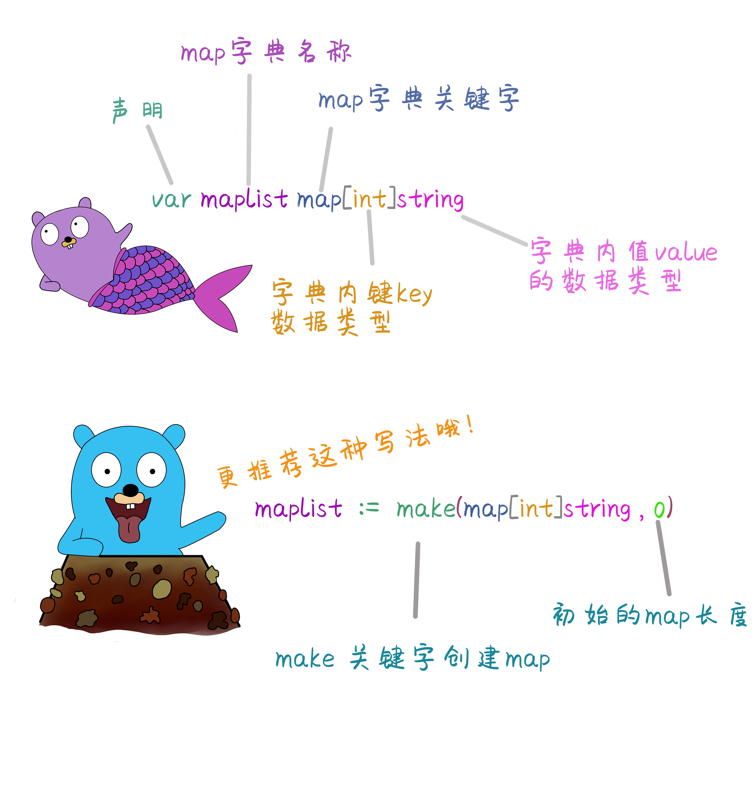

# Go小二的两大绝招--切片和数组

原文链接：https://juejin.cn/book/6844733833401597966/section/6844733833481289742

# 数组与切片

go语言中有两大数据类型

- 基本数据类型： int、string、bool...... 等都是基本数据类型。

- 复合数据类型：包括 array数组、slice切片、map字典、struct结构体、pointer指针、function函数、channel通道。这些都是Go语言中的复合数据类型。

## 数组的概念

之前存储数据使用一个变量，只能存储一个数值。如果要存储新的值，只能覆盖原有的值。如果想要存储多个值只能定义多个变量，我们可以将这些多个值存储到同时存储到一个容器里面，也就是数组。



## 数组的声明

数组声明的语法格式为： `var 数组名称 [长度]数据类型`

- 数组只能用来存储一组相同类型的数据结构。

- 数组需要通过下标来访问，并且有长度和容量 。

```go
//数组定义
var arr [5]int
//数组访问使用下标来访问
arr[0]=1
arr[1]=2

//通过下标直接获取数组数值
fmt.Print(arr[2])

```

- 数组有长度限制，访问和复制不能超过数组定义的长度，否则就会下标越界。

- 数组的长度，用内置函数 len()来获取。

- 数组的容量，用内置函数 cap()来获取。

```go
fmt.Println("数组的长度为：",len(arr))//数组中实际存储的数据量
fmt.Println("数组的容量为：",cap(arr))//容器中能够存储的最大数据量  因为数组是定长的 所以长度和容量是相同的

```

## 数组的创建

```go
//默认情况下 数组中每个元素初始化时候 根据元素的类型 对应该数据类型的零值，
arr1 := [3]int{1,2}
fmt.Println(arr1[2])//下标为2的元素没有默认取int类型的零值

//数组创建方式1 创建时 直接将值赋到数组里
arr2 := [5]int{1,2,3,4}    //值可以少 默认是0  但是不能超过定长

//在指定位置上存储值
arr3 := [5]int{1:2,3:5}//在下标为1的位置存储2，在下标为3的位置存储5

```

在创建数组时候长度可以省略，用 ... 代替，表示数组的长度可以由初始化时候数组中的元素的个数来决定。

```go
//长度可以用...代替  根据数值长度程序自动填充数值的大小
arr4 :=  [...]int{1,2,3,4}

//简短声明方式
arr5 := [...]int{2:3,6:3}//在固定位置存储固定的值

```



# 数组的遍历

使用for range 进行循环数组中的元素，依次打印数组中的元素。

1，使用range 不需要操作下标，每次循环自动获取元素中的下标和对应的值。如果到达数组的末尾，自动结束循环。

```go
arr := [5]int{1,2,3,4,5}
//range方式循环数组
for index,value:=range arr{
fmt.Println(index,value)
}

```

2，可以通过 for循环 配合下标来访问数组中的元素。

```go
arr := [5]int{1,2,3,4,5}
//for循环
for i:=0; i<len(arr);i++{
fmt.Println(arr[i])
}

```

## 多维数组

存储一组相同的数据类型的叫数组也叫一维数组，一维数组存储的是数值本身，而二维数组存储的是一维数组。



## 声明二维数组

语法：arr:=[总共多少个一维数组][每个一维数组的长度]数据类型{{}，{}，{}}
arr:=[3][4]int{{},{},{}}

```go
//声明一个二维数组
var arr [3][8]int
//给二维数组赋值
arr[0]=[8]int{1,2,3,4,5,6,7,8}
//打印结果
fmt.Println(arr) // [[1 2 3 4 5 6 7 8] [0 0 0 0 0 0 0 0] [0 0 0 0 0 0 0 0]]
//也可以通过下标给指定的索引赋值
arr[1][3]=9
fmt.Println(arr) // [[1 2 3 4 5 6 7 8] [0 0 0 9 0 0 0 0] [0 0 0 0 0 0 0 0]]

```

## 切片Slice

作为容器的一种，数组能够存储一组特定类型的数据，但是缺点是数组是定长的。系统根据定义的固定的长度，开辟了固定的内存大小所以不能改变大小。


切片也是一种存储相同类型的数据结构，但是不同于数组的是它的大小可以改变，如果长度不够可以自动扩充。


## 如何声明一个切片

与数组不同的是，不需要指定[] 里面的长度 。    `语法：var 切片名字 [] 数据类型`

```go
//声明一个切片slice
var slice []int

```

通常情况下，使用make函数来创建一个切片，切片有长度和容量，默认情况下它的容量与长度相等。所以可以不用指定容量。



```go
//使用make函数来创建切片
slice :=make([]int,3,5)//长度为3 容量为5  容量如果省略 则默认与长度相等也为3
fmt.Println(slice)//[0,0,0]
fmt.Println(len(slice),cap(slice))//长度3,容量5

```

## 切片追加元素append()

切片中追加一个元素时，使用内置函数append() 方法追加在切片的末尾。 例如切片slice[3] 长度为3 所以下标只能为0, 1, 2 。如果继续添加就可以使用用内置函数append在切片尾部追加内容。
`语法 slice=append(slice,elem1,elem2)`

```go
//使用append() 给切片末尾追加元素
var slice []int
slice = append(slice, 1, 2, 3)
fmt.Println( slice) // [1, 2, 3]

//使用make函数创建切片
s1:=make([]int,0,5)
fmt.Println(s1)// [] 打印空的切片
s1=append(s1,1,2)
fmt.Println(s1)// [1,2]
//因为切片可以扩容  所以定义容量为5 但是可以加无数个数值
s1=append(s1,3,4,5,6,7)
fmt.Println(s1)// [1,2,3,4,5,6,7]

//添加一组切片到另一切片中
s2:=make([]int,0,3)
s2=append(s2,s1...) //...表示将另一个切片数组完整加入到当前切片中

```



## make()与new() 的区别

make()是Go语言中的内置函数，主要用于创建并初始化slice切片类型，或者map字典类型，或者channel通道类型数据。他与new方法的区别是。new用于各种数据类型的内存分配，在Go语言中认为他返回的是一个指针。指向的是一个某种类型的零值。make 返回的是一个有着初始值的非零值。



```go
//测试使用new方法新建切片
slice1 := new([]int)
fmt.Println(slice1) //输出的是一个地址  &[]

//使用make创建切片
slice2 := make([]int, 5)
fmt.Println(slice2)//输出初始值都为0的数组， [0 0 0 0 0]

fmt.Println(slice1[0])//结果出错 slice1是一个空指针 invalid operation: slice1[0] (type *[]int does not support indexing)
fmt.Println(slice2[0])//结果为 0 因为已经初始化了

```

## 切片是如何扩容的

```go
package main

import (
"fmt"
)

func main() {
s1 := make([]int, 0, 3)
fmt.Printf("地址%p,长度%d,容量%d\n", s1, len(s1), cap(s1))
s1 = append(s1, 1, 2)
fmt.Printf("地址%p,长度%d,容量%d\n", s1, len(s1), cap(s1))
s1 = append(s1, 3, 4, 5)
fmt.Printf("地址%p,长度%d,容量%d\n", s1, len(s1), cap(s1))

//地址0xc000010540,长度0,容量3
//地址0xc000010540,长度2,容量3
//地址0xc00000e4b0,长度5,容量6
}

```



容量成倍数扩充  3--->6--->12--->24......

如果添加的数据容量够用, 地址则不变。如果实现了扩容， 地址就会发生改变成新的地址，旧的则自动销毁。

### 总结一下

- 每一个切片都引用了一个底层数组。

- 切片本身不能存储任何数据，都是这底层数组存储数据，所以修改切片的时候修改的是底层数组中的数据。

- 当切片添加数据时候，如果没有超过容量，直接进行添加，如果超出容量自动扩容成倍增长。

- 切片一旦扩容，指向一个新的底层数组内存地址也就随之改变。

## 值传递与引用传递

数据如果按照数据类型划分

- 基本类型:`int、float、string、bool`

- 复合类型:`array、slice、map、struct、pointer、function、chan`

按照数据特点划分分为

- 值类型：`int、float、string、bool、array、struct`
值传递是传递的数值本身，不是内存地，将数据备份一份传给其他地址，本身不影响，如果修改不会影响原有数据。


- 引用类型: `slice、pointer、map、chan` 等都是引用类型。
引用传递因为存储的是内存地址，所以传递的时候则传递是内存地址，所以会出现多个变量引用同一个内存。

```go
//数组为值传递类型
//定义一个数组 arr1
arr1 := [4]int{1, 2, 3, 4}
arr2 := arr1            //将arr1的值赋给arr2
fmt.Println(arr1, arr2) //[1 2 3 4] [1 2 3 4]  输出结果 arr1与arr2相同，
arr1[2] = 200           //修改arr1中下标为2的值
fmt.Println(arr1, arr2) //[1 2 200 4] [1 2 3 4] 结果arr1中结果改变,arr2中不影响
//说明只是将arr1中的值给了arr2 修改arr1中的值后并不影响arr2的值

//切片是引用类型
//定义一个切片 slice1
slice1 := []int{1, 2, 3, 4}
slice2 := slice1            //将slice1的地址引用到slice2
fmt.Println(slice2, slice2) //[1 2 3 4] [1 2 3 4]   slice1输出结果 slice2输出指向slice1的结果，
slice1[2] = 200             //修改slice1中下标为2的值
fmt.Println(slice1, slice2) //[1 2 200 4] [1 2 200 4] 结果slice1中结果改变,因为修改的是同一份数据
//说明只是将slice1中的值给了slice2 修改slice1中的值后引用地址用的是同一份 slice1 和slice2 同时修改

fmt.Printf("%p,%p\n", slice1, slice2)//0xc000012520,0xc000012520
//切片引用的底层数组是同一个 所以值为一个地址 是引用的底层数组的地址
fmt.Printf("%p,%p\n", &slice1, &slice2)//0xc0000044a0,0xc0000044c0
//切片本身的地址

```


## 深拷贝和浅拷贝

深拷贝是指将值类型的数据进行拷贝的时候，拷贝的是数值本身，所以值类型的数据默认都是深拷贝。浅拷贝指的是拷贝的引用地址，修改拷贝过后的数据,原有的数据也被修改。
那么如何做到引用类型的深拷贝？也就是需要将引用类型的值进行拷贝。修改拷贝的值不会对原有的值造成影响。

### 浅拷贝


### 深拷贝


### 1,使用range循环获取元素中的值 进行拷贝

```go
//使用range循环将切片slice中的元素一个一个拷贝到切片s2中
slice := []int{1, 2, 3, 4}
s2 := make([]int, 0)
for _, v := range slice {
s2 = append(s2, v)
}
fmt.Println(slice)  //结果 [1 2 3 4]
fmt.Println(s2)     //结果 [1 2 3 4]

```

### 2,使用深拷贝数据函数:  copy(目标切片,数据源)

```go
//copy(目标切片,数据源)  深拷贝数据函数
s2 := []int{1, 2, 3, 4}
s3 := []int{7, 8, 9}

copy(s2, s3)        //将s3拷贝到s2中
fmt.Println(s2)     //结果 [7 8 9 4]
fmt.Println(s3)     //结果 [7 8 9]

copy(s3, s2[2:])    //将s2中下标为2的位置 到结束的值 拷贝到s3中
fmt.Println(s2)     //结果 [1 2 3 4]
fmt.Println(s3)     //结果 [3 4 9]

copy(s3, s2)        //将s2拷贝到s3中
fmt.Println(s2)     //结果 [1 2 3 4]
fmt.Println(s3)     //结果 [1 2 3]

```

## 切片的删除

Go语言中并没有提供一个内置函数将切片中的元素进行删除，我们可以使用切片的特性来删除切片中的元素。通过下标来访问切片中的元素，把切片切成三段中间部分用`：`切开。`：`之前的是从下标0开始，`：`之后的是切片结尾位置处的下标。


删除切片中元素的方法

```go
//方法一 获取切片指定位置的值 重新赋值给当前切片
slice:=[]int{1,2,3,4}
slice=slice[1:]//删除切片中开头1个元素  结果 [2,3,4]

//方法二 使用append不会改变当前切片的内存地址
slice = append(slice[:0], slice[1:]...) // 删除开头1个元素
fmt.Println(slice)

```

删除指定的下标元素

```go
slice:=[]int{1,2,3,4}
i := 2      // 要删除的下标为2
slice = append(slice[:i], slice[i+1:]...) // 删除中间1个元素
fmt.Println(slice)  //结果[1 2 4]

```

删除切片结尾的方法

```go
slice := []int{1, 2, 3, 4}
slice = slice[:len(slice)-2] // 删除最后2个元素
fmt.Println(slice)           //结果 [1,2]

```

## 复合数据 map

map是go语言中的内置的字典类型，他存储的是一个键值对 `key:value` 类型的数据。map也是一种容器，和数组切片不一样的是，他不是通过下标来访问数据，而是通过key来访问数据。类似于我们手机中的电话本，人名对应电话号码。


### map 特点

- map是无序的、长度不固定、不能通过下标获取，只能通过key来访问。

- map的长度不固定 ，也是一种引用类型。可以通过内置函数 len(map)来获取map长度。

- 创建map的时候也是通过make函数创建。

- map的key不能重复，如果重复新增加的会覆盖原来的key的值。



```go
//1, 声明map 默认值是nil
var m1 map[key_data_type]value_data_type
声明  变量名称 map[key的数据类型]value的数据类型
//2，使用make声明
m2:=make(map[key_data_type]value_data_type)
//3,直接声明并初始化赋值map方法
m3:=map[string]int{"语文":89,"数学":23,"英语":90}

```

### map的使用

map 是引用类型的，如果声明没有初始化值，默认是nil。空的切片是可以直接使用的，因为他有对应的底层数组,空的map不能直接使用。需要先make之后才能使用。

```go
var m1 map[int]string         //只是声明 nil
var m2 = make(map[int]string) //创建
m3 := map[string]int{"语文": 89, "数学": 23, "英语": 90}

fmt.Println(m1 == nil) //true
fmt.Println(m2 == nil) //false
fmt.Println(m3 == nil) //false

//map 为nil的时候不能使用 所以使用之前先判断是否为nil
if m1 == nil {
m1 = make(map[int]string)
}

//1存储键值对到map中  语法:map[key]=value
m1[1]="小猪"
m1[2]="小猫"

//2获取map中的键值对  语法:map[key]
val := m1[2]
fmt.Println(val)

//3判断key是否存在   语法：value,ok:=map[key]
val, ok := m1[1]
fmt.Println(val, ok) //结果返回两个值，一个是当前获取的key对应的val值。二是当前值否存在，会返回一个true或false。

//4修改map  如果不存在则添加， 如果存在直接修改原有数据。
m1[1] = "小狗"

//5删除map中key对应的键值对数据 语法: delete(map, key)
delete(m1, 1)

//6 获取map中的总长度 len(map)
fmt.Println(len(m1))

```

### map的遍历

```go
//map的遍历
因为map是无序的 如果需要获取map中所有的键值对
可以使用 for range
map1 := make(map[int]string)
map1[1] = "张无忌"
map1[2] = "张三丰"
map1[3] = "常遇春"
map1[4] = "胡青牛"

//遍历map
for key, val := range map1 {
fmt.Println(key, val)
}

```

### map结合Slice

```go
//创建一个map存储第一个人的信息
map1 := make(map[string]string)
map1["name"] = "张无忌"
map1["sex"] = "男"
map1["age"] = "21"
map1["address"] = "明教"

//如果需要存储第二个人的信息则需要重新创建map
map2 := make(map[string]string)
map2["name"] = "周芷若"
map2["sex"] = "女"
map2["age"] = "22"
map2["address"] = "峨眉山"

//将map存入切片 slice中

s1 := make([]map[string]string, 0, 2)
s1 = append(s1, map1)
s1 = append(s1, map2)

//遍历map
for key, val := range s1 {
fmt.Println(key, val)
}

```

### sync.map的使用

map在Go语言并发编程中,如果仅用于读取数据时候是安全的，但是在读写操作的时候是不安全的，在Go语言1.9版本后提供了一种并发安全的，sync.Map是Go语言提供的内置map，不同于基本的map数据类型，所以不能像操作基本map那样的方式操作数据，他提供了特有的方法，不需要初始化操作实现增删改查的操作。

```go
package main

import (
"fmt"
"sync"
)

//声明sync.Map
var syncmap sync.Map

func main() {

//Store方法将键值对保存到sync.Map
syncmap.Store("zhangsan", 97)
syncmap.Store("lisi", 100)
syncmap.Store("wangmazi", 200)

// Load方法获取sync.Map 键所对应的值
fmt.Println(syncmap.Load("lisi"))

// Delete方法键删除对应的键值对
syncmap.Delete("lisi")

// Range遍历所有sync.Map中的键值对
syncmap.Range(func(k, v interface{}) bool {
fmt.Println(k, v)
return true
})

}

```


