# 家财万贯之--包的介绍

原文链接：https://juejin.cn/book/6844733833401597966/section/6844733833482928141

# 包管理和常用包介绍

包的概念就是我们程序中的目录，我们所写的所有代码都放在包中在定义的时候用package定义包， 然后使用 import 引入包。Go语言提供了很多内置包，例如：fmt、strings、strconv、os、io 等等。

## strings包

strings主要针对utf-8 编码，实现一些简单函数。

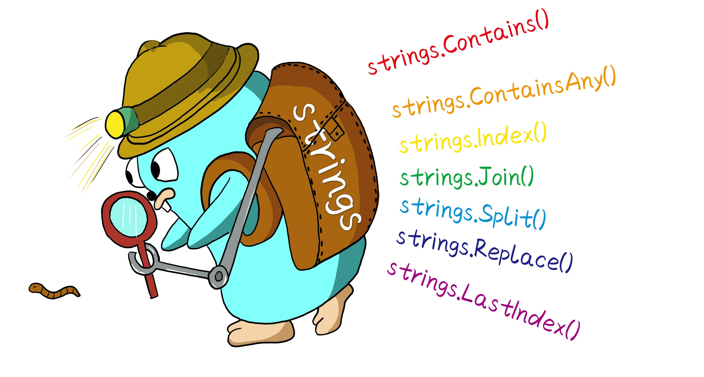

```go
//1是否包含指定内容 返回bool类型
s1 := "ok let's go"
fmt.Println(strings.Contains(s1, "go"))
//结果为true
```

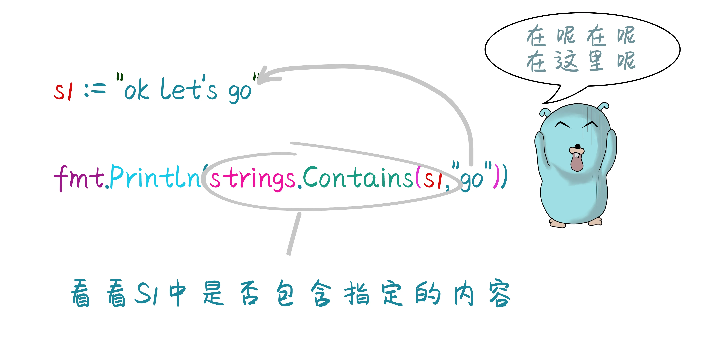

```go
//是否包含指定的字符串中任意一个字符 有一个出现过 就返回true
fmt.Println(strings.ContainsAny(s1, "glass"))

//返回指定字符出现的次数
fmt.Println(strings.Count(s1, "g"))

//文本的开头
fmt.Println(strings.HasPrefix(s1, "ok"))
//文本的结尾
fmt.Println(strings.HasSuffix(s1, ".txt"))

//查找指定字符在字符串中存在的位置 如果不存在返回-1
fmt.Println(strings.Index(s1, "g"))
//查找字符中任意一个字符出现在字符串中的位置
fmt.Println(strings.IndexAny(s1, "s"))
//查找指定字符出现在字符串中最后一个的位置
fmt.Println(strings.LastIndex(s1, "s"))

//字符串的拼接
s2 := []string{"123n", "abc", "ss"}
s3 := strings.Join(s2, "_")
fmt.Println(s3) // 123n_abc_ss

//字符串的切割
s4 := strings.Split(s3, "_")
fmt.Println(s4) // 返回切片[]string{"123n","abc","ss"}

//字符串的替换
s5 := "okoletsgo"
s6 := strings.Replace(s5, "o", "*", 1)
fmt.Println(s6) //*koletsgo
//TODO 1 只替换1次,  -1 全部替换

//字符串的截取
//str[start:end]包含start 不包含end
```

## strconv包

主要用于字符串和基本类型的数据类型的转换

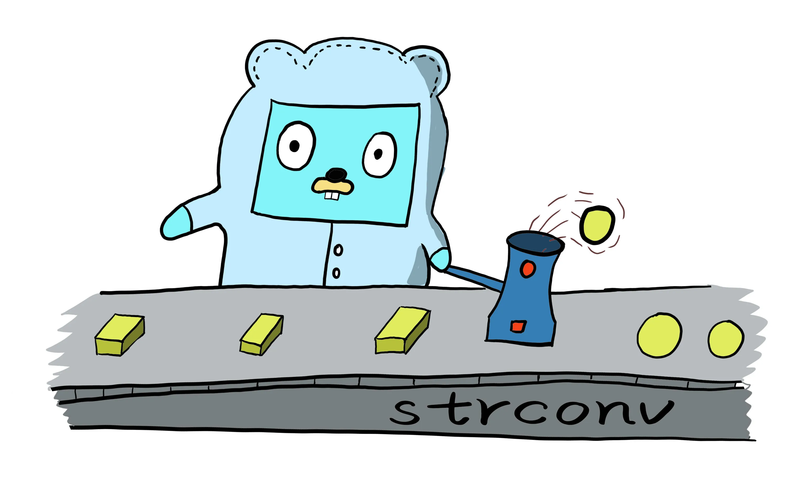

```go
/str：="aa"+100
//字符串和整形数据不能放在一起  所以需要将100 整形转为字符串类型
//+号在字符串中表示字符串的连接 在整形中表示数据的计算

//string 转 bool类型
s1 := "true" //字符串
b, err := strconv.ParseBool(s1)
if err != nil {
fmt.Println(err) //打印错误信息
}
fmt.Printf("%T,%t", b, b) //bool,true

//string 转int
s1 := "100" //字符串
b, err := strconv.ParseInt(s1, 10, 64)
//10 表示s1要转的数据是10进制 64位
if err != nil {
fmt.Println(err) //打印错误信息
}
fmt.Printf("%T,%d", b, b) //int64,100

//整形转为字符串
s := strconv.Itoa(23)
//字符串转为整形
i, e := strconv.Atoi(s)

```

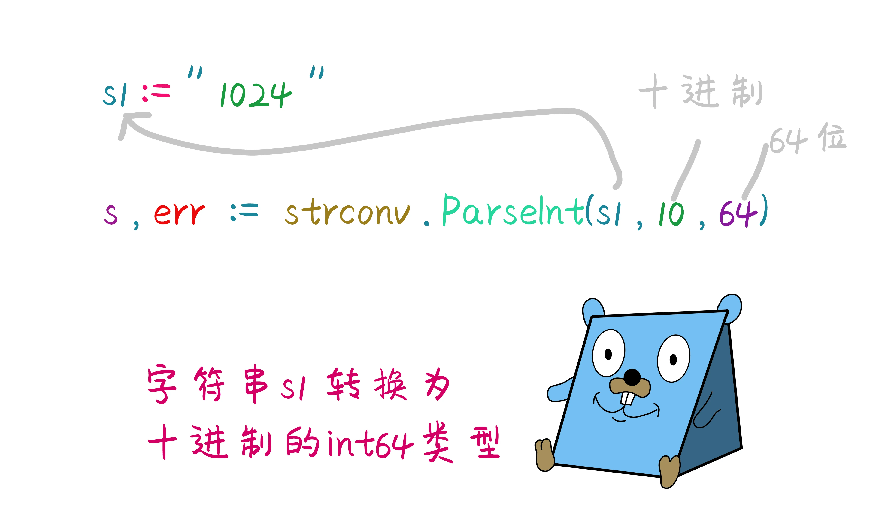

## time包

time包操作的都是时间，时间的单位都包括年，月，日，时，分，秒，毫秒，微妙，纳秒，皮秒。

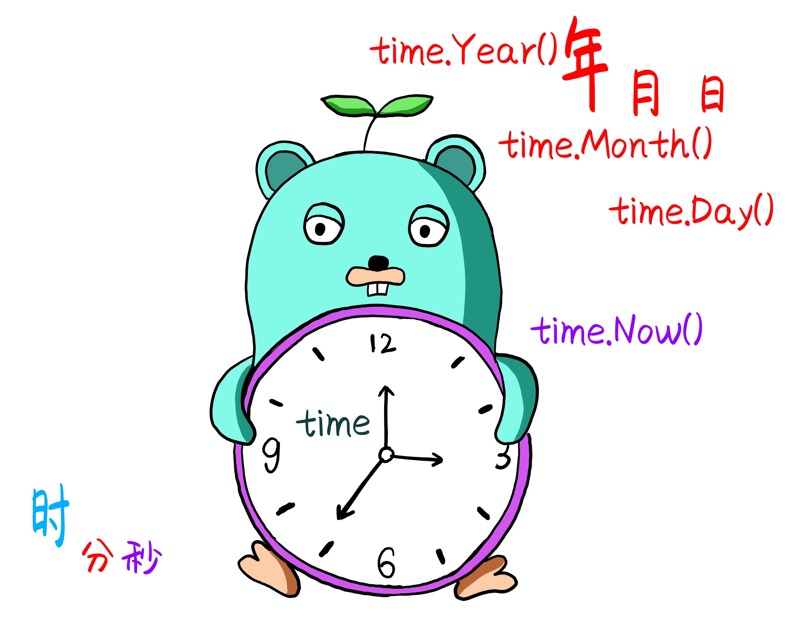

```go
package main

import (
	"fmt"
	"time"
)

func main() {
	// 获取当前时间
	t := time.Now()
	fmt.Println(t) //2020-03-31 21:26:01.7307507 +0800 CST m=+0.001999001
	//获取的时间后面的信息是时区

	// 上面的时间看起来不是很方便 于是需要格式化时间
	s := t.Format("2006年1月2日 15:04:05")
	fmt.Println(s)
}
```

需要注意的是Go语言中时间的格式化，需要指定格式化时间的模板, 不管年月日的类型格式怎么写，但是具体的数值必须写成`2006-01-02 15:04:05`， 如果不是这个日期就不能够格式化，这个时间也是为了纪念Go语言诞生的时间。


```go
s := t.Format("2006-1-2 15:04:05")
fmt.Println(s) //打印出的格式就是当前的时间 2020-3-31 23:08:35

s := t.Format("2006/1/2")
fmt.Println(s) //打印出的格式就是当前的年月日 2020/3/31
```

以上的时间格式都是time.Time类型的数据,如果将string类型的字符串时间转为具体时间格式则用time包下的parse函数。

```go
//字符串类型的时间
str := "2020年3月31日"
//第一个参数是模板,第二个是要转换的时间字符串
s, _ := time.Parse("2006年1月2日", str)
fmt.Println(s) //打印出的格式就是2020-03-31 00:00:00 +0000 UTC
```

```go
//获取年月日信息
year, month, day := time.Now().Date()
fmt.Println(year, month, day) //2020 March 31

//获取时分秒信息
hour, minute, second := time.Now().Clock()
fmt.Println(hour, minute, second) //23 23 54

//获取今年过了多少天了
tday := time.Now().YearDay()
fmt.Println(tday) //91  (今年已经过了91天了)

//获取今天是星期几
weekday := time.Now().Weekday()
fmt.Println(weekday) //Tuesday
```

## 时间戳

时间戳是指格林威治时间1970年01月01日00时00分00秒(北京时间1970年01月01日08时00分00秒)起至现在的总毫秒数。它主要是为用户提供一份电子证据.


```go
package main

import (
	"fmt"
	"time"
)

func main() {
	// 获取指定日期的时间戳
	t := time.Date(2020, 3, 31, 23, 30, 0, 0, time.UTC)
	timestamp := t.Unix()
	fmt.Println(timestamp) //1585697400

	// 获取当前时间的时间戳
	timestamp2 := time.Now().Unix()
	fmt.Println(timestamp2) //1585669151

	// 当前时间的以纳秒为单位的时间戳
	timestamp3 := time.Now().UnixNano()
	fmt.Println(timestamp3) //1585669151296330900
}
```

```go
//时间间隔 相加
now := time.Now()
//当前时间加上一分钟
t := now.Add(time.Minute)
fmt.Println(now) //2020-03-31 23:43:35.0004791 +0800 CST m=+0.002999201
fmt.Println(t)   //2020-03-31 23:44:35.0004791 +0800 CST m=+60.002999201

//计算两个时间的间隔
d := t.Sub(now)
fmt.Println(d) //1m0s  相差一分钟
```

## 时间戳与时间格式互转

```go
//将指定时间转为时间戳格式
beforetime := "2020-04-08 00:00:00"                             //待转化为时间戳的字符串
timeLayout := "2006-01-02 15:04:05"                             //转化所需模板
loc := time.Now().Location()                                    //获取时区
theTime, _ := time.ParseInLocation(timeLayout, beforetime, loc) //使用模板在对应时区转化为time.time类型
aftertime := theTime.Unix()                                     //转化为时间戳 类型是int64
fmt.Println(theTime)                                            //打印输出theTime 2020-04-08 00:00:00 +0800 CST
fmt.Println(aftertime)                                          //打印输出时间戳 1586275200

//再将时间戳转换为日期
dataTimeStr := time.Unix(aftertime, 0).Format(timeLayout) //设置时间戳 使用模板格式化为日期字符串
fmt.Println(dataTimeStr)
```

## 包的声明

以上所讲内容都是Go语言中内置的包，我们自己开发的代码也是通过包的形式定义的，每一个包就相当于一个目录。在文档第一行声明package。

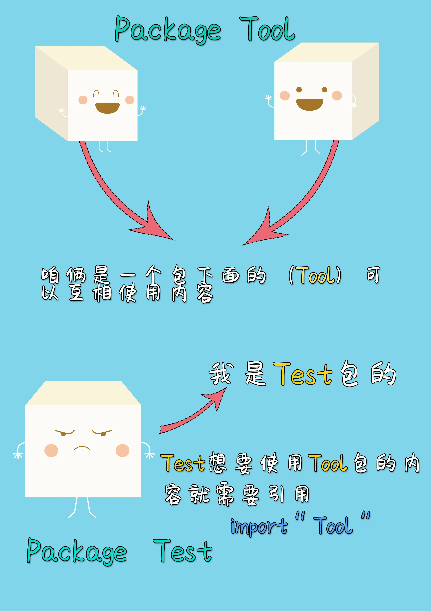
包的声明通常和目录的名称一致，并且同一个目录下不允许出现多个包名称，同一个目录下同级别的文件都是一个包，则package名都是一样的。
main 是程序的入口包  不能用作其他的包的包名。

## 包的使用

使用import 导入包。go自己会默认从GO的安装目录和GOPATH环境变量中的目录，检索src下的目录进行检索包是否存在。所以导入包的时候路径要从src目录下开始写。GOPATH 就是我们自己定义的包的目录。

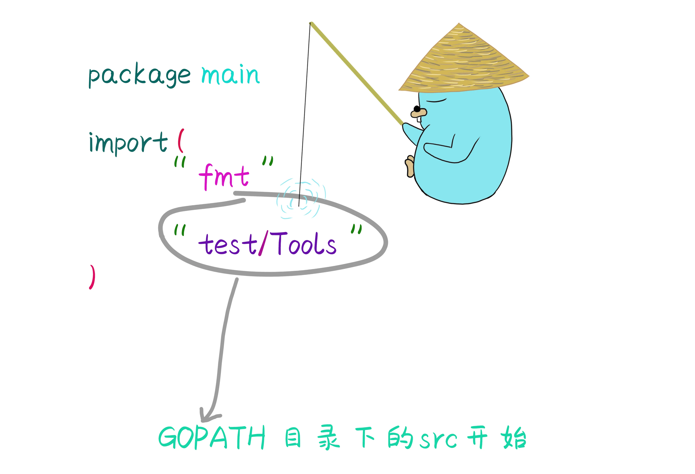

我们导入包目的是要使用写在其他包内的函数，或者包里面的结构体方法等等，如果在同一个包下的内容不需要导包，可以直接使用。也可以给包起别名，如果包原有名称太长不方便使用，则可以在导入包之前加上别名。

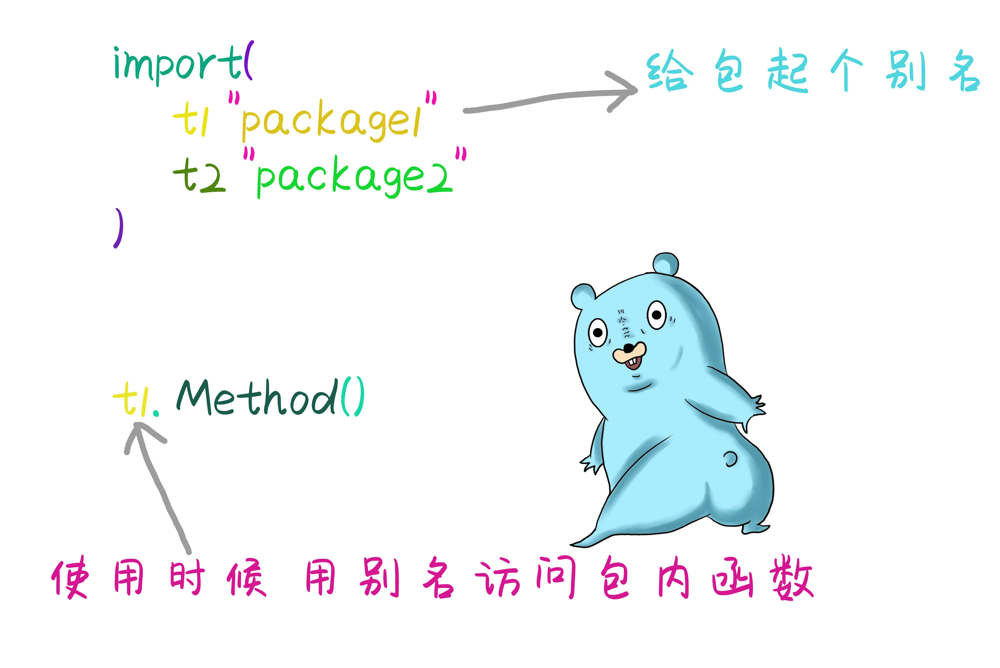

## 包管理方案

程序在编写过程中往往会使用到除自己程序外的第三方包，可以使用Go命令 `go get` 来导入需要的第三方包到配置的GOPATH中。

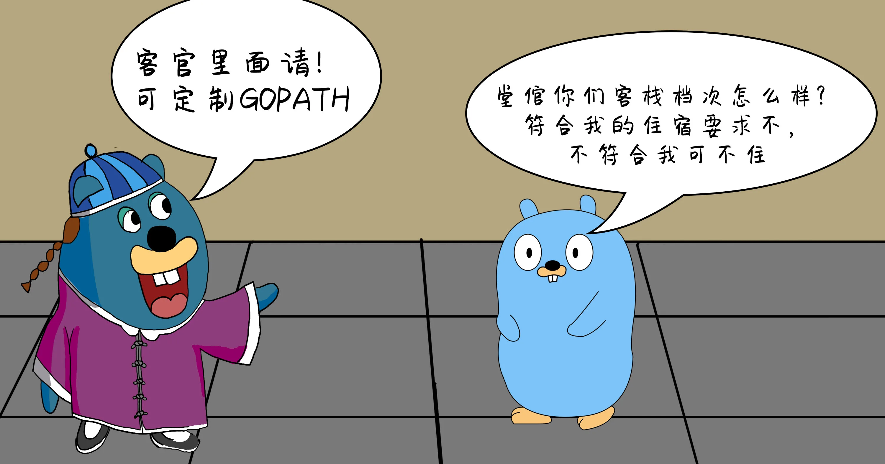

### dep管理方案

但是早期的Go语言被很多开发者所诟病的一个问题是依赖包的管理，在Golang1.5版本之前需要设置GOPATH来解决所有包依赖的问题，但是这样会有很多问题，如果我们两个项目引用的包版本不一致，而GOPATH中只有一个版本，就需要使用多个GOPATH来解决这样的问题，这样来回切换GOPATH是很不方便的。于是Go在1.9之后加入包管理方案解除了GOPATH的依赖。于是出现了`dep`和`glide`在项目中加入了`vender`目录来存储所有项目中需要引入的包。

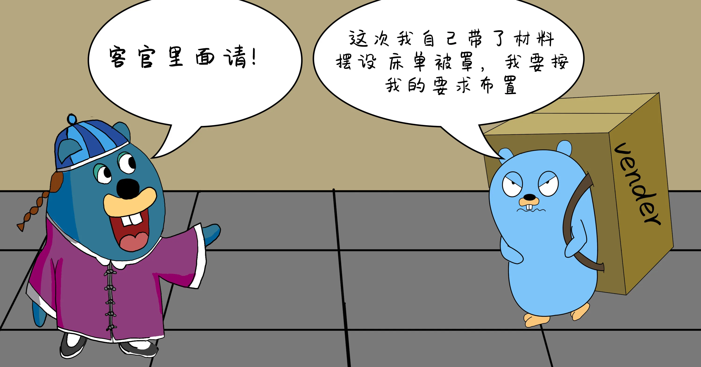

安装dep

MacOS `brew install dep`

Linux `curl https://raw.githubusercontent.com/golang/dep/master/install.sh | sh`

Windows   `go get -u github.com/golang/dep/cmd/dep`

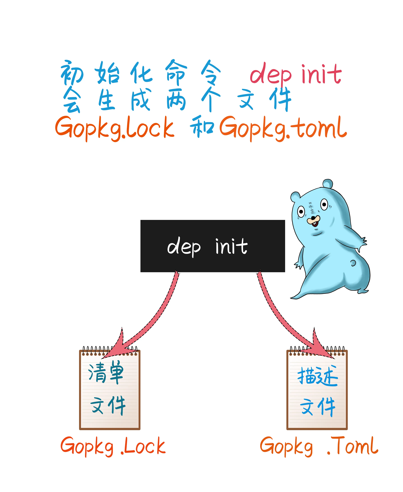

使用 `dep status` 查看项目依赖的详细信息和状态。

`dep ensure` 查看所有的依赖库都已经安装，如果没有就去下载。
`dep ensure add github.com/go-sql-driver/mysql `
下载添加新的依赖库，并增量更新清单文件和校验描述文件。
dep不是每次都去下载，他会先在本地环境中找如果没有找到则会到网上下载并添加到本地仓库。

### mod 模块化管理方案


Go.mod是Golang1.11版本新引入的官方包管理工具用于解决之前没有地方记录依赖包具体版本的问题，方便依赖包的管理。

使用`go mod` 管理项目，不需要非得把项目放到GOPATH指定目录下，可以在电脑上任何位置新建一个项目。

### mod初始化

使用mod需要注意的是：

- 如果Go的版本太低不能使用，建议将Go的版本升级到最新。

- 环境变量中可以增加`GOPROXY=https://goproxy.io` 这样没有梯子的情况下可以正确的加载相应的包文件。

- 环境变量`GO111MODULE`不要设置，如果已经增加了这个变量请务必设置为`GO111MODULE=auto`。

- 在项目的根目录下使用命令`go mod init projectName`。

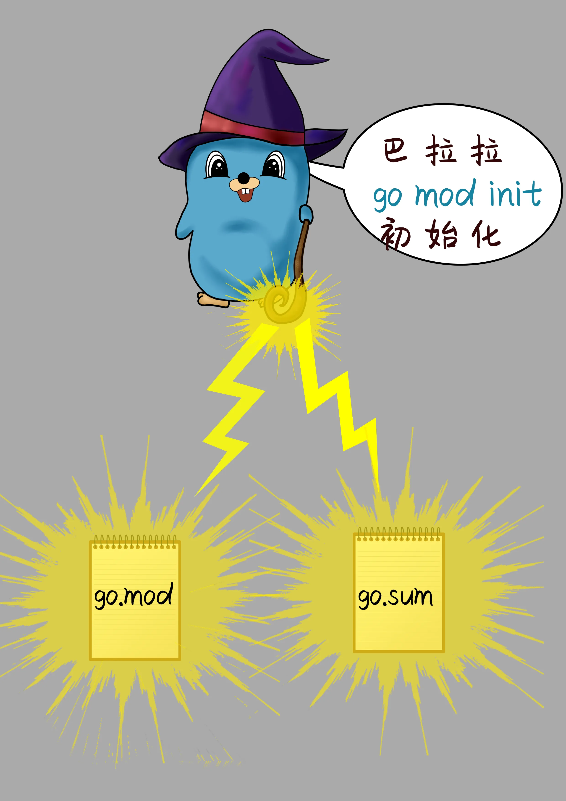

执行上面的命令之后，就已经可以开发编译运行此项目了。他已经自动引用了项目中所有的包文件。
