# 好家伙你要媳妇不要--函数

原文链接：https://juejin.cn/book/6844733833401597966/section/6844733833481453575

# 漫画 Go 语言  函数

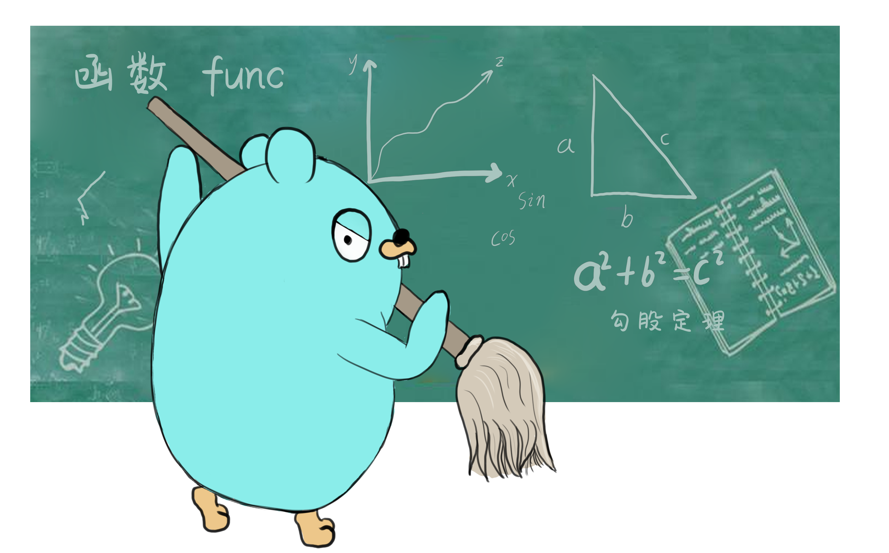

## 函数的声明

函数代表了代码执行的逻辑，Go语言中函数的关键字是func加上函数名，参数列表，返回值和函数体，构成一个函数。我们在开发一个程序中一定会包含很多个函数。

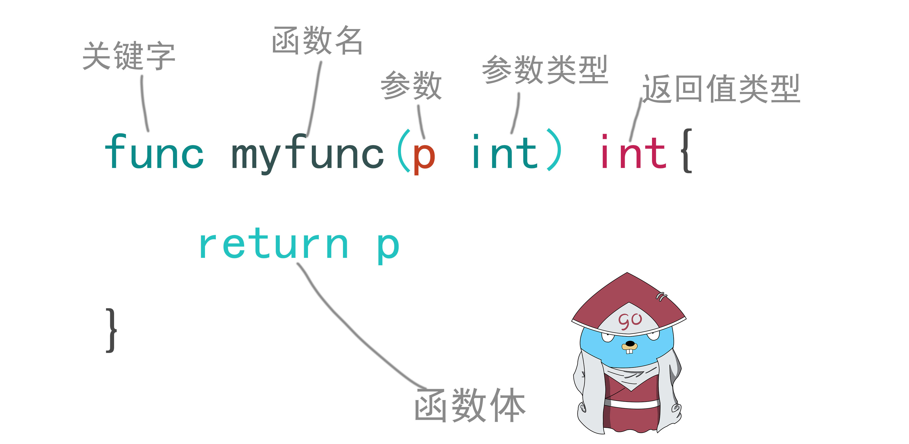
我们自定义函数的时候，需要注意按照规则定义必须满足以下格式，函数的名字可以由字母和数字组成，但是不能是数字开头，函数的首字母区分大小写，如果是大写的表示公共的函数，其他包内可以调用到，相当于其他语言中的public 前提是在别的包中引入了当前包。

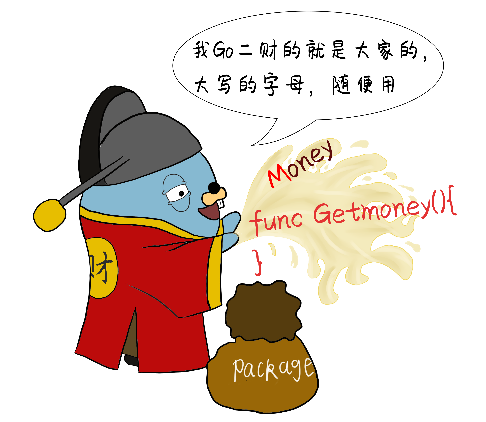

如果是小写的，表示私有的函数，仅能够在本包中调用，相当于其他语言中的private。

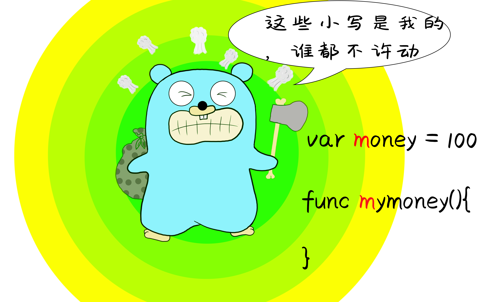

## 函数的使用

声明一个函数之后并不会被执行，只有调用函数之后才会执行。例如要执行函数myfunc 在函数名加上()表示调用。

```go
//函数的定义并不会执行函数的过程  只有调用的时候才会执行
func main(){
//这是一个特殊的函数  由系统自动调用
}

func funcname(parametername1 type1,parametername2 type2)(output1 type1,output2 type2){
//处理逻辑
//返回  go语言支持多返回值，一个函数可以返回多个结果
return value1,value2
}

()表示函数 也是函数的标志
()里面是参数列表 这里传入的是形参 用于接收函数外部传入的数据
返回值列表，函数执行后返回给调用方的结果
函数可以没有参数 也可以没有返回值
func test(){

}

调用函数的语法
在调用的地方使用函数的名字加上()

```

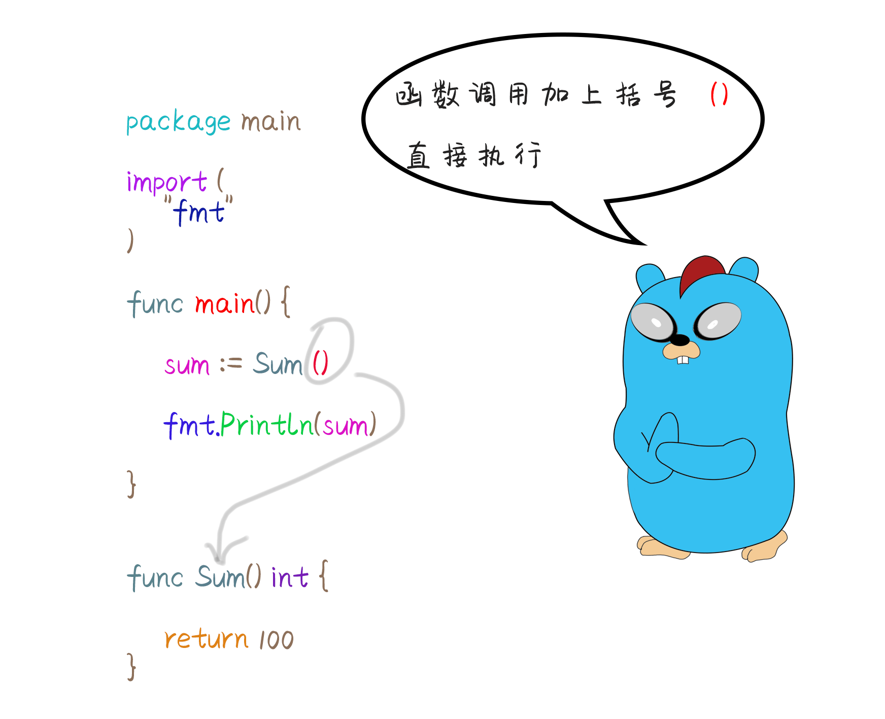

```go
package main

import (
"fmt"
)

func main() {
//函数的调用
sum := getSum()
fmt.Printf("%d", sum) //5050
}

//定义函数 求1-100的和
func getSum() int {
sum := 0
for i := 0; i <= 100; i++ {
sum += i
}
return sum
}

```

函数在使用时候注意:

- 函数必须先定义才能使用，如果定义后不使用，虽然不会报错但也没有意义。

- 函数名不能重复。

- main函数是程序中特殊的函数，其他自己定义的函数不能叫这个名字。

## 函数的参数

函数参数分为
`形式参数`  也叫形参，在函数定义的时候用于接收外部传入的数据变量， 函数中某些变量数值无法确定， 需要由外部传入。
`实际参数`  也叫实参， 函数调用的时候，给形参赋值的实际数据。
`可变参数`  表示可以传入的参数个数不固定， 表示可以传入任意数量的参数。

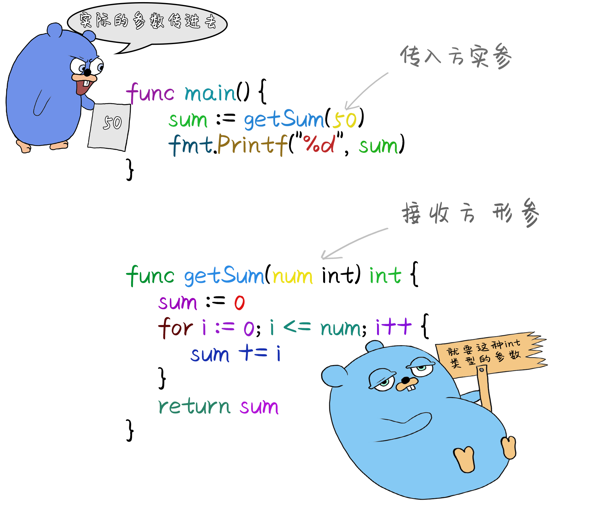

```go
package main

import (
"fmt"
)

func main() {
//函数的调用
sum := getSum(50)//这里50 作为实参传递给方法
fmt.Printf("%d", sum) //5050
}

//定义函数  num为形参用于接收调用方传递过来的参数
func getSum(num int) int {
sum := 0
for i := 0; i <= num; i++ {
sum += i
}
return sum
}

```

## 函数返回值/多返回值

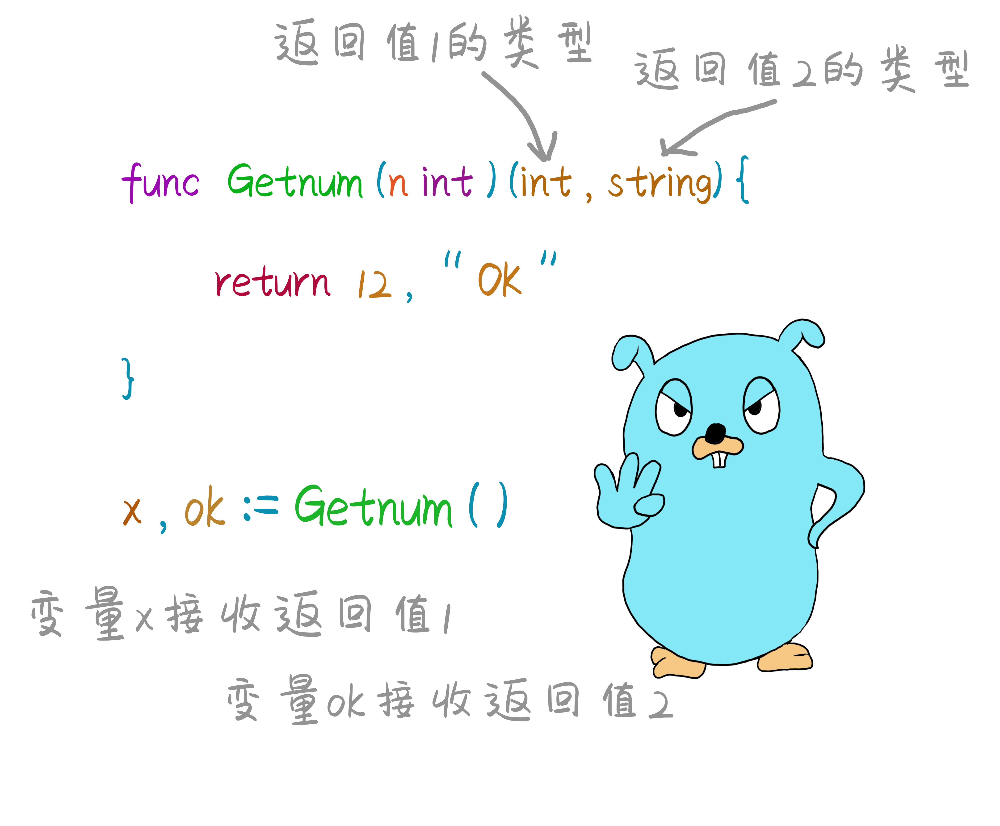

函数可以定义多个返回值，并且返回值类型，返回值数量都必须是一一对应的，return是将结果返回到函数的调用处，结束函数的执行。 `_` 空白标识符，舍弃返回的数据。

## 变量在函数的作用域

```go
package main

import (
"fmt"
)

func main() {
x := 2
test()
fmt.Print(x)

if i := 2; i <= 30 {
x := 20
fmt.Println(x) //if语句内部定义的x
fmt.Println(i) //if内部定义的i  if之外就不能访问了
}
}

//函数外部定义全局变量
//全局变量不支持简短定义方法 n:=0
var n = 3 //全局变量可以随意被修改 如果不想被修改可以定义为常量

func test() {
//fmt.Print(x) //undefined: x  未定义 x是main函数中定义的变量 所以不能访问
fmt.Println(n) //全局变量 任何地方都可以访问
}

```

## 函数作为参数传递

Go语言中函数也是一种数据类型，也可以跟其他数据类型一样存储在一个变量中。调用变量时候也就相当于调用函数了。

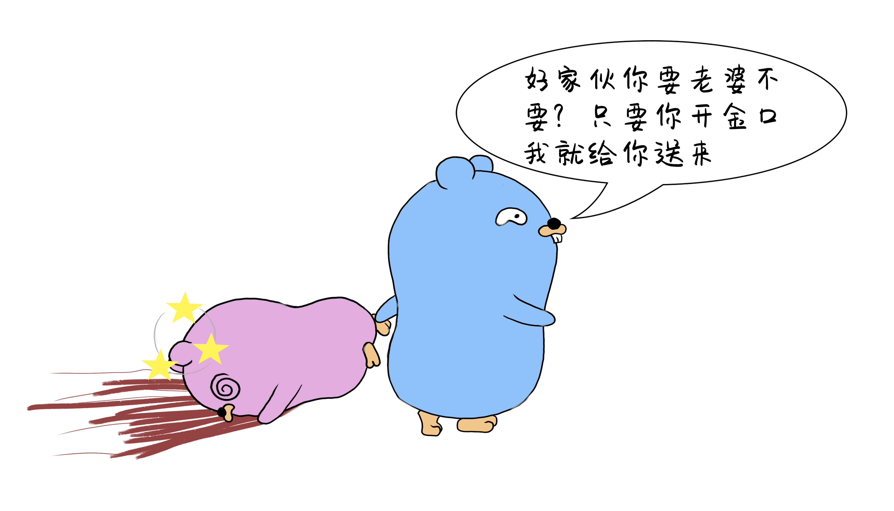

```go
package main

import (
"fmt"
)

func main() {
//声明一个变量f  类型是一个函数类型
var f func()
//将自定义函数myfunc 赋给变量f
f = myfunc
//调用变量f 相当于调用函数myfunc()
f()
}

//自定义函数
func myfunc() {
fmt.Println("myfunc...")
}

```

## 匿名函数

匿名也就是没有名字的函数

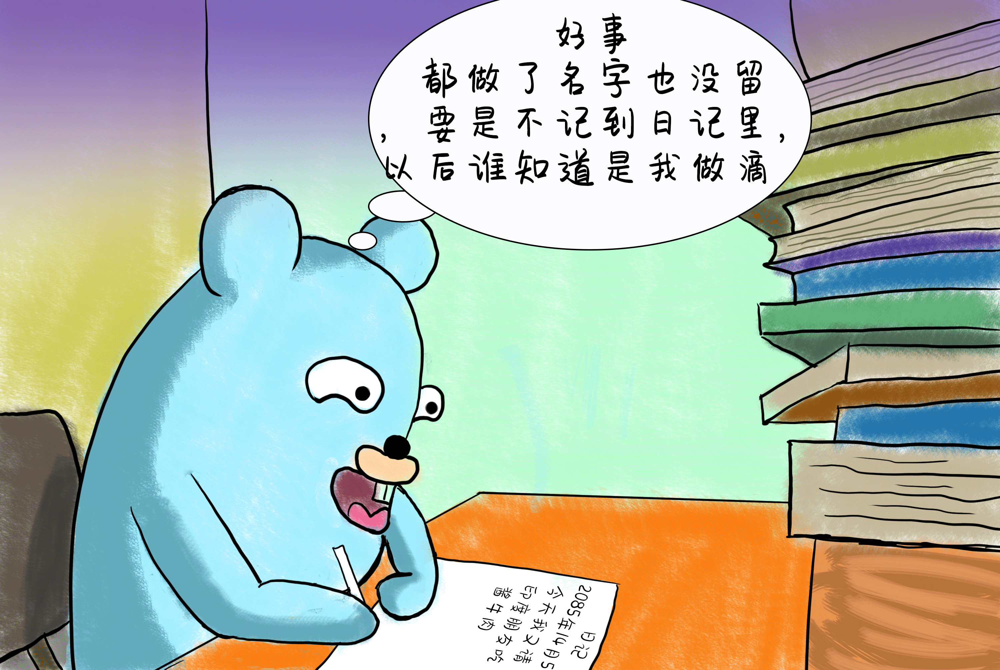

定义一个匿名函数直接加上()就相当于直接调用了，通常只能调用一次，可以将匿名函数赋值给一个变量，这个变量就代表了这个函数。则可以调用多次。

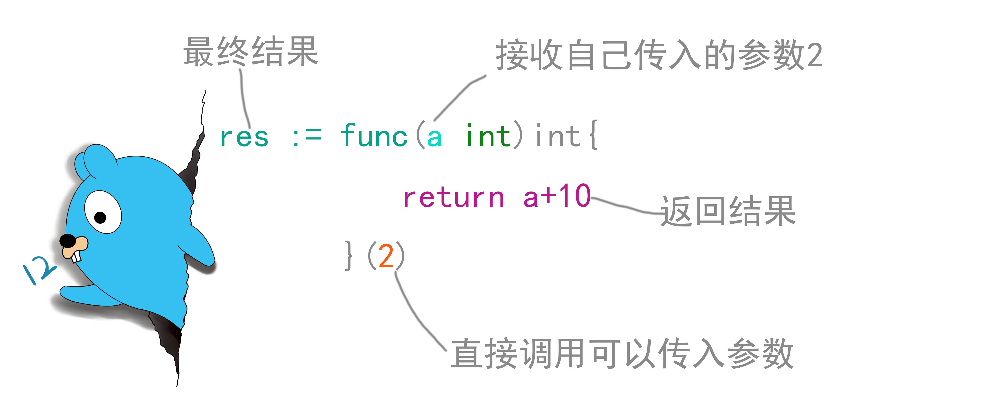

```go
package main

import (
"fmt"
)

func main() {

func() {
fmt.Println("匿名函数")
}()

func(a int, b int) {
fmt.Println(a, b)
}(1, 2) //括号内为匿名函数的实参

res := func(a int, b int) int {
return a + b
}(1, 2)
fmt.Println(res) //打印匿名函数返回值

//如果不写后面的括号 则函数没有被调用
func(a, b int) int {
return a + b
} //没有加括号只是定义了一个函数
}

```

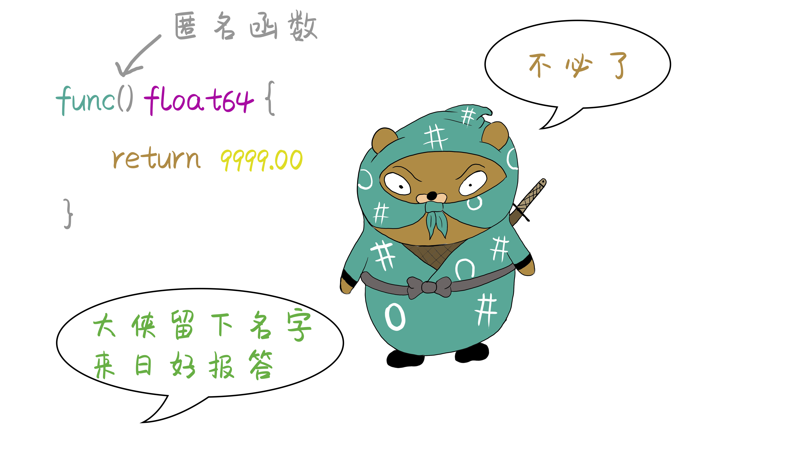

- 匿名函数可以作为另一个函数的参数

- 匿名函数可以作为另一个函数的返回值

```go
package main
import (
"fmt"
)
func main() {
res2 := oper(20, 12, add)
fmt.Println(res2)

//匿名函数作为回调函数直接写入参数中
res3 := oper(2, 4, func(a, b int) int {
return a + b
})
fmt.Println(res3)
}
func add(a, b int) int {
return a + b
}
func reduce(a, b int) int {
return a - b
}
//oper就叫做高阶函数
//fun 函数作为参数传递则fun在这里叫做回调函数
func oper(a, b int, fun func(int, int) int) int {
fmt.Println(a, b, fun) //20 12 0x49a810A   第三个打印的是传入的函数体内存地址
res := fun(a, b)//fun 在这里作为回调函数 程序执行到此之后才完成调用
return res
}

```

根据go语言的数据类型的特点，函数也是一种类型，所以可以将一个函数作为另一个函数的参数传递func1()和func2()是两个函数，将func1函数作为func2这个函数的参数，func2函数就叫做高阶函数，因为他接收了一个函数作为参数。所以func1叫做回调函数，他作为另一个函数的参数。

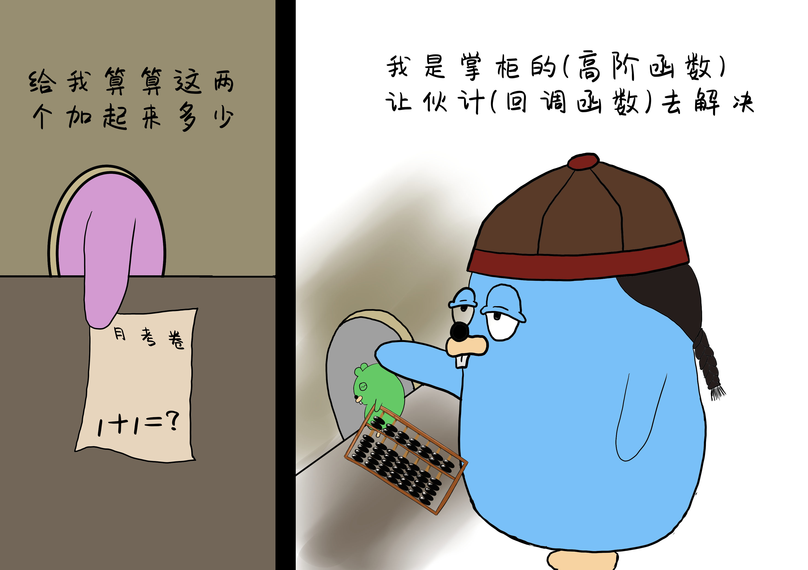

## defer语句

defer 表示延时推迟的意思，在go语言中用来延时一个函数或者方法的执行。如果一个函数或者方法添加了defer关键字，表示则暂时不执行，等到主函数的所有方法都执行完后才开始执行。


当多个函数被defer的时候他们被添加到一个堆栈中，并且根据先进后出的原则执行。 即 `Last In First Out（LIFO）`

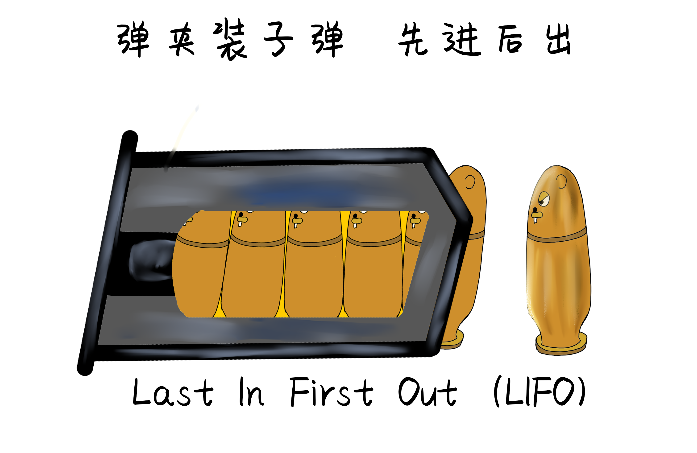

```go
package main

import (
"fmt"
)

func main() {
defer test(1) //第一个被defer的，函数后执行
defer test(2) //第二个被defer的，函数先执行
test(3)       //没有defer的函数，第一次执行

//执行结果
//3
//2
//1
}

func test(s int) {
fmt.Println(s)
}

```

defer函数调用时候，参数已经传递了，只不过代码暂时不执行而已。等待主函数执行结束后，才会去执行。

```go

func test2() {
a := 2
test(a)
defer test(a) //此时a已经作为2 传递出去了 只是没有执行
a++           //a++ 不会影响defer函数延迟执行结果
test(a)
}

```

## 闭包

go语言支持将一个函数作为参数传递，也支持将一个函数作为返回值。一个外层函数当中有内层函数，这个内层函数会操作外层函数的局部变量。并且，外层函数把内层函数作为返回值，则这里内层函数和外层函数的局部变量，统称为 闭包结构 。 这个外层函数的局部变量的生命周期会随着发生改变，原本当一个函数执行结束后，函数内部的局部变量也会随之销毁。但是闭包结构内的局部变量不会随着外层函数的结束而销毁。


```go
package main

import (
"fmt"
)

func main() {
res := closure()
fmt.Println(res) //0x49a880  返回内层函数函数体地址
r1 := res()      //执行closure函数返回的匿名函数
fmt.Println(r1)  //1
r2 := res()
fmt.Println(r2) //2
//普通的函数应该返回1，而这里存在闭包结构所以返回2 。
//一个外层函数当中有内层函数，这个内层函数会操作外层函数的局部变量,并且外层函数把内层函数作为返回值,则这里内层函数和外层函数的局部变量,统称为闭包结构。这个外层函数的局部变量的生命周期会发生改变，不会随着外层函数的结束而销毁。
//所以上面打印的r2 是累计到2 。

res2 := closure() //再次调用则产生新的闭包结构 局部变量则新定义的
fmt.Println(res2)
r3 := res2()
fmt.Println(r3)
}

//定义一个闭包结构的函数 返回一个匿名函数
func closure() func() int { //外层函数
//定义局部变量a
a := 0 //外层函数的局部变量
//定义内层匿名函数 并直接返回
return func() int { //内层函数
a++ //在匿名函数中将变量自增。内层函数用到了外层函数的局部变量，此变量不会随着外层函数的结束销毁
return a
}
}

```

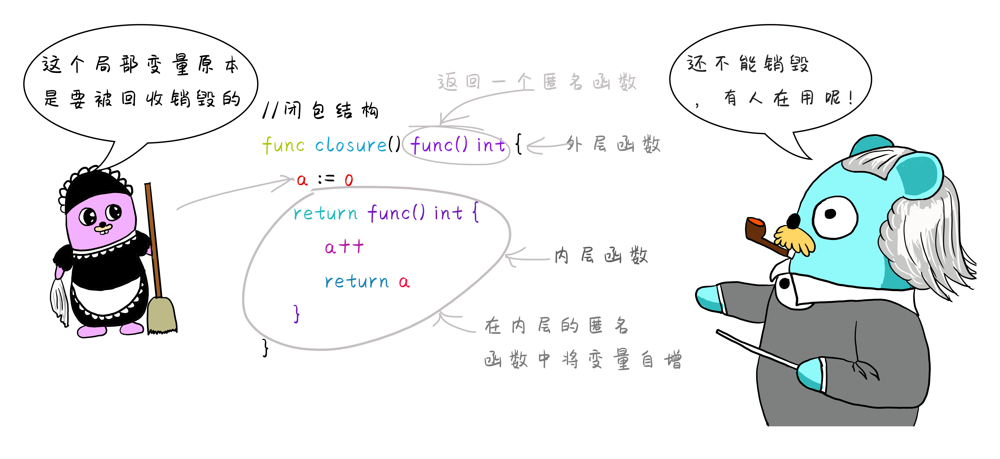

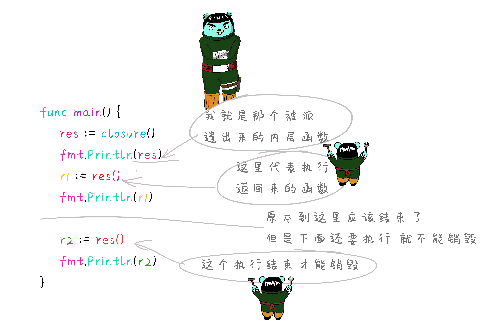

## 指针

指针是存储另一个变量的内存地址的变量。 例如： 变量B的值为100， 地址为0x1122。变量A的值为变量B的地址0x1122，那么A就拥有了变量B的地址，则A就成为指针。Go语言中通过`&`获取变量的地址。通过`* `获取指针所对应的变量存储的数值。

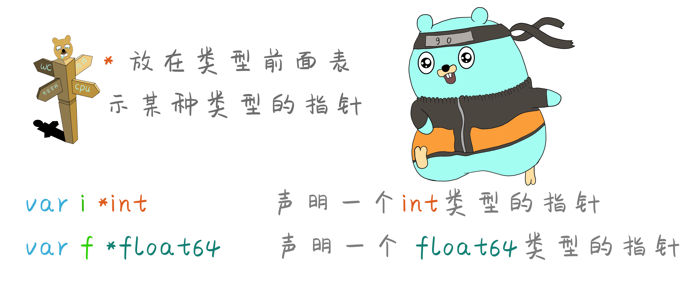

```go
package main

import (
"fmt"
)

func main() {

//定义一个变量
a := 2
fmt.Printf("变量A的地址为%p", &a) //通过%p占位符, &符号获取变量的内存地址。
//变量A的地址为0xc000072090

//创建一个指针
// 指针的声明 通过 *T 表示T类型的指针
var i *int     //int类型的指针
var f *float64 //float64类型的指针
fmt.Println(i) // < nil >空指针
fmt.Println(f)

//因为指针存储的变量的地址 所以指针存储值
i = &a
fmt.Println(i)  //i存储a的内存地址0xc000072090
fmt.Println(*i) //i存储这个指针存储的变量的数值2
*i = 100
fmt.Println(*i) //100
fmt.Println(a)  //100通过指针操作 直接操作的是指针所对应的数值

}

```

指针的指针，也就是存储的不是具体的数值了，而是另一个指针的地址。

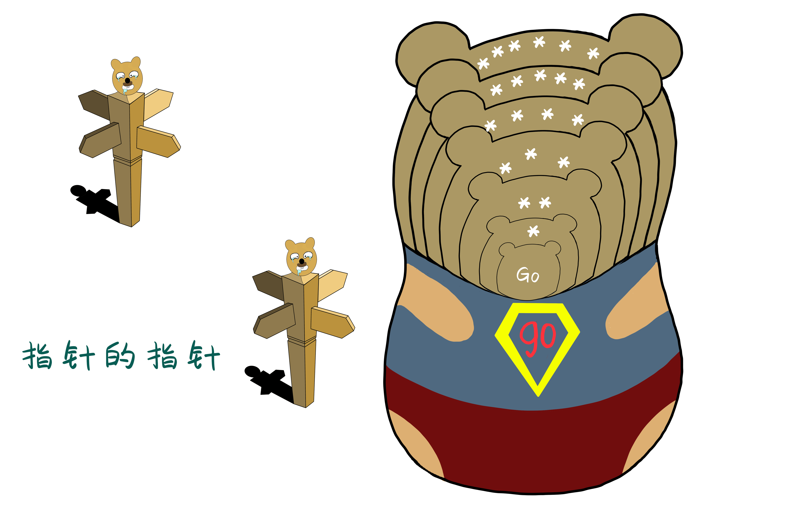

```go
func main(){
a := 2
var i *int         //声明一个int类型的指针
fmt.Println(&a)	   //0xc00000c1c8
i = &a             //将a的地址取出来放到i里面
fmt.Println(&i)    //0xc000006028
var a2 **int       //声明一个指针类型的指针
a2 = &i            //再把i的地址放进a2里面
fmt.Println(a2)    //获取的是a2所对应的数值0xc000006028也就是i的地址
}

```

## 数组指针

意思为，数组的指针。 首先是他是一个指针， 指向一个数组，存储数组的地址。

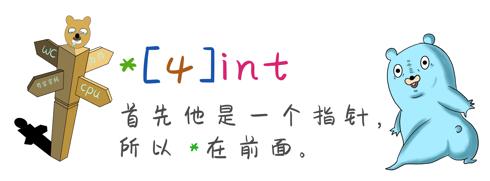

```go
package main

import (
"fmt"
)

func main() {
//创建一个普通的数组
arr := [3]int{1, 2, 3}
fmt.Println(arr)

//创建一个指针 用来存储数组的地址 即：数组指针
var p *[3]int
p = &arr        //将数组arr的地址，存储到数组指针p上。
fmt.Println(p)  //数组的指针 &[1 2 3] 后面跟数组的内容

//获取数组指针中的具体数据 和数组指针自己的地址
fmt.Println(*p) //指针所对应的数组的值
fmt.Println(&p) //该指针自己的地址0xc000006030

//修改数组指针中的数据
(*p)[0] = 200
fmt.Println(arr) //修改数组中下标为0的值为200   结果为：[200 2 3]

//简化写法
p[1] = 210       //意义同上修改下标为1的数据
fmt.Println(arr) //结果： [200 210 3]
}

```

## 指针数组

其实就是一个普通数组，只是存储数据类型是指针。

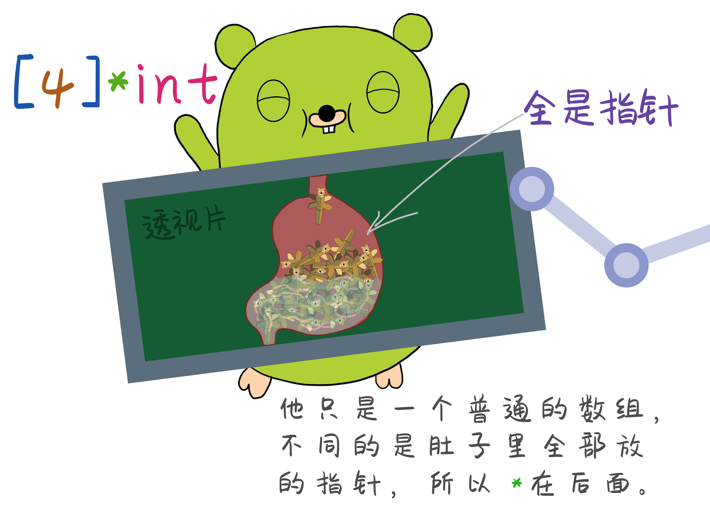

```go
package main

import (
"fmt"
)

func main() {
//定义四个变量
a, b, c, d := 1, 2, 3, 4

arr1 := [4]int{a, b, c, d}
arr2 := [4]*int{&a, &b, &c, &d} //将所有变量的指针，放进arr2里面

fmt.Println(arr1)   //结果为：[1 2 3 4]
fmt.Println(arr2)   //结果为：[0xc00000c1c8 0xc00000c1e0 0xc00000c1e8 0xc00000c1f0]

arr1[0] = 100  //修改arr1中的值
fmt.Println("arr1的值：", arr1)  //修改后的结果为：[100 2 3 4]

fmt.Println("a=", a) //变量a的值还是1，相当于值传递，只修改了数值的副本。

//修改指针数组
*arr2[0] = 200 //修改指针的值
fmt.Println(arr2)
fmt.Println("a=", a) //200  引用传递 修改的是内存地址所对应的值 所以a也修改了

//循环数组，用*取数组中的所有值。
for i := 0; i < len(arr2); i++ {
fmt.Println(*arr2[i])
}
}

```

## 指针函数

如果一个函数返回结果是一个指针，那么这个函数就是一个指针函数。

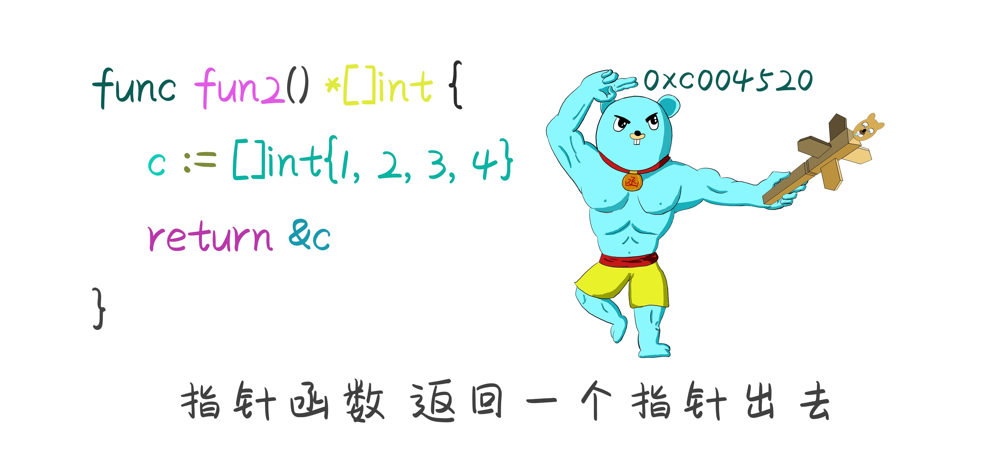

```go
package main

import (
"fmt"
)

func main() {
//函数默认为指针 只是不需要用 *
a := fun1
fmt.Println(a) //0x49c670 函数默认为指针类型
a1 := fun1()
fmt.Printf("a1的类型：%T,a1的地址是%p 数值为%v \n", a1, &a1, a1) //[]int,a1的地址是0xc0000044c0 数值为[1 2 3]

a2 := fun2()
fmt.Printf("a2的类型：%T,a2的地址是%p 数值为%v \n", a2, &a2, a2) //*[]int,a1的地址是0xc000006030 数值为&[1 2 3 4]
fmt.Printf("a2的值为：%p\n", a2)                          //0xc000004520 指针函数返回的就是指针
}

//一般函数
func fun1() []int {
c := []int{1, 2, 3}
return c
}

//指针函数 返回指针
func fun2() *[]int {
c := []int{1, 2, 3, 4}
fmt.Printf("c的地址为%p：\n", &c) //0xc000004520
return &c
}

```

## 指针参数

指针属于引用类型的数据， 所以在传递过程中是将参数的地址传给函数，将指针作为参数传递时，只有值类型的数据，需要传递指针，而引用类型的数据本身就是传递的地址，所以数组传递可以使用指针，切片是引用类型数据，则不需要传递指针传递。

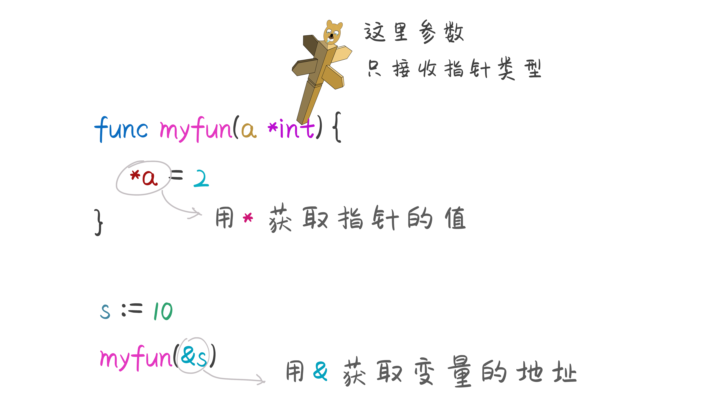

```go
package main

import (
"fmt"
)

func main() {
s := 10
fmt.Println(s) //调用函数之前数值是10
fun1(&s)
fmt.Println(s) //调用函数之后再访问则被修改成2
}

//接收一个int类型的指针作为参数
func fun1(a *int) {
*a = 2
}

```

## panic() 和 recover()

`panic宕机` `recover恢复`
panic 表示恐慌。当程序遇到一个异常时候可以强制执行让程序终止操作，同时需要引入defer函数类延时操作后面的函数，在defer函数中通过recover来恢复正常代码的执行，因为defer是根据先入后出原则，所以先被defer的函数会放在最后执行，recover需要放在第一个被执行，当遇到panic时候恢复正常的代码逻辑。同时也可将错误信息通过recover获取panic传递的错误信息。


```go
package main

import (
"fmt"
)

func main() {
Test1()
}

func Test1() {
defer func() {
ms := recover()//这里执行恢复操作
fmt.Println(ms, "恢复执行了..") //恢复程序执行,且必须在defer函数中执行
}()
defer fmt.Println("第1个被defer执行")
defer fmt.Println("第2个被defer执行")
for i := 0; i <= 6; i++ {
if i == 4 {
panic("中断操作") //让程序进入恐慌 终端程序操作
}
}

defer fmt.Println("第3个被defer执行") //恐慌之后的代码是不会被执行的
}

```
