# 能生公Go的配方--结构体

原文链接：https://juejin.cn/book/6844733833401597966/section/6844733833485484046

# 漫画 Go 语言  结构体

## 结构体的概念

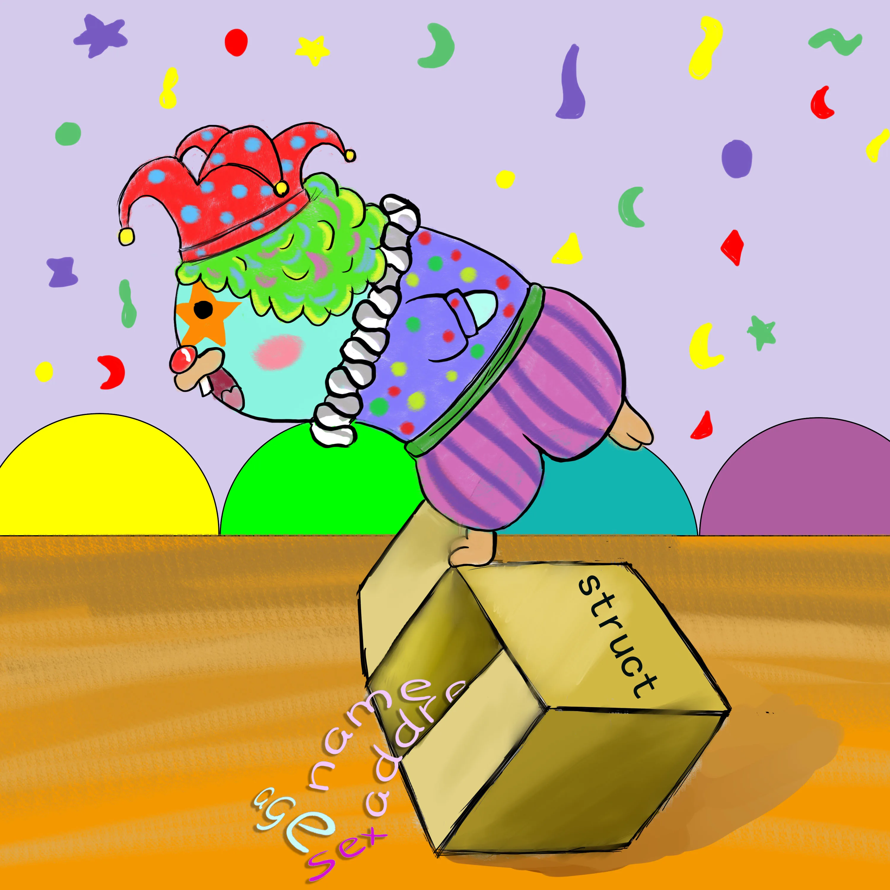

在Go语言中不存在Class类的概念,但是可以通过结构体struct来实现。结构体就是一种相同类型，或者不同类型的数据构成的数据的集合。里面的每一个变量叫做成员变量。也就是结构体的字段。每一个字段拥有自己的数据类型和数值。

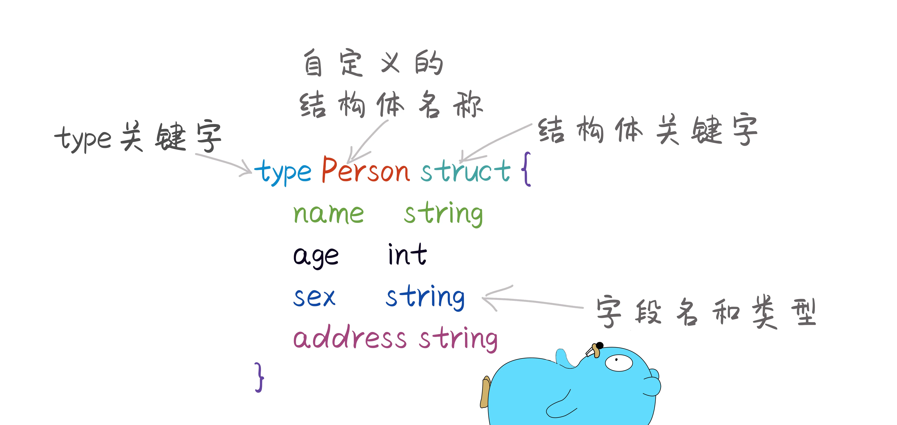

结构体定义之后也只是确定了这个结构长什么样子，都有哪些字段，并没有真实的数据，所以需要使用结构体时必须先实例化结构体。赋予结构体真实存在的意义。


## 结构体的实例化

```go
package main

import (
	"fmt"
)

// 定义结构体
type Person struct {
	name    string
	age     int
	sex     string
	address string
}

func main() {
	// 实例化后并使用结构体
	p := Person{} //使用简短声明方式，后面加上{}代表这是结构体

	p.age = 2 //给结构体内成员变量赋值
	p.address = "陕西"
	p.name = "好家伙"
	p.sex = "女"

	fmt.Println(p.age, p.address, p.name, p.sex) //使用点.来访问结构体内成员的变量的值。

}
```

还可以在结构体后面大括号内，直接给结构体成员变量赋值。

```go
//直接给成员变量赋值
p2 := Person{age: 2, address: "陕西", name: "老李头", sex: "女"}
fmt.Println(p2.age, p2.address, p2.name, p2.sex)
```

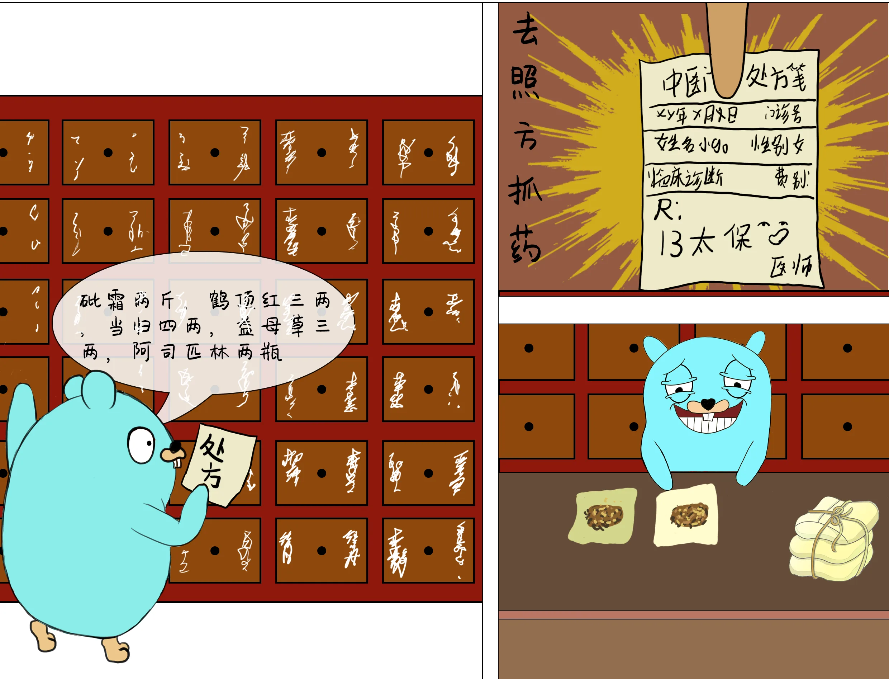

在Go语言中有一个关键字new可以用来实例化结构体。本质上是分配了一个某种类型的内存空间，所以使用new关键字默认就会返回一个指针。使用new创建结构体，默认就是一个指针类型的结构体。

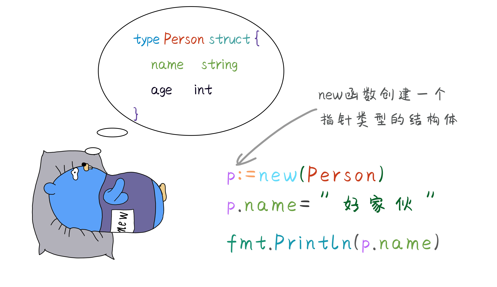

```go
package main

import (
	"fmt"
)

// 定义结构体
type Person struct {
	name    string
	age     int
	sex     string
	address string
}

func main() {
	p2 := Person{age: 2, address: "陕西", name: "老李头", sex: "女"}

	// 1 使用结构体指针
	var p *Person
	p = &p2 //将p2 的地址赋给p
	fmt.Println(p)
	p.name = "好家伙" //修改p的值
	fmt.Println(p)
	fmt.Println(p2) //p2的值也被修改了

	// 2 使用new 创建结构体指针
	pnew := new(Person)
	fmt.Println(pnew)
	pnew.address = "陕西"
	pnew.age = 23
	pnew.name = "李书记"
	pnew.sex = "男"
	fmt.Println(pnew)
}
```

在Go语言中,使用`&`符号取地址时候，默认就对该类型进行了一次实例化操作。在开发过程中经常会以下面这种使用函数封装写法，来实例化一个结构体。

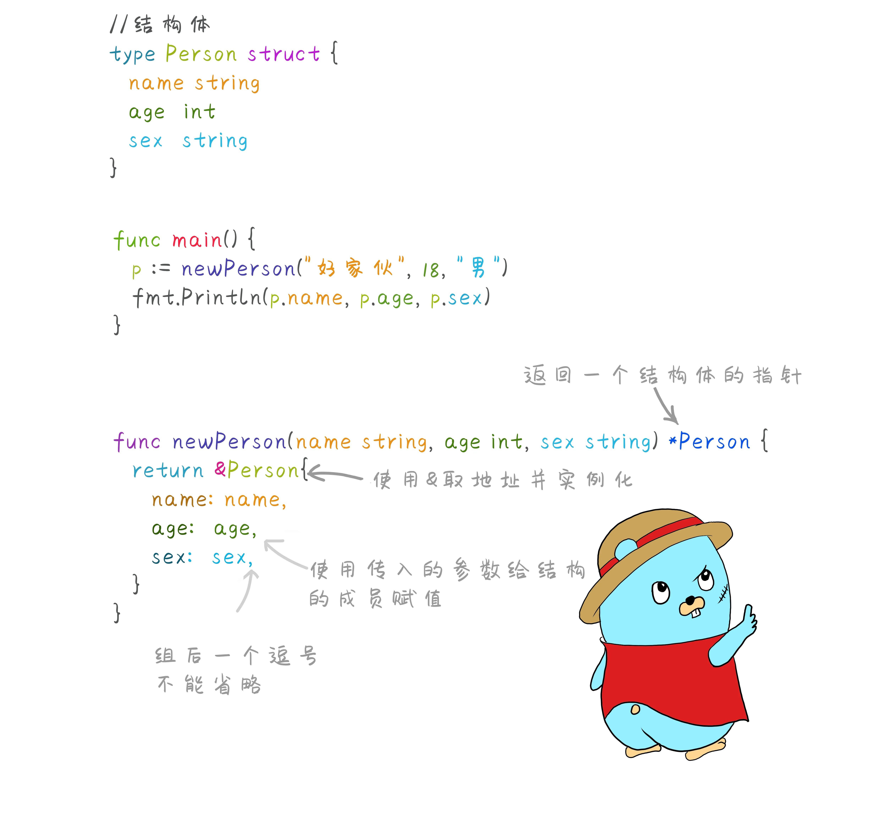

```go
package main

import (
	"fmt"
)

// 定义结构体
type Person struct {
	name string
	age  int
	sex  string
}

func main() {
	p := newPerson("好家伙", 18, "男")
	fmt.Println(p.name, p.age, p.sex)
}

// 使用函数来实例化结构体
func newPerson(name string, age int, sex string) *Person {
	return &Person{
		name: name,
		age:  age,
		sex:  sex,
	}
}
```

## 结构体初始化

结构体内的每一个字段，都有自己相应的数据类型，如果结构体被实例化后，字段的默认值就是该字段类型的零值，int就是`0`，string就是`""`,如果是指针类型，默认就是`nil`。

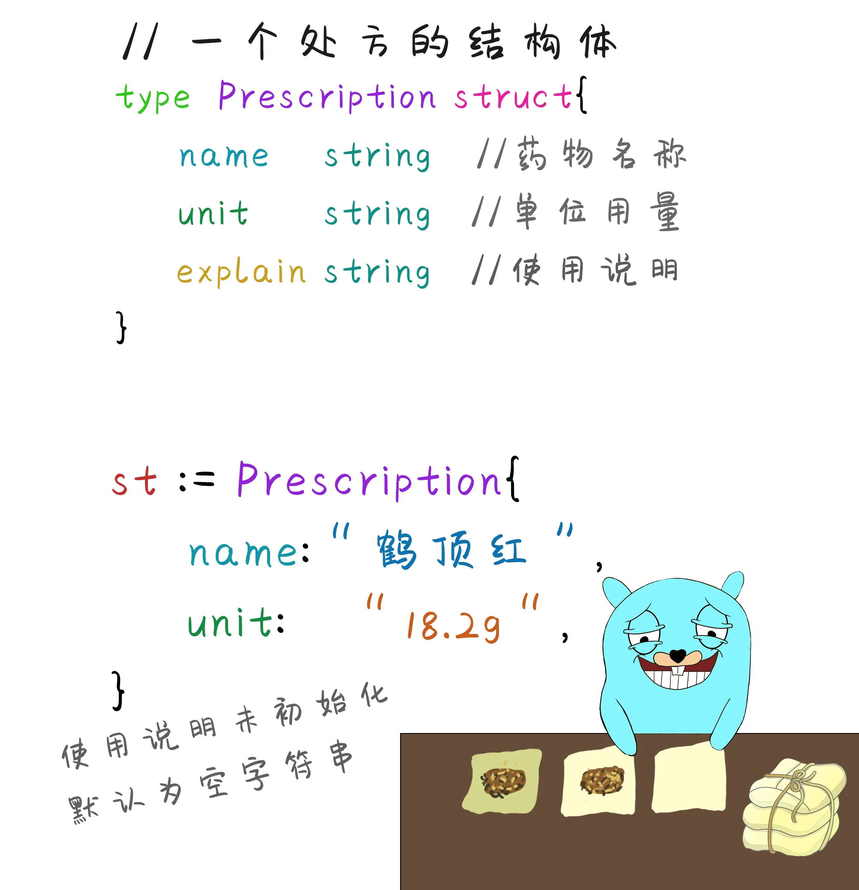

初始化时可以忽略成员内的字段名，但是必须初始化所有的字段，必须和结构体内字段顺序一致，并且不能和有字段的初始化方法混用。

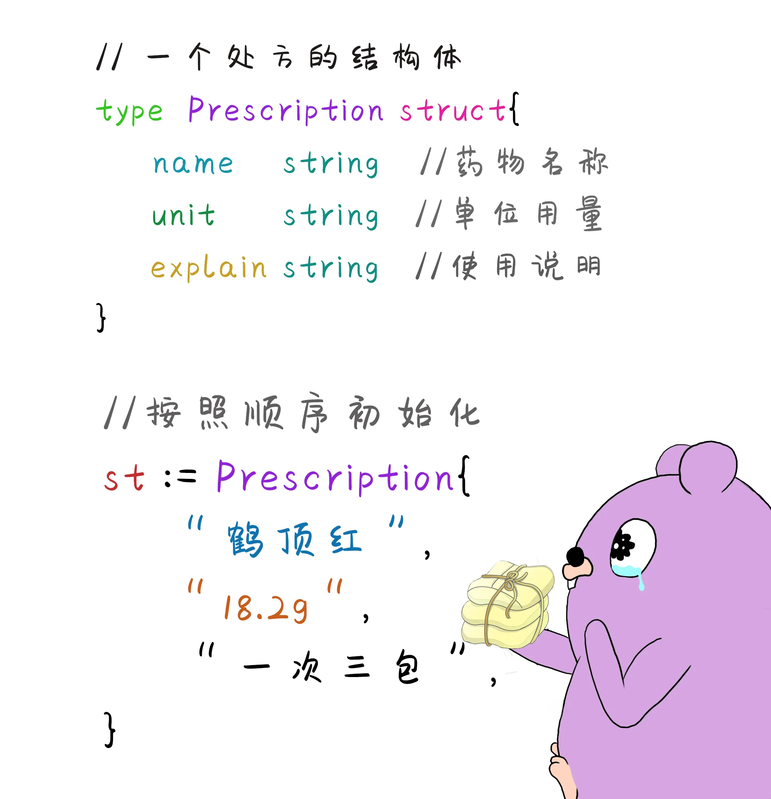

## 匿名结构体

匿名结构体就是没有类型名称，也不需要type关键字可以直接使用。

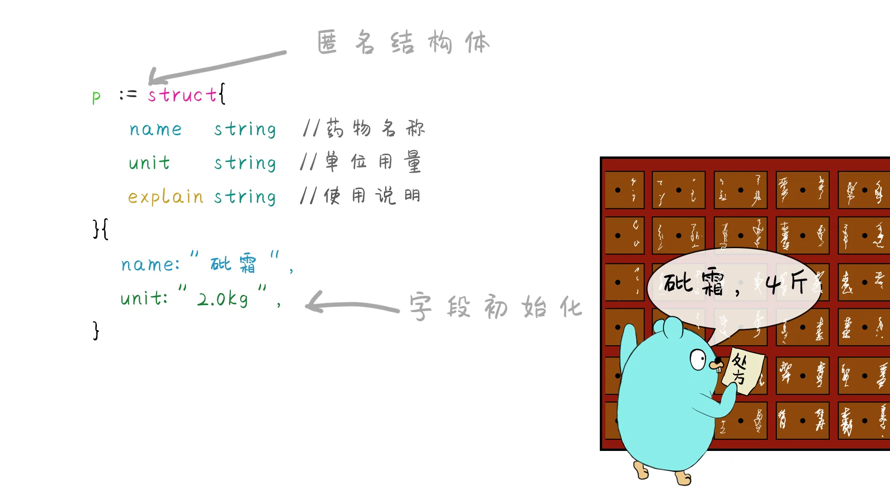

## 结构体嵌套


结构体可以包含多个字段，每一个字段都需要相应的数据类型，结构体也属于一种数据类型，所以结构体内部也可以包含另一个结构体。

```go
package main

import (
	"fmt"
)

// 结构体一
type Prescription struct {
	name     string
	unit     string
	additive Prescription2
}

// 结构体二
type Prescription2 struct {
	name string
	unit string
}

// 也可以嵌套结构体指针
type Prescription3 struct {
	name     string
	unit     string
	additive *Prescription2
}

func main() {

	p := Prescription{}
	p.name = "鹤顶红"
	p.unit = "1.2kg"
	p.additive = Prescription2{
		name: "砒霜",
		unit: "0.5kg",
	}
	fmt.Println(p)

	//结构体初始化可以使用上面两种格式将字段名和对应的值写在括号内，使用(字段名:值,)的格式填充
	//第二种初始化的方式，定义好结构体之后使用重新赋值的方式:使用(变量.字段名=值)的格式

	// 嵌套结构体指针
	pr := Prescription2{}
	pr.name = "鹤顶红升级版"
	pr.unit = "2.2kg"

	pre := Prescription3{}
	pre.name = "砒霜+"
	pre.unit = "1.2kg"
	pre.additive = &pr
	fmt.Println(pre)
}
```

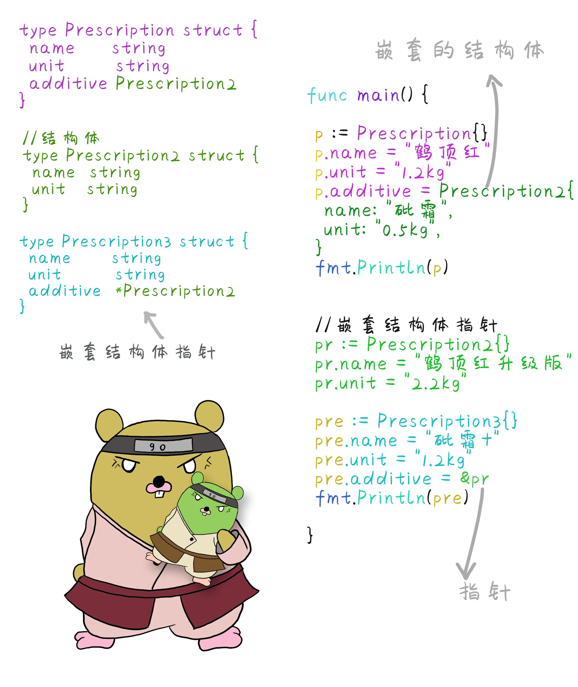

## 结构体与Json数据的相互转换

JSON是一种特殊格式的字符串，用来传输和存储数据，在使用api服务开发提供给前端的数据时，更多使用json数据交互。Go语言标准库中提供了json解析的包，使用之前导入包。

```go
import "encoding/json"

```

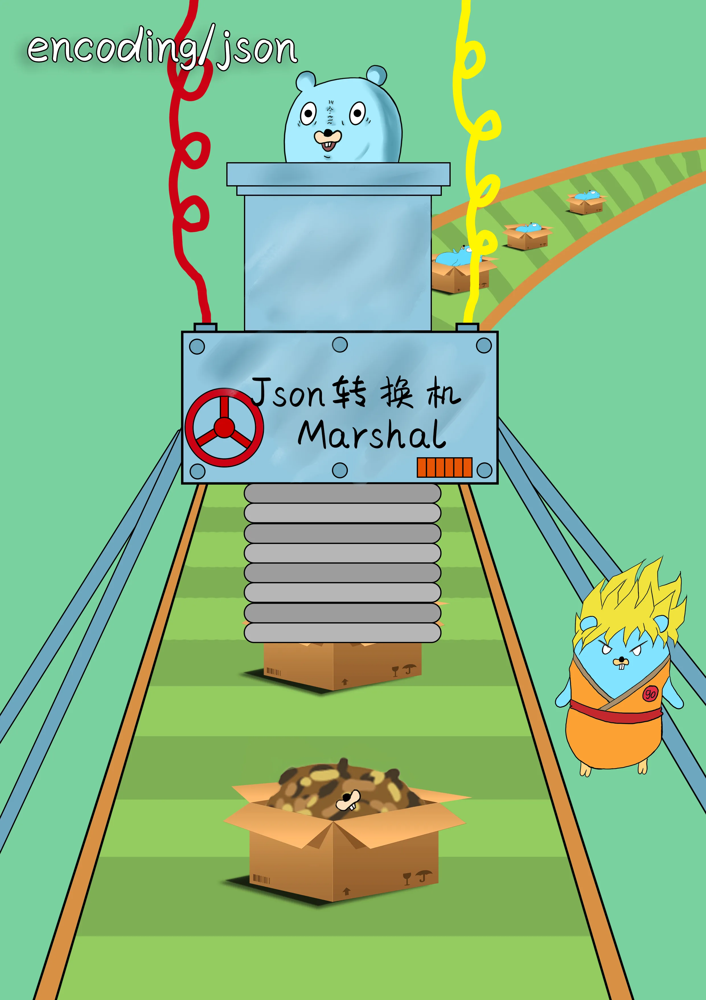

### 1，结构体转为json字符串

需要注意的是将结构体转换为Json数据时候，定义结构体的字段必须首字母大写。否则无法正常解析。

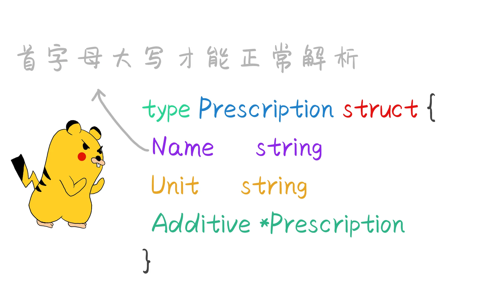

```go
package main

import (
	"encoding/json"
	"fmt"
)

// 结构体
type Prescription struct {
	Name     string
	Unit     string
	Additive *Prescription
}

func main() {
	p := Prescription{}
	p.Name = "鹤顶红"
	p.Unit = "1.2kg"
	p.Additive = &Prescription{
		Name: "砒霜",
		Unit: "0.5kg",
	}

	buf, err := json.Marshal(p) //转换为json返回两个结果
	if err != nil {
		fmt.Println("err = ", err)
		return
	}

	fmt.Println("json = ", string(buf))
}
```

以上代码执行结果为:`json =  {"Name":"鹤顶红","Unit":"1.2kg","Additive":{"Name":"砒霜","Unit":"0.5kg","Additive":null}}`

可以看出其中json字符中每一个key的首字母也是大写，最后一个没有设置数据的字段的结果为null。那么如何强制将他变为小写的。并且将不需要显示的字段隐藏掉。就需要在结构体上添加标记。

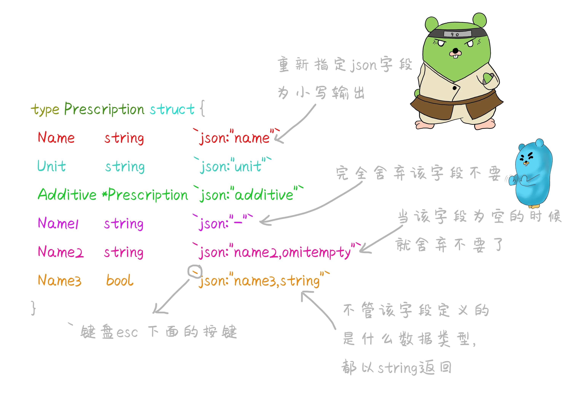

在结构体加上标记之后再转换之后的json字符串就会舒服多了。`{"name":"鹤顶红","unit":"1.2kg","additive":{"name":"砒霜","unit":"0.5kg"}}`

### 2，json字符串转为结构体

```go
package main

import (
	"encoding/json"
	"fmt"
)

// 结构体
type Prescription struct {
	Name     string        `json:"name"` //重新指定json字段为小写输出
	Unit     string        `json:"unit"`
	Additive *Prescription `json:"additive,omitempty"`
}

func main() {
	jsonstr := `{"name":"鹤顶红","unit":"1.2kg","additive":{"name":"砒霜","unit":"0.5kg"}}`
	var p Prescription
	if err := json.Unmarshal([]byte(jsonstr), &p); err != nil {
		fmt.Println(err)
	}
	fmt.Println(p)
}
```

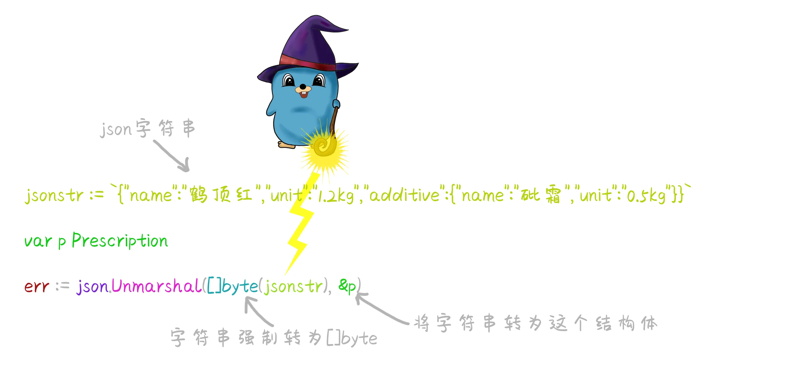
