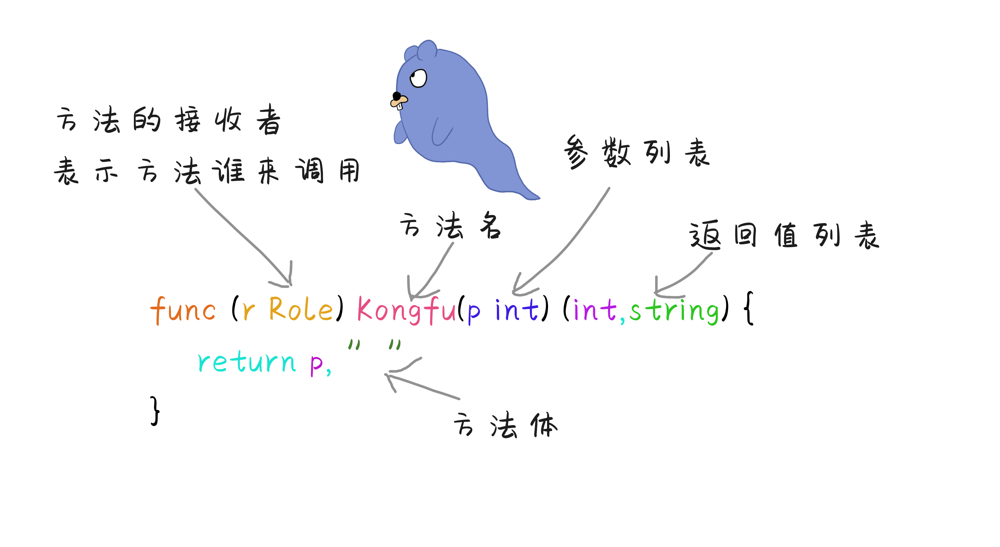
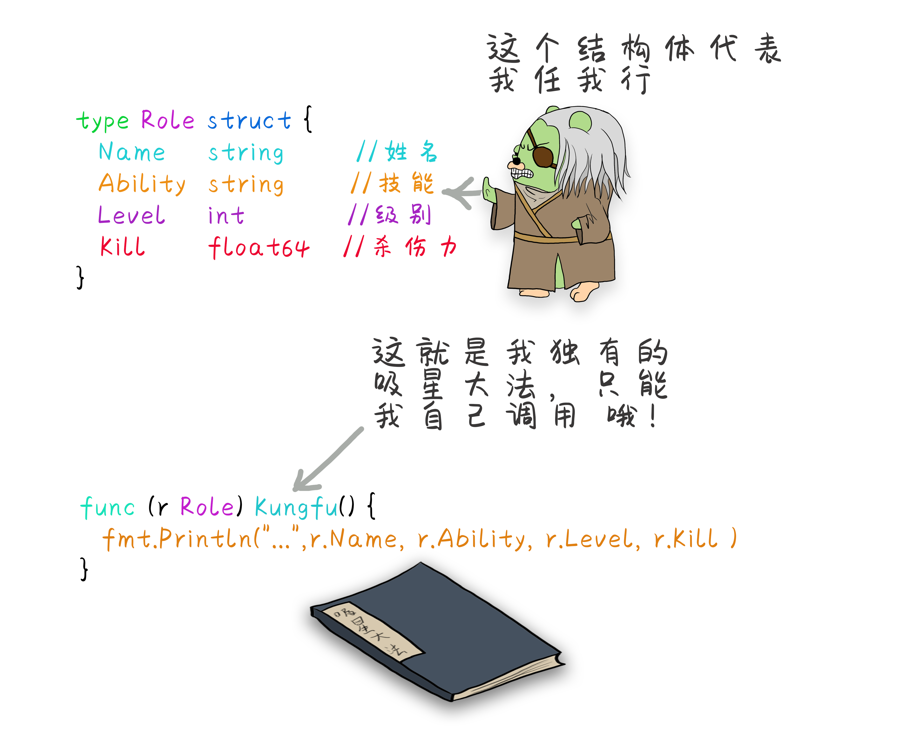
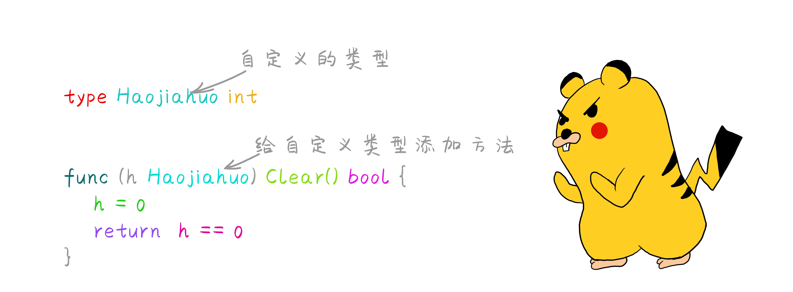
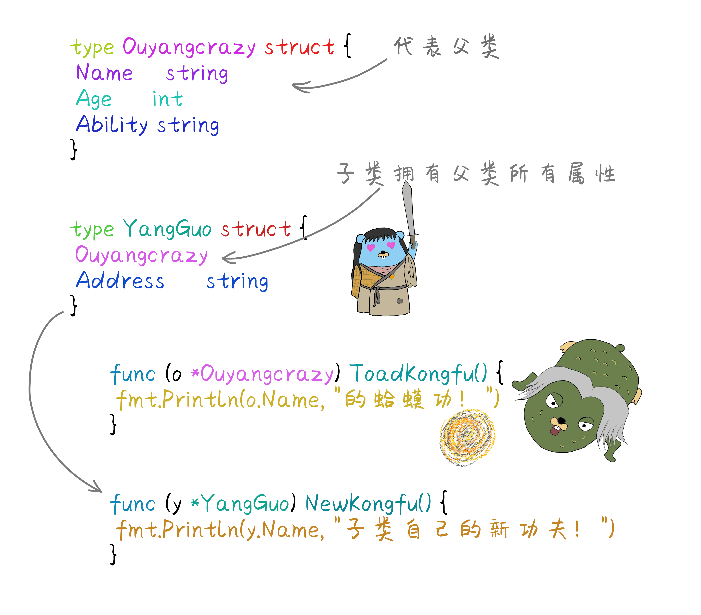
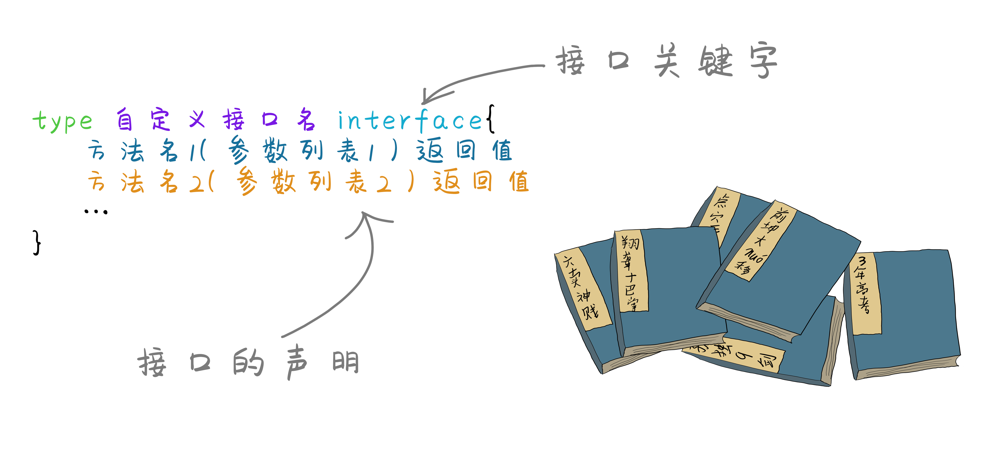
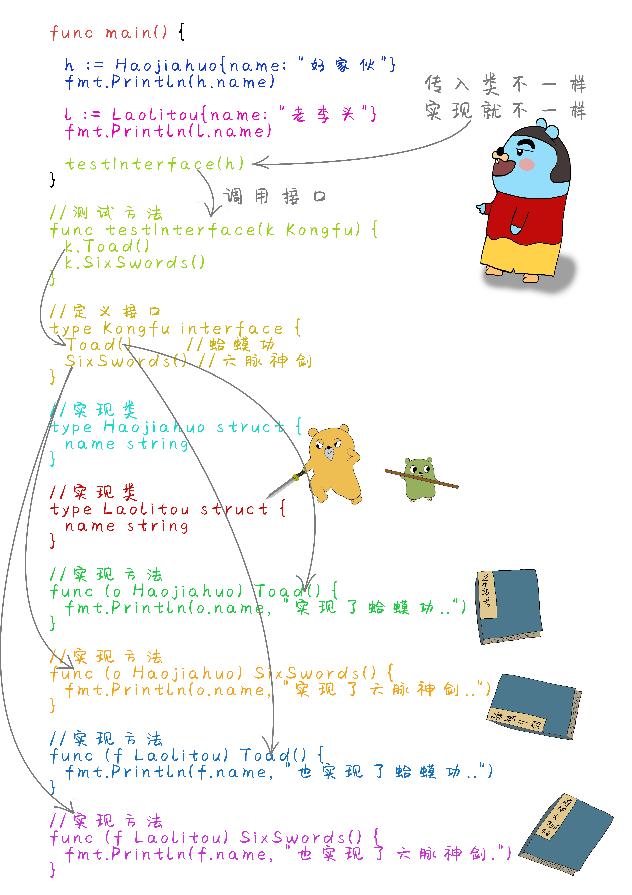
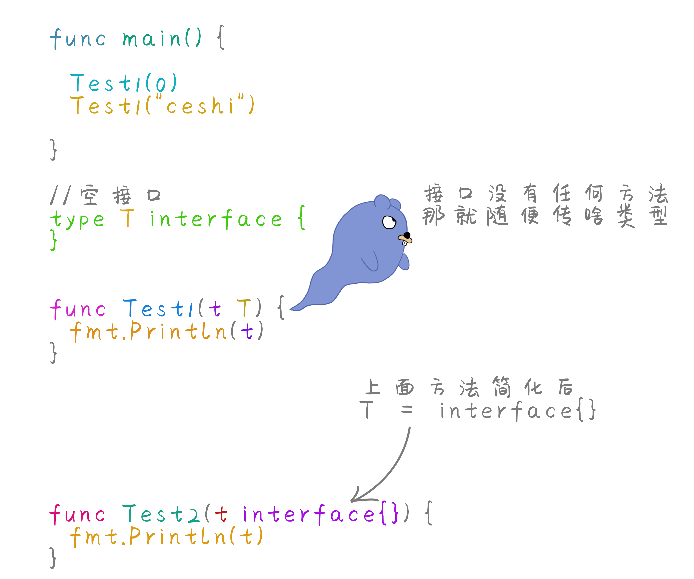
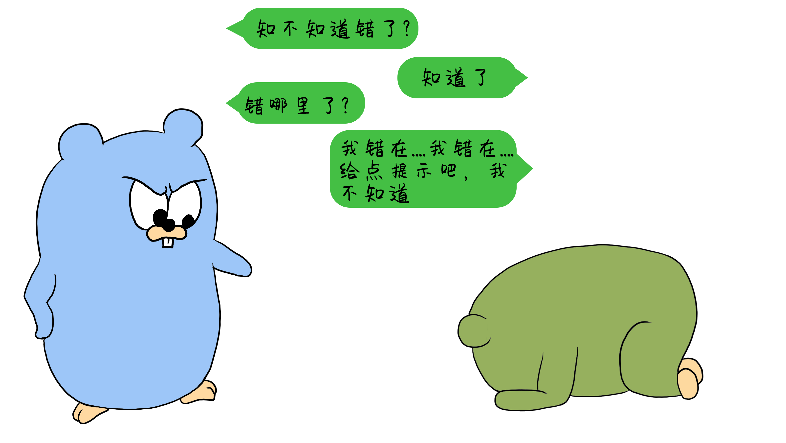

# 臭流氓任我行的吸星大法 --方法与接口

原文链接：https://juejin.cn/book/6844733833401597966/section/6844733833485484045

# 漫画 Go 语言  方法与接口

## 什么是方法

在Go语言中方法和函数类似，也可以认为方法是特殊类型的函数，只不过方法限制了接收者，方法也可以说是包含了接收者的函数。




## 结构体类型调用方法

```
package main

import (
"fmt"
)

func main() {
//使用Role结构体创建一个角色代表任我行
rwx := Role{"任我行", "吸星大法", 10, 9.9}
rwx.Kungfu()//调用这个结构体的方法。
}

//创建一个结构体代表人物角色--任我行
type Role struct {
Name    string  //姓名
Ability string  //技能
Level   int     //级别
Kill    float64 //杀伤力
}

//创建一个方法,只要是Role结构体就能调用。
func (r Role) Kungfu() {
fmt.Printf("我是:%s，我的武功:%s,已经练到%d级了，杀伤力%.1f\n", r.Name, r.Ability, r.Level, r.Kill)
}

```




## 指针类型方法

方法的接收者可以是结构体类型，也可以是一个值，或者是一个指针类型。

```
package main

import (
"fmt"
)

func main() {
rwx := &Role{"任我行", "吸星大法", 8, 10}
rwx.Kungfu() //使用Role该类型的指针调用方法

zwj := &Role{"张无记", "九娘神功", 9, 12}
zwj.Kungfu2() //调用指针类型方法
}

//创建一个结构体代表人物角色--任我行或者张无忌
type Role struct {
Name    string  //姓名
Ability string  //技能
Level   int     //级别
Kill    float64 //杀伤力
}

func (r Role) Kungfu() {
fmt.Printf("我是:%s，我的武功:%s,已经练到%d级了，杀伤力%.1f\n", r.Name, r.Ability, r.Level, r.Kill)
}

//指针类型方法
func (r *Role) Kungfu2() {
fmt.Printf("我是:%s，我的武功:%s,已经练到%d级了，杀伤力%.1f\n", r.Name, r.Ability, r.Level, r.Kill)
}

```


## 任意类型方法

在Go语言中，使用`type`关键字可以定义出新的自定义类型，有了自定义类型之后我们就可以为自定义类型添加各种方法了。



```
package main

import (
"fmt"
)

// 将好家伙 定义为int类型
type Haojiahuo int

// 使用Clear方法将Haojiahuo的所有值清空
func (h Haojiahuo) Clear() bool {
h = 0
return h == 0
}

// 使用Add方法给Haojiahuo增加值
func (h Haojiahuo) Add(num int) int {
return int(h) + num
}
func main() {
var h Haojiahuo
fmt.Println(h.Clear()) //调用清空方法
fmt.Println(h.Add(2))  //调用添加方法加2
fmt.Println(h.Clear()) //调用清空方法
fmt.Println(h.Add(6))  //调用添加方法加6
fmt.Println(h.Clear()) //调用清空方法
fmt.Println(h)
}

```

`函数与方法的区别`

- 方法限制某个类别的行为,需要指定调用者。函数是一段独立的功能代码,可以直接调用。

- 方法名称可以相同，只要接收者不同就可以，函数命名上不能冲突。

## Go语言实现面向对象

其实在Go语言中是没有面向对象的，但是Go语言的语法设计，我们可以借助结构体，方法，接口的实现，来模拟其他语言中的面向对象的概念。首先了解一下什么是面向对象，面向对象中的三大特征是：

- `封装` 在意义上是把许多客观的事物封装成一个抽象的类,把自己的属性 方法只让可信的对象操作。

- `继承` 子类可以访问父类的属性和方法，子类也可以拥有自己的属性和方法。子类可以重写父类的方法。

- `多态` 是指一个程序中同名的方法共存的情况，调用者只需使用同一个方法名，系统会根据不同情况，调用相应的不同方法，从而实现不同的功能。多态性又被称为“一个名字，多个方法”。

### 1，使用结构体来实现封装

Go语言中没有像java或者.net中的class类，不过可以把struct结构体看成一个类，结构体如果用面向对象的思维来理解，结构体把字段封装到一起，数据被保护在结构体内部，程序需要访问字段的时候，需要通过结构体来访问。


```
package main

import (
"fmt"
)

// 定义结构体实现封装
type Haojiahuo struct {
Name string
Age  int
}

//使用NewPerson方法创建一个对象
func NewPerson(name string) *Haojiahuo {
return &Haojiahuo{
Name: name,
}
}

// 使用SetAge方法设置结构体成员的Age
func (h *Haojiahuo) SetAge(age int) {
h.Age = age
}

// 使用GetAge方法获取成员现在的Age
func (h *Haojiahuo) GetAge() int {
return h.Age
}

func main() {
//创建一个对象
h := NewPerson("好家伙")
h.SetAge(18)                    //访问封装的方法设置年龄
fmt.Println(h.Name, h.GetAge()) //使用对象封装的方法获取年龄
}

```

### 2,继承的实现

继承可以解决代码复用的问题，结构体内嵌套一个匿名结构体，也可以嵌套多层结构体。




```
package main

import (
"fmt"
)

// 创建一个结构体起名 Ouyangcrazy 代表父类
type Ouyangcrazy struct {
Name    string
Age     int
Ability string
}

//创建一个结构体代表子类
type YangGuo struct {
Ouyangcrazy        //包含父类所有属性
Address     string //单独子类有的字段
}

// 父类的方法
func (o *Ouyangcrazy) ToadKongfu() {
fmt.Println(o.Name, "的蛤蟆功！")
}

//子类的方法
func (y *YangGuo) NewKongfu() {
fmt.Println(y.Name, "子类自己的新功夫！")
}

//子类重写父类的方法
// func (y *YangGuo) ToadKongfu() {
// 	fmt.Println(y.Name, "的新蛤蟆功！")
// }

func main() {

o := &Ouyangcrazy{Name: "欧阳疯", Age: 70} //创建父类
o.ToadKongfu()                          //父类对象访问父类方法

y := &YangGuo{Ouyangcrazy{Name: "杨过", Age: 18}, "古墓"} //创建子类
fmt.Println(y.Name)                                   //子类对象访问父类中有的字段
fmt.Println(y.Address)                                //子类访问自己的字段

y.ToadKongfu() //子类对象访问父类方法
y.NewKongfu()  //子类访问自己的方法
//y.ToadKongfu()    //如果存在自己的方法 访问自己重写的方法
}

```


## 接口




### 3,使用接口来实现多态

接口的意义是对其他类型的一个概括，接口内可以定义很多个方法，谁将这些方法实现，就可以认为是实现了该接口。Go语言的多态，主要是通过接口来实现。


```
package main

import (
"fmt"
)

func main() {

h := Haojiahuo{name: "好家伙"}
fmt.Println(h.name)

l := Laolitou{name: "老李头"}
fmt.Println(l.name)

//testInterface 需要参数类型为Kongfu接口类型的参数
//h实现了Kongfu接口的方法
//h就是这个接口的实现 就可以作为这个函数的参数
testInterface(h)

var kf Kongfu
kf = h
kf.Toad()

l.PlayGame()
}

//测试方法
func testInterface(k Kongfu) {
k.Toad()
k.SixSwords()
}

//定义接口
type Kongfu interface {
Toad()      //蛤蟆功
SixSwords() //六脉神剑
}

//实现类
type Haojiahuo struct {
name string
}

//实现类
type Laolitou struct {
name string
}

//实现方法
func (o Haojiahuo) Toad() {
fmt.Println(o.name, "实现了蛤蟆功..")
}

//实现方法
func (o Haojiahuo) SixSwords() {
fmt.Println(o.name, "实现了六脉神剑..")
}

//实现方法
func (f Laolitou) Toad() {
fmt.Println(f.name, "也实现了蛤蟆功..")
}

//实现方法
func (f Laolitou) SixSwords() {
fmt.Println(f.name, "也实现了六脉神剑.")
}

//实现自己的方法
func (f Laolitou) PlayGame() {
fmt.Println(f.name, "玩游戏..")
}

```



使用接口对方法进行约束，然后让方法实现接口，这样规范了方法。通过使用同样的接口名称，但是在调用的时候使用不同的类，实现执行不同的方法。这样就实现了Go语言中的多态。

## 空接口

空接口就是不包含任何方法的接口，所有的类型都可以实现空接口，因此空接口可以实现存储任意类型的数据， 谁实现它就被看作是谁的实现类。

```
package main

import (
"fmt"
)

func main() {
Test1(0)//使用int类型做为参数传入到函数
Test1("ceshi")//使用string类型做为参数传入到函数
}

//空接口
type T interface {
}

//定义一个函数 接收Test接口类型的数据
func Test1(t T) {
fmt.Println(t)
}

```



可以将空接口类型写为`interface{}` 这种类型可以理解为任何类型。类似其他语言中的`object`。

## 空接口的使用

空接口既然可以传任意类型，利用这个特性可以把空接口interface{}当做容器使用。

```
func Test() {
//创建一个map类型 key为string val为空接口，这样值就可以存储任意类型了
m := make(map[string]interface{})
m["a"] = "zhangsan"
m["b"] = 1.1
m["c"] = true
fmt.Println(m)
}

```

```
package main

import "fmt"

// 字典结构
type Dictionary struct {
data map[string]interface{} // 数据key为string值为interface{}类型
}

// 获取值
func (d *Dictionary) GetData(key string) interface{} {
return d.data[key]
}

// 设置值
func (d *Dictionary) SetData(key string, value interface{}) {
d.data[key] = value
}

// 创建一个字典
func NewDict() *Dictionary {
return &Dictionary{
data: make(map[string]interface{}),//map类型使用前需要初始化，所以需要使用make创建 防止空指针异常。
}
}

func main() {
// 创建字典实例
dict := NewDict()
// 添加数据
dict.SetData("001", "第一条数据")
dict.SetData("002", 3.1415)
dict.SetData("003", false)
// 获取值
d := dict.GetData("001")
fmt.Println(d)
}

```

## Go语言中的错误

错误和异常不同，错误是在程序中正常存在的，可以预知的失败在意料之中。而异常通常指在不应该出现问题的地方出现问题，比如空指针，这在人们的意料之外。go语言没有 `try......catch` 这样的方式来捕获异常所以Go定义属于自己的一种错误类型，用error表示错误。



例如：我们在读取一个不存在的文件时候。如果文件正常存在就返回文件的内容，否则就返回一个err信息。

```
package main

import (
"fmt"
"io/ioutil"
)

func main() {
//使用io/ioutil包下的读取文件方法
conent, err := ioutil.ReadFile("test.txt")
if err != nil {
fmt.Println(err)//打印错误信息
} else {
fmt.Println(string(conent))//返回正常信息
}
}

```

通常情况一个函数如果有错误，都会在返回值最后一个，返回一个error类型的错误，根据这个值来判断是否是非nil的值，如果是nil表示没有错误，如果nil不为空，则需要进行错误处理。

error的定义是一个接口，接口内部包含一个返回字符串类型的方法Error()

```
type error interface {
Error() string
}

```

知道了error的定义是一个接口类型，那么只要实现了这个接口 都可以用来处理错误信息。来返回一个错误提示给用户。Go语言也提供了一个内置包errors ，来创建一个错误对象。


```
package main

import (
"errors"
"fmt"
)

func main() {
err := errors.New("错误信息...")
fmt.Println(err)

num, err2 := Calculation(0)
fmt.Println(num, err2)
}

//通过内置errors包创建错误对象来返回
func Calculation(divisor int) (int, error) {
if divisor == 0 {
return 0, errors.New("错误:除数不能为零.")
}
return 100 / divisor, nil
}

```
