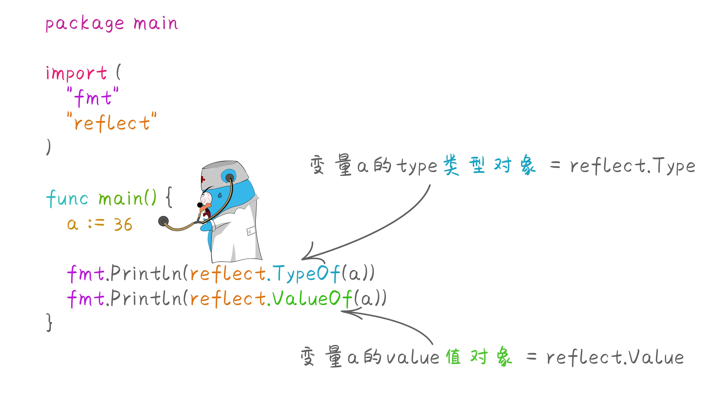
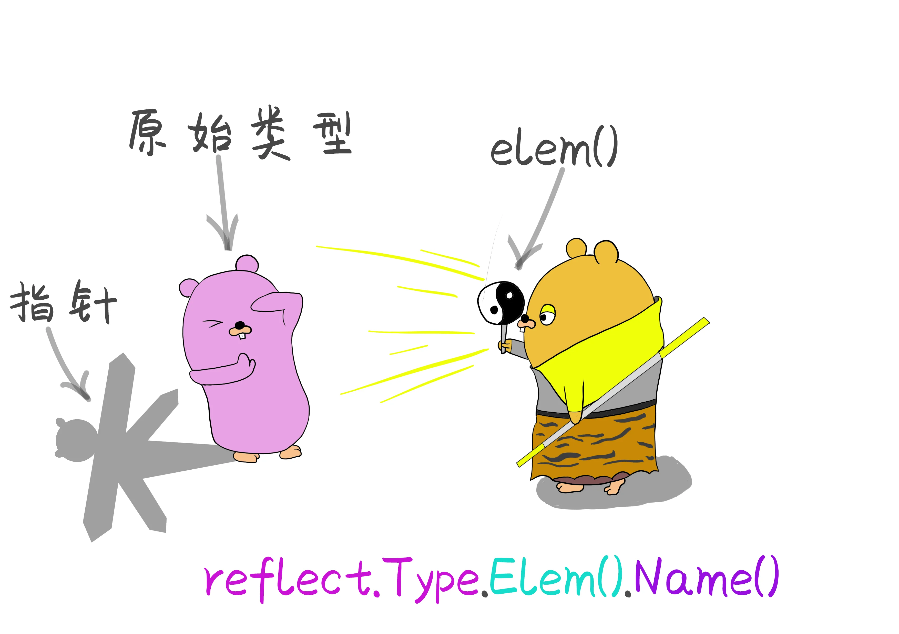
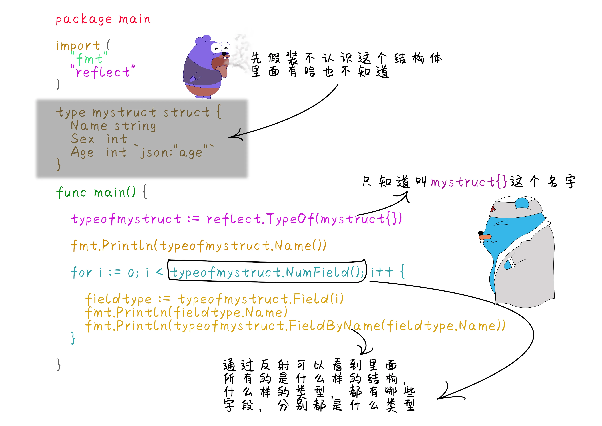
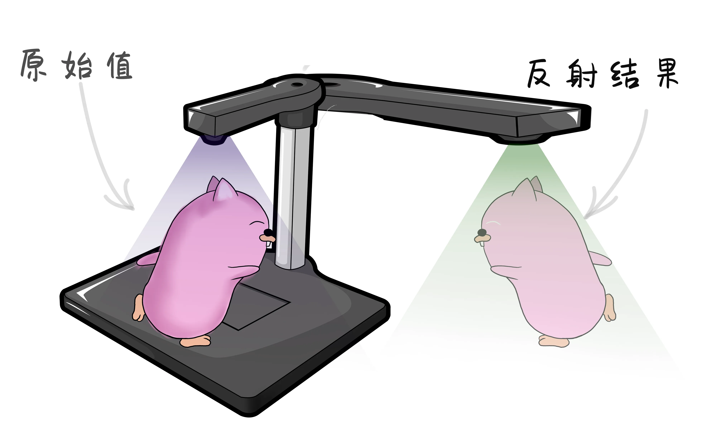
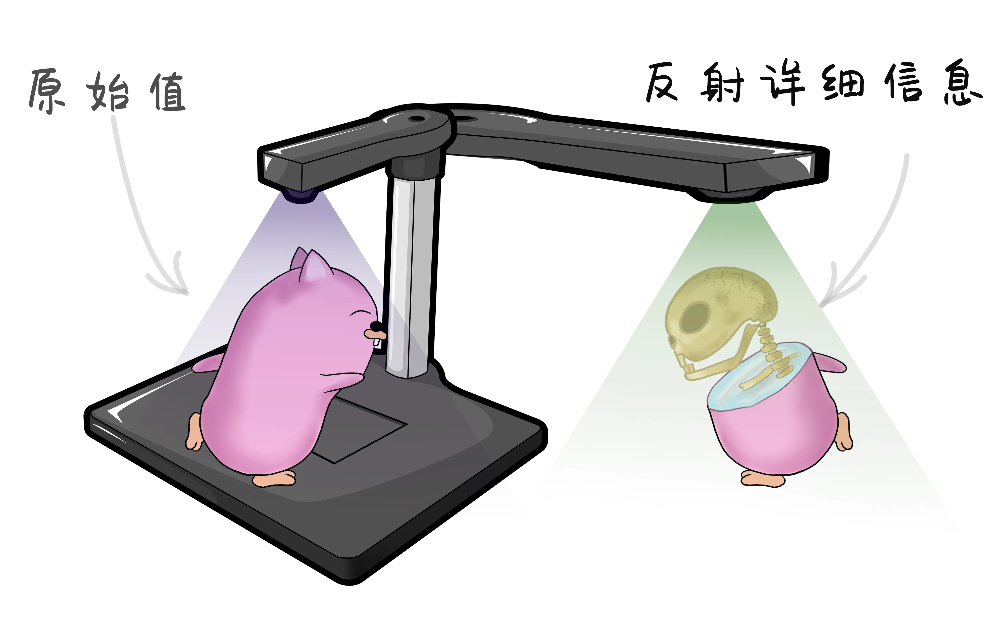
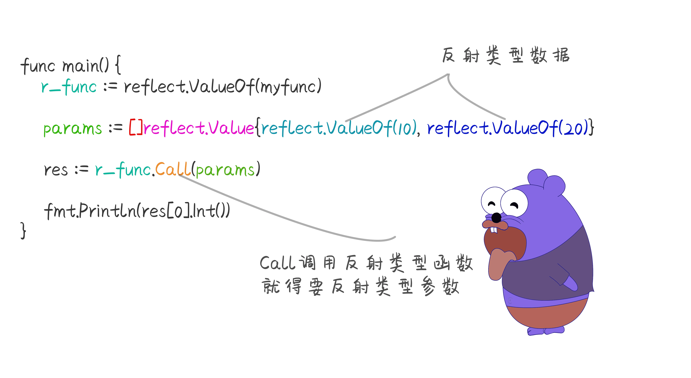

# 闭着眼睛就知道是个什么鬼--反射

原文链接：https://juejin.cn/book/6844733833401597966/section/6844733833485500429

# 漫画 Go 语言 反射

## 反射的定义

Go语言官方文档中是这样定义反射，在计算机领域中反射是一种让程序通过类型理解其自身的结构的一种能力。其实反射本质上就是在程序运行时候，来获取对象的类型信息或者结构，进行访问或者修改。

Go语言在运行期使用`reflect`包访问程序的反射信息。


## 通过反射获取类型对象与值对象

一个普通的变量包含两个信息，一个是类型`type`，一个是值`value`。type指的是系统中的原有的数据类型，如：int、string、bool、float32 等类型。
在Go语言中可以通过 `reflect.TypeOf()` 函数获取任意值的`类型对象`，程序通过这个`类型对象`，可以获取任意的类型信息。

```
package main

import (
"fmt"
"reflect"
)

func main() {
a := 36

fmt.Println(reflect.TypeOf(a)) //通过反射获取变量a的type类型对象
fmt.Println(reflect.ValueOf(a))//通过反射获取变量a的value类型对象
}

```



有了`类型对象`和`值对象`，就可以获取到当前任意类型的类型信息和值信息。

```

func main() {
a := 36
atype := reflect.TypeOf(a)
fmt.Println(atype.Name()) //获取类型名称为int
avalue := reflect.ValueOf(a)
fmt.Println(avalue.Int()) //获取具体的数值
}

```

## 从类型对象中获取类型名称和种类

在反射中还定义了另外一种叫种类`Kind`，种类Kind与type还是有区别的。Kind指的是对象归属的品种，在反射中定义了下列这些种类。

```
type Kind uint

const (
Invalid       Kind = iota //非法类型
Bool                      //布尔型
Int                       //有符号整型
Int8                      //有符号8位整型
Int16                     //有符号16位整型
Int32                     //有符号32位整型
Int64                     //有符号64位整型
Uint                      //无符号整型
Uint8                     //无符号8位整型
Uint16                    //无符号16位整型
Uint32                    //无符号32位整型
Uint64                    //无符号64位整型
Uintptr                   //指针
Float32                   //单精度浮点类型
Float64                   //双精度浮点类型
Complex64                 //64位复数类型
Complex128                //128位复数类型
Array                     //数组
Chan                      //通道
Func                      //函数
Interface                 //接口
Map                       //字典
Ptr                       //指针
Slice                     //切片
String                    //字符串
Struct                    //结构体
UnsafePointer             //底层指针
)

```

通过反射获取类型名称的字符串，使用`类型对象reflect.Type`中的`Name()`方法， 类型归属的种类`Kind` ，使用reflect.Type中的`Kind()`方法获取。返回的是上面类别种类常量中定义的信息。

```
package main

import (
"fmt"
"reflect"
)

type mystruct struct {
Name string
Sex  int
Age  int `json:"age"`
}

func main() {

typeofmystruct := reflect.TypeOf(mystruct{})

fmt.Println(typeofmystruct.Name()) //获取反射类型对象  mystruct

fmt.Println(typeofmystruct.Kind()) //获取反射类型种类  struct

}

```

`Map`、`Slice`、`Chan` 这几个也都属于引用类型的数据，使用时使用的都是这些类型的指针。但是在上面种类定义的时候这些都有自己的种类。不属于指针类型`Ptr`。mystruct{}的种类属于Struct结构体类型，而&mystruct{} 属于指针Ptr。

## 获取和指针指向的元素

前面学习指针时候，如果要取指针指向的具体的数据时通过`*` 来获取指针的值。在反射中获取指针类型的对象时，通过`reflect.Elem()`方法获取这个指针指向的元素类型。



```
package main

import (
"fmt"
"reflect"
)

type mystruct struct {
Name string
Sex  int
Age  int `json:"age"`
}

func main() {

typeofmystruct := reflect.TypeOf(&mystruct{})

fmt.Println(typeofmystruct.Elem().Name()) //获取指针类型指向的元素类型的名称

fmt.Println(typeofmystruct.Elem().Kind()) //获取指针类型指向的元素类型的种类

}

```

## 反射获取结构体成员的类型

任意一个类型通过反射 `reflect.TypeOf()` 获取反射类型对象，通过反射类型对象可以获取当前结构具体是什么样的类型，如果是结构体时，可以通过反射类型对象的`NumField()`和`Field()`方法获得结构体的详细成员信息。



```
package main

import (
"fmt"
"reflect"
)

type mystruct struct {
Name string
Sex  int
Age  int `json:"age"`
}

func main() {

typeofmystruct := reflect.TypeOf(mystruct{})

fieldnum := typeofmystruct.NumField() //获取结构体成员字段的数量

for i := 0; i < fieldnum; i++ {
fieldname := typeofmystruct.Field(i) //索引对应的字段信息
fmt.Println(fieldname)
name, err := typeofmystruct.FieldByName("Name")//根据指定的字符串返回对应的字段信息
fmt.Println(name, err)
}

}

```

## 反射获取结构体字段的类型

通过reflect.Type的Field()方法返回的StructField结构信息，这个结构信息包含了成员字段的所有信息。这个结构的定义如下。

```
type StructField struct {
Name string	        // 字段名
PkgPath string      // 字段路径
Type      Type      // 字段反射类型对象
Tag       StructTag // 字段的结构体标签
Offset    uintptr   // 字段在结构体中的相对偏移
Index     []int     // Tpye.FieldByIndex中的返回索引值
Anonymous bool      // 是否为匿名字段
}

```

## 使用反射值对象获取任意值

反射不仅可以获取值的类型信息，还可以动态的获取变量具体的值。使用reflect.ValueOf()函数获得反射的值对象`reflect.Value`。通过reflect.Value重新获得原始的值。



```
package main

import (
"fmt"
"reflect"
)

func main() {

a := 2020
valof := reflect.ValueOf(a) //先通过reflect.ValueOf 获取反射的值对象
fmt.Println(valof)
//再通过值对象通过类型断言转换为指定类型
fmt.Println(valof.Interface()) //转换为interface{} 类型
fmt.Println(valof.Int())       //将值以int类型返回
}

```

通过以下方法 可以从反射对象reflect.Value中获取原始值。

- `.Interface()` 将值以interface{}任意类型返回。

- 还有各自对应的类型， `.Int()`、`.Uint()` 、`.Floact()` 、`.Bool()` 、`.Bytes()` 、`.String()`。

## 通过反射获取结构体的成员字段的值

reflect.Value 也提供了像获取成员类型的方法，用来获取成员的值。



```
package main

import (
"fmt"
"reflect"
)

type haojiahuo struct {
Name string
Age  int
}

func main() {
h := haojiahuo{"好家伙", 20}
fmt.Println(h)
hofvalue := reflect.ValueOf(h)             //获取结构体的reflect.Value对象。
for i := 0; i < hofvalue.NumField(); i++ { //循环结构体内字段的数量
//获取结构体内索引为i的字段值
fmt.Println(hofvalue.Field(i).Interface())
}
fmt.Println(hofvalue.Field(1).Type()) //获取结构体内索引为1的字段的类型

}

```

## 反射对象的空值处理

反射值对象`reflect.Value`提供了`IsNil()`方法判断空值。`IsValid()`方法判断是否有效。

```
package main

import (
"fmt"
"reflect"
)

type haojiahuo struct {
Name string
Age  int
}

func main() {
var a *int                              //声明一个变量a为nil的空指针
fmt.Println(reflect.ValueOf(a).IsNil()) //判断是否为nil 返回true

//当reflect.Value不包含任何信息，值为nil的时候IsValid()就返回false
fmt.Println(reflect.ValueOf(nil).IsValid())
}

```

## 使用反射值对象修改变量的值

reflect.Value值对象支持修改反射出的元素的值。

```
package main

import (
"fmt"
"reflect"
)

func main() {
//声明变量a
a := 100
fmt.Printf("a的内存地址为：%p\n", &a)
//获取变量a的反射类型reflect.Value 的地址
rf := reflect.ValueOf(&a)
fmt.Println("通过反射获取变量a的地址:", rf)

//获取a的地址的值
rval := rf.Elem()
fmt.Println("反射a的值：", rval)

//修改a的值
rval.SetInt(200)
fmt.Println("修改之后反射类型的值为：", rval.Int())

//原始值也被修改
fmt.Println("原始a的值也被修改为：", a)
}

```

使用反射修改值的方法

- `SetInt(x)` 设置值为x, 类型必须是int类型。

- `SetUint(x)` 设置值为x, 类型必须是uint类型。

- `SetFloat(x)` 设置值为x, 类型必须是float32或者float64类型。

- `SetBool(x)` 设置值为x, 类型必须是bool类型。

- `SetBytes(x)` 设置值为x, 类型必须是[]Byte类型。

- `SetString(x)` 设置值为x, 类型必须是string类型。

## 反射类型调用函数

反射的值对象reflect.Value如果返回的类型是一个函数，那么这个函数是可以通过`Call()`方法直接调用的。

```
package main

import (
"fmt"
"reflect"
)

func myfunc(a, b int) int {
return a + b
}

func main() {
r_func := reflect.ValueOf(myfunc)

//设置函数需要传入的参数也必须是反射类型
params := []reflect.Value{reflect.ValueOf(10), reflect.ValueOf(20)}

//反射调用函数
res := r_func.Call(params)

//获取返回值
fmt.Println(res[0].Int())
}

```


