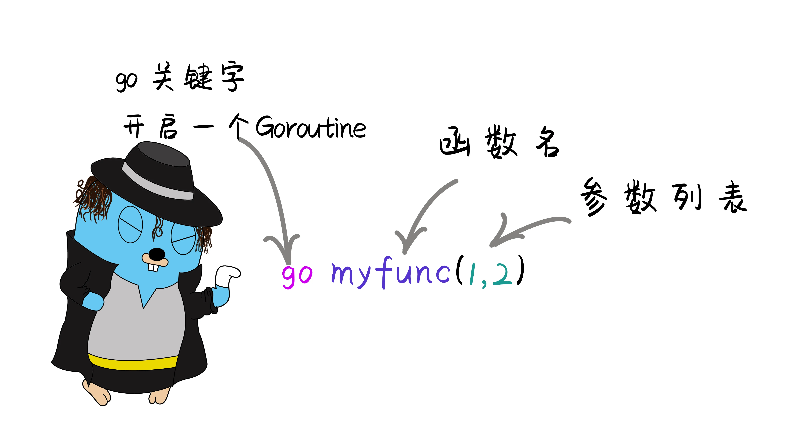
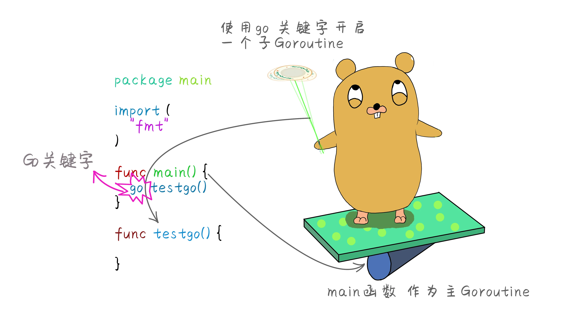
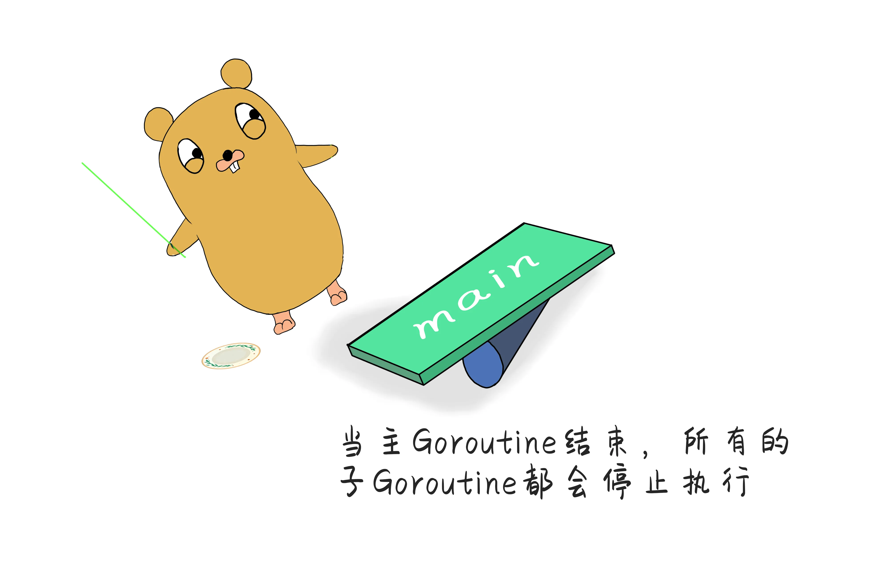
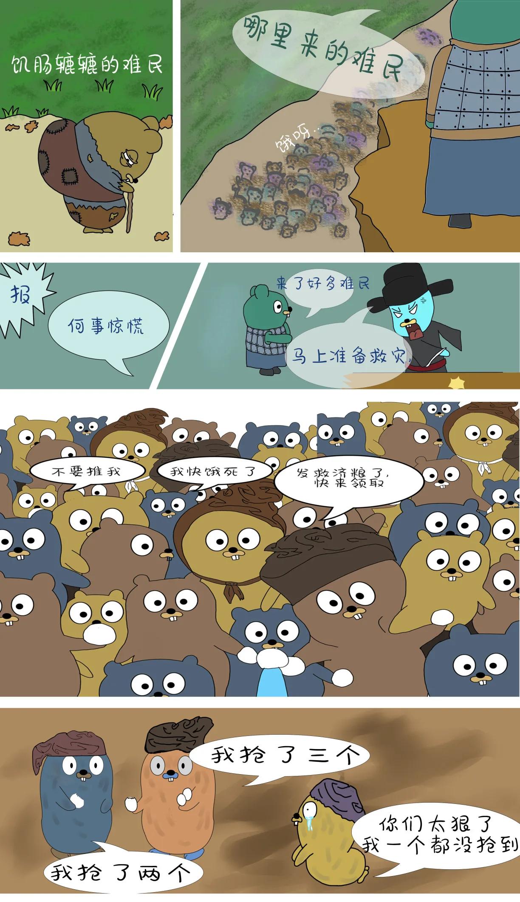
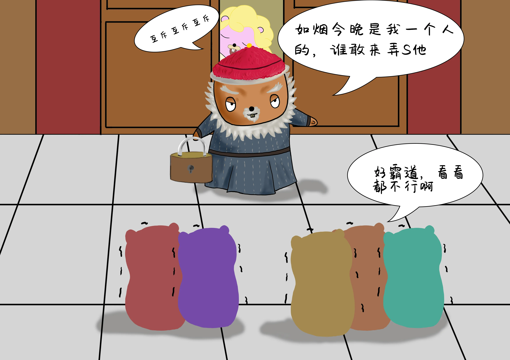

# 如烟姑娘到底谁抢走了--并发 上

原文链接：https://juejin.cn/book/6844733833401597966/section/6844733833485484040

# Go 语言特色 并发-上

## 什么是并发

go语言的并发属于go语言中一大亮点，其他语言创建并发是通过线程，而go语言则通过协程，协程是一个轻量级的线程。进程或者线程在一台电脑中最多不能超过一万个，而协程可以在一台电脑中创建上百万个也不会影响到电脑资源。学习之前先知道一些并发与并行的一些概念。

- `并发` 是指在同一个时间点上只能执行同一个任务，但是因为速度非常快，所以就像同时进行一样。

- `并行` 是指在一个时间点上同时处理多个任务。真正的并行，是需要电脑硬件的支持，单核的CPU是无法达到并行的。并行，他不一定快因为并行运行时是需要通信的，这种通信的成本还是很高的，而并发的程序成本很低。


- `进程` 就是一个独立功能的程序，在一个数据集中的一次动态执行过程，可以认为他是一个正在执行的程序，比如打开一个QQ就是在运行一个进程。

- `线程` 线程是被包含在进程之中的，它是比进程更小的能独立运行的基本单位 一个进程可以包含多个线程。例如、打开文档在你输入文字的时候他还在后台检测你输入的文字的大小写，还有拼写是否正确 ，这就是一个线程来检测的。

- `协程` 协程属于一种轻量级的线程，英文名 Goroutine 协程之间的调度由 Go运行时（runtime）管理。

## 什么是Goroutine

goroutine 协程。是go语言中特有的名词，他不同于进程Process，以及线程Thread。Go语言创造者认为和他们还是有区别的，所以创造为goroutine。goroutine与线程相比创建成本非常小，可以认为goroutine就是一小段代码，我们使用goroutine往往是执行某一个特定的任务，也就是函数或者方法。



使用go关键字调用这个函数开启一个goroutine时候，即使这个函数有返回值也会忽略的。所以不需要接收这个函数的返回值。

## 如何创建Goroutine

在函数或者方法前面加上关键字go，就会同时运行一个新的goroutine。



```go
package main

import (
	"fmt"
)

func main() {
	go testgo() //使用关键字go调用函数或者方法 开启一个goroutine
	for i := 0; i < 10; i++ {
		fmt.Println(i)
	}
	fmt.Println("main 函数结束")

}

// 自定义函数
func testgo() {
	for i := 0; i < 10; i++ {
		fmt.Println("测试goroutine", i)
	}
}
```

## Goroutine是如何执行的

与函数不同的是goroutine调用之后会立即返回，不会等待goroutine的执行结果，所以goroutine不会接收返回值。
把封装main函数的goroutine叫做主goroutine，main函数作为主goroutine执行，如果main函数中goroutine终止了，程序也将终止，其他的goroutine都不会再执行。



```go
package main

import (
	"fmt"
)

func main() {
	go testgo1()
	go testgo2()
	for i := 0; i <= 5; i++ {
		fmt.Println("main函数执行", i)
	}
	fmt.Println("main 函数结束")

}

func testgo1() {
	for i := 0; i <= 10; i++ {
		fmt.Println("测试子goroutine1", i)
	}
}

func testgo2() {
	for i := 0; i <= 10; i++ {
		fmt.Println("测试子goroutine2", i)
	}
}
```

上面代码执行结果为：

```
main函数执行 0
main函数执行 1
main函数执行 2
main函数执行 3
main函数执行 4
main函数执行 5
main函数结束
测试子goroutine1： 0
```

由结果可以看出，当主函数main执行完成后，子goroutine执行了一次整个程序就执行结束了，main函数并不会等待子goroutine执行结束。一个goroutine的执行速度是非常快的，并且是主goroutine和子goroutine进行资源竞争，谁抢到资源多，谁就先执行。main函数是不会让着子goroutine的。我们可以在主goroutine中加上时间休眠，可以看每一个goroutine执行过程。


```
time.Sleep(1000 * time.Millisecond) //让程序休眠1秒
```

```go
package main

import (
	"fmt"
	"time"
)

func main() {
	go testgo1()
	go testgo2()
	for i := 0; i <= 5; i++ {
		fmt.Println("main函数执行", i)
	}
	time.Sleep(3000 * time.Millisecond) //加上休眠让主程序休眠3秒钟。
	fmt.Println("main函数结束")

}

func testgo1() {
	for i := 0; i <= 10; i++ {
		fmt.Println("测试子goroutine1：", i)
	}
}

func testgo2() {
	for i := 0; i <= 10; i++ {
		fmt.Println("测试子goroutine2：", i)
	}
}
```

这时候程序就会等待所有的子goroutine执行结束后再结束。

## 使用匿名函数创建Goroutine

使用匿名函数创建goroutine时候在匿名函数后加上(),直接调用。

```go
package main

import (
	"fmt"
)

func main() {
	go func() {
		fmt.Println("匿名函数创建goroutine执行")
	}()

	fmt.Println("主函数执行")
}
```

## runtime包

虽然说Go编译器将Go的代码编译成本地可执行代码。不需要像java或者.net那样的语言需要一个虚拟机来运行，但其实go是运行在runtime调度器上的，它主要负责内存管理、垃圾回收、栈处理等等。也包含了Go运行时系统交互的操作，控制goroutine的操作，Go程序的调度器可以很合理的分配CPU资源给每一个任务。

Go1.5版本之前默认是单核执行的。从1.5之后使用可以通过`runtime.GOMAXPROCS()`来设置让程序并发执行，提高CPU的利用率。

```go
package main

import (
	"fmt"
	"runtime"
	"time"
)

func main() {
	// 获取当前GOROOT目录
	fmt.Println("GOROOT:", runtime.GOROOT())
	// 获取当前操作系统
	fmt.Println("操作系统:", runtime.GOOS)
	// 获取当前逻辑CPU数量
	fmt.Println("逻辑CPU数量：", runtime.NumCPU())

	// 设置最大的可同时使用的CPU核数  取逻辑cpu数量
	n := runtime.GOMAXPROCS(runtime.NumCPU())
	fmt.Println(n) //一般在使用之前就将cpu数量设置好 所以最好放在init函数内执行

	// goexit 终止当前goroutine
	// 创建一个goroutine
	go func() {
		fmt.Println("start...")
		runtime.Goexit() //终止当前goroutine
		fmt.Println("end...")
	}()
	time.Sleep(3 * time.Second) //主goroutine 休眠3秒 让子goroutine执行完
	fmt.Println("main_end...")
}
```

如果调用`runtime.Goexit()`函数之后，会立即停止当前goroutine，其他的goroutine不会受影响。并且当前goroutine如果有未执行的defer 还是会执行完defer 操作。需要注意的是 不能 将`runtime.goexit()` 放在主goroutine也就是`main`函数中执行，否则会发生运行时恐慌。

## Go语言临界资源安全

### 什么是临界资源

指并发环境中多个协程之间的共享资源，如果对临界资源处理不当，往往会导致数据不一致的情况。例如：多个goroutine在访问同一个数据资源的时候，其中一个修改了数据，另一个goroutine在使用的时候就不对了。



```go
package main

import (
	"fmt"
	"math/rand"
	"time"
)

// 定义全局变量 表示救济粮食总量
var food = 10

func main() {
	// 开启4个协程抢粮食
	go Relief("灾民好家伙1")
	go Relief("灾民好家伙2")
	go Relief("灾民老李头1")
	go Relief("灾民老李头2")

	// 让程序休息5秒等待所有子协程执行完毕
	time.Sleep(5 * time.Second)
}

// 定义一个发放的方法
func Relief(name string) {
	for {
		if food > 0 { //此时有可能第二个goroutine访问的时候 第一个goroutine还未执行完 所以条件也成立
			time.Sleep(time.Duration(rand.Intn(1000)) * time.Millisecond) //随机休眠时间
			food--
			fmt.Println(name, "抢到救济粮 ，还剩下", food, "个")
		} else {
			fmt.Println(name, "别抢了 没有粮食了。")
			break
		}
	}
}

//结果
//灾民好家伙1 抢到救济粮 ，还剩下 8 个
//灾民老李头1 抢到救济粮 ，还剩下 7 个
//灾民好家伙1 抢到救济粮 ，还剩下 6 个
//灾民老李头1 抢到救济粮 ，还剩下 5 个
//灾民老李头2 抢到救济粮 ，还剩下 4 个
//灾民好家伙2 抢到救济粮 ，还剩下 3 个
//灾民好家伙1 抢到救济粮 ，还剩下 2 个
//灾民老李头1 抢到救济粮 ，还剩下 1 个
//灾民老李头2 抢到救济粮 ，还剩下 0 个
//灾民老李头2 别抢了 没有粮食了。
//灾民老李头1 抢到救济粮 ，还剩下 -1 个
//灾民老李头1 别抢了 没有粮食了。
//灾民好家伙1 抢到救济粮 ，还剩下 -2 个
//灾民好家伙1 别抢了 没有粮食了。
//灾民好家伙2 抢到救济粮 ，还剩下 -3 个
//灾民好家伙2 别抢了 没有粮食了。
```

以上代码出现负数的情况，也是因为Go语言的并发走的太快了，当有一个协程进入执行的时候还没来得及取出数据，另外一个协程也进来了，所以会出现负数的情况，那么如何解决这样的问题，我们不能用休眠的方法让程序等待，因为你并不知道程序会多久执行结束，到底应该让程序休眠多长时间。下面看看如何控制goroutine协程在执行过程中保证数据的安全。

## sync同步包

sync同步包，是Go语言提供的内置同步操作，保证数据统一的一些方法，WaitGroup 等待一个goroutine的集合执行完成，也叫同步等待组，使用`Add()`方法，来设置要等待一组goroutine 要执行的数量。用`Done()`方法来减去执行goroutine集合的数量。使用`Wait()` 方法让`主goroutine`也就是`main`函数进入阻塞状态，等待其他的子goroutine执行结束后，main函数才会解除阻塞状态。


```go
package main

import (
	"fmt"
	"sync"
)

// 创建一个同步等待组的对象
var wg sync.WaitGroup

func main() {
	wg.Add(3) //设置同步等待组的数量
	go Relief1()
	go Relief2()
	go Relief3()
	wg.Wait() //主goroutine进入阻塞状态
	fmt.Println("main end...")
}

func Relief1() {
	fmt.Println("func1...")
	wg.Done() //执行完成 同步等待数量减1
}
func Relief2() {
	defer wg.Done()
	fmt.Println("func2...")
}
func Relief3() {
	defer wg.Done() //推荐使用延时执行的方法来减去执行组的数量
	fmt.Println("func3...")
}
```

在并发编程中存在多个goroutine协程共用同一条数据，也就是临界资源的安全问题，为了解决这种的问题Go语言提供了同步等待组的方法解决，Go语言还提供了锁，控制并发情况下的数据安全。Go语言提供两种锁类型`互斥锁`和`读写锁`。当一个协程在访问当前数据资源的时候，给当前资源加上锁， 防止另外的协程访问，等待解锁后其他协程才能够访问。

## 互斥锁

互斥锁，当一个goroutine获得锁之后其他的就只能等待当前goroutine执行完成之后解锁后才能访问资源。对应的方法有`上锁Lock()`和`解锁Unlock()`。



```go
package main

import (
	"fmt"
	"sync"
)

// 定义全局变量 表示救济粮食总量
var food = 10

// 同步等到组对象
var wg sync.WaitGroup

// 创建一把锁
var mutex sync.Mutex

func main() {
	wg.Add(4)
	// 开启4个协程抢粮食
	go Relief("灾民好家伙")
	go Relief("灾民好家伙2")
	go Relief("灾民老李头")
	go Relief("灾民老李头2")
	wg.Wait() //阻塞主协程，等待子协程执行结束
}

// 定义一个发放的方法
func Relief(name string) {
	defer wg.Done()
	for {
		// 上锁
		mutex.Lock()
		if food > 0 { //加锁控制之后每次只允许一个协程进来，就会避免争抢
			food--
			fmt.Println(name, "抢到救济粮 ，还剩下", food, "个")
		} else {
			mutex.Unlock() //条件不满足也需要解锁 否则就会造成死锁其他不能执行
			fmt.Println(name, "别抢了 没有粮食了。")
			break
		}
		// 执行结束解锁，让其他协程也能够进来执行
		mutex.Unlock()
	}
}
```

在使用互斥锁的时候一定要进行解锁,否则会造成程序的死锁。

## 读写锁

互斥锁是用来控制多个协程在访问同一个资源的时候进行加锁控制,保证了数据安全，但同时也降低了性能，如果说多个goroutine同时访问一个数据，只是读取一下数据，并没有对数据进行任何修改操作，那么不管多少个goroutine来读取都应该是可以的。主要问题在于修改。修改的数据就需要加锁操作，来保证数据在多个goroutine读取的时候统一。
读取和读取之间是不需要互斥操作的，所以我们用`读写锁`专门针对读操作和写操作的互斥锁。


```go
package main

import (
	"fmt"
	"sync"
	"time"
	// "runtime"
)

// 创建一把读写锁 可以是他的指针类型
var rwmutex sync.RWMutex

var wg sync.WaitGroup

func main() {
	wg.Add(3)
	go ReadTest(1)
	go WriteTest(2)
	go ReadTest(3)
	wg.Wait()
	fmt.Println("======main结束======")
}

// 读取数据的方法
func ReadTest(i int) {
	defer wg.Done()
	fmt.Println("======准备读取数据======")
	rwmutex.RLock() //读上锁
	fmt.Println("======正在读取...", i)
	rwmutex.RUnlock() //读取操作解锁
	fmt.Println("======读取结束======")
}

func WriteTest(i int) {
	defer wg.Done()
	fmt.Println("======开始读写数据======")
	rwmutex.Lock() //写操作上锁
	fmt.Println("======正写数据...", i)
	time.Sleep(1 * time.Second)
	rwmutex.Unlock() //写操作解锁
	fmt.Println("======写操作结束======")
}
```

与普通的互斥锁的区别在于他能分别针对读操作和写操作进行锁定和解锁。读写锁的控制规则是，他允许任意多个读操作同时进行，但是只允许一个写操作进行，并且在某一个写操作的时候不允许读操作进行。
