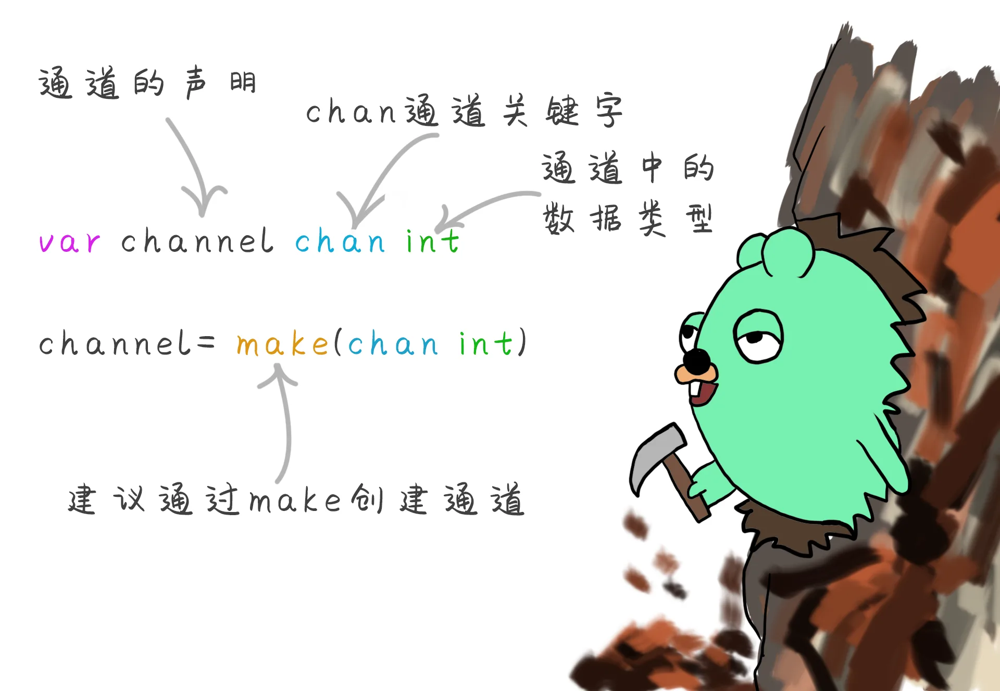
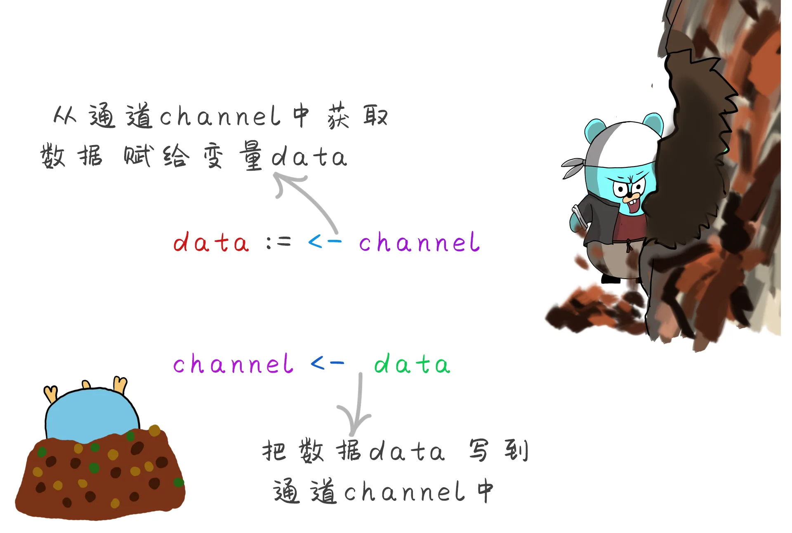
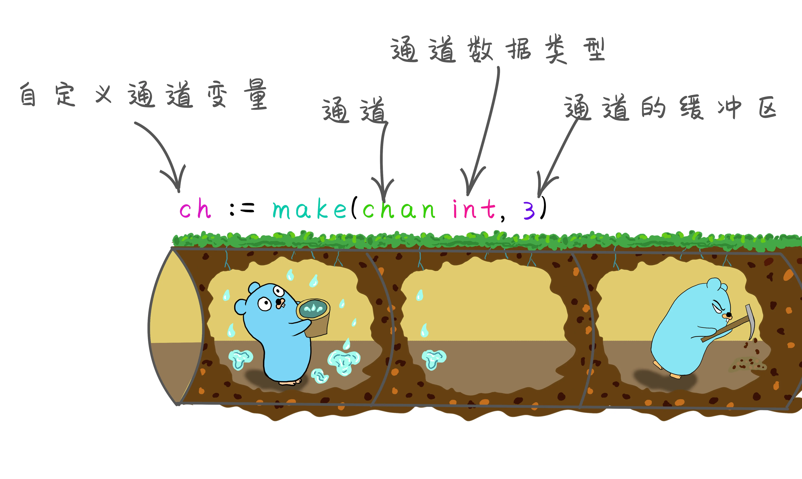
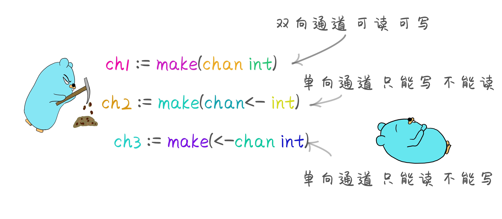
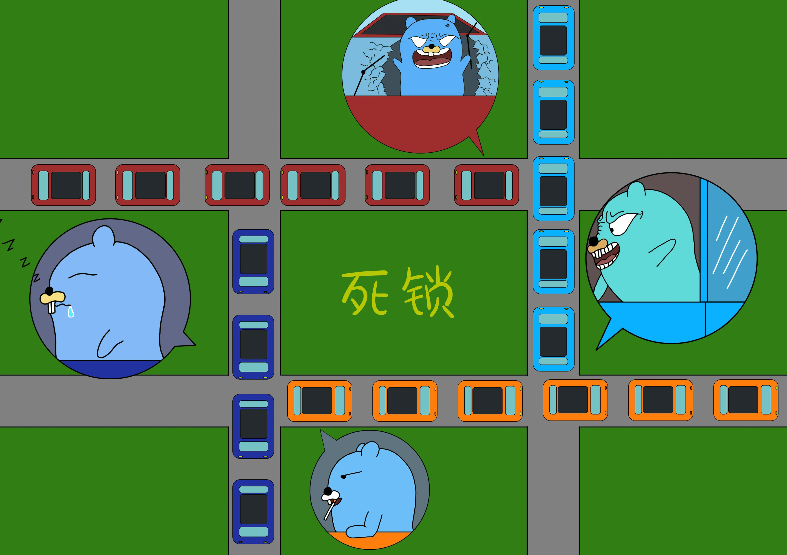

# 连王干娘都没有生意了--并发 下

原文链接：https://juejin.cn/book/6844733833401597966/section/6844733833489678343

# Go 语言特色 并发-下

## Channel 通道

channel通道是用来实现多个协程 Goroutines之间的通讯的，通道相当于一个管道，管道里面放的是数据, 管道一头放 则另一头取。Go语言虽然提供了传统的同步机制，但是Go语言强烈建议还是使用通道来实现Goroutines之间的通讯。Go语言强调 `"不要通过共享内存来通信，而应该通过通信来共享内存"`


当存在多个goroutine要传递某一个数据时，可以把这个数据封装成一个对象，然后把对象的指针传入channel通道中，另一个goroutine 从通道中读取这个指针。同一时间只允许一个goroutine访问channel通道里面的数据。所以go就是把数据放在了通道中来传递，而不是共享内存来传递。

```go
//通道的声明
var channel chan int
//如果通道时nil 则要通过make创建通道
channel = make(chan int)
```

每个通道都有与其相关的类型，该类型表示通道中允许传递的数据类型,通道作为一种数据类型也有自己的默认值零值为nil,  通道必须使用类似于切片的方法 `make()`来定义声明通道。



```go
package main

import (
	"fmt"
)

func main() {
	var channle chan int
	fmt.Printf("通道的数据类型:%T,通道的值:%v\n", channle, channle) //

	if channle == nil {
		channle = make(chan int)
		fmt.Printf("通过make创建的通道数据类型:%T,通道的值:%v,\n", channle, channle)
		// make创建后 通道的值为 0xc00005c060 也就是一个内存地址
		// 所以channel 是一个引用类型的数据
	}
}
```

## 通道的使用

通道中是如何发送和接收数据的。



不管是发送数据还是获取数据， 他们都是阻塞的，当一个goroutine 向另一个goroutine发送数据的时候，他就是阻塞的，直到有另外一个goroutine来取数据，则解除阻塞。相反的 读取数据也是阻塞的，直到另一个goroutine向他来写数据来解除阻塞。channel 本身就是同步的。也就是同一时间只允许一条goroutine来操作。要使用通道最少有两个goroutine来操作。一个goroutine是用不到channel的。

```go
package main

import (
	"fmt"
)

func main() {
	ch1 := make(chan int)

	go func() {
		fmt.Println("======子协程执行======")
		data := <-ch1 //从通道中读取数据
		fmt.Println("读取到通道中的数据是:", data)
	}()

	ch1 <- 10 //往通道里放数据
	fmt.Println("======主协程结束======")
}
```


通过通道来传输数据的时候，读写操作必须是一一对应的，也就是说，有一个读的操作必须对应的有一个写的操作，否则程序会造成程序死锁。

## 通道的关闭

当发送者或者接收者把数据发生完毕，发送者可以关闭通道，通知接收方不会再有数据发送到channel上了然后发送方调用 `close()`方法关闭通道。接收者可以获取来自通道数据时候额外的变量，来检测通道是否已经关闭。


```go
v, ok := <-ch //从通道获取数据时后会返回一个值v 和一个通道的状态ok 为bool类型
```

```go
package main

import (
	"fmt"
)

func main() {
	// 创建一个通道用来传递数据
	ch1 := make(chan int)

	// 通过子协程往通道中放数据
	go func() {
		fmt.Println("======子协程执行======")
		for i := 0; i < 10; i++ {
			ch1 <- i //往通道中放数据
		}
		close(ch1) //关闭通道
	}()

	// 主协程通过for循环来获取通道中的所有数据
	for {
		v, ok := <-ch1 //获取通道的状态以及数据
		if !ok {
			fmt.Println("子协程已将通道关闭")
			break
		}
		fmt.Println("获取到的子协程数据为", v)
	}

	fmt.Println("主协程结束")
}
```

上面代码通过for循环来访问通道的数据,可以通过for range来循环取通道中的数据。for range 就是遍历所有数据，当没有数据的时候也就循环结束。所以可以 替代 `v,ok:=<-ch1`

```go
package main

import (
	"fmt"
)

func main() {
	ch1 := make(chan int)

	go func() {
		fmt.Println("======子协程执行======")
		for i := 0; i < 10; i++ {
			ch1 <- i //往通道中放数据
		}
		close(ch1) //结束发送数据  通知对方通道已经关闭了
	}()

	// 通过for range循环读取通道中的数据,当通道关闭,循环也就结束了
	for v := range ch1 {
		fmt.Println("读取到的通道的数据：", v)
	}

	fmt.Println("主协程结束")
}
```

## 缓冲通道

前面的channel通道都是非缓冲通道，每一次发送和接收都是阻塞式的。一个发送操作，对应一个接收操作，如果发送后未接收，就是阻塞的。同样对于接收者来说另一个发送之前它也是阻塞的。缓冲通道指的是有一个缓冲区，对于发送数据是将数据发送到缓冲区。当缓冲区满了之后才会被阻塞。


对于接收数据方，当没有数据可以接收的时候也会被阻塞。


## 创建缓冲通道

默认情况下无缓冲区的容量都是0，所以之前创建的通道都默认容量都是0。可以在声明通道之后一个参数来指定缓冲区的大小。



```go
package main

import (
	"fmt"
)

func main() {
	// 定义一个缓冲区大小为5的通道
	ch1 := make(chan int, 5)
	ch1 <- 1 //向缓冲区放入数据1 因为缓冲区的大小为5 放入一个1之后 还有四个空的缓冲区  所以还未阻塞
	ch1 <- 2
	ch1 <- 3
	ch1 <- 4
	ch1 <- 5 //此时缓冲区已经满 如果再加入 则会进入阻塞状态
	// 继续添加时会造成死锁 因为缓冲区满了 一直没有读取
	ch1 <- 6 //fatal error: all goroutines are asleep - deadlock!
	fmt.Println("main end")
}
```

对于缓冲区中的数据，是先进先出的原则。第一个进去的第一个被读取到，可以理解为，一个从管道的一端放入，一个从管道的另一端读取。

```go
package main

import (
	"fmt"
)

func main() {
	// 定义一个缓冲区大小为5的通道
	ch1 := make(chan int, 5)

	// 开启子协程写入数据
	go func() {
		for i := 0; i < 10; i++ {
			ch1 <- i
			fmt.Println("子协程写入数据：", i)
		}
		close(ch1) //关闭通道
	}()

	// 主协程读取数据
	for {
		v, ok := <-ch1
		if !ok {
			fmt.Println("读取结束", ok)
			break
		}
		fmt.Println("主协程读取到的数据为：", v)
	}

	fmt.Println("主协程结束")
}
```

## 定向通道

之前的通道都是双向通道，可以同时通过子goroutine向通道中发送数据和接收数据，或者从主goroutine中发送或者接收数据。而定向通道表示： 要么是只读通道，要么是只写通道。


- `chan <- T  只写通道`

- `<- chan T  只读通道`


如果尝试从只写通道ch2中读取数据，则会报错  `invalid operation: <-ch2 (receive from send-only type chan<- int)`。
同样的往只读通道中写入数据也会报错` invalid operation: ch3 <- 10 (send to receive-only type <-chan int)`。

```go
package main

import (
	"fmt"
)

func main() {
	ch1 := make(chan int)   //双向通道
	ch2 := make(chan<- int) //只写通道
	ch3 := make(<-chan int) //只读通道

	// =========1================
	// 如果创建时候创建的就是双向通道
	// 则在子协程内部写入数据，读取的时候不受影响。
	go WriteOnly(ch1)
	data2 := <-ch1
	fmt.Println("获取到只写通道中的数据是", data2)

	// =========2================
	// 如果将定向通道ch2只写通道，作为参数传递。
	// 则不能读取到写回来的数据。
	go WriteOnly(ch2)
	//data := <-ch2 //不能读取会报错：invalid operation: <-ch2 (receive from send-only type chan<- int)

	go ReadOnly(ch1) //这里可以传ch1 双向通道
	ch1 <- 20        //向通道ch1中写入数据

	// =========3================
	go ReadOnly(ch3) //传递单向通道ch3 就无法向通道中写入数据

	fmt.Println("结束")
}

// 只读
func ReadOnly(ch <-chan int) {
	data := <-ch
	fmt.Println("读取到通道的数据是：", data)
}

// 只写
func WriteOnly(ch chan<- int) {
	// 如果传进来的原本是双向通道
	// 但是函数本身接收的是一个只写的通道，则在此函数内部只允许写入数据不允许读取数据
	// 所以单向通道往往是作为参数传递
	ch <- 10
	fmt.Println("只写通道结束")
}
```

## 死锁

死锁是指两个或两个以上的协程的执行过程中，由于竞争资源而阻塞的现象，如果没有外力介入,则无法继续进行下去。死锁的出现的情况有很多种，但都大多数都是因为资源竞争和数据通信的时候引起的。


### 常见的几种死锁场景

使用同步等待组创建协程，主协程中设置同步等待组的数量为4，而只加进去了3条协程，最终都执行完成之后，还有一条未执行，当程序进入阻塞状态的时候无法解锁，就造成了死锁。

```go
package main

import (
	"fmt"
	"sync"
)

// 创建一个同步等待组的对象
var wg sync.WaitGroup

func main() {
	wg.Add(4) //设置同步等待组的数量
	go Sale1()
	go Sale2()
	go Sale3()
	wg.Wait() //主goroutine进入阻塞状态
	fmt.Println("main end...")
}

func Sale1() {
	fmt.Println("func1...")
	wg.Done() //执行完成 同步等待数量减1
}
func Sale2() {
	defer wg.Done()
	fmt.Println("func2...")
}
func Sale3() {
	defer wg.Done() //使用延时执行来减去执行组的数量
	fmt.Println("func3...")
}
```

还有一种是，一个通道在一个主goroutine协程里同时进行读和写。也会造成死锁。

```go
package main

import (
	"fmt"
)

func main() {
	c := make(chan int)
	c <- 100 //向通道中写入数据
	a := <-c //读取通道中的数据
	fmt.Println(a)
}
```

协程开启之前就放数据,还没有准备好，就放数据，就会造成死锁。

```go
func main() {
	c := make(chan int)
	c <- 88
	go func() {
		<-c
	}()
}
```


通道1中调用了通道2，通道2中调用通道1,相互等着要对方的数据，造成死锁。

```go
package main

func main() {
	ch1 := make(chan int)
	ch2 := make(chan int)
	go func() {
		for {
			c := <-ch1
			ch2 <- c
		}
	}()

	for {
		c := <-ch2
		ch1 <- c
	}
}
```



## select 语句实现通道的多路复用


我们在聊天过程中，有两条通道，一条专门负责发送消息给对方，另一条通道专门负责接收消息。虽然可以使用for循环来遍历每个通道的数据，达到同时接收到多个通道的数据，但是效率就比较差了。在Go语言中提供select关键字，可以同时响应多个通道的操作。


select 的用法

```go
select {
case <- ch1:
    // 如果ch1成功读到数据，则进行该case处理语句。
case ch2 <- 1:
    // 如果成功向ch2写入数据，则进行该case处理语句。
default:
    // 如果上面都没有成功，则进入default处理流程。
```

```go
package main

import (
	"fmt"
	"time"
)

func main() {
	ch1 := make(chan int)
	ch2 := make(chan int)
	go func() {
		for {
			select {
			case <-ch1:
				fmt.Println("成功获取ch1的数据：", <-ch1)
			case ch2 <- 1:
				fmt.Println("成功向通道ch2中写入数据")
			case <-time.After(time.Second * 2):
				// 使用time.After 设置超时响应。如果迟迟接收不到以上的case就会响应超时。
				fmt.Println("超时!!")
			}
		}
	}()

	for i := 0; i < 10; i++ {
		ch1 <- i
		fmt.Println("ch1写入数据：", i)
	}
	for i := 0; i < 10; i++ {
		str := <-ch2
		fmt.Println("获取到ch2的数据：", str)
	}

	// select 会一直等待等到某个 case 语句完成，
	// 也就是等到成功从 ch1 或者 ch2 中读到数据。则 select 语句结束。
}
```

## Go语言的并发模型 GPM

所有的并发模型在操作系统中，都是以线程模式存在的。操作系统根据访问的资源权限不同，又分为用户空间和内核空间，内核空间主要操作访问计算机CPU资源、I/O资源、内存资源、等硬件资源。用户空间不能直接访问计算机内核资源，必须通过系统调用库或者函数或者其他脚本来访问内核空间提供的资源。往往程序中所指的线程都是一个用户空间的线程，不是操作系统内的内核线程。用户线程与内核线程都是一对一的关系，大部分编程语言的线程库都是对操作系统的内核线程做了一层封装，创建出来的线程与内核线程静态进行关联，所以这种方式实现起来简单，但是完全要依靠内核线程来处理，并且不同的用户线程之间的创建销毁等操作都是由内核亲自来完成。如果需要大量的线程，则性能完全由内核来决定。

GPM的概念

- `G` 就是goroutine的简称，代表一段需要被并发执行的go代码，其中保存了goroutine运行的一些状态信息。

- `M` 就是真正服务工作的工作线程,是一个内核级线程，对内核级线程的封装，数量对应真实的CPU数,G需要依赖M才可以运行。M 保存了自己使用时候的栈信息、当前正在执行的G信息、以及与之绑定的P。

- `P` 为M的执行提供了上下文，保存了M执行G的一些基本信息，保存了等待执行的G队列。

`M只有绑定P才可以去执行G`


