# 漫画 Go 语言项目实战 聊天服务

原文链接：https://juejin.cn/book/6844733833401597966/section/6844733833489694727

# 漫画 Go 语言项目实战 聊天服务

学习了Go语言的基础知识，Go语言中最大的特色是并发，接下来通过一个简单的聊天室更全面了解Go语言的并发，以及如何在日后的项目中使用Go语言。

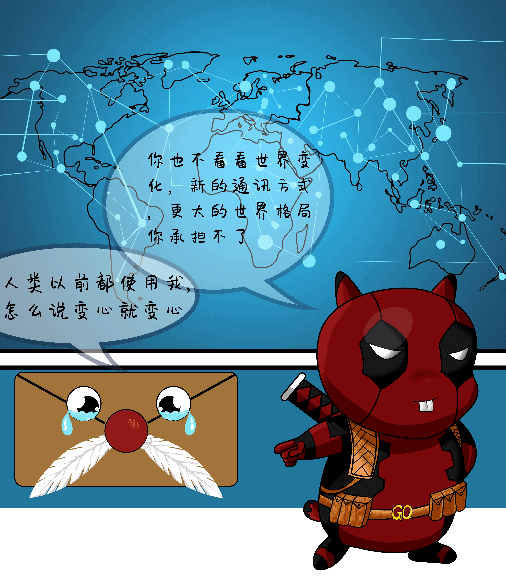

## 聊天服务准备技术

-

一个Go语言http框架，使用框架能够帮助你快速开发Go语言的项目，并且把重点都放在业务逻辑上。目前有很多这样的框架，在这里我们先采用一种框架`beego`，beego能够快速开发API，Web服务等应用。我们写聊天服务的基于beego框架，实现聊天服务的服务端。聊天服务中我们会用到部分beego的内容。更多有关beego框架的内容可以到beego官网学习。beego官网地址：[https://beego.me/](https://beego.me/)

-

`WebSocket协议`，底层的通信协议，单纯的http协议是一个单项通讯的协议，只能够客户端向服务端发送请求，如果作为聊天服务的话就必须要求服务端与客户端能够双向通讯。所以单纯的HTTP协议是不能够实现的，WebSocket协议解决了这样的问题，不仅能让够客户端主动向服务端发送消息，服务端也能够主动向客户端发送消息，客户端只要连接到服务器，就会保持一个长时间的通讯，也就会一直在线。WebSocket标识符是`ws`。例如：ws://localhost:8080/Conn

-

websocket包地址：github.com/gorilla/websocket

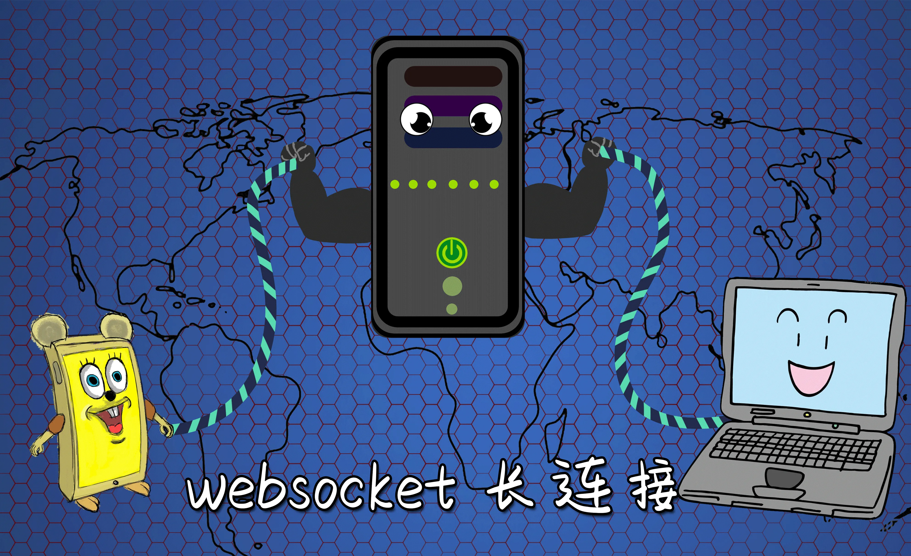

- `数据库MariaDB` MariaDB是Mysql的一个分支，而Mysql是闭源的MariaDB是开源的，MariaDB是由Mysql创始人`Michael Widenius迈克尔·维德纽斯`开发的，MariaDB的名字来自于`Michael Widenius`的女儿`Maria`的名字。MariaDB跟Mysql在绝大多数情况下是兼容的。对于我们开发者来说没有什么区别。

- mariadb安装包下载地址 : [https://downloads.mariadb.org/mariadb](https://downloads.mariadb.org/mariadb)


## 实现步骤

### 创建API项目

使用beego 创建api项目，beego的项目都是由`bee`创建的。首先得先安装`bee` 和`beego`。

- `go get github.com/astaxie/beego`

- `go get github.com/beego/bee`
安装好环境之后就可以使用bee命令来创建项目。  执行命令 `bee api chatservice` 之后就会在GOPATH目录下创建一个api项目 chatservice。

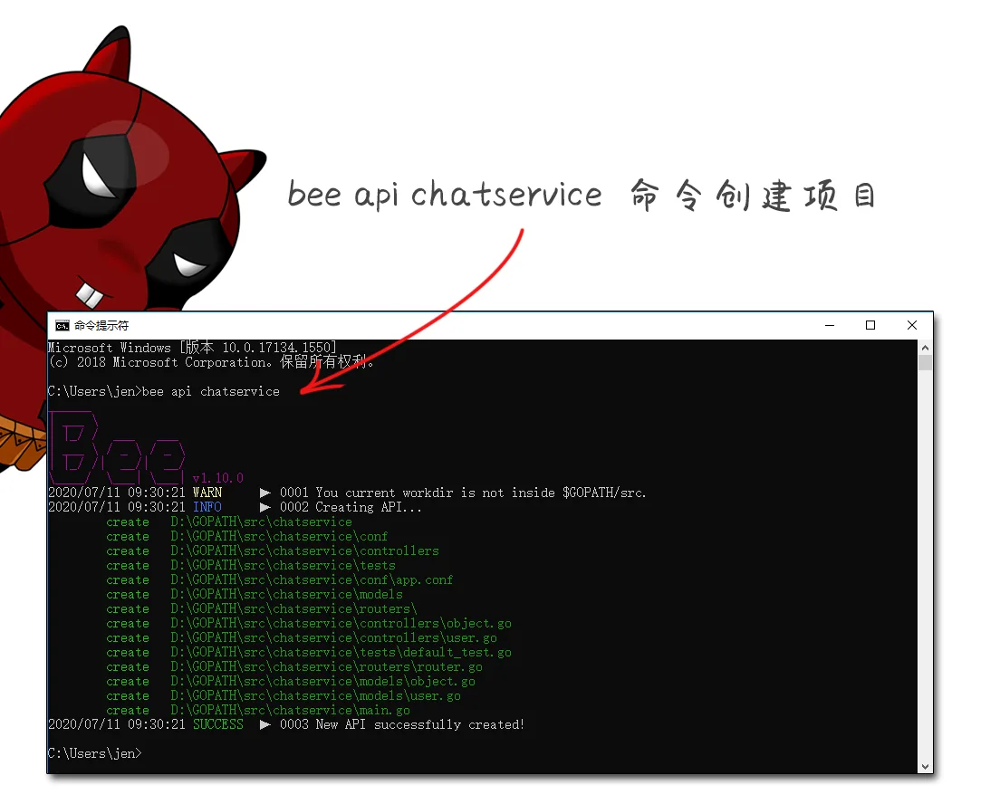
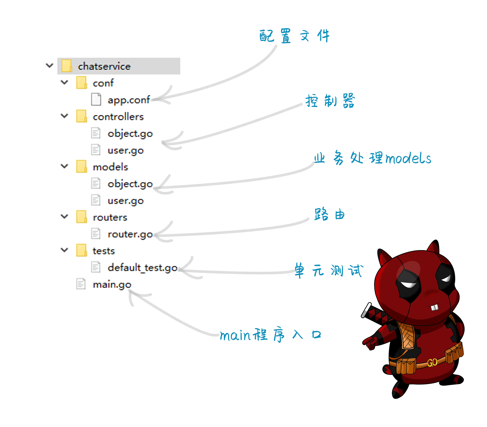
图中的object.go 和user.go 都是示例文件，在此基础上可以新建自己的控制器。

### 自动化生成swagger文档

`bee run -gendoc=true -downdoc=true`    其中 `-gendoc=true` 表示每次自动化的 build 文档。  `-downdoc=true` 表示如果本地没有找到swagger文件，就会自动的下载 swagger 文档查看器。之后就可以在浏览器查看效果。

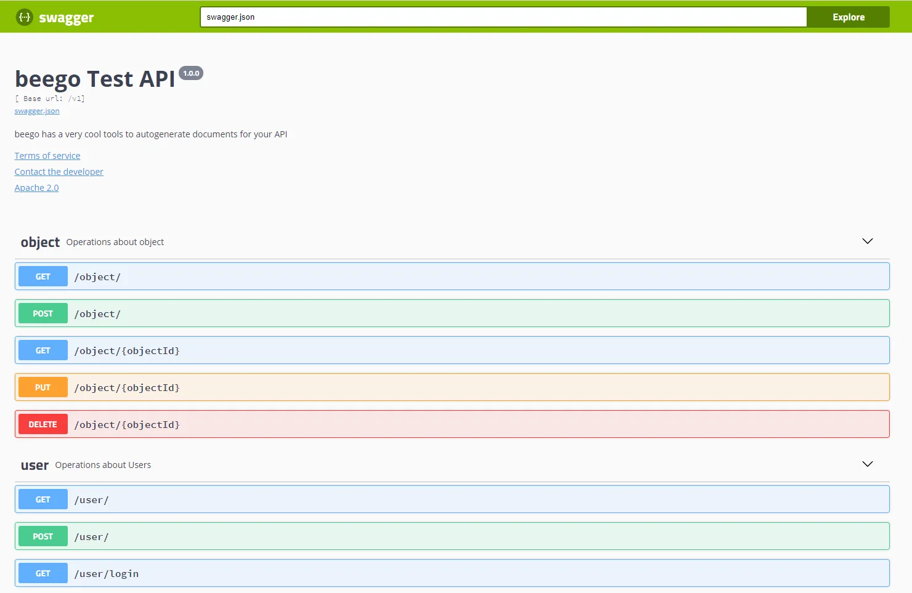
swagger文档目前最新版本是3.0版本。也就是默认为上图风格的。但是好家伙觉得2.0版本的比较好看，而且简单明了。下图为2.0版本。

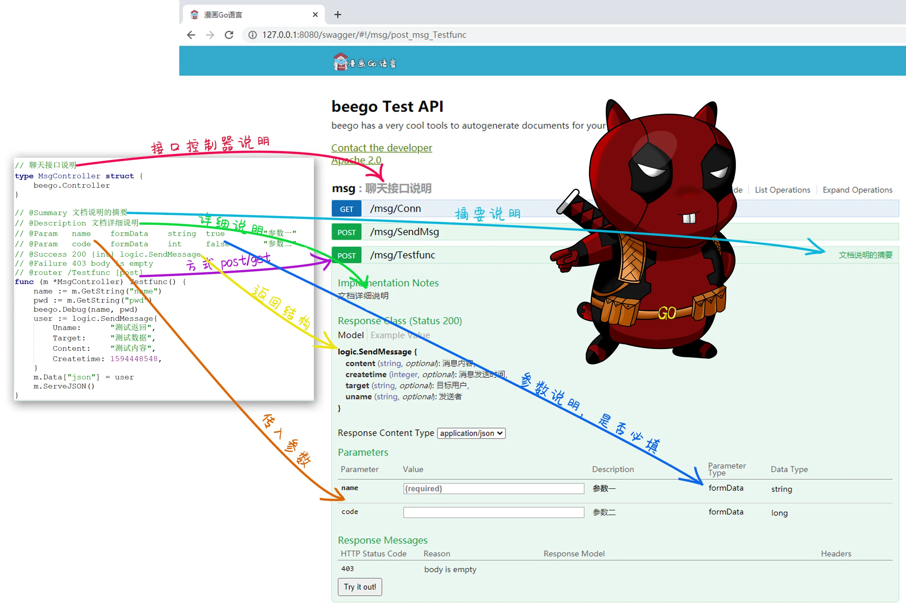

### 新建控制器用于创建websocket连接

在聊天中的主要内容分两种：一个是用户，一个是消息。

- 用户包含用户的主要信息:姓名,头像,年龄,等这些基本信息内容，还有客户端与服务端之间的这个ws连接信息。

- 消息则分为：有用户发送的消息，用户加入的消息，还有用户退出的消息。
所以上面创建连接的代码中，需要获取到用户的姓名`uname`。创建好连接ws，将ws连接信息，和用户同时加入服务器，这个用户的状态就可以认为是在线状态了。
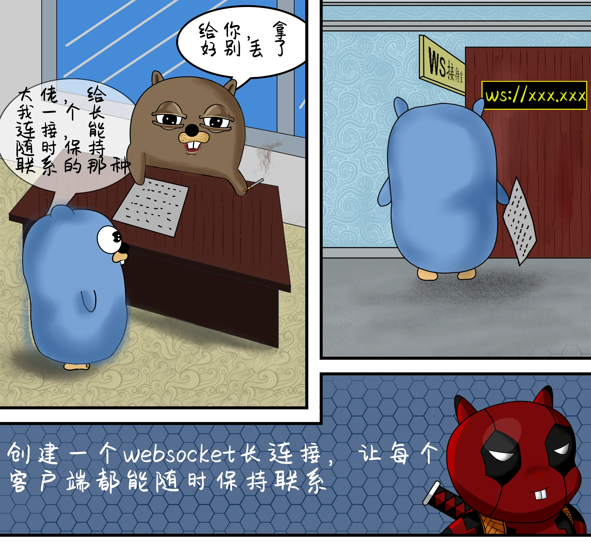

在控制器controllers 中创建msg.go 控制器，新建Conn接口用于websocket连接。

```go

// @Title 创建websocket链接
// @Summary 创建websocket链接
// @Description 根据用户信息创建websocket链接
// @Param   userid  path    int true        "当前连接的用户id"
// @router /Conn [get]
func (m *MsgController) Conn() {
userid, _ := m.GetInt("userid", 0)
ws, err := websocket.Upgrade(m.Ctx.ResponseWriter, m.Ctx.Request, nil, 1024, 1024)
if _, ok := err.(websocket.HandshakeError); ok {
beego.Error(m.Ctx.ResponseWriter, "不是websocket连接", 400)
return
} else if err != nil {
beego.Error("无法设置websocket连接:", err)
return
}
client := logic.NewUser(userid, ws, make(chan *logic.SendMessage, 256))
client.Join(ws)
}

```

客户端结构存储用户信息，ws连接还有消息通道。

```go
//客户端结构
type Client struct {
	Userid   int
	Conn     *websocket.Conn
	Sendchan chan *SendMessage
}
```

消息结构表示每一个用户发送出去的，或者接收到的消息都是什么样的结构。

```go
//发送消息数据
type SendMessage struct {
	Id       int    `json:"id" description:"消息ID"`
	Cvsid    int    `json:"cvsid" description:"会话id"`
	Source   int    `json:"source" description:"消息发送者ID"`
	Content  string `json:"content" description:"消息内容"`
	Sendtime int    `json:"sendtime" description:"发送时间"`
	Userimg  string `json:"userimg" description:"发送者头像"`
	Username string `json:"username" description:"发送者名称"`
}
```

将连接信息通过协程goroutine加入到map中，map存储了所有在线用户，通过map就能够判断当前用户是否在线。如果在线就可以获取到用户的连接信息以及消息通道。就可以将消息通过用户的消息通道，发送到客户端。

```go
//保存所有在线用户信息及客户端信息
Onlineusers = make(map[string]*Client)
```

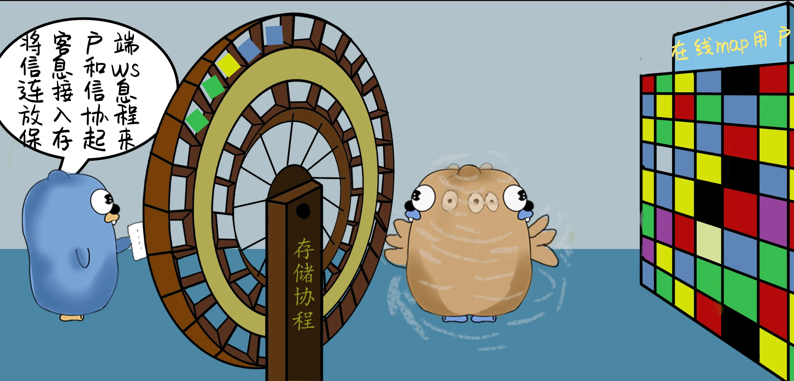

当用户加入聊天之后就要开始接收消息或者发送消息，在聊天服务中通过两个单独的协程，一个协程用于接收用户消息，另一个协程用于发送消息。

```go
//加入聊天
func (c *Client) Join(ws *websocket.Conn) {
register <- &Client{Userid: c.Userid, Conn: ws, Sendchan: c.Sendchan}
//开始监听发送消息
go c.beginSend()
//开始监听读取消息
go c.beginRead()
//执行心跳检测
go c.ProcLoop()
}

```

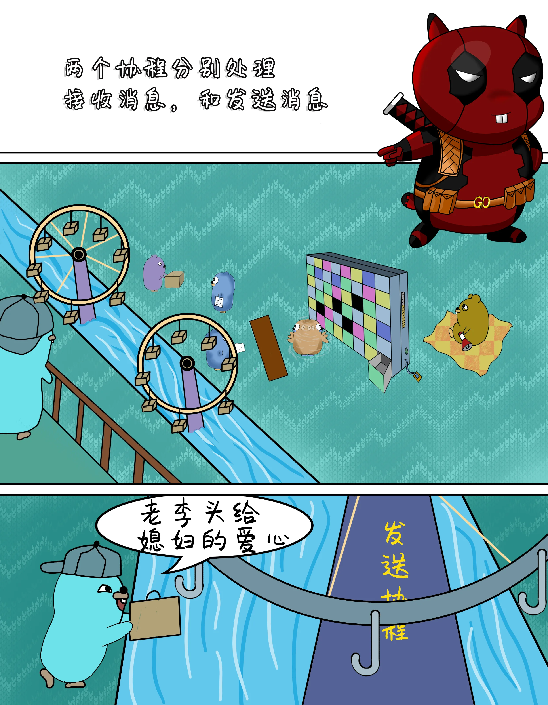

### 服务端收发消息处理

客户端的任务是将消息送到服务器，那么服务器开始处理接收到的消息。

```go
//开启一个携程执行监听读取消息
func (c *Client) beginRead() {
defer func() {
c.Leave()
}()
c.Conn.SetReadLimit(maxMessageSize) //设置获取消息的大小限制
//设置websocket连接超时时间
c.Conn.SetReadDeadline(time.Now().Add(pongWait))
c.Conn.SetPongHandler(func(string) error { c.Conn.SetReadDeadline(time.Now().Add(pongWait)); return nil })
for {
//从websocket获取消息缓冲
_, message, err := c.Conn.ReadMessage()
if err != nil {
if websocket.IsUnexpectedCloseError(err, websocket.CloseGoingAway, websocket.CloseAbnormalClosure) {
beego.Info("error: %v", err)
}
break
}
beego.Info(c.Name, "发来消息：", string(message))
//将消息放入发送通道中
//publish <- &SendMessage{}
}
}

```

```go
//开启一个携程执行监听发送消息
//开启一个携程执行监听发送消息
func (c *Client) beginSend() {
defer func() {
c.Leave()
}()
for {
message, ok := <-c.Sendchan
c.Conn.SetWriteDeadline(time.Now().Add(writeWait))
if !ok {
//通道关闭
c.Conn.WriteMessage(websocket.CloseMessage, []byte{})
return
}
ws := c.Conn
if ws != nil {
//发送消息
if ws.WriteMessage(websocket.TextMessage, []byte{}) != nil {
unregister <- c
}
}

//发送消息
c.Conn.WriteJSON(message)
}
}

```

### 创建客户端

有了上面的准备工作接下来创建一个客户端用来接收和发送消息。在这里我们使用beego创建一个web项目用于测试聊天服务器。使用命令 `bee new chatclient`
在view页面中使用javascript代码测试聊天服务，主要有三部分内容：

- 1，创建websocket连接。

- 2，监听websocket返回消息。

- 3，发出消息。

```javascript
// 1，创建websocket连接
var socket = new WebSocket('ws://127.0.0.1:8088/v1/msg/Conn');

//2，监听websocket返回的信息
socket.onmessage = function (event) {
if(event.data!=""){
//接受消息后的处理
}
};

//3，通过webscoket 发送消息
//socket.send("消息内容");//发送消息到聊天服务

```

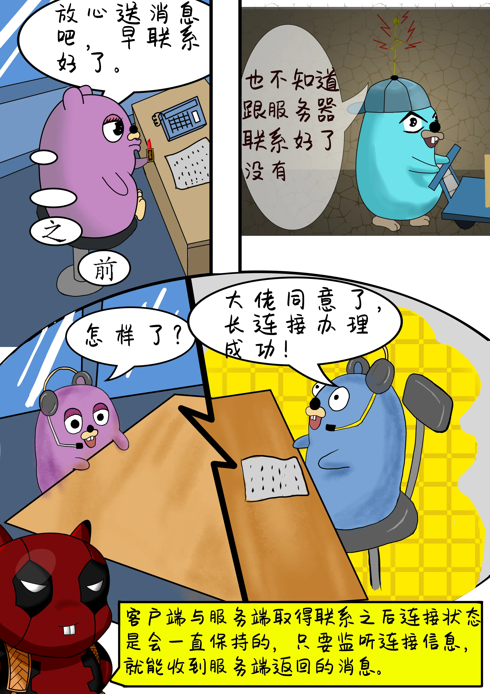
当客户端创建好websocket 连接，就可以通过websocket.send() 向服务端发送消息。服务器可以根据消息内容来分发消息。

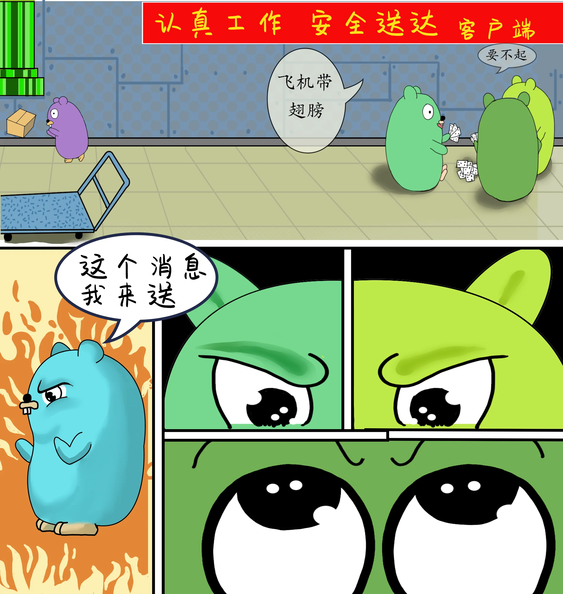

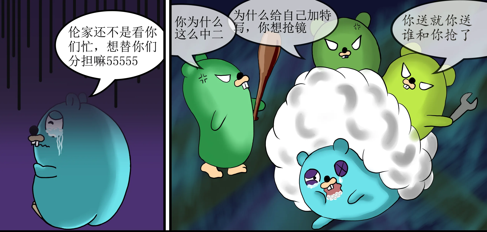

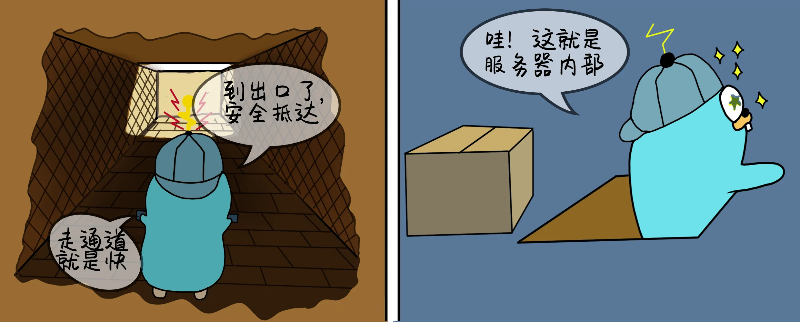

### 心跳检测和重连机制

心跳和重连的目的概括就是客户端和服务端保证彼此还活着，还有心跳，这样也就不会丢失数据了。

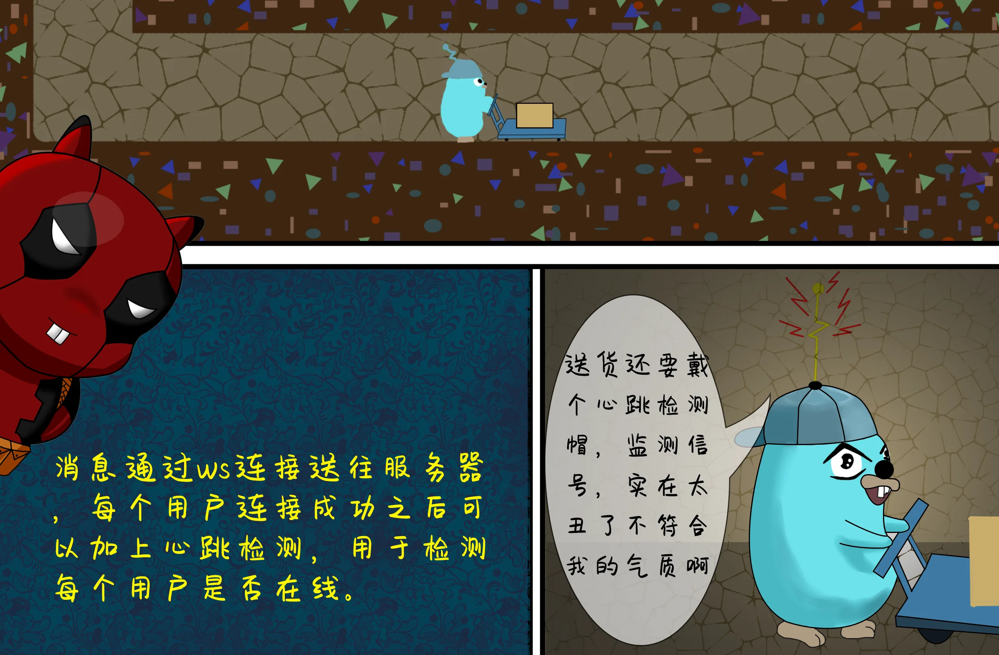
websocket连接被断开，分两种情况：

- 前端断开 有可能因为信号不好，网络原因，客户端悄悄的溜走了，服务端也就不知道客户端是否在线了。

- 服务器断开 后端服务可能会因为一些情况，更新程序等操作，是在可控的情况下发生断开连接。或者因为一些异常断开连接。

因此就需要用一种心跳检测机制来检测客户端与服务端是否处于正常连接状态，通过在一定时间间隔发送心跳包来检测连接是否正常，如果出现异常状态，需要触发关闭websocket连接。然后就可以触发重连操作。

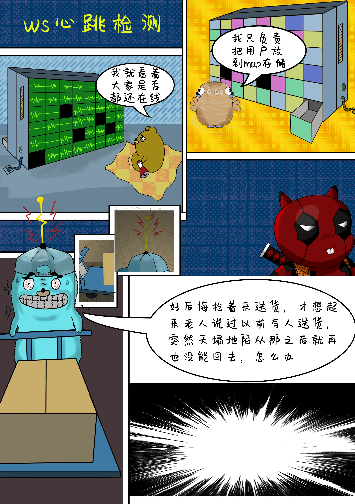

```go
// 开启一个携程执行 心跳检测
func (c *Client) ProcLoop() {
ticker := time.NewTicker(pingPeriod)
defer func() {
//心跳停止了 关掉当前连接
beego.Debug(c.Name, "心跳停止")
ticker.Stop()
c.Leave()
}()

for {
<-ticker.C
//beego.Info(c.Name, "`•.¸¸.•´´¯`••.¸¸.•´´❤`•.¸¸.•´´¯`••.¸¸.•´´")

c.Conn.SetWriteDeadline(time.Now().Add(writeWait))
if err := c.Conn.WriteMessage(websocket.PingMessage, []byte("heartbeat")); err != nil {
beego.Debug(err.Error())
return
}
}

}

```

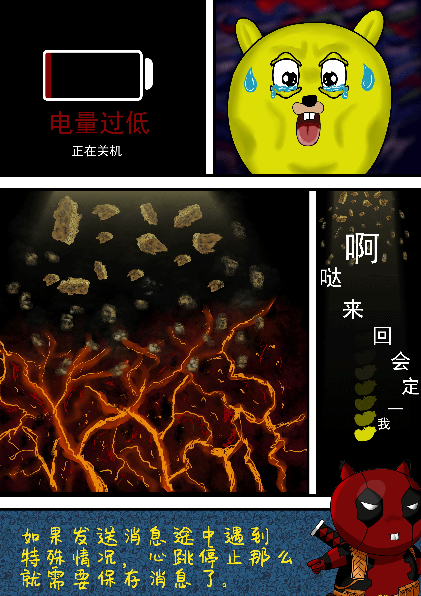

### 配置文件说明

配置文件中runmode代表当前项目是在什么模式下运行,`dev`为开发模式，`test`测试模式，`prod`生产模式，当修改`runmode=prod`时候，代码运行时会使用prod模式下配置的节点。

```go
# 项目名称
appname = chatservice
# 程序端口号
httpport = 8088
# 编辑模式
runmode = dev
autorender = false
copyrequestbody = true
# 文档可用
EnableDocs = true
sqlconn = "root:123456@tcp(127.0.0.1:3306)/chatdb?charset=utf8mb4"

# 开发模式
[dev]
EnableDocs = true
apnsProduction=false

# 测试模式
[test]
EnableDocs = true
apnsProduction=false

# 生产模式
[prod]
sqlconn = "root:123456@tcp(mysqltest.kuaibang360.com:3306)/gyburl?charset=utf8mb4"

```

### 数据库设计

如果需要将聊天的消息存储起来那么就需要数据库的支持，这里我们用MariaDB。需要在配置文件中配置数据库连接。

```sql
/*
Navicat Premium Data Transfer

Source Server         : 本地
Source Server Type    : MariaDB
Source Server Version : 100504
Source Host           : localhost:3306
Source Schema         : chatdb

Target Server Type    : MariaDB
Target Server Version : 100504
File Encoding         : 65001

Date: 14/07/2020 08:25:34
*/

SET NAMES utf8mb4;
SET FOREIGN_KEY_CHECKS = 0;

-- ----------------------------
-- Table structure for conversation
-- ----------------------------
DROP TABLE IF EXISTS `conversation`;
CREATE TABLE `conversation`  (
`id` int(11) NOT NULL AUTO_INCREMENT COMMENT 'id',
`userlist` varchar(255) CHARACTER SET utf8 COLLATE utf8_general_ci NULL DEFAULT NULL COMMENT '用户会话',
PRIMARY KEY (`id`) USING BTREE
) ENGINE = InnoDB AUTO_INCREMENT = 2 CHARACTER SET = utf8 COLLATE = utf8_general_ci COMMENT = '会话表' ROW_FORMAT = Dynamic;

-- ----------------------------
-- Records of conversation
-- ----------------------------
INSERT INTO `conversation` VALUES (1, ',1,2,');

-- ----------------------------
-- Table structure for conversation_user
-- ----------------------------
DROP TABLE IF EXISTS `conversation_user`;
CREATE TABLE `conversation_user`  (
`id` int(11) NOT NULL AUTO_INCREMENT COMMENT 'id',
`cvsid` int(11) NULL DEFAULT NULL COMMENT '对应会话id',
`userid` int(11) NULL DEFAULT NULL COMMENT '关联的用户id',
`lastid` int(11) NULL DEFAULT NULL COMMENT '最后阅读消息的id',
PRIMARY KEY (`id`) USING BTREE,
INDEX `index_cvsid`(`cvsid`) USING BTREE COMMENT '会话索引',
INDEX `index_userid`(`userid`) USING BTREE COMMENT '用户索引'
) ENGINE = InnoDB AUTO_INCREMENT = 3 CHARACTER SET = utf8 COLLATE = utf8_general_ci COMMENT = '用户对应的会话表' ROW_FORMAT = Dynamic;

-- ----------------------------
-- Records of conversation_user
-- ----------------------------
INSERT INTO `conversation_user` VALUES (1, 1, 1, 1);
INSERT INTO `conversation_user` VALUES (2, 1, 2, 1);

-- ----------------------------
-- Table structure for message
-- ----------------------------
DROP TABLE IF EXISTS `message`;
CREATE TABLE `message`  (
`id` int(11) NOT NULL AUTO_INCREMENT COMMENT 'id',
`cvsid` int(11) NULL DEFAULT NULL COMMENT '会话id',
`source` int(255) NULL DEFAULT NULL COMMENT '消息发送者ID',
`content` varchar(500) CHARACTER SET utf8 COLLATE utf8_general_ci NULL DEFAULT NULL COMMENT '消息内容',
`sendtime` int(11) NULL DEFAULT NULL COMMENT '消息发送时间',
PRIMARY KEY (`id`) USING BTREE,
INDEX `index_cvsid`(`cvsid`) USING BTREE COMMENT '会话索引'
) ENGINE = InnoDB AUTO_INCREMENT = 3 CHARACTER SET = utf8 COLLATE = utf8_general_ci ROW_FORMAT = Dynamic;

-- ----------------------------
-- Records of message
-- ----------------------------
INSERT INTO `message` VALUES (1, 1, 2, '在不在不', 1594652539);
INSERT INTO `message` VALUES (2, 1, 1, '不在不在', 1594655539);

-- ----------------------------
-- Table structure for user
-- ----------------------------
DROP TABLE IF EXISTS `user`;
CREATE TABLE `user`  (
`id` int(11) NOT NULL AUTO_INCREMENT COMMENT 'id',
`name` varchar(50) CHARACTER SET utf8 COLLATE utf8_general_ci NULL DEFAULT NULL COMMENT '用户姓名',
`usertel` varchar(20) CHARACTER SET utf8 COLLATE utf8_general_ci NULL DEFAULT NULL COMMENT '手机号',
`img` varchar(255) CHARACTER SET utf8 COLLATE utf8_general_ci NULL DEFAULT NULL COMMENT '用户头像',
PRIMARY KEY (`id`) USING BTREE
) ENGINE = InnoDB AUTO_INCREMENT = 4 CHARACTER SET = utf8 COLLATE = utf8_general_ci ROW_FORMAT = Dynamic;

-- ----------------------------
-- Records of user
-- ----------------------------
INSERT INTO `user` VALUES (1, '好家伙', '10000000000', '');
INSERT INTO `user` VALUES (2, '老李头', '12222222222', '');

SET FOREIGN_KEY_CHECKS = 1;

```

### 业务分析

聊天服务第一步得与要聊天的对象创建一条会话，也就是你要和谁聊天。

```go
//创建会话ID
func (c *Conversation) CreateConversation(targetid, userid int) (int, string) {
o := orm.NewOrm()
cvsinfo := models.Conversation{}
sql := "select * from conversation where userlist like ? and userlist like ?"
tid := strconv.Itoa(targetid)
uid := strconv.Itoa(userid)
err := o.Raw(sql, "%,"+tid+",%", "%,"+uid+",%").QueryRow(&cvsinfo)
cvsid := 0
if err != nil {
//如果没有和对方聊过天就新创建主会话信息
var conversation models.Conversation
conversation.Userlist = "," + uid + "," + tid + ","
cvsnum, _ := o.Insert(&conversation)
cvsid, _ = strconv.Atoi(strconv.FormatInt(cvsnum, 10))
} else {
//返回已经存在的会话ID
cvsid = cvsinfo.Id
}

var cvslist []models.ConversationUser
o.Raw("select * from conversation_user where cvsid=?", cvsid).QueryRows(&cvslist)
//创建map存储
cvslistmap := make(map[int]int, len(cvslist))
for _, v := range cvslist {
cvslistmap[v.Userid] = v.Userid
}
//用户如果删除会话列表 再次创建会话列表数据
//获取删除之前最后消息ID
var msglist []logic.SendMessage
o.Raw("select max(id) as id,source from message where cvsid=? GROUP BY source", cvsid).QueryRows(&msglist)
msglistmap := make(map[int]int, len(msglist))
if len(msglist) > 0 {
for _, v := range msglist {
msglistmap[v.Source] = v.Id
}
}
_, ok1 := cvslistmap[userid]
_, ok2 := cvslistmap[targetid]
//删除之后以前的数据最大ID设置成最大阅读ID
wlasid, _ := msglistmap[userid]
tlasid, _ := msglistmap[targetid]
//创建对应的两条用户关联数据
chatcvsuser := []models.ConversationUser{}
if !ok1 && !ok2 {
chatcvsuser = []models.ConversationUser{
{Cvsid: cvsid, Userid: userid, Lastid: wlasid},
{Cvsid: cvsid, Userid: targetid, Lastid: tlasid},
}
} else if ok1 && !ok2 {
chatcvsuser = []models.ConversationUser{
{Cvsid: cvsid, Userid: targetid, Lastid: tlasid},
}
} else if !ok1 && ok2 {
chatcvsuser = []models.ConversationUser{
{Cvsid: cvsid, Userid: userid, Lastid: wlasid},
}
}
//插入数据
o.InsertMulti(100, chatcvsuser)
return cvsid, "创建会话成功"
}

```

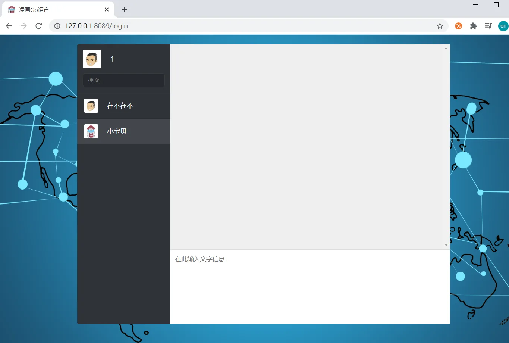

当客户端进入聊天页面之后，需要获取到曾经都与哪些人聊过天，于是就得有一个获取会话列表的接口。

```go
//获取会话列表数据
func (this *Conversation) GetConversation(userid int) ([]*logic.Conversation, error) {
list := []*logic.Conversation{}
o := orm.NewOrm()
//当前用户的会话消息列表
var cvslist []logic.Conversation
sql := "select cu.*,c.userlist,m.* from conversation_user cu,conversation c,(select cvsall.id as msgid,cvsall.cvsid as mcvsid,cvsall.source,cvsall.content,cvsall.sendtime  from (select m.* from message m,(select cvsid from conversation_user where userid =?) s where s.cvsid=m.cvsid  ORDER BY m.id desc ) cvsall GROUP BY cvsall.cvsid) m where cu.cvsid=c.id and m.mcvsid=cu.cvsid and cu.userid=?"
_, e := o.Raw(sql, userid, userid).QueryRows(&cvslist)
if e != nil {
return nil, e
}
beego.Debug(len(cvslist))
//查询所有会话未读消息数
var CvsNotseelist []logic.CvsNotsee
cvsmsgsql := "select cm.cvsid,count(1) as notsee from (select msg.*,cv.userlist from message msg ,conversation cv where cv.id=msg.cvsid and cv.userlist like '%," + strconv.Itoa(userid) + ",%' ) cm,conversation_user cu where cu.cvsid=cm.cvsid and cu.userid=?  and cm.id>cu.lastid GROUP BY cvsid  "
beego.Debug(cvsmsgsql)
o.Raw(cvsmsgsql, userid).QueryRows(&CvsNotseelist)
beego.Debug(CvsNotseelist)
NotseeMap := make(map[int]int, len(CvsNotseelist))
for _, v := range CvsNotseelist {
NotseeMap[v.Cvsid] = v.Notsee
}
//获取会话列表中用户信息 获取对方用户信息
userlist := []int{}
cvsMap := make(map[int]int, len(cvslist))
for _, c := range cvslist {
if c.Userlist != "" {
//获取对方的用户id
otherid := strings.Replace(strings.Replace(c.Userlist, ","+strconv.Itoa(userid)+",", "", -1), ",", "", -1)
otherids, _ := strconv.Atoi(otherid)
userlist = append(userlist, otherids)
cvsMap[c.Cvsid] = otherids
}
}
//会话列表中对方的用户信息
db := orm.NewOrm()
beego.Debug(userlist)
var userinfo []models.User
if len(userlist) > 0 {
_, e = db.QueryTable(new(models.User)).Filter("Id__in", userlist).All(&userinfo)
if e != nil {
return nil, e
}
}
userMap := make(map[int]models.User, len(userinfo))
for _, u := range userinfo {
userMap[u.Id] = u
}
for _, c := range cvslist {
ortherid, _ := cvsMap[c.Cvsid]
user, ok := userMap[ortherid]
notsee, sok := NotseeMap[c.Cvsid]
if !sok {
notsee = 0
}
var users *models.User
if ok {
users = &user
}
list = append(list, NewConversation(&c, users, notsee))
}

return list, nil
}

```

```go
//发送消息给指定用户
func SendToUser(msg *logic.SendMessage) (int, string) {
db := orm.NewOrm()
userid := msg.Source
cvsid := msg.Cvsid
conversation := &models.Conversation{}
targetid := 0
err := db.Raw("select * from conversation where id=?", cvsid).QueryRow(conversation)
if err == nil {
if len(conversation.Userlist) > 0 {
conversationlist := strings.TrimLeft(strings.TrimRight(conversation.Userlist, ","), ",")
userarray := strings.Split(conversationlist, ",")
for _, v := range userarray {
vid, _ := strconv.Atoi(v)
if vid != userid {
targetid = vid
}
}
}
}

//如果对方不存在会话 重新创建会话信息
var cvslist []models.ConversationUser
db.Raw("select * from conversation_user where cvsid=?", cvsid).QueryRows(&cvslist)
cvslistmap := make(map[int]int, len(cvslist))
for _, v := range cvslist {
cvslistmap[v.Userid] = v.Userid
}
_, ok2 := cvslistmap[targetid]
if !ok2 {
//用户如果删除会话列表 再次创建会话列表数据
//获取删除之前最后消息ID
var msglist []logic.SendMessage
db.Raw("select max(id) as id,source from message where cvsid=? GROUP BY source", cvsid).QueryRows(&msglist)
msglistmap := make(map[int]int, len(msglist))
if len(msglist) > 0 {
for _, v := range msglist {
msglistmap[v.Source] = v.Id
}
}
tlasid, _ := msglistmap[targetid]
chatcvsuser := []models.ConversationUser{
{Cvsid: cvsid, Userid: targetid, Lastid: tlasid},
}
db.InsertMulti(10, chatcvsuser)
}
//获取发送者头像和姓名信息
userinfo := models.User{}
db.QueryTable(new(models.User)).Filter("id", userid).One(&userinfo)
sendmsg := &logic.SendMessage{
Id:       msg.Id,
Cvsid:    msg.Cvsid,
Source:   msg.Source,
Content:  msg.Content,
Sendtime: msg.Sendtime,
Userimg:  userinfo.Img,
Username: userinfo.Name,
}
//目标用户ID
beego.Debug(msg.Source, "给目标用户", targetid, "发来消息：", msg.Content)
if targetid == 0 {
return 0, "目标用户不存在"
}
u, ok := logic.Onlineusers[targetid]
if ok {
//用户在线直接发送消息
u.Send(sendmsg)
} else {
//用户不在线推送消息
beego.Debug("目标用户不在线")
}
return 1, "已发送"
}

```

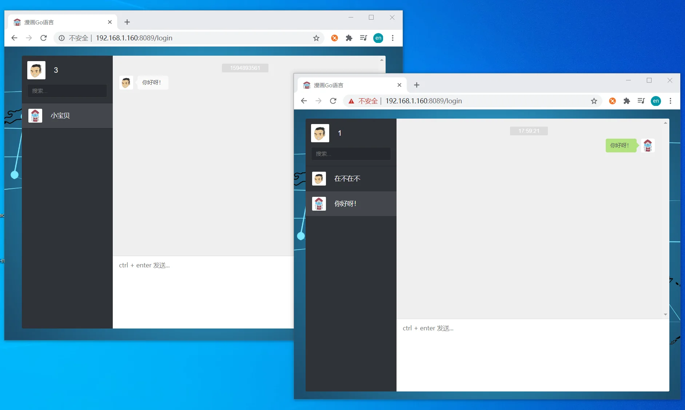

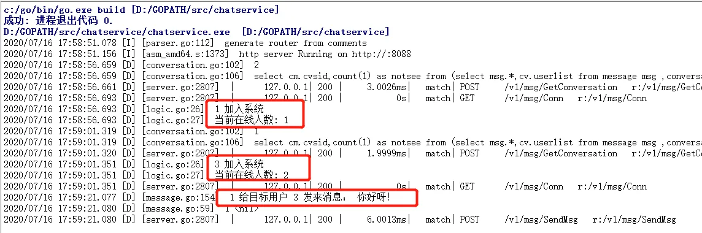

### 项目git地址

- chatservice 服务端：[https://github.com/haojiahuogo/chatservice.git](https://github.com/haojiahuogo/chatservice.git)

- chatclient  客户端：[https://github.com/haojiahuogo/chatclient.git](https://github.com/haojiahuogo/chatclient.git)

(郑重说明) 文中侧重于聊天服务端的撰写，客户端使用go web编程，但重点请求数据还是使用了JavaScript。实现聊天功能但是还不够完善，但是会持续更新。有兴趣的朋友也可以使用手机端编写来调用聊天服务。
