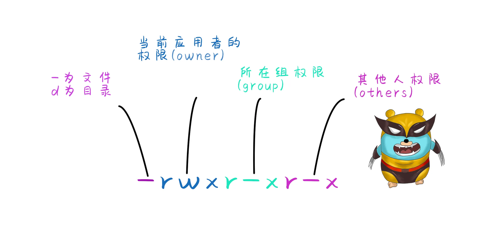
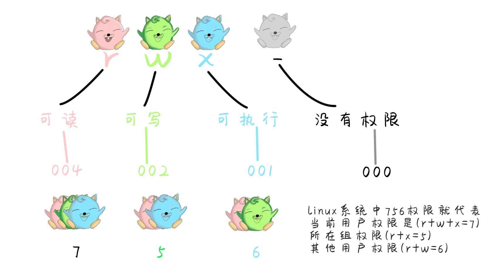
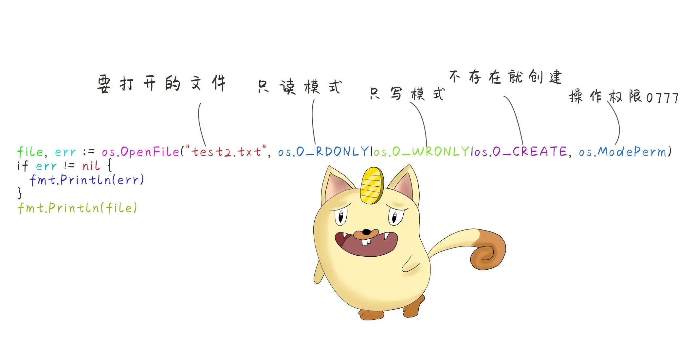
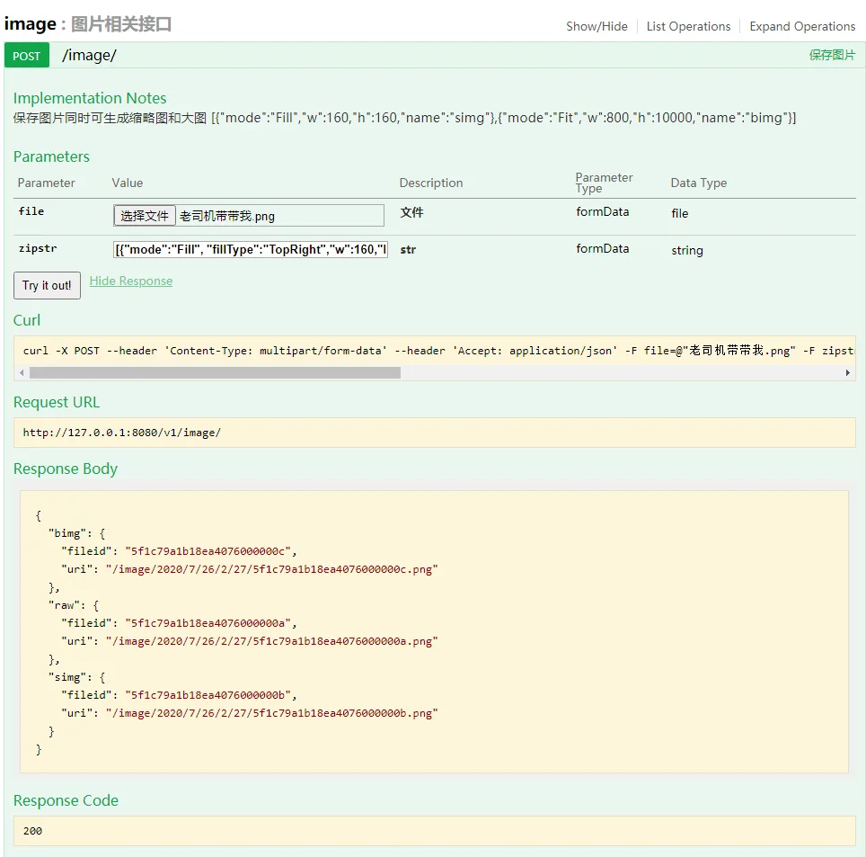

# 漫画 Go 语言项目实战 文件服务

原文链接：https://juejin.cn/book/6844733833401597966/section/6844733833489678350

# 漫画 Go 语言项目实战 文件服务


文件服务实际上就是对文件的操作，对于文件的创建，文件的写入。首先还是得学习下Go语言是如何对文件进行操作的。

## 获取文件信息

Go语言提供了os包。关于文件信息可以通过os这个包操作。还包括了文件的读写等操作。

```go
//通过os.Stat获取文件的信息 FileInfo
fileinfo, err := os.Stat("C:\\Users\\jen\\Desktop\\hjh.png")
if err != nil {
	//打印错误信息
	fmt.Println(err)
}
fmt.Println(fileinfo.Name()) //打印文件名
```

`os.Stat`返回的是一个FileInfo。OS包中FileInfo的定义 包含了文件的名称，大小创建时间，是否是目录的信息。

```go
type FileInfo interface {
	Name() string       // 文件名称
	Size() int64        // 文件大小
	Mode() FileMode     // 文件权限
	ModTime() time.Time // 文件修改时间
	IsDir() bool        // 是否是文件夹
	Sys() interface{}   // 基础数据源接口(可以返回nil)
}
```

## 文件权限

文件权限是指创建文件时指定的权限，一般有两种表达方式，一是符号表达但是习惯上还是使用八进制的数字表达，例如0777(表示：可读，可写，可执行)。





## 创建文件和文件夹

创建文件夹

```go
//MKdir创建文件夹
err := os.Mkdir("testdir", os.ModePerm)
if err != nil {
	fmt.Println(err)
}

//MkdirAll创建多级文件夹
err2 := os.MkdirAll("testdir/test/aa", os.ModePerm)
if err2 != nil {
	fmt.Println(err2)
}
```

创建一个文件

```go
file, err := os.Create("test.txt")
if err != nil {
	fmt.Println(err)
}
fmt.Println(file)
```

## 读写文件

通过`os.Open()`可以通过只读的模式打开文件。如果还需要操作文件中的内容，向文件中写入数据，可以通过`os.OpenFile()`方式打开文件。


```go
//通过Open只读方式打开文件
file, err := os.Open("test.txt")
if err != nil {
	fmt.Println(err)
}
fmt.Println(file.Name())

file2, err2 := os.OpenFile("test2.txt", os.O_RDONLY|os.O_WRONLY|os.O_CREATE, os.ModePerm)
if err2 != nil {
	fmt.Println(err2)
}
fmt.Println(file2)
```


文件的操作模式可以是只读模式`O_RDONLY`，只写模式`O_WRONLY`，也可以使用只读或者只写模式`O_RDWR`。在os包定义的常量有以下几种：

```go
const (
	O_RDONLY int = syscall.O_RDONLY // 以只读方式打开文件
	O_WRONLY int = syscall.O_WRONLY //  以只写方式打开文件
	O_RDWR   int = syscall.O_RDWR   //  以读写方式打开文件
	O_APPEND int = syscall.O_APPEND // 写入时向文件追加数据
	O_CREATE int = syscall.O_CREAT  // 如果不存在创建新文件
	O_EXCL   int = syscall.O_EXCL   //与O_CREATE一起使用，文件必须不存在
	O_SYNC   int = syscall.O_SYNC   // 为同步I/O打开
	O_TRUNC  int = syscall.O_TRUNC  // 打开时截断常规可写文件
)
```

##关闭文件和删除文件
使用程序进行读取文件的时候，读取完成之后需要手动调用`Close()`关闭文件。

```go
file, err := os.Open("test2.txt")
if err != nil {
	fmt.Println(err)
}
//使用结束之后记得关闭file
defer file.Close()
fmt.Println(file)
```

使用`os.Remove()`能够删除文件夹和一个空目录。

```go
err := os.Remove("test2.txt")
if err != nil {
	fmt.Println(err)
}
```

如果一个目录中包含了子目录或者目录不是空的，就不能用`os.Remove()`方法删除。需要使用`os.RemoveAll()`删除。好用是好用，但是注意，通过程序调用os.RemoveAll()方法，不会经过回收站，删掉就找不回来了。

```go
err := os.RemoveAll("testdir")
if err != nil {
	fmt.Println(err)
}
```

## IO操作

IO操作也叫做流操作。I指的是Input，O指的是Output。所以IO操作也叫输入或者输出操作，用于读或者写数据。

### 读取数据操作


```go
package main

import (
	"fmt"
	"os"
)

func main() {
	// 第一步打开文件
	file, err := os.Open("test.txt")
	if err != nil {
		fmt.Println(err)
	}
	// 第三步读取完后关闭文件
	defer file.Close()

	// 第二步读取数据
	// 创建一个切片用于读取数据
	data := make([]byte, 4, 4)
	// 读取数据到切片中
	n, e := file.Read(data)
	if e != nil {
		fmt.Println(e)
	}
	// 读取到的字节数量
	fmt.Println(n)
	// 读取到的数据内容转为string
	fmt.Println(string(data))
}
```

### 写入数据操作

```go
package main

import (
	"fmt"
	"os"
)

func main() {
	// 读取文件
	file, err := os.OpenFile("write.txt", os.O_RDWR|os.O_CREATE|os.O_APPEND, os.ModePerm)
	if err != nil {
		fmt.Println(err)
	}
	// 关闭文件
	defer file.Close()

	// 要写入的数据字符串
	str := "haojiahuo2020"
	b := []byte(str)

	// 写入到文件
	n, e := file.Write(b)
	if e != nil {
		fmt.Println(e)
	}
	// 写入到文件中的字节数
	fmt.Println(n)
}
```

在写入时使用`Write()`方法每次都是默认从头开始写入文件。


写文件时，操作模式使用`os.O_APPEND` 表示每次将数据追加到文件末尾。


## 文件复制


复制文件方法一 边读边写

```go
package main

import (
	"fmt"
	"io"
	"os"
)

func main() {
	// 源文件
	file1, err1 := os.Open("yuan.txt")
	if err1 != nil {
		fmt.Println(err1)
	}

	// 目标文件
	file2, err2 := os.OpenFile("test.txt", os.O_RDWR|os.O_CREATE|os.O_APPEND, os.ModePerm)
	if err2 != nil {
		fmt.Println(err2)
	}
	// 使用结束关闭文件
	defer file1.Close()
	defer file2.Close()

	bytestr := make([]byte, 1024, 1024)

	for {
		n, e := file1.Read(bytestr)
		if e == io.EOF || n == 0 {
			fmt.Println("读取文件结束")
			break
		}
		// 循环写入读取到的文件
		file2.Write(bytestr[:n])
	}
}
```

文件复制方法二
使用内置函数读取复制文件io.Copy(file2, file1)

```go
package main

import (
	"fmt"
	"io"
	"os"
)

func main() {
	// 源文件
	file1, err1 := os.Open("yuan.txt")
	if err1 != nil {
		fmt.Println(err1)
	}

	// 目标文件
	file2, err2 := os.OpenFile("test.txt", os.O_RDWR|os.O_CREATE, os.ModePerm)
	if err2 != nil {
		fmt.Println(err2)
	}
	// 使用结束关闭文件
	defer file1.Close()
	defer file2.Close()
	n, e := io.Copy(file2, file1)
	if e != nil {
		fmt.Println(e)
	}
	fmt.Println(n)
}
```

文件复制方法三
ioutil包

```go
package main

import (
	"fmt"
	"io/ioutil"
	"os"
)

func main() {
	// ioutil.ReadFile读取文件内容
	bytestr, err := ioutil.ReadFile("yuan.txt")
	if err != nil {
		fmt.Println(err)
	}
	// ioutil.WriteFile将读取到的文件写入newtext.txt文件中
	err2 := ioutil.WriteFile("newtext.txt", bytestr, os.ModePerm)
	if err2 != nil {
		fmt.Println(err2)
	}
}
```

## 文件服务

有了文件操作的基本知识，结合http框架就可以动手搭建文件服务。

- 1，将图片或文件通过多媒体表单提交到服务端。

- 2，图片裁剪压缩处理。

- 3，将图片路径与图片名称返回。


执行命令 `bee api fileservice `创建http服务。创建一个Post接口,通过多媒体表单`multipart/form-data`上传文件。服务端从formDate中获取file文件。

```go
// @Title 保存图片
// @Description 保存图片同时可生成缩略图和大图 [{"mode":"Fill","w":160,"h":160,"name":"simg"},{"mode":"Fit","w":800,"h":10000,"name":"bimg"}]
// @Summary 保存图片
// @Param   file        formData    file    true        "文件"
// @Param   zipstr  formData    string  true        "str"
// @router / [post]
func (this *ImageController) Post() {
beego.Info("接收到请求:", time.Now().String())
zipArgs := this.GetString("zipstr", "")
beego.Debug("zipArgs:", zipArgs)

file, header, e := this.GetFile("file")
if e != nil {
this.Data["json"] = map[string]string{
"error": e.Error(),
}
this.ServeJSON()
return
}
defer file.Close()

imageInfo := models.NewImageInfo(file, header, zipArgs)
allow := strings.Index(_ImageAllowType, strings.ToLower(imageInfo.FileExt))
if allow < 0 {
this.Data["json"] = map[string]string{
"error": imageInfo.FileExt + "后缀文件不允许上传!",
}
this.ServeJSON()
return
}
beego.Debug(imageInfo.FileSize)
saveOK := imageInfo.SaveFile()
if !saveOK {
this.Data["json"] = map[string]string{
"error": "图片保存失败",
}
this.ServeJSON()
return
}
result := map[string]models.FileResponse{}
//原始文件
result["raw"] = models.FileResponse{
FileId: imageInfo.FileID,
Uri:    imageInfo.Path.UriPath + imageInfo.FileID + imageInfo.FileExt,
}
//返回缩略图和压缩图
if len(imageInfo.ZipImg) > 0 {
for i := 0; i < len(imageInfo.ZipImg); i++ {
num := strconv.Itoa(i)
if imageInfo.ZipImg[i] == nil {
result[num] = models.FileResponse{}
continue
}
if imageInfo.ZipImg[i].Name != "" {
num = imageInfo.ZipImg[i].Name
}
result[num] = models.FileResponse{
FileId: imageInfo.ZipImg[i].FileID,
Uri:    imageInfo.Path.UriPath + imageInfo.ZipImg[i].FileID + imageInfo.ZipImg[i].FileExt,
}
beego.Debug(imageInfo.Path.FullPath + "/" + imageInfo.ZipImg[i].FileID + imageInfo.ZipImg[i].FileExt)
}
}

this.Data["json"] = result
this.ServeJSON()
}

```

### NewFileInfo方法创建文件对象

```go
//创建文件信息对象
func NewImageInfo(file multipart.File, fileHeader *multipart.FileHeader, zipArgs string) *ImageInfo {
ii := &ImageInfo{
FileID:     NewObjectId().Hex(),
File:       file,
FileHeader: fileHeader,
Path:       NewPathInfo(_IMAGETYPE),
FileSize:   file.(Sizer).Size(),
}
ii.FileExt = filepath.Ext(ii.FileHeader.Filename)
ii.FullName = filepath.Join(ii.Path.FullPath, ii.FileID) + ii.FileExt
ii.zipArgs = zipArgs
return ii
}

```

### SaveFile方法保存文件到本地

```go
//保存文件到本地
func (this *ImageInfo) SaveFile() bool {
beego.Debug("开始写文件")
//创建文件保存目录
this.Path.CreateDirectory()

//保存原始图片
beego.Debug("创建原始图片:", this.FullName)
f, err := os.OpenFile(this.FullName, os.O_WRONLY|os.O_CREATE|os.O_TRUNC, os.ModePerm)
if err != nil {
return false
}
defer f.Close()
io.Copy(f, this.File)
beego.Debug("保存完毕.")

//保存压缩图
beego.Debug(this.zipArgs)
if this.zipArgs != "" {
this.ZipImg = NewZipImageArray(this.zipArgs, this.Path, this.FileExt)
beego.Debug("this.ZipImg length:", len(this.ZipImg))
rawImage, e := imaging.Open(this.FullName)
if e != nil {
beego.Debug("原图打开失败:", e.Error())
beego.Debug("rawImageFullName:", this.FullName)
return false
}
if len(this.ZipImg) > 0 {
for i := 0; i < len(this.ZipImg); i++ {
iofile, _ := os.Open(this.FullName)
defer iofile.Close()
result := this.ZipImg[i].SaveFile(rawImage, iofile)
if !result {
this.ZipImg[i] = nil
}
}
}
beego.Debug(this.FullName)
}
return true

}

```

### 图片的压缩与裁剪处理

在调用上传图片接口时需要指定压缩参数，`zipstr` 是一个json数组字符串`[{"mode":"Fill", "fillType":"TopRight","w":160,"h":160,"name":"simg"},{"mode":"Fit","w":800,"h":10000,"name":"bimg"}] ` 需要返回几种图片类型，json数组字符串中就写多少个对象。


```go
//压缩图片处理
func (this *ZipImage) SaveFile(rawImage image.Image, osfile *os.File) bool {
c, _, err := image.DecodeConfig(osfile)
if err == nil && this.W == 1 && this.H == 1 {
this.W = c.Width
this.H = c.Height
}
beego.Debug("压缩图处理开始.")
var dst *image.NRGBA
switch this.Mode {
case "Resize":
//按固定大小缩放会造成图片变形
dst = imaging.Resize(rawImage, this.W, this.H, imaging.Lanczos)
case "Fit":
//等比例缩放
dst = imaging.Fit(rawImage, this.W, this.H, imaging.Lanczos)
case "Fill":
//按照固定模式裁剪缩放
var anchor imaging.Anchor
switch this.FillType {
case "Center":
//裁剪中间部分
anchor = imaging.Center
case "TopLeft":
//裁剪左上部分
anchor = imaging.TopLeft
case "Top":
//裁上部分
anchor = imaging.Top
case "TopRight":
//裁剪右上部分
anchor = imaging.TopRight
case "Left":
anchor = imaging.Left
case "Right":
anchor = imaging.Right
case "BottomLeft":
anchor = imaging.BottomLeft
case "Bottom":
anchor = imaging.Bottom
case "BottomRight":
anchor = imaging.BottomRight
default:
anchor = imaging.Center
}
dst = imaging.Fill(rawImage, this.W, this.H, anchor, imaging.Lanczos)
}
beego.Debug("缩放完成\n Stride:", dst.Stride, "\n Rect:", dst.Rect, "\n Pix:", len(dst.Pix))
beego.Debug(this.FullName)
e := imaging.Save(dst, this.FullName)
if e != nil {
beego.Debug("压缩图保存失败:", e.Error())
beego.Debug("压缩图文件名:", this.FullName)
return false
}
return true
}

```




### 项目地址

文件服务git地址：[https://github.com/haojiahuogo/fileserver.git](https://github.com/haojiahuogo/fileserver.git)
