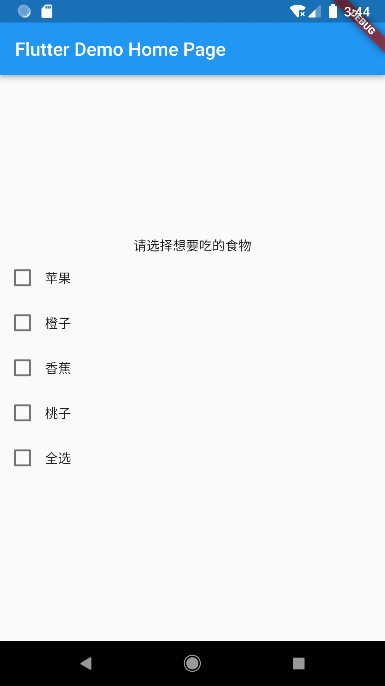

# Flutter 篇：玩转组件（二）

原文链接：https://juejin.cn/book/7178741001677176836/section/7180604902853312551

在上一讲中，我们首先概括地讲述了组件，然后将其分为三类，进行深入探讨。作为“续集”，我会在本讲介绍组件是如何与数据发生联动的，让我们结合实际场景中去理解它们。

## 有状态 VS 无状态

在 Flutter 中，根据组件是否持有数据以及能否与数据发生交互，可分为两大类：有状态的组件（StatefulWidget）和无状态的组件（StatelessWidget）。

举例来说，微信中的消息气泡就可以看作是有状态的。一条消息的发送成功与否，是可以通过 UI 的变化（气泡前方的感叹号）来知晓的，而这个变化的来源便是数据了。像这种 数据变化会引发组件发生改变的一类组件，就可以看作是有状态的组件了。

这种改变不一定会引发 UI 上的变化，有可能只影响组件内部某些变量的值。所有有状态的组件都继承自 StatefulWidget 类，为其提供状态保存服务的则是继承自 State 类的对象。

而像内容固定不变的文本、按钮等组件，数据的变化对它毫无影响，或者说这些组件不“关心”数据上的改变。像这类组件，就可以当作是无状态的组件了。所有无状态的组件都继承自 StatelessWidget 类。

回到计数器小程序，在 main.dart 中，除了一开始的 main() 函数外，有一个无状态的组件 MyApp 以及一个有状态的组件 MyHomePage，_MyHomePageState 为 MyHomePage 提供状态保存服务。

### 无状态组件

对于无状态的组件，实现较为简单。比如 MyApp 类，它的源码如下：

```dart
class MyApp extends StatelessWidget {
const MyApp({Key? key}) : super(key: key);
@override
Widget build(BuildContext context) {
return MaterialApp(
title: 'Flutter Demo',
theme: ThemeData(
primarySwatch: Colors.blue,
),
home: const MyHomePage(title: 'Flutter Demo Home Page'),
);
}
}

```

很好理解，MyApp 继承 StatelessWidget 类，并重写其中的 build() 函数，最后将想要显示的组件作为 return 值返回就行了。

但对于一些较为复杂的界面，如果像这样写，return 部分则会显得特别冗长。我的经验是将不同子组件分开构建，并组合使用它们。比如，就可以把上面的代码优化成这样：

```dart
class MyApp extends StatelessWidget {
const MyApp({Key? key}) : super(key: key);
@override
Widget build(BuildContext context) {
const String title = 'Flutter Demo';
// 构建Home组件
Widget buildHomeWidget() {
return  const MyHomePage(title: 'Flutter Demo Home Page');
}
// 构建ThemeData对象
ThemeData buildThemeWidget() {
return ThemeData(
primarySwatch: Colors.blue,
);
}
// 构建UI
return MaterialApp(
title: title,
theme: buildThemeWidget(),
home: buildHomeWidget(),
);
}
}

```

虽然看上去代码量比优化前要多，但随着界面元素复杂度的上升，就越来越能体现出如此编码的优势了。每个组件都使用单独的函数构建，在修改时更方便找到对应的代码位置。同时还能在一定程度上规避 Flutter 中的“嵌套地狱”问题，可以说是非常值得的。

### 有状态组件

在计数器小程序中，用户点击界面右下方的加号浮动按钮，界面中间的数字就会自增 1。要实现这样的效果，就要请有状态组件登场了。我们来看具体是如何实现的。

```dart
class MyHomePage extends StatefulWidget {
const MyHomePage({Key? key, required this.title}) : super(key: key);
final String title;
@override
State<MyHomePage> createState() => _MyHomePageState();
}

```

MyHomePage 继承 StatefulWidget 类，因此成为了有状态的组件。接着，重写 createState() 函数。本例创建了 _MyHomePageState 的对象作为其返回值。

再来看 _MyHomePageState，它继承 State 类，提供状态保存服务，具体如下：

```dart
class _MyHomePageState extends State<MyHomePage> {
int _counter = 0;
void _incrementCounter() {
setState(() {
_counter++;
});
}
@override
Widget build(BuildContext context) {
return Scaffold(
appBar: AppBar(
title: Text(widget.title),
),
body: Center(
child: Column(
mainAxisAlignment: MainAxisAlignment.center,
children: <Widget>[
const Text(
'You have pushed the button this many times:',
),
Text(
'$_counter',
style: Theme.of(context).textTheme.headline4,
),
],
),
),
floatingActionButton: FloatingActionButton(
onPressed: _incrementCounter,
tooltip: 'Increment',
child: const Icon(Icons.add),
),
);
}
}

```

_MyHomePageState 继承 State 类，重写 build() 函数，将要显示的组件作为该函数的返回值，完成界面的绘制。

右下角的浮动按钮是 FloatingActionButton 组件，在点击后会触发 _incrementCounter() 函数的执行。在该函数中完成了对 _counter 变量的自增 1 操作，并调用 setState() 函数“通知”组件数据发生改变。于是，界面将重新绘制，显示变化后的数据。

如上所述，setState() 函数的作用就是将数据的变化“通知”给组件，便于 UI 的更新。如果不调用它，界面则不会有任何变化。

### 实战

接下来是实战环节，请大家先尝试自行动手实现下图所示的效果，然后再来看解析。



要求如下：

1. 如上图所示，纵向排列 6 个组件，均使用默认样式；

2. 5 个选项中的前 4 个均要求独立互动，不相互影响；

3. “全选”选项选中时，前 4 个选项均要求选中状态；当“全选”选项取消选中时，前 4 个选项均取消选中；

4. 当前 4 个选项均被选中时，“全选”选项自动变为选中状态。

大家开始动手吧！

好了，下面来公布答案。

让我们一起来想想实现思路，单纯摆上这几个组件并非难事。文字组件是 Text，复选框是 Checkbox，纵向排列，用 Column（本例使用）或 ListView 都行。为了日后好维护，我将整个 Column 作为 buildBodyWidget() 函数的返回值，然后在 Scaffold 中使用这个函数，具体如下：

```dart
class _MyHomePageState extends State<MyHomePage> {
...
// 构建Body组件
Widget buildBodyWidget() {
return Column(
mainAxisAlignment: MainAxisAlignment.center,
children: <Widget>[
buildSelectTitleWidget(),
buildSelectAppleWidget(),
buildSelectOrangeWidget(),
buildSelectBananaWidget(),
buildSelectPeachWidget(),
buildSelectToggleAllWidget(),
],
);
}
...
@override
Widget build(BuildContext context) {
return Scaffold(
appBar: AppBar(
title: Text(widget.title),
),
body: buildBodyWidget(),
);
}
}

```

Text 组件已经是“老相识”了，从上面的代码可以看出，我将使用 buildSelectTitleWidget() 函数构建标题文字，于是便有了下面这段代码：

```dart
// 构建选择标题组件
Widget buildSelectTitleWidget() {
return  const Text("请选择想要吃的食物");
}

```

如法炮制，后续几个组件也应如此构建。难点也随之而来：通过阅读 Checkbox 的源码，会发现：

1. Checkbox 似乎没办法设置文字，就只有一个复选框；

2. value 和 onChanged 是必需参数，前者表示选中状态，后者是状态发生改变时执行的函数。

对于第 1 个问题，其实不难解决。使用 Row 布局组件将 Checkbox 和 Text 并排摆放就行了。

对于第 2 个问题，其实也不难处理。value 是 bool 类型，顺水推舟，声明个 bool 类型的变量给它用就行了。onChanged 既然需要一个函数，那就给它一个函数。在这个函数中，我们改变 bool 类型变量的值，如此便可实现第 2 个要求了。苹果选项的实现代码如下：

```dart
// 苹果选项是否选中
bool aSelect = false;
// 构建苹果选项组件
Widget buildSelectAppleWidget() {
return Row(
children: [
Checkbox(
value: aSelect,
onChanged: (value) {
setState(() {
aSelect = value!;
});
}),
const Text("苹果"),
],
);
}

```

`💡 提示：onchanged 附近的 value 表示选中状态的回传值，也是 bool 类型。true 表示选中；false 表示未选中。`

接下来依次实现橙子、香蕉和桃子选项，代码如下：

```dart
// 橙子选项是否选中
bool bSelect = false;
// 香蕉选项是否选中
bool cSelect = false;
// 桃子选项是否选中
bool dSelect = false;
// 构建橙子选项组件
Widget buildSelectOrangeWidget() {
return Row(
children: [
Checkbox(
value: bSelect,
onChanged: (value) {
setState(() {
bSelect = value!;
});
}),
const Text("橙子"),
],
);
}
// 构建香蕉选项组件
Widget buildSelectBananaWidget() {
return Row(
children: [
Checkbox(
value: cSelect,
onChanged: (value) {
setState(() {
cSelect = value!;
});
}),
const Text("香蕉"),
],
);
}
// 构建桃子选项组件
Widget buildSelectPeachWidget() {
return Row(
children: [
Checkbox(
value: dSelect,
onChanged: (value) {
setState(() {
dSelect = value!;
});
}),
const Text("桃子"),
],
);
}

```

现在就剩下全选框了。按照题目要求：

- “全选”选项选中时，前 4 个选项均要求选中状态；当“全选”选项取消选中时，前 4 个选项均取消选中。 这其实对应的是 onChanged() 函数的具体动作：当选中全选框后，aSelect - dSelect 都变为 true，然后调用 setState() 函数。如此，上面 4 个复选框将自动变为选中状态；反之同理。

- 当前 4 个选项均被选中时，“全选”选项自动变为选中状态。 这其实对应的是 value 的参数，当 aSelect - dSelect 都是 true 时，value 参数的值才是 true。

思路有了，接下来就是具体的实现：

```dart
// 构建全选选项组件
Widget buildSelectToggleAllWidget() {
return Row(
children: [
Checkbox(
value: aSelect & bSelect & cSelect & dSelect,
onChanged: (value) {
setState(() {
aSelect = value!;
bSelect = value;
cSelect = value;
dSelect = value;
});
}),
const Text("全选"),
],
);
}

```

到此，整个实战练习就完成了。完整的实战代码在文末附录 1，请有需要的同学自取。

## 小结

🎉 恭喜，您完成了本次课程的学习！

📌 以下是本次课程的重点内容总结：

本讲是 Flutter 组件部分的“续集”，具体话题围绕“数据”展开。根据组件是否持有数据以及能否与数据发生交互，我们将组件分为有状态组件（StatefulWidget）和无状态组件（StatelessWidget）。

那些 数据变化会引发组件发生改变的一类组件，就可以看作是有状态的组件，所有有状态的组件都继承自 StatefulWidget 类，为其提供状态保存服务的则是继承自 State 类的对象。

具体说来，就是先继承 StatefulWidget 类，再重写 createState() 函数。接着创建一个类，该类继承 State 类，重写 build() 函数，将要显示的组件作为该函数的返回值即可。

那些不受数据的变化影响的，或者说这些组件不“关心”数据上的改变的一类组件，就可以看作是无状态的组件。所有无状态的组件都继承自 StatelessWidget 类。

具体说来，就是先继承 StatelessWidget 类，再重写其中的 build() 函数，最后将想要显示的组件作为 return 值返回即可。

此外，我还分享了一个我个人比较喜欢的编码风格：每个组件都使用单独的函数构建，使代码更清爽。 在修改时更方便找到对应的代码位置，同时还能在一定程度上规避 Flutter 中的“嵌套地狱”问题。

➡️ 在下次课程中，我们继续聊 Flutter 基础部分：热修复。热修复是 Flutter 框架非常重要的特性之一。作为开发者，一方面要体验这种“高效”，另一方面也要知道哪些情况不适用。我将在下一讲中为大家详细介绍。

## 附录 1：实战练习完整源码

```dart
import 'package:flutter/material.dart';
void main() {
runApp(const MyApp());
}
class MyApp extends StatelessWidget {
const MyApp({Key? key}) : super(key: key);
@override
Widget build(BuildContext context) {
const String title = 'Flutter Demo';
// 构建Home组件
Widget buildHomeWidget() {
return  const MyHomePage(title: 'Flutter Demo Home Page');
}
// 构建ThemeData对象
ThemeData buildThemeWidget() {
return ThemeData(
primarySwatch: Colors.blue,
);
}
// 构建UI
return MaterialApp(
title: title,
theme: buildThemeWidget(),
home: buildHomeWidget(),
);
}
}
class MyHomePage extends StatefulWidget {
const MyHomePage({Key? key, required this.title}) : super(key: key);
final String title;
@override
State<MyHomePage> createState() => _MyHomePageState();
}
class _MyHomePageState extends State<MyHomePage> {
// 苹果选项是否选中
bool aSelect = false;
// 橙子选项是否选中
bool bSelect = false;
// 香蕉选项是否选中
bool cSelect = false;
// 桃子选项是否选中
bool dSelect = false;
// 构建选择标题组件
Widget buildSelectTitleWidget() {
return  const Text("请选择想要吃的食物");
}
// 构建苹果选项组件
Widget buildSelectAppleWidget() {
return Row(
children: [
Checkbox(
value: aSelect,
onChanged: (value) {
setState(() {
aSelect = value!;
});
}),
const Text("苹果"),
],
);
}
// 构建橙子选项组件
Widget buildSelectOrangeWidget() {
return Row(
children: [
Checkbox(
value: bSelect,
onChanged: (value) {
setState(() {
bSelect = value!;
});
}),
const Text("橙子"),
],
);
}
// 构建香蕉选项组件
Widget buildSelectBananaWidget() {
return Row(
children: [
Checkbox(
value: cSelect,
onChanged: (value) {
setState(() {
cSelect = value!;
});
}),
const Text("香蕉"),
],
);
}
// 构建桃子选项组件
Widget buildSelectPeachWidget() {
return Row(
children: [
Checkbox(
value: dSelect,
onChanged: (value) {
setState(() {
dSelect = value!;
});
}),
const Text("桃子"),
],
);
}
// 构建全选选项组件
Widget buildSelectToggleAllWidget() {
return Row(
children: [
Checkbox(
value: aSelect & bSelect & cSelect & dSelect,
onChanged: (value) {
setState(() {
aSelect = value!;
bSelect = value;
cSelect = value;
dSelect = value;
});
}),
const Text("全选"),
],
);
}
// 构建Body组件
Widget buildBodyWidget() {
return Column(
mainAxisAlignment: MainAxisAlignment.center,
children: <Widget>[
buildSelectTitleWidget(),
buildSelectAppleWidget(),
buildSelectOrangeWidget(),
buildSelectBananaWidget(),
buildSelectPeachWidget(),
buildSelectToggleAllWidget(),
],
);
}
@override
Widget build(BuildContext context) {
return Scaffold(
appBar: AppBar(
title: Text(widget.title),
),
body: buildBodyWidget(),
);
}
}

```
