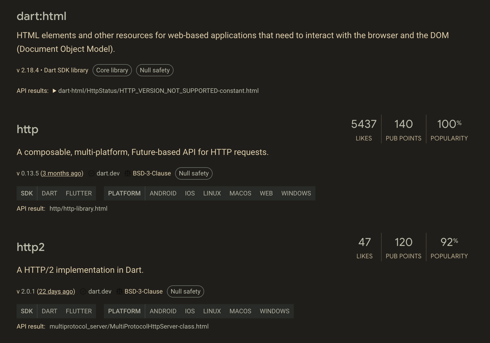
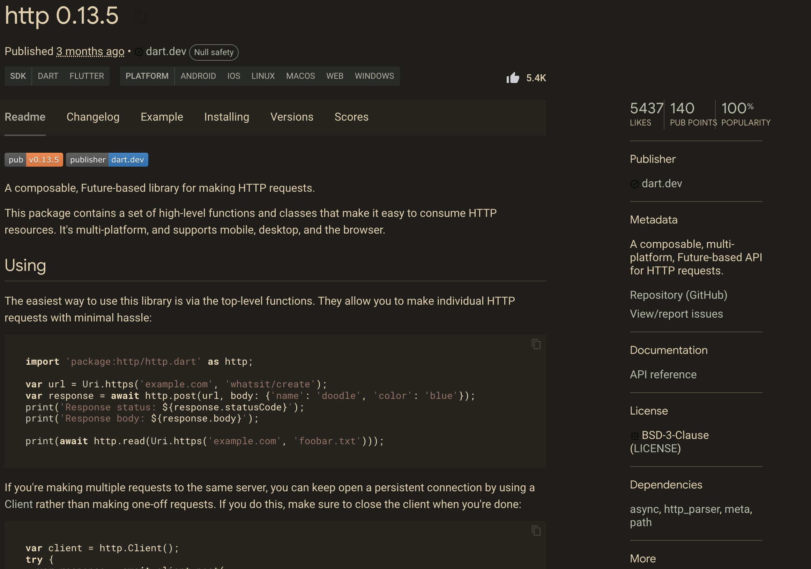
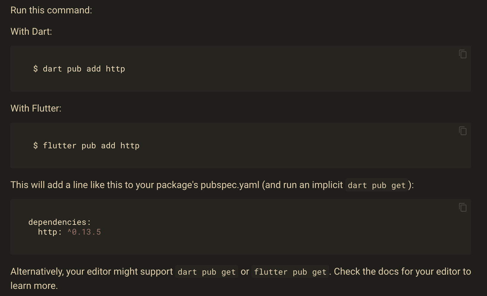
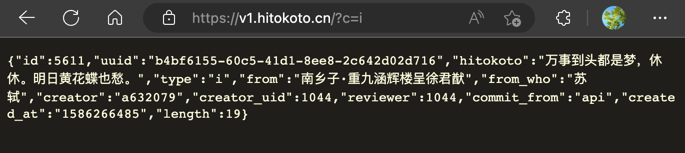
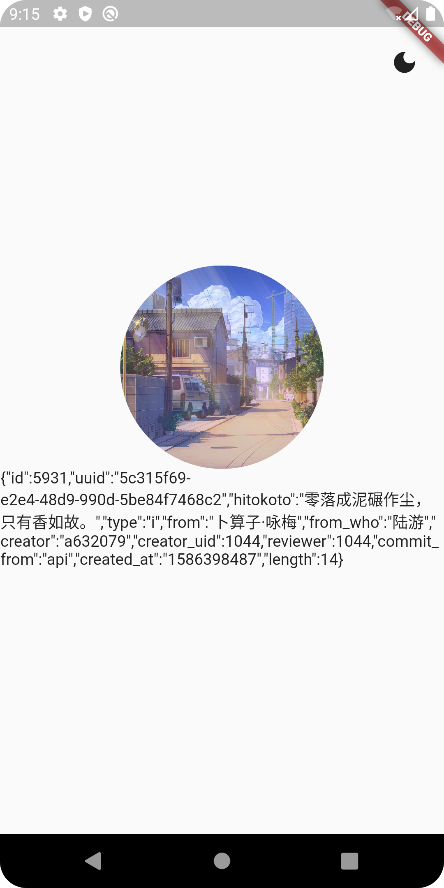

# 实战项目一：网络请求与数据解析

原文链接：https://juejin.cn/book/7178741001677176836/section/7181294910912331835

在前一讲中，我们一起完成了整个 App 的“骨架”搭建，做出了如下图所示的样子：


从图中可以看出，虽然现在的样子和最终的成品很相似，但文字的内容仍然是假的。正如前一讲末尾处所说的那样：文字的样式、排版、动画特效以及暗黑模式切换等等都还没有实现。

那就让我们逐个完善它们吧！先从文字内容开始。

那么，要实现每次启动都获取并显示不同的文字，要完成那些工作呢？

1. 网络请求： 我们都知道，文字内容本身并不内置于程序中，而是从网络上动态获取的。所以第一要务就是找到一个服务提供商，作为数据源，并完成内容的获取；

2. 数据解析： 从网络上获取的原始数据往往是 json 或 xml 格式，对于普通用户而言很难理解。需要开发者将要显示的数据“提取”出来，这个提取的过程，就是所谓的“数据解析”；

3. 刷新界面： 程序运行后，文本显示区域的内容是空的。完成网络请求和数据解析后，就要把显示的内容更新到界面上，完成“最后一公里”的工作。

梳理完工作后，就动手干吧！

## 择优选包

通过调研发现：Flutter 并不具备发起网络请求的 API，于是就需要开发者到 [Package（包） 网站](https://pub.flutter-io.cn/)中进行检索，并选择合适的包集成到项目中，让项目具备网络请求的能力。这就涉及到一个问题：某个需求（如网络请求）有可能存在多个包，我们如何择优选择呢？

来到 Package 网站，输入“http”（网络请求又称为 http 请求，大多数网络请求都和 http 脱不了干系，因此以 http 作为搜索关键字）并按下回车键，会看到若干结果。除了内置包外，都有 Likes（喜欢或赞）、Pub Points（评分，满分 140 分）和 Popularity（人气值）。如下图所示：



显然，http 显得特别鹤立鸡群，无论是点赞数、得分还是人气值都很高，最后两项还到达顶峰。而且支持全平台，为实现跨平台开发提供了很大方便。像这种包，可以称得上是非常优秀了，是我们的首选。

接下来要考虑一个问题：它真的可以帮我们实现想要的功能吗？那就点开它，从 [Readme（自述）](https://pub.flutter-io.cn/packages/http)中寻找答案。



如上图所示，便是某个包的详情页了，默认就是 Readme 标签。我们可以很清晰地看到这个包都能做什么，以及怎么做。还有各种额外的信息，比如开发者网站、开源地址、API 参考文档等等。

从我个人的开发经验来看，越是优秀的包，这类文档就越详实。换句话说，如果大家发现某个包文档写得很烂，有可能代码写得也不太优秀，就要谨慎选择了。

确定了要集成的包，下一步就要做真正的集成操作了。

还是在这个详情页，点击 Installing 标签，就会看到集成方式：



如图所示的三种方式其实都可以顺利把包集成到项目中，我个人比较推荐第三种，也就是手动打开 pubspec.yaml 进行编辑，然后执行 `dart pub get` 命令。因为当项目中集成的包比较多，或者那些通过包名不太能看出作用的包，最好要添加注释。而添加注释还是要手动编辑 pubspec.yaml 的，索性直接使用第三种方式，更省事一些。

下面的代码是编辑后的 pubspec.yaml，供大家参考：

```yaml
name: flutter_juejin_yiyan
description: A new Flutter project.
publish_to: 'none'
version: 1.0.0+1
environment:
sdk: '>=2.18.2 <3.0.0'
dependencies:
flutter:
   sdk: flutter
cupertino_icons: ^1.0.2
 # 网络请求
http: ^0.13.5
dev_dependencies:
flutter_test:
   sdk: flutter
flutter_lints: ^2.0.0
flutter:
uses-material-design: true

```

到此，我们的项目就拥有了网络请求的能力，可以和服务器进行交互了。根据服务端提供的接口，按照接口规范进行交互，就能得到服务器返回给我们的数据了。

## 网络请求

我们的《一言》App 的数据服务提供商来自非常良心的“[一言开发者中心](https://developer.hitokoto.cn/sentence/)”。一般来说，作为服务提供商，都会有详尽的接口文档供客户端/前端开发者参考。这类文档详细描述了服务端都能提供哪些具体的服务，以及如何使用它们，也就是接口规范。

在一言开发者中心的网站中，我们可以得知服务端的接口地址、请求参数列表以及返回值格式和意义。

我选择的接口地址是：v1.hitokoto.cn，请求参数传递“c”，表示我要指定类型的句子。对应的参数值是“i”，表示诗词类型。

在正式编码前，我们可以使用 Postman 等接口测试工具对接口进行测试，并得到返回值。如此验证服务端可以提供正常的服务，当编码后发现程序运行不符合预期时，更好确定到底是服务端出了问题，还是我们这边的代码出了差错。

不同于简单的网络交互，Postman 或类似的接口测试工具可以保存登录鉴权的凭据，对于后续的接口访问非常有帮助。

当然，像一言这种简单的接口，我们甚至可以使用本地浏览器进行测试。具体做法便是启动浏览器，并在地址栏处输入接口地址和参数列表，然后敲击回车键就行了。测试结果如下图所示：



我们先不管返回值的格式，至少可以得到一个结论：服务端可以正常提供服务，返回值里有我们需要的所有内容（一言的内容和作者/来源）。

一边参考 http 包的 Readme 说明，一边进行编码。

在 home_page.dart 中，创建 loadTextContent() 方法，将网络请求放到这个方法中实现，具体代码片段如下：

```ini
import 'package:http/http.dart' as http;
class _HomePageState extends State<HomePage> {
 String textContent = '';
 String from = '';
...
 void loadTextContent() async {
   var url = Uri.parse('https://v1.hitokoto.cn?c=k');
   var response = await http.post(url);
   setState(() {
     textContent = response.body.toString();
   });
}
...
 Widget textWidget() {
   return Text(textContent + from);
}
...

```

textContent 表示一言的内容，from 表示作者/来源。loadTextContent() 执行了网络访问动作，并通过 setState() 顺便把更新界面的活也干了。textWidget() 返回的是文本区域组件，它将全部要显示的内容拼接在了一起。

仔细阅读 loadTextContent() 的具体内容，不难发现：进行网络访问，基本就是照抄 http 包文档的示例代码。确实如此，在 Flutter 中集成和使用包就是个 easy job，可以 easy done。

所以，如果某个包的文档写的足够完善，对于它的使用者而言，简直是个福音。如果大家以后自己创建包，并分享给他人，也要提供尽可能详尽的文档说明。花费一个人的一点点时间，节省若干人的时间。

回到我们的程序，完成编码后再次运行，界面就会变成这样：



看上去怎么样？虽然这似乎不是给正常人看的，但起码想要的东西都在。接下来就是“提取”有用数据的过程，也就是数据解析的过程了。

## 数据解析

就目前来看，大部分的网络交互的返回值都是 json 格式，本例也如此。如果你对 json 格式不太了解，推荐先去阅读：[JSON 教程 | 菜鸟教程](https://www.runoob.com/json/json-tutorial.html)。

Flutter 内置了 json 格式解析的包，它来自于 dart:convert。虽然在 package 网站中对于它的描述不多，但在 Flutter 官网中有对于它非常详细的[使用教程](https://flutter.cn/docs/development/data-and-backend/json)，我这里就不再赘述了，直接上修改后的代码片段：

```ini
void loadTextContent() async {
 var url = Uri.parse('https://v1.hitokoto.cn?c=i');
 var response = await http.post(url);
 Map<String, dynamic> respData = json.decode(response.body);
 setState(() {
   textContent = respData['hitokoto'];
   from = respData['from_who'];
});
}

```

到此，网络请求、数据解析和更新 UI 的工作都已经完成了。再次运行程序，可以看到如下显示效果：


请大家先自行尝试完成上述编码，下面我会放上完整的 home_page.dart。如果你有任何疑难，请参考下面的代码进行排查：

```typescript
import 'dart:convert';
import 'package:flutter/material.dart';
import 'package:http/http.dart' as http;
class HomePage extends StatefulWidget {
 const HomePage({Key? key}) : super(key: key);
 @override
 State<HomePage> createState() => _HomePageState();
}
class _HomePageState extends State<HomePage> {
 String textContent = '';
 String from = '';
 void loadTextContent() async {
   var url = Uri.parse('https://v1.hitokoto.cn?c=i');
   var response = await http.post(url);
   Map<String, dynamic> respData = json.decode(response.body);
   setState(() {
     textContent = respData['hitokoto'];
     from = respData['from_who'];
   });
}
 Widget imageWidget() {
   return const CircleAvatar(
       backgroundColor: Colors.white70,
       foregroundImage: NetworkImage(
           'https://img.xjh.me/random_img.php?type=bg&ctype=nature&return=302'),
       radius: 90);
}
 Widget textWidget() {
   return Text(textContent + from);
}
 @override
 void initState() {
   super.initState();
   loadTextContent();
}
 @override
 Widget build(BuildContext context) {
   return Scaffold(
     body: Center(
       child: Column(
         mainAxisAlignment: MainAxisAlignment.center,
         children: <Widget>[imageWidget(), textWidget()],
       ),
     ),
   );
}
}

```

## 小结

🎉恭喜，您完成了本次课程的学习！

📌 以下是本次课程的重点内容总结：

本讲继续《一言》项目的实战，完成了“填肉”的工作，具体包括网络请求、数据解析和更新 UI。此外还详细地解释了选包的原则。

➡️ 在下次课程中，我们继续开发《一言》App，体验通过自定义组件实现竖排 + 横排文本框的样式，我们下一讲见！
