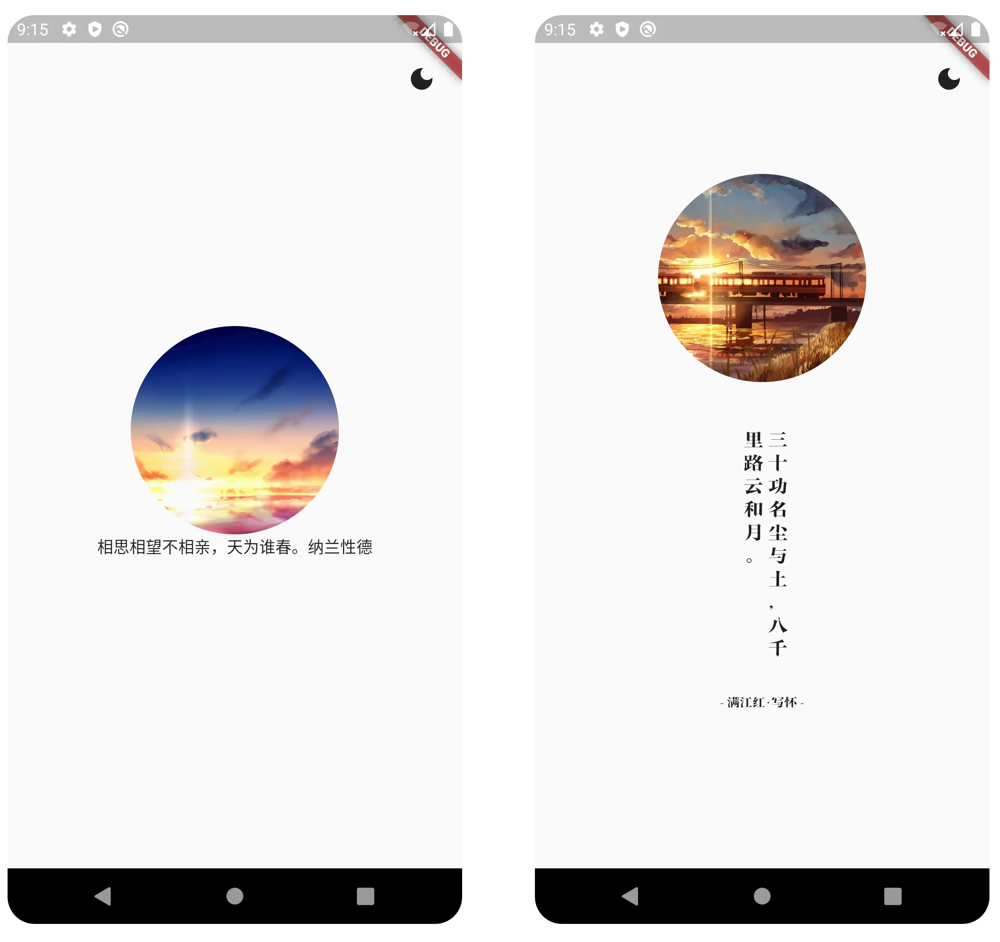
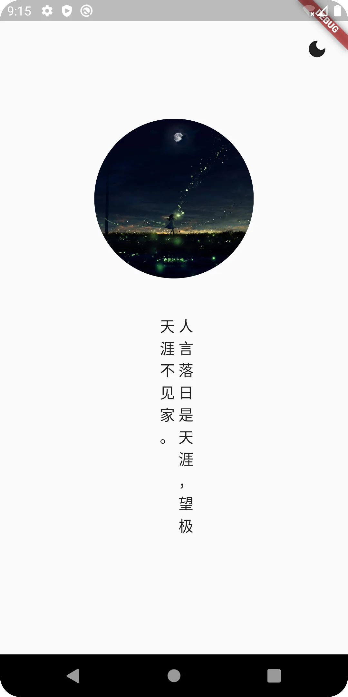
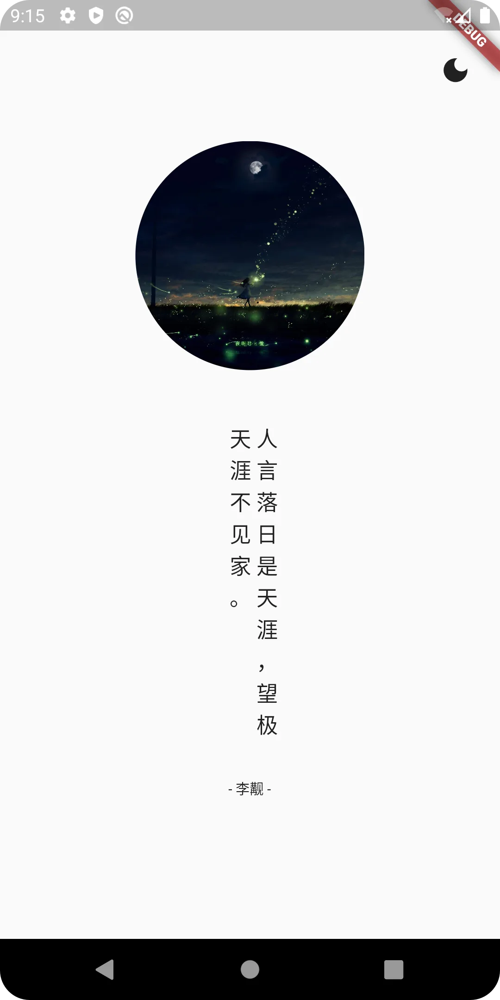

# 实战项目一：自定义组件：打造竖排文本框

原文链接：https://juejin.cn/book/7178741001677176836/section/7181702240250380345

经过前面两讲的实战，我们已经实现了下图中左侧所示的界面效果了。



但这显然还不够，通过和右侧图片的对比可以发现：这些文字实际上是由两部分组成的，一部分是摘录的内容，另一部分是摘录的来源。

回顾前一讲的内容，文字部分的内容实现确实是由这两部分构成的：

```dart
void loadTextContent() async {
    var url = Uri.parse('https://v1.hitokoto.cn?c=i');
    var response = await http.post(url);
    Map<String, dynamic> respData = json.decode(response.body);
    setState(() {
            textContent = respData['hitokoto'];
            from = respData['from_who'];
    });
}
Widget textWidget() {
    return Text(textContent + from);
}
```

显然，textContent 表示的就是摘录的内容，而 from 则表示来源。接下来的任务就是改造 textWidget() 方法，让横排和竖排文本组件合二为一，成为一个整体用作方法的返回值。话不多说，我们直奔主题，构思实现思路。

## 思路

正如前文所述：textContent() 方法将返回一个 Widget。该 Widget 由两个组件构成，分别表示摘录的内容和摘录的来源。二者自上而下，以垂直的方式排布。

表示来源的文本无需多言，无非是前后均加上一个减号“-”，再放大文本字号就行了。最大的难点在于摘录的内容部分。

`💡 提示：或许你还发现字体也需要修改。别着急，自定义字体涉及到一个很重要的技能点：资源文件的使用。我会将该技能点单独展开成一讲呈现给大家，还会介绍使用内置图片、声音等多媒体资源等，本讲只聚焦自定义组件。`

仔细观察内容部分的文本，会发现它有以下特点：

- 文本竖向排列；

- 每列至多 10 个文字（标点符号是全角的，因此一个标点占文字）；

- 阅读文本的方向是从右至左的。

如果大家尝试自己动手实现，会发现把一堆文字作为一个整体进行拆分、排列，最后还要改变阅读方向是不容易的。但是，要知道 Flutter 中“一切皆组件”。再复杂的 UI 样式，不过是用已有的组件进行排列组合而已。

现在，看看我们都有哪些已知条件。

文字的总字数可以从网络请求的返回值中获得，每列最多显示的文字个数也知道了。因此，我们可以很轻易地得到总列数。计算方法就是用总字数除以 10。如果能整除更好，如果不能的话，只要有余数，我们就将得到的商 + 1，即可得到总列数。

举例来说，如果总字数是 20，则 20 除以 10，得到商为 2，即两列。如果总字数是 25，则 25 除以 10，得到商为 2。因为有余数，所以商 + 1，总列数为 3。

接着，有了每列最多显示的文字数，我们同时就能将文字整体拆分，得到每列要显示的文本。

现在，总列数有了，每列要显示什么也知道了。最后用 Row 组件将其水平逆序摆放，就能实现竖排文本框了。

讲完了实现思路，我们不妨回过头来思考一个问题：自定义组件的最佳使用场景是什么？有些人可能会说：当然是看上去很复杂的 UI 样式了。这样的答案并不妥当，某些内置的组件依然提供了方法，可以实现复杂的 UI 样式。所以 UI 的复杂度并不是使用自定义组件的最根本原因。

实际上，在思考如何实现竖排文本框时，我发现了 RotatedBox 组件，可以实现任何 Widget 的旋转效果，然而实际做出来的模样却是这样的：


我是在没有办法直接用某种已有的解决方案的前提下，才考虑自定义组件，而非一上来就完全自己动手。这就好像当人们想要编辑文档，一上来就会想到使用 Word 或者 WPS，而非直接自己编程一套新的文字处理软件一样。即使它们有各自的缺点甚至 Bug，也不会影响我们的选择。

在实际开发中，当我们面对一个 UI 样式，无法一下子想到实现思路时，不妨先在网络上搜索一下，要坚信：“你所遇到的大部分问题，已经有现成的答案”的信条。经过多人使用和验证的实现，比自己动手从 0 到 1 的实现更加可靠。

为了让这个自定义组件更加通用，在设计具体的代码实现方式时，通常要考虑将自定义组件进行封装。日后在使用时更加自由，只要传入特定的参数，就能实现相应的效果。

对于本例，我将自定义的竖排 + 横排文本框封装在一起，称为“VerticalText”组件。该组件需要传入摘录的内容（textContent）和来源（from），以及竖排单列的宽度（singleLineWidth）和每列的文字个数限制（numberOfSingleLineText）。并将 VerticalText 的实现单独放在 vertical_text.dart 中，便于移植到日后的项目中。

下面就动手编码实现吧！

## 参数定义和传递

如果你是从本例第一讲开始跟练，那么你应该已经拥有 vertical_text.dart 源码文件了，它位于 lib\ui\widget\，只不过现在还是空白一片。

现在，根据前文所述的组件参数，构建 vertical_text.dart。代码如下：

```dart
import 'package:flutter/material.dart';
class VerticalText extends StatefulWidget {
    const VerticalText(
        {Key? key,
            required this.textContent,
            required this.from,
            required this.numberOfSingleLineText,
            required this.singleLineWidth})
    : super(key: key);
    final String textContent;
    final String from;
    final int numberOfSingleLineText;
    final double singleLineWidth;
    @override
    VerticalTextState createState() => VerticalTextState();
}
class VerticalTextState extends State<VerticalText> {
    @override
    void initState() {
        super.initState();
    }
    @override
    Widget build(BuildContext context) {
        return Container();
    }
}
```

回到 main.dart，使用 VerticalText，并传入所需参数：

```dart
double singleLineWidth = 16;
int numberOfSingleLineText = 10;
Widget textWidget() {
    return VerticalText(
        textContent: textContent,
        from: from,
        singleLineWidth: singleLineWidth,
        numberOfSingleLineText: numberOfSingleLineText);
}
```

为什么 singleLineWidth（单列的宽度）值为 16 呢？这是我反复调整测试 UI 样式后得到的效果，大家也可以自己尝试，这里没有特别固定的值。当然，必要时还可以调整单列最大文字数。总之，自己觉得美观就行了。

## 实现竖排文字排版

按照之前理清的思路，先计算出总列数，它由单列最大文字数和总文字数计算后确定。

```ini
int numberOfLines =
widget.textContent.length ~/ widget.numberOfSingleLineText;
if (widget.textContent.length % widget.numberOfSingleLineText > 0) {
numberOfLines++;
}
```

`❗️ 注意：在 Dart 中做除法运算时，如果商只需要整数部分，则应使用“~/”运算符。`

接着，声明 List 类型的，名为 allTextLine 的变量表示所有列，使用 numberOfLines 作为结束条件，从 0 开始循环，拆分文字，得到每列要显示的文字，并将它们放到 allTextLine 中。代码片段如下：

```dart
List<Widget> allTextLine = [];
for (int i = 0; i < numberOfLines; i++) {
    String singleLineText = '';
    singleLineText = widget.textContent.substring(
        widget.numberOfSingleLineText * i,
        i < numberOfLines - 1
        ? widget.numberOfSingleLineText * (i + 1)
        : widget.textContent.length);
    allTextLine.add(
        Container(
            margin: const EdgeInsets.only(left: 5),
            width: widget.singleLineWidth,
            child: Text(
                singleLineText,
                style: TextStyle(fontSize: widget.singleLineWidth + 1),
                textAlign: TextAlign.left,
            ),
        ),
    );
}
```

然后，别忘了将 allTextLine 中的元素进行反向。这样做的目的是改变阅读方向，由从左至右变为从右到左：

```dart
for (int i = 0; i < allTextLine.length / 2; i++) {
    Widget temp = allTextLine[i];
    allTextLine[i] = allTextLine[allTextLine.length - 1 - i];
    allTextLine[allTextLine.length - 1 - i] = temp;
}
```

最后，使用 Row 组件显示 allTextLine。并在外面套一层 Container，设定距上方组件（图片）的 padding 值，让图片和文字之间保留合适的间距：

```dart
return Container(
    padding: const EdgeInsets.only(top: 40),
    child: Row(
        mainAxisAlignment: MainAxisAlignment.center,
        crossAxisAlignment: CrossAxisAlignment.start,
        children: allTextLine),
);
```

编码完成后，运行一下看看效果吧！不出意外的话，大家会看到下图所示的样式：



如果你的代码出了问题，找不到哪里出错，可以参考本讲附录中的完整代码。

## 增加摘录来源显示

最艰难的部分我们已经达成目标了，接下来都是较为简单的任务了。

摘录的文字和来源是从上至下垂直排列的，而且来源的显示并不复杂，只是在前后都加上“-”就可以了。

从上至下排列，我们一下子就想起了 Column 组件，添加文字前后缀只需做字符串拼接的操作即可。代码如下：

```dart
String from = widget.from;
return Column(
    children: [
        Container(
            padding: const EdgeInsets.only(top: 40, bottom: 30),
            child: Row(
                mainAxisAlignment: MainAxisAlignment.center,
                crossAxisAlignment: CrossAxisAlignment.start,
                children: allTextLine),
        ),
        Text(
            '- $from -',
            style: TextStyle(fontSize: widget.numberOfSingleLineText + 1),
        )
    ],
);
```

直接按 Ctrl + S 保存代码，触发热加载，运行结果如下图所示：



怎么样？看上去越来越养眼，也一步步地靠近最终的目标了。

## 小结

🎉恭喜，您完成了本次课程的学习！

📌 以下是本次课程的重点内容总结：

本讲继续《一言》项目的实战，完成了自定义组件的任务。

首先我带大家一起打通了实现思路，这一步是非常重要的。在工作中，程序设计的过程远比实际编码的过程重要得多。如果代码写得有问题，单纯地修改有问题的地方就可以了。但如果设计出了问题，就可能意味着要动代码的“全身”。

所以一开始的“打通思路”至关重要，而“打通”的过程还包含了“优选”的过程。某一需求的实现思路很可能不止一个，往往需要择优实施。

另一方面，是否需要自定义组件的标准也需要调研。本着“你所遇到的大部分问题，已经有现成的答案”的原则，先尝试寻找。找不到合适的，再尝试亲自动手实现。

自定义组件不过是利用已有的组件进行排列组合，然后封装。再复杂的组件也不过如此，不同的只是算法的复杂度，“一切皆组件”的特性让复杂的 UI 样式不再可怕。

➡️ 在下次课程中，我们聊聊“动画”的实现，让组件动起来。我们下一讲见！

## 附录：vertical_text.dart 源码

```dart
import 'package:flutter/material.dart';
class VerticalText extends StatefulWidget {
    const VerticalText(
        {Key? key,
            required this.textContent,
            required this.from,
            required this.numberOfSingleLineText,
            required this.singleLineWidth})
    : super(key: key);
    final String textContent;
    final String from;
    final int numberOfSingleLineText;
    final double singleLineWidth;
    @override
    VerticalTextState createState() => VerticalTextState();
}
class VerticalTextState extends State<VerticalText> {
    @override
    void initState() {
        super.initState();
    }
    @override
    Widget build(BuildContext context) {
        int numberOfLines =
        widget.textContent.length ~/ widget.numberOfSingleLineText;
        if (widget.textContent.length % widget.numberOfSingleLineText > 0) {
            numberOfLines++;
        }
        List<Widget> allTextLine = [];
        for (int i = 0; i < numberOfLines; i++) {
            String singleLineText = '';
            singleLineText = widget.textContent.substring(
                widget.numberOfSingleLineText * i,
                i < numberOfLines - 1
                ? widget.numberOfSingleLineText * (i + 1)
                : widget.textContent.length);
            allTextLine.add(
                Container(
                    margin: const EdgeInsets.only(left: 5),
                    width: widget.singleLineWidth,
                    child: Text(
                        singleLineText,
                        style: TextStyle(fontSize: widget.singleLineWidth + 1),
                        textAlign: TextAlign.left,
                    ),
                ),
            );
        }
        for (int i = 0; i < allTextLine.length / 2; i++) {
            Widget temp = allTextLine[i];
            allTextLine[i] = allTextLine[allTextLine.length - 1 - i];
            allTextLine[allTextLine.length - 1 - i] = temp;
        }
        String from = widget.from;
        return Column(
            children: [
                Container(
                    padding: const EdgeInsets.only(top: 40, bottom: 30),
                    child: Row(
                        mainAxisAlignment: MainAxisAlignment.center,
                        crossAxisAlignment: CrossAxisAlignment.start,
                        children: allTextLine),
                ),
                Text(
                    '- $from -',
                    style: TextStyle(fontSize: widget.numberOfSingleLineText + 1),
                )
            ],
        );
    }
}
```
