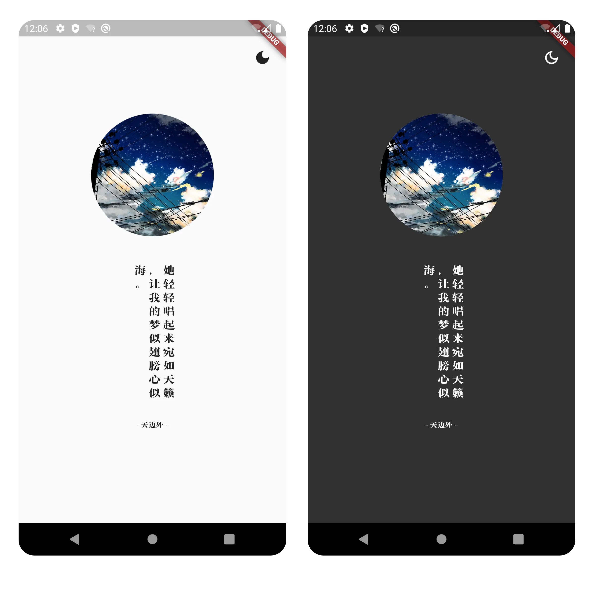
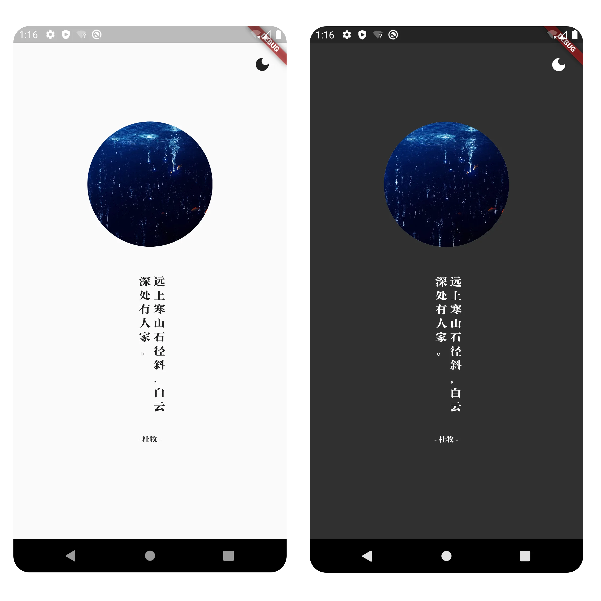

# 实战项目一：实现暗黑模式

原文链接：https://juejin.cn/book/7178741001677176836/section/7181703984262938684

说到“暗黑模式”，大家一定不会陌生。随着 iOS 13 与 Android 10 的推出，暗黑模式更是成为集成在系统中的主题方案广泛推广，深受用户的喜爱。我们的“一言”App 自然也不能落下这一功能，Flutter 自从 2019 年开始，就已经内置了暗黑模式支持，为开发者提供了适配上的便利。我们先看主题切换前后的效果图：



显然，程序的背景、文字以及右上角的主题切换按钮都发生了反转，由日间的亮色模式切换为夜晚的暗色模式。

此外，“一言”App 还支持随系统设置自动切换主题的功能。即当系统设置为黑暗模式时，App 也随之切换为黑暗模式。

现在，汇总一下要实现的功能和切换逻辑：

1. App 显示模式随系统设置发生变化，且为默认显示模式；

2. 用户可以通过 App 中的主题切换按钮自主选择显示模式。

因此，我们的实现逻辑应该是这样的：当有用户自定义的显示设置值时，按照该设置值显示，否则就跟随系统样式。

`💡 提示：我们可以在很多 App 中发现上述切换逻辑，只不过它们的主题更加丰富，不只局限于亮色和暗色。一些 App 中，暗色模式只有一种主题，但亮色模式的主题有很多。另一方面，每一种主题都包含着一整套配色方案。比如在亮色主题中，文字和按钮是黑色的；暗色主题中，文字和按钮是白色的；深蓝色主题中，文字和按钮是奶黄色的；红色主题中，文字和按钮是白色的等等。具体如何搭配颜色，一般是由从事设计岗位的同事来制定的。作为开发者，我们只需要根据配色表进行颜色定义即可。`

有了需求定义，也有了实现逻辑，接下来就到了动手环节。我们先来实现让 App 跟随系统主题显示的功能。

## 主题样式跟随系统

还记得是如何自定义字体的吗？没错，当时我们用到的就是主题定义的方式，代码是这样的：

```typescript
@override
Widget build(BuildContext context) {
    return MaterialApp(
        theme: ThemeData(fontFamily: 'ShuYunSong'),
        ...
    );
}
```

继续深入探索 MaterialApp 的参数列表，会发现还有一个 darkTheme 参数。darkTheme 就是暗色模式的主题配色方案了，当系统设置为暗色模式且该参数有值时，App 就会按照该参数定义的主题颜色进行呈现。

回到本例，只需对原代码作出如下修改，即可实现主题样式跟随系统的效果：

```less
@override
Widget build(BuildContext context) {
return MaterialApp(
theme: ThemeData(fontFamily: 'ShuYunSong', brightness: Brightness.light),
darkTheme: ThemeData(fontFamily: 'ShuYunSong', brightness: Brightness.dark),
...
);
}
```

`❗️ 注意：别忘了在 darkTheme 中使用自定义字体。`

完成修改后，再次运行 App。然后到系统显示设置中进行亮/暗色切换，最后再回到 App，可以发现 App 的显示样式可以随系统设置发生变化，且无需重新打开程序。效果如下图所示：



仔细看这张图，和本讲开头的图进行对比，有没有发现什么问题？

暗色模式下，右上角的图标应该是空心的才对，而不应该只是简单地变个颜色就行了。

所以，这里还需要做一个“监听器”，当需要切换主题时，若为亮色模式，则使用实心的图标；反之，则使用空心的图标。至于颜色，系统默认的暗色模式已经定义好配色方案，我们无需理会。

那么，这个“监听器”该怎么实现呢？

## 监听系统设置变化

Flutter 提供了一个名为“WidgetsBindingObserver”的抽象类，它通常用作监听生命周期。由此便可在适当的时机作出恰当的处理，比如一个赛车游戏，当用户回到 Home 后，游戏应该自动暂停。也就是当界面不可见时，若游戏仍在进行中，则执行暂停处理。否则，当用户再次回到游戏时，会发现自己的赛车早就撞毁了……

这个类除了能用作监听生命周期，还能提供很多实用的回调，比如内存不足、屏幕旋转、系统主题设置变化等等。我们可以通过实现该类的接口，轻松完成对系统主题设置的监听，从而达成最终的实现样式。具体实现代码如下：

```dart
class _MyAppState extends State<MyApp> with WidgetsBindingObserver {
    bool darkModeOn = false;
    @override
    void initState() {
        super.initState();
        WidgetsBinding.instance.addObserver(this);
    }
    @override
    void dispose() {
        WidgetsBinding.instance.removeObserver(this);
        super.dispose();
    }
    @override
    void didChangePlatformBrightness() {
        Brightness brightness = WidgetsBinding.instance.window.platformBrightness;
        setState(() {
                if (brightness.name == "light") {
                    darkModeOn = false;
                } else {
                    darkModeOn = true;
                }
        });
    }
    ...
}
```

正确使用 WidgetsBindingObserver 的姿势如上述代码所示，首先要在 initState() 中调用 addObserver() 添加“观察者” ，然后实现相应的回调方法（本例是 didChangePlatformBrightness()），最后在 dispose() 方法中调用 removeObserver() 移除“观察者” 。

这段代码中，布而类型的 darkModeOn 变量表示当前系统设置是否为暗色模式。true 代表是；反之则不是。

接着，在后面的 build() 方法中，根据 dartModeOn 来切换 Icon 组件，代码片段如下：

```yaml
MaterialButton(
padding: const EdgeInsets.all(0),
child: Icon(
darkModeOn ? Icons.dark_mode_outlined : Icons.dark_mode,
size: 25),
onPressed: () {
setState(() {
darkModeOn = !darkModeOn;
});
},
),
```

同时，如上述代码所示，当用户按下这个按钮时，允许手动切换 App 亮/暗色显示模式。因此，在 onPressed 参数中切换 darkModeOn 的值，但此时并没有什么效果。

## 手动切换主题样式

由于 theme 和 darkTheme 并未与 darkModeOn 变量产生联动，所以即使改变了这个变量的值，App 的主题也不会发生任何变化。

所以，光靠一个布尔类型的 darkModeOn 变量来控制 App 的主题，显然是不够的。我在这里引入了另一个布尔类型的变量 customTheme，该变量的默认值为 false，表示非自定义主题状态。当用户按了切换按钮后，该变量值改为 true。

与之紧密相关的便是上部分讲过的主题切换，当自定义主题（customTheme 为 true）时，即使系统主题发生变化，也不会改变 darkModeOn 的值。这部分的代码修改如下：

```ini
@override
void didChangePlatformBrightness() {
Brightness brightness = WidgetsBinding.instance.window.platformBrightness;
if (!customTheme) {
setState(() {
if (brightness.name == "light") {
darkModeOn = false;
} else {
darkModeOn = true;
}
});
}
}
```

与之配合的便是 theme 和 darkTheme 的参数赋值：

- 对于 theme，当自定义主题（customTheme 为 true）且需要亮色显示（dartModeOn 为 false），以及不需要自定义主题（customTheme 为 false）时，brightness 的值都为 Brightness.light；否则为 Brightness.dark。

- 对于 darkTheme，当自定义主题（customTheme 为 true）且需要暗色显示（dartModeOn 为 true），以及不需要自定义主题（customTheme 为 false）时，brightness 的值都为 Brightness.dark；否则为 Brightness.light。

相应的代码修改如下：

```yaml
theme: ThemeData(
fontFamily: 'ShuYunSong',
brightness: customTheme && !darkModeOn
? Brightness.light
: customTheme && darkModeOn
? Brightness.dark
: Brightness.light),
darkTheme: ThemeData(
fontFamily: 'ShuYunSong',
brightness: customTheme && !darkModeOn
? Brightness.light
: customTheme && darkModeOn
? Brightness.dark
: Brightness.dark),
```

热加载后，再次点按右上角的主题切换，可见主题已经按用户的需要发生变化了。另外，无论系统主题如何改变，也不会影响 App 自身的主题样式。

完整重新运行后，先进行系统主题切换，可见 App 主题跟随系统。然后，点击右上角的主题切换，App 的主题随用户选择进行切换，不再跟随系统设置。

目标达成！

如果你尝试了半天，还没达成目标，不妨参考本讲末尾附录部分的完整代码。

## 小结

🎉恭喜，您完成了本次课程的学习！

📌 以下是本次课程的重点内容总结：

在本讲中，完结了《一言》App 的开发全过程。

在最后一部分，我介绍了如何实现亮/暗色主题切换。具体的切换逻辑和目前很多 App 保持一致：

1. App 显示模式随系统设置发生变化，且为默认显示模式；

2. 用户可以通过 App 中的主题切换按钮自主选择显示模式。

在具体的实现过程中，我还介绍了一个非常实用的抽象类：WidgetsBindingObserver。它提供了监听生命周期、系统主题样式设置等众多监听器。实现这个类时，请一定要遵循一般步骤，即：

1. 在 initState() 中调用 addObserver() 添加“观察者”；

2. 实现相应的回调方法；

3. 在 dispose() 方法中调用 removeObserver() 移除“观察者”。

其中第 1 和 3 步非常重要，缺少第 1 步，回调方法不会奏效，缺少第 3 步，资源没有回收将导致内存占用率高，甚至程序崩溃的后果。

➡️ 从下一讲开始，我们就要进入新的单元：《你的名字》日记 App 的实战。在新的实战项目中，我会介绍页面导航设计、本地数据库 IO、EventBus 事件总线等实用技能，我们还会再次与自定义组件相遇，不过这一次难度会更高。让我们做好准备，攀登新的山峰吧！

## 附录：main.dart 完整代码：

```dart
import 'package:flutter/material.dart';
import 'package:flutter_juejin_yiyan/ui/page/home_page.dart';
void main() {
    runApp(const MyApp());
}
class MyApp extends StatefulWidget {
    const MyApp({super.key});
    @override
    State<MyApp> createState() => _MyAppState();
}
class _MyAppState extends State<MyApp> with WidgetsBindingObserver {
    bool darkModeOn = false;
    bool customTheme = false;
    @override
    void initState() {
        super.initState();
        WidgetsBinding.instance.addObserver(this);
    }
    @override
    void dispose() {
        WidgetsBinding.instance.removeObserver(this);
        super.dispose();
    }
    @override
    void didChangePlatformBrightness() {
        Brightness brightness = WidgetsBinding.instance.window.platformBrightness;
        if (!customTheme) {
            setState(() {
                    if (brightness.name == "light") {
                        darkModeOn = false;
                    } else {
                        darkModeOn = true;
                    }
            });
        }
    }
    @override
    Widget build(BuildContext context) {
        return MaterialApp(
            theme: ThemeData(
                fontFamily: 'ShuYunSong',
                brightness: customTheme && !darkModeOn
                ? Brightness.light
                : customTheme && darkModeOn
                ? Brightness.dark
                : Brightness.light),
            darkTheme: ThemeData(
                fontFamily: 'ShuYunSong',
                brightness: customTheme && !darkModeOn
                ? Brightness.light
                : customTheme && darkModeOn
                ? Brightness.dark
                : Brightness.dark),
            home: Scaffold(
                body: Stack(children: [
                        const HomePage(),
                        Positioned(
                            right: 20,
                            top: 40,
                            child: SizedBox(
                                width: 30,
                                height: 30,
                                child: MaterialButton(
                                    padding: const EdgeInsets.all(0),
                                    child: Icon(
                                        darkModeOn ? Icons.dark_mode_outlined : Icons.dark_mode,
                                        size: 25),
                                    onPressed: () {
                                        setState(() {
                                                customTheme = true;
                                                darkModeOn = !darkModeOn;
                                        });
                                    },
                                ),
                            ),
                        )
                ]),
            ),
        );
    }
}
```
