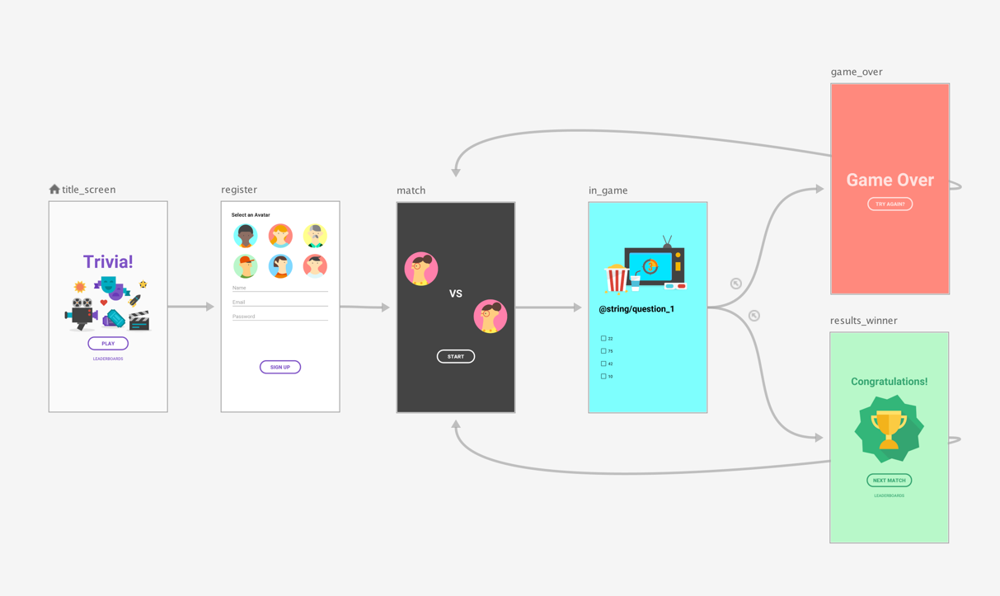
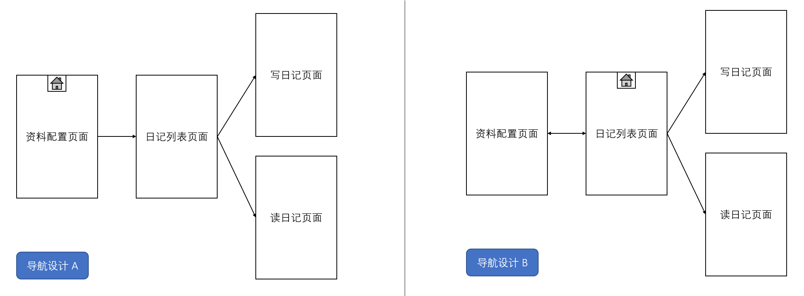
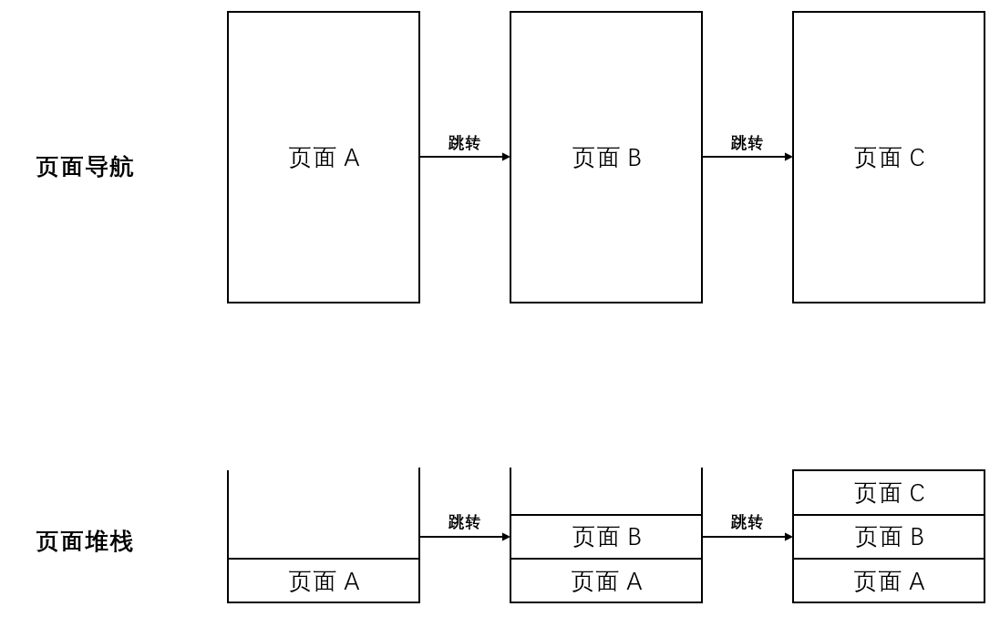
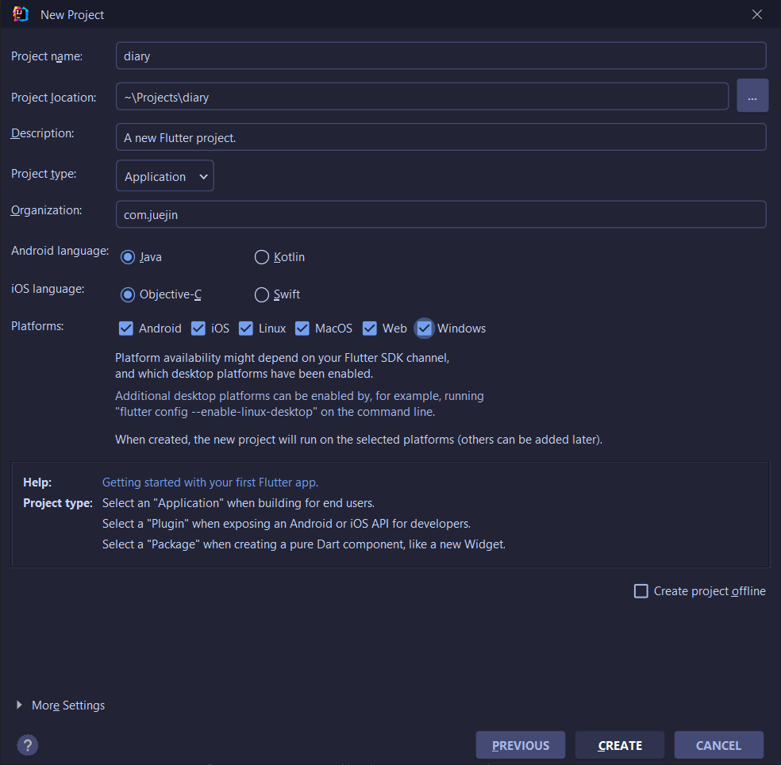
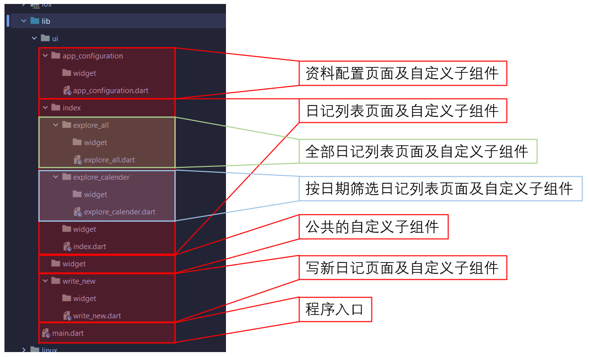
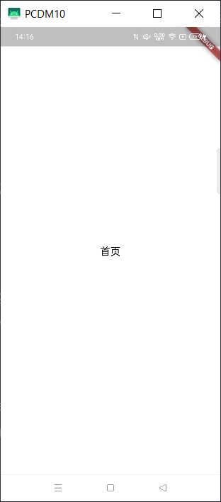
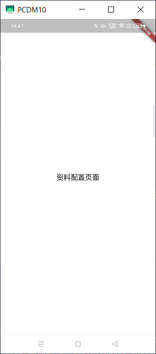

# 实战项目二：实现“日记”项目多页面管理

原文链接：https://juejin.cn/book/7178741001677176836/section/7180607573492498444

从本讲开始，进入《日记》实战项目的开发部分，这款应用缘起《你的名字》动漫。先来通过下面的 GIF 动画大致了解下最终的“成品”。


从图中可以看到，这其实是在使用 Android 手机运行 iOS 风格的程序。得益于 Flutter 中组件设计上的自由，动图中虽然使用 Android 模拟器运行，但整体程序风格仍保持 iOS 风格该有的样式。除了动图中展示的功能外，首次运行程序还将引导用户完成性别和主题色选择，还有日记编辑功能。

显然，和之前的《一言》程序相比，《日记》则更加复杂。最直观的感受可能就是页面变多了，功能也变多了。

这节课我们会对整体的项目页面结构进行设计与实现，为了实现多页面的组织管理，还要引入一个新的概念——页面导航。

## 设计页面导航

通俗地说，页面导航就是多页面跳转的“地图”，它指明了所有页面的所有出口和入口。举例来说，下图便是一个简单的游戏页面导航图设计：



>

注：该图摘自 Android Developer 网站（[设计导航图 | Android 开发者 | Android Developers (google.cn)](https://developer.android.google.cn/guide/navigation/navigation-design-graph)）

可以看到，游戏所有的页面都罗列在导航图中，箭头表明了跳转的方向，线条表明了跳转的起点和目的地。

下面回到《日记》应用，除了调用系统相机页面外，总共包含 4 个页面，分别是：

- 首次运行时的资料配置页；

- 浏览日记列表页；

- 写日记页面；

- 读日记页面。

`💡 提示：为什么其它程序的界面不包含在导航图中呢？这是因为其它程序是如何设计的，我们并不知道，也不太可能知道。我们的可控范围只局限在我们要开发的软件中。`

接下来，对比下面两个设计图，大家想想哪一种设计更合理？



仔细观察 A 和 B，它们有两个不同点：

- 程序启动后的首页不同；

- A 中，资料配置页面只能单向跳转到日记列表页面，B 中二者可以双向跳转。

可能很多人会选择 A，因为它最符合“流程”：软件启动后先进行资料配置，完成后进入日记列表页，在列表页可以查看历史日记（跳转到读日记页面）和写新的日记（跳转到写日记页面）。这套逻辑似乎无可厚非，但真的合适吗？

想象一下，首次启动软件，确实可以按上述逻辑进行。但如果是第二次、第三次呢？用户会感觉很奇怪：我明明之前设置过了各种资料，为什么又让我设置一次？同理，类似有登录/注册功能的软件也是如此。明明登录过，为何又让我登录一次……

一种解决之道（A）是在资料配置页面做判断。

如果之前配置过就直接跳转到日记列表页面。这确实解决了重复配置的问题，但新的问题随之出现：“做判断”的逻辑包含在资料配置页之中，这就意味着该页面无论如何也要出现一次，然后才有可能发生跳转。也就意味着用户无论如何也要面对一次他有可能无需面对的页面……

当然，也不是没有优化方法：如果需要配置，则绘制页面组件；不需要配置则直接跳转，同时无需执行页面跳转动画。天呢！真是太麻烦了，搞不好会引入 Bug……

另一种解决之道（B）是把日记列表页作为起始页，程序启动则立即判断是否已经配置了资料，没有配置的话则跳转到资料配置页面；如果配置过了就呆在这，继续显示日记列表页，哪儿都不跳。

相比起来，B 方案无论在体验方面还是开发上都更优，这也是目前大部分软件都采用的一种方案，但并不是全部。有些安全等级要求高的软件依然需要登录，比如银行、交易类的软件。甚至还会在某个时机跳出手势或面部识别页面进行验证，这就需要大家在设计页面导航时考虑更多条件分支，更为妥善处理了。

## 页面堆栈

当页面跳转时，旧的页面不会消失。默认情况下，新的页面会在旧页面的“上方”，“挡住”旧页面，就好像叠罗汉一样。这种“叠罗汉”的结构，被称为“页面堆栈”。要理解“页面堆栈”的概念，最好是“看图说话”。我们一起来看下图：



这个图描绘的是页面跳转的过程，即由页面 A 跳转到页面 B，再跳转到页面 C。同时，存在 “页面堆栈”，它“记录”着页面跳转的历史，以栈的形式存在，所有页面的存入和取出都在栈顶进行。这就意味着，当用户从页面 C 进行返回操作时，页面 B 会再次出现。

这样的返回逻辑满足了大部分的场景需求，但总有那么一小撮需求独具特色。

回到《日记》，日记列表页和资料配置页面就属于那“一小撮”。程序运行后，日记列表页会首先显示，当没有配置资料时，跳转到资料配置页面，随后再跳回日记列表页。此时，用户若进行返回操作，在默认情况下，将再次回到资料配置页。再返回的话，又会回到最初的日记列表页……还是看图说话：


要破局，有两种解决之道：

- 一是不跳转，让当前页面直接出栈。这种方式适用于资料配置页跳转到日记列表页，让资料配置页直接出栈就行了。不过这样做需要“告知”日记列表页：配置发生更改了，你要赶快应用最新的参数；

- 二是跳转的同时清理堆栈，也就是说跳转后自己成为栈底，之前的页面都不在了。这样一来，无论用户怎么返回，也不会回到错误的页面上。

上述两种方式孰优孰劣要根据实际情况做判定，对于《日记》，显然第二种更简单易行。还是用图来表示：


`💡 提示：无需担心返回会直接退出程序。想象一下，在进行首次资料配置时，用户按了返回键，相当于放弃使用。退出程序不正是很合理的响应吗？`

使用页面“路由”是实现页面跳转的途径。可以按照“key-value”的形式理解，key 是路径，value 表示某个页面及跳转处理逻辑。跳转时，通过key来指明跳转的目的地。同时，还能附带数据、设置跳转动画、设置是否清除 堆栈。具体的实现步骤，稍后将结合实际代码讲解。

## 创建项目，并添加“占位”页面

我们先创建一个项目，名为 diary。同时别忘了修改默认包名，选中所有支持的平台，修改 Android 开发语言为 Java，iOS 开发语言为 Objective-C。如下图所示：



接着，按照如下图所示的结构创建项目结构。每个文件及目录的意义在下图中都已经标明，供大家参考：



`💡 提示：读日记页面去哪儿了？在一开始的动图中可以看到，读日记页面其实是一个对话框。在 Flutter 中，对话框通过 showCupertinoDialog() 或类似函数显示，和全屏页面不同。具体内容将在后面的章节中详述。根据实际需求，读日记对话框的源码位置在 ui\index\widget 中。`

可以看到，每个页面都有各自的 widget 目录，在 ui 目录中，还有一个公共的 widget 目录。前者存放的自定义组件仅用于所属的页面中，若某个自定义组件的使用范围超过单个页面，则应将其放在公共 widget 目录中。

日记列表页面包含全部日记列表页面和按日期筛选日记列表页面，源码组织形式结构与此保持一致。

最后，为了确认页面跳转逻辑的正确性，每个页面都暂时摆放一个居中的标题文本框。比如资料配置页面，它的完整代码如下：

```dart
import 'package:flutter/cupertino.dart';
class AppConfigurationPage extends StatefulWidget {
const AppConfigurationPage({Key? key}) : super(key: key);
@override
State<AppConfigurationPage> createState() => _AppConfigurationPageState();
}
class _AppConfigurationPageState extends State<AppConfigurationPage> {
@override
Widget build(BuildContext context) {
return const CupertinoPageScaffold(child: Center(child: Text('资料配置页面')));
}
}

```

依葫芦画瓢，其它页面修改类名和文本框中的文字内容即可，这里就不再详述了。

值得注意的是，写日记页面需要传入日记 id 以便实现编辑功能。当 id 存在时，从数据库加载相应内容，最后更新数据库；当 id 不存在时，保持内容为空，最后向数据库写入新数据。

另外还需创建一个路由出错的页面，用于找不到路由“key”值时的默认跳转目的地（尽管这不太可能发生，但万一呢）。

## 实战 fluro 路由库的使用

Flutter 框架内置了页面跳转的 API，但为了更高效地编程，我更推荐大家使用成熟的库，fluro 便是其中一款。

集成 fluro 的方法非常简单，在 fluro 库[首页](https://pub.flutter-io.cn/packages/fluro)就能找到最新的版本，添加到 pubspec.yaml 中即可。我使用的版本号是 2.0.3，相应代码如下：

```dart
dependencies:
flutter:
sdk: flutter
cupertino_icons: ^1.0.2
...
# 全局路由
fluro: ^2.0.3
...

```

添加好后，执行一次 flutter pub get 获取包内容。

接下来，在 lib 目录中新建一个 router 目录，用来存放 routes.dart，这个文件中定义了具体的路由跳转路径。

通过阅读官方指导文档，我们了解到路由的定义通过 `router.define()` 方法实现，该方法需要两个参数，一个是路径，另一个是 handler 类型的变量。

前文中提到：我们可以把路由看作是“key-value”结构，key 相当于路径，value 包含某个页面及跳转处理逻辑。换言之，跳转目的地和处理逻辑都在 handler 中。

《日记》程序的起始页是日记列表页，对应到代码中是 index.dart。因此，路由如下定义：

```dart
import 'package:fluro/fluro.dart';
import 'package:flutter/cupertino.dart';
import '../ui/index/index.dart';
//主页面
var indexHandler = Handler(
handlerFunc: (BuildContext? context, Map<String, List<String>> params) {
return const IndexPage();
});
class Routes {
static String indexPage = '/';
static void configureRoutes(FluroRouter router) {
router.define(indexPage, handler: indexHandler);
}
}

```

对于无需传递参数的页面而言，如此便定义好了路由。而对于需要传递参数的页面而言，则需要做些特定的处理了。比如写日记页面，该页面承担了新增日记和编辑旧日记的功能。其关键在于有无 id 参数。当 id 存在且不为空字符串时为编辑状态；反之则是新增。因此，写日记页面的路由定义如下：

```dart
import 'package:fluro/fluro.dart';
import 'package:flutter/cupertino.dart';
import '../ui/write_new/write_new.dart';
var writeDiaryHandler = Handler(
handlerFunc: (BuildContext? context, Map<String, List<String>> params) {
if (params.isNotEmpty && params['id'] != null) {
return WriteNewPage(id: params['id']![0]);
} else {
return const WriteNewPage(id: "");
}
});
class Routes {
static String writeDiaryPage = '/writeDiary';
static void configureRoutes(FluroRouter router) {
router.define("$writeDiaryPage/:id", handler: writeDiaryHandler);
}
}

```

请大家注意此时 router.define() 方法传入的路径格式。如果你还不清楚如何构建可接受参数的 WriteNewPage 页面，请参考文末的附录。

全部日记列表和按日期筛选日记列表页是日记列表页面的子页面，有日记列表页面的 Tab 结构管理，无需进行路由定义。这样一来，《日记》程序总共需要 4 个页面被路由管理，其中包含 1 个默认跳转页面（或称为找不到地址页面、404 页面……）。

完整的 routes.dart 源码如下所示：

```dart
import 'package:fluro/fluro.dart';
import 'package:flutter/cupertino.dart';
import '../ui/app_configuration/app_configuration.dart';
import '../ui/write_new/write_new.dart';
import '../ui/default/default_page.dart';
import '../ui/index/index.dart';
//路由出错的默认页面
var errorHandler = Handler(
handlerFunc: (BuildContext? context, Map<String, List<String>> params) {
return const DefaultPage();
});
//程序参数配置页面
var appConfigurationHandler = Handler(
handlerFunc: (BuildContext? context, Map<String, List<String>> params) {
return const AppConfigurationPage();
});
//主页面
var indexHandler = Handler(
handlerFunc: (BuildContext? context, Map<String, List<String>> params) {
return const IndexPage();
});
//写日记
var writeDiaryHandler = Handler(
handlerFunc: (BuildContext? context, Map<String, List<String>> params) {
if (params.isNotEmpty && params['id'] != null) {
return WriteNewPage(id: params['id']![0]);
} else {
return const WriteNewPage(id: "");
}
});
class Routes {
static String indexPage = '/';
static String errorPage = '/error';
static String writeDiaryPage = '/writeDiary';
static String appConfigurationPage = '/appConfiguration';
static void configureRoutes(FluroRouter router) {
router.define(appConfigurationPage, handler: appConfigurationHandler);
router.define(indexPage, handler: indexHandler);
router.define("$writeDiaryPage/:id", handler: writeDiaryHandler);
router.notFoundHandler = errorHandler;
}
}

```

回到 main.dart，按照 fluro 文档中所述创建 FluroRouter 实例（router）；然后调用刚刚实现的 Routes 类中 configureRoutes() 方法，将 router 作为参数传入其中；最后，在 CupertinoApp 中将 router.generator 作为 onGenerateRoute 参数的值使用。代码如下：

```dart
import 'package:diary/router/routes.dart';
import 'package:diary/ui/index/index.dart';
import 'package:fluro/fluro.dart';
import 'package:flutter/cupertino.dart';
final router = FluroRouter();
void main() {
// 配置路由
Routes.configureRoutes(router);
runApp(const MyApp());
}
class MyApp extends StatelessWidget {
const MyApp({Key? key}) : super(key: key);
@override
Widget build(BuildContext context) {
return CupertinoApp(onGenerateRoute: router.generator, home: const Diary());
}
}
class Diary extends StatefulWidget {
const Diary({Key? key}) : super(key: key);
@override
State<Diary> createState() => _DiaryState();
}
class _DiaryState extends State<Diary> {
@override
Widget build(BuildContext context) {
return const IndexPage();
}
}

```

好了，运行一下程序吧，出现下图所示的界面就代表大功告成了！



最后，如果要实现从日记列表页跳转到资料配置页面，该如何做呢？

答案还是按照 fluro 官方文档的指导即可：

```dart
router.navigateTo(context, Routes.appConfigurationPage, clearStack: true);

```

请注意，这里 clearStack 给了 true，意思是清理页面跳转堆栈。该值默认为 false。

在 Flutter 中，setState()、页面跳转等操作都要求当前界面处于 mounted 状态，否则会出现异常。由于页面跳转的时机非常靠前，因此就要确保当前界面为 mounted 状态才行。

Flutter 中提供了 WidgetsBinding.instance.addPostFrameCallback() 回调方法来保证这一点，具体请参考下面的代码片段：

```dart
@override
void initState() {
super.initState();
WidgetsBinding.instance.addPostFrameCallback((_) {
// 未进行资料配置，跳转到相应页面进行
if (true) {
router.navigateTo(context, Routes.appConfigurationPage,
clearStack: true);
}
});
}

```

再次运行程序，显示如下：



此时在按返回键，程序将直接退出。

## 总结

🎉 恭喜，您完成了本次课程的学习！

📌 以下是本次课程的重点内容总结：

本讲详细规划设计了《日记》项目中所有页面的跳转逻辑。具体来说，我们首先设计了“页面导航图”，它指明了程序的入口页面以及每个页面的所有出口和入口路径。同时，由于“页面堆栈”机制的存在，还需在必要时清除堆栈。

为了实现导航图中所描绘的“愿景”，引入了“页面路由”的概念。使用时的思路类似“key-value”的形式，通过 key 来指明跳转的目的地，value 表示详细的跳转动作。跳转时还可包含数据、指定跳转动画以及设置是否清除堆栈。fluro 库可以帮我们轻松实现页面跳转。

在项目创建伊始，程序的功能往往并未准备就绪，因此我们使用若干“占位页面”实现了所有页面跳转。 同时，这些 “占位页面”充当了整个程序的 UI 结构，为后面的开发工作指明了方向。

最后，需要特别注意的一点：在页面尚未处于“mounted”状态时，强行跳转会发生异常。此处我们使用WidgetsBinding.instance.addPostFrameCallback() 回调方法等待页面进入“mounted” 后再执行跳转。

到此，《日记》项目的整体 UI 框架就构建得差不多了，后面到了填“肉”的环节。

➡️ 在下次课程中，我们会继续《日记》程序的开发，具体内容是：

- 本地持久化的实现，具体包括首选项与本地数据库（SQLite）的设计、实现与封装。

## 附录：WriteNewDiary.dart 源码

```dart
import 'package:flutter/cupertino.dart';
class WriteNewPage extends StatefulWidget {
const WriteNewPage({Key? key, required this.id}) : super(key: key);
final String id;
@override
State<WriteNewPage> createState() => _WriteNewPageState();
}
class _WriteNewPageState extends State<WriteNewPage> {
@override
Widget build(BuildContext context) {
return const CupertinoPageScaffold(child: Center(child: Text('写日记')));
}
}

```
